[← Volver al índice](00-chapter0.md#contenido)

# Capítulo II: Requirements Development and Software Solution Design

## 2.1. Competidores

### 2.1.1. Análisis competitivo

#### Competitive analysis landscape

| Competitive Analysis Landscape | | | | |
|---|---|---|---|---|
| **¿Por qué llevar a cabo este análisis?** | Identificar ventajas competitivas frente a soluciones existentes en el mercado de seguridad para transporte público. | | | |
| | **SafeBus (Nuestro startup)** | **Competidor 1 (Metropolitano)** | **Competidor 2 (RTP)** | **Competidor 3 (Mi Transporte)** |
| **Ventaja competitiva** | Monitoreo en tiempo real, botón de emergencia con conteo de pasajeros por sensores en la puerta. | Infraestructura organizada, estaciones, rutas definidas, carriles exclusivos y cámaras de videovigilancia. | Tecnología incorporada: cámaras de seguridad, monitoreo en tiempo real y capacitación del personal. | Monitoreo y protocolos de seguimiento en tiempo real, reportes ciudadanos. |
| **Mercado objetivo** | Consorcios/empresas de transporte público y operarios de vehículos asignados. | Usuarios urbanos de Lima Metropolitana. | Población de zonas periféricas, estudiantes y grupos vulnerables. | Población de zonas periféricas y estudiantes. |
| **Estrategia de marketing** | Enfatiza la seguridad durante la ruta con un sistema integrado al vehículo. | Servicio rápido, moderno, formal y seguro, destacando eficiencia y orden. | Campaña "Yo Soy RTP", sustentabilidad con unidades eléctricas. | Posiciona el transporte como sistema integrado, moderno y eficiente. |
| **Productos & Servicios** | Botón de pánico, información sobre paraderos, monitoreo de riesgos 24h. | Transporte troncal, tarjeta recargable, estaciones seguras, información de rutas. | Servicio ordinario, expreso, Ecobús y Nochebús. | Transporte multimodal, Tarjeta Mi Movilidad, App Mi Saldo, Mi Pasaje. |
| **Precios & Costos** | Desde S/. 99 por unidad/mes incluyendo instalación. 20% de descuento a partir de 3 unidades. | S/. 3.50 por viaje. | 40 céntimos (ordinario) a 1.50 soles (Nochebús). | Tarifa plana S/. 2.00, tarifa preferencial S/. 1.00. |
| **Canales de distribución** | Web y móvil. | Web, móvil/recarga digital, puntos físicos. | App CDMX, tarjeta de movilidad integrada, sitio web oficial. | Web, móvil (App Mi Saldo), puntos físicos (OXXO, estaciones). |
| **Fortalezas** | Equipo profesional comprometido con el bienestar del cliente. | Marca reconocida, sistema formal, modernización digital. | Tarifas sociales subsidiadas, flota moderna eléctrica, conductores capacitados. | Marca unificada, interoperabilidad, modernización de flota. |
| **Oportunidades** | Expansión a provincias, acuerdos formales con la policía. | Expansión urbana, digitalización del servicio. | Expansión de rutas eléctricas para el Mundial 2026. | Crecimiento urbano hacia otros estados, crisis de combustibles. |
| **Amenazas** | Alto índice de extorsiones a transportistas en sus rutas. | Inseguridad ciudadana, saturación en horas punta, fallas operativas. | Competencia del transporte concesionado informal, congestión vial. | Resistencia al cambio, inseguridad, incidentes de vandalismo. |

## Análisis SWOT — SafeBus

| Fortalezas | Debilidades |
|---|---|
| Tecnología diferenciadora: monitoreo en tiempo real, botón de emergencia y conteo de pasajeros por sensores en la puerta. | Marca nueva y poco reconocida frente a competidores consolidados (Metropolitano, RTP). |
| Enfoque especializado en seguridad, que los competidores tratan solo como característica secundaria. | Canales limitados: solo web y móvil, sin puntos físicos de venta/atención. |
| Precio competitivo y escalable: desde S/. 99 por unidad/mes, con 20% de descuento a partir de 3 unidades. | Dependencia de hardware/sensores: costos de instalación, mantenimiento y riesgo de fallas técnicas. |
| Sistema integrado al vehículo, sin depender de estaciones ni infraestructura fija. | Mercado objetivo estrecho (consorcios y empresas): ingresos concentrados en pocos clientes grandes. |
| Equipo profesional comprometido con el bienestar del cliente. | Startup en etapa temprana, aún no probada a gran escala. |

| Oportunidades | Amenazas |
|---|---|
| Expansión a provincias. | Alto índice de extorsiones a transportistas en las rutas de operación. |
| Acuerdos formales con la policía y autoridades. | Competidores grandes con más recursos podrían incorporar funciones de seguridad similares. |
| Demanda creciente de soluciones de seguridad por el aumento de la inseguridad y la extorsión. | Resistencia al cambio y baja adopción tecnológica entre los transportistas. |
| Tendencia a la formalización del transporte público y a exigir estándares de seguridad. | Informalidad del sector y dependencia de los presupuestos de los consorcios. |

### 2.1.2. Estrategias y tácticas frente a competidores

Para posicionar a SafeBus de manera competitiva, se plantean las siguientes estrategias:

**Estrategias de vinculación y fidelización con usuarios clave:**

**#1 Implementación colaborativa con conductores y empresas**  
SafeBus adoptará un enfoque participativo, donde conductores y empresas de transporte formen parte del proceso de implementación y adaptación del sistema. Esto permitirá reducir la resistencia al cambio y asegurar que la solución se ajuste a necesidades reales del entorno.

**#2 Programa integral de capacitación y soporte técnico continuo**  
Se ofrecerán programas de capacitación para conductores y empresas, junto con soporte técnico constante. Esta estrategia responde a la baja adopción tecnológica en el sector.

**#3 Empoderamiento del usuario como actor activo**  
SafeBus integrará funcionalidades visibles para los usuarios (como monitoreo de rutas o estado del viaje), aumentando la percepción de seguridad.

**Estrategias de diferenciación tecnológica y funcional:**

**#1 Sistema integral de seguridad en tiempo real**  
SafeBus integrará monitoreo en tiempo real, botón de emergencia y sensores de conteo de pasajeros en una sola plataforma.

**#2 Plataforma centralizada de información**  
Se consolidará toda la información del vehículo (ubicación, alertas, estado) en un sistema único accesible para empresas.

**#3 Integración de hardware y software**  
SafeBus combinará aplicación móvil con dispositivos físicos (sensores, botón de pánico), generando una solución más robusta.

**#4 Analítica y reportes de seguridad**  
Se incorporarán reportes sobre incidentes, zonas de riesgo y comportamiento de rutas.

**Estrategias de posicionamiento y enfoque de mercado:**

**#1 Enfoque en seguridad como valor principal**  
SafeBus se posicionará como una solución centrada en la protección de conductores y pasajeros, destacando su impacto social.

**#2 Segmentación hacia empresas formales de transporte**  
Se priorizará trabajar con consorcios organizados que busquen mejorar su gestión y seguridad.

**#3 Adaptación al contexto local (Perú)**  
La solución estará diseñada considerando problemáticas reales como extorsión, informalidad y falta de regulación tecnológica.

**#4 Alianzas estratégicas**  
Se buscarán acuerdos con autoridades, municipalidades y entidades de seguridad para fortalecer la credibilidad y efectividad del sistema.

---

## 2.2. Entrevistas

### 2.2.1. Diseño de entrevistas
A continuación se presentan las preguntas para las entrevistas a los segmentos objetivos

Segmento 1:  Operadores (conductores) de transporte público

1. ¿Cómo es un día típico para ti desde que inicias hasta que terminas tu jornada?
2. Durante toda esa jornada, ¿en qué momentos te sientes más expuesto o inseguro?
3. ¿Qué tan frecuente es que reciban amenazas, cobros o algún tipo de extorsión durante el trabajo?
4. Frente a estos riesgos, ¿qué herramientas o medidas de seguridad tienen actualmente en la unidad?
5. ¿Qué tan importante sería para ti que la empresa pudiera monitorear la unidad en tiempo real?
6. Si ocurriera una emergencia dentro del bus, ¿qué tan rápido podrías pedir ayuda actualmente?
7. ¿Qué tan cómodo te sentirías utilizando una aplicación que monitoree tu ubicación y seguridad durante toda la jornada?
8. La aplicación podría permitirte validar tu identidad mediante un código QR antes de iniciar el recorrido. ¿Qué opinas de esa función?
9. Si pudieras elegir una sola función de seguridad que debería tener SafeBus, ¿cuál sería?

### 2.2.2. Registro de entrevistas

Video consolidado: `upc-pre-<periodo>-1acc0238-<NRC>-<startup>-needfinding-<avn/tbn>.mp4`

### Entrevista 1: Carlos Garcia

| Campo | Detalle |
| :--- | :--- |
| **Entrevistado** | Carlos Garcia |
| **Imagen** | {width=80%} |
| **Edad** | 45 |
| **Ocupación** | Conductor de transporte público |
| **Link** | [https://upcedupe-my.sharepoint.com/:v:/g/personal/u202410344_upc_edu_pe/IQDxbGA3NcI4QJTFe6GnCx8pAQvz3SOZwqUSE4nQZNJK-xc?e=GFwsLX&nav=eyJyZWZlcnJhbEluZm8iOnsicmVmZXJyYWxBcHAiOiJTdHJlYW1XZWJBcHAiLCJyZWZlcnJhbFZpZXciOiJTaGFyZURpYWxvZy1MaW5rIiwicmVmZXJyYWxBcHBQbGF0Zm9ybSI6IldlYiIsInJlZmVycmFsTW9kZSI6InZpZXcifX0%3D](https://upcedupe-my.sharepoint.com/:v:/g/personal/u202410344_upc_edu_pe/IQDxbGA3NcI4QJTFe6GnCx8pAQvz3SOZwqUSE4nQZNJK-xc?e=GFwsLX&nav=eyJyZWZlcnJhbEluZm8iOnsicmVmZXJyYWxBcHAiOiJTdHJlYW1XZWJBcHAiLCJyZWZlcnJhbFZpZXciOiJTaGFyZURpYWxvZy1MaW5rIiwicmVmZXJyYWxBcHBQbGF0Zm9ybSI6IldlYiIsInJlZmVycmFsTW9kZSI6InZpZXcifX0%3D) |
| **Resumen** | La entrevista presenta a Carlos Garcia, conductor de transporte público en Lima, quien describe una jornada extensa y desgastante que inicia a las 4:00 a. m. y termina entre las 9:00 y 10:00 p. m. Señala que los momentos de mayor riesgo son de madrugada y durante la noche, especialmente al atravesar “zonas rojas” y al quedar solos en los paraderos finales. Destaca que la extorsión y los cobros de cupos son frecuentes, mientras que actualmente cuentan con pocas herramientas de seguridad, sin cámaras, botón de pánico ni comunicación rápida con la empresa. Carlos considera fundamental el monitoreo GPS en tiempo real y una alerta discreta para emergencias. Además, muestra una actitud positiva hacia SafeBus, especialmente hacia la validación mediante QR para identificar al conductor autorizado. Finalmente, considera que el botón de emergencia sería la función más importante, acompañado del monitoreo de ubicación para facilitar una respuesta rápida ante situaciones de peligro. | 

### 2.2.3. Análisis de entrevistas

[Análisis con sustento estadístico por segmento]

---

## 2.3. Needfinding

Para identificar las necesidades de nuestros usuarios, es importante interactuar con ellos y recopilar información valiosa de las entrevistas previamente realizadas.

#### 2.3.1 User Personas

Con el User Persona, buscamos representar imaginariamente a un usuario actual ideal.

**Segmento #1: Conductores (operarios) de transporte público**

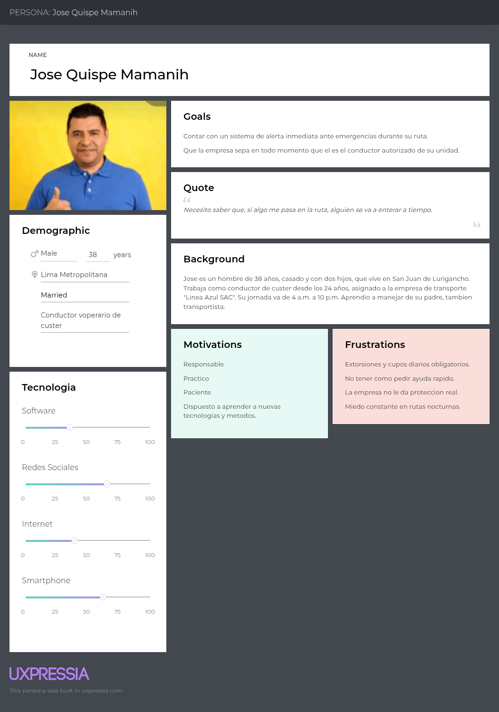

**Segmento #2: Empresas o consorcios de transporte público**

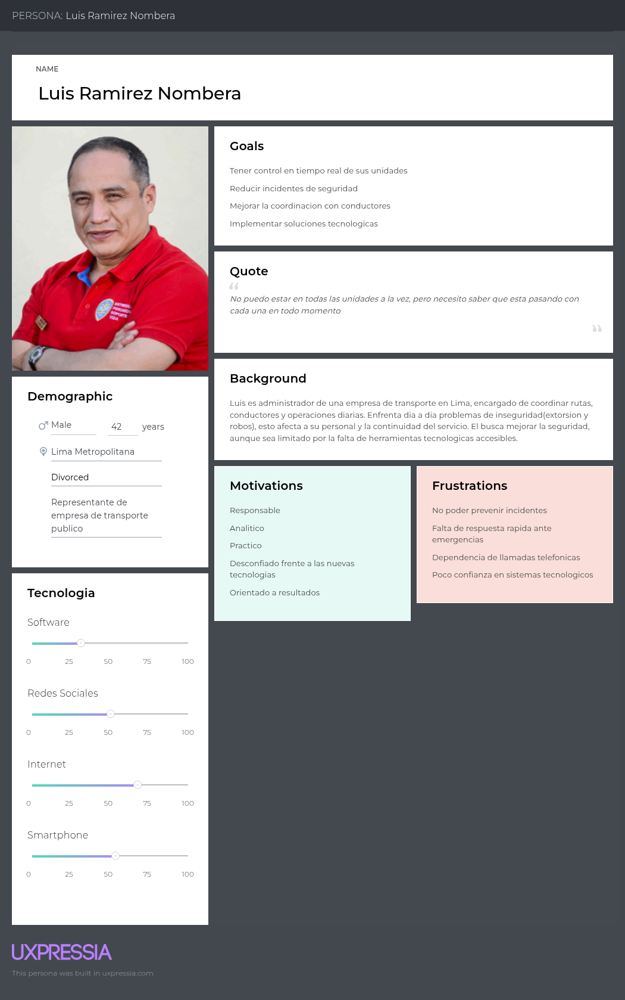

---

### 2.3.2. User Task Matrix

Esta es una lista de actividades que nuestros usuarios completan. Esto nos ayudará a entender la importancia de las tareas que podríamos llevar a cabo dentro de nuestro producto.

**Segmento objetivo #1 — Jose Quispe Mamanih**

| Actividades | Frecuencia | Importancia |
|-------------|-----------|-------------|
| Iniciar jornada y verificar el estado de la unidad antes de salir | Con frecuencia | Alta |
| Confirmar la ruta asignada y horario de salida con la empresa | Con frecuencia | Alta |
| Cobrar pasaje y controlar el flujo de subida y bajada de pasajeros | Con frecuencia | Alta |
| Reportar incidentes o percances al encargado de la empresa | A veces | Alta |
| Evaluar zonas de riesgo durante la ruta y tomar desvíos si es necesario | Frecuente | Alta |
| Pagar cuota o cupo a personas externas que operan en la ruta | Frecuente | Media |
| Comunicarse con otros conductores vía celular ante situaciones de riesgo | A veces | Alta |
| Registrar el cierre de turno y entregar la unidad al siguiente conductor | Con frecuencia | Alta |

**Segmento objetivo #2 — Luis Ramirez Nombera**

| Actividades | Frecuencia | Importancia |
|-------------|-----------|-------------|
| Supervisar las unidades de transporte en ruta | Con frecuencia | Alta |
| Coordinar con conductores durante la jornada | Con frecuencia | Alta |
| Atender incidentes o reportes de seguridad | Con frecuencia | Alta |
| Comunicarse con autoridades (policía, emergencia) | A veces | Alta |
| Verificar documentación de conductores | A veces | Media |
| Gestionar problemas de extorsión o amenazas | Con frecuencia | Alta |
| Revisar estado operativo de las unidades | Con frecuencia | Alta |
| Recibir reportes de pasajeros o quejas | A veces | Media |
| Resolver problemas sin información en tiempo real | Con frecuencia | Alta |
| Evaluar implementación de nuevas tecnologías | A veces | Media |

### 2.3.3. User Journey Mapping

Usaremos el User Journey Map para representar las etapas que nuestros usuarios pasan al interactuar por un cambio de turno.

**Segmento objetivo #1 — José Mamani Quispe**

**Segmento objetivo #2 — Luis Ramirez Nombera**

---

### 2.3.4. Empathy Mapping

Para entender mejor a nuestros usuarios, usamos el Empathy Map, para ponernos en su lugar y entender mejor sus necesidades y deseos.

**#1er Segmento Objetivo:**

**#2do Segmento Objetivo:**

---

### 2.3.5. Big Picture EventStorming

[Capturas y explicación del proceso — guía: https://bit.ly/bpes-guide]

### 2.3.6. Ubiquitous Language

| Term (English) | Término (Español) | Definición |
|-----------------|--------------------|------------|
| | | |

---

## 2.4. Requirements specification

### 2.4.1. User Stories

#### Epics

- [Epic 1]

#### User Stories

| Story ID | User | Priority | Epic |
|----------|------|----------|------|
| **Title** | | | |
| **Description** | | | |
| **Acceptance Criteria** | Given... When... Then... | | |

#### Technical Stories

[Redactadas con rol "Developer", AC en formato Gherkin]

#### Spike Stories

[Ver Anexo D del enunciado como referencia de estructura]

### 2.4.2. Impact Mapping

[Business Goals SMART, Actors/Personas, Impacts, Deliverables, User Stories]

### 2.4.3. Product Backlog

> URL público del Product Backlog: [completar]

| # Orden | User Story Id | Título | Story Points | Sprint |
|---------|----------------|--------|----------------|--------|
| 1 | US01 | | | |

---

## 2.5. Strategic-Level Domain-Driven Design

### 2.5.1. EventStorming

#### 2.5.1.1. Candidate Context Discovery

[Proceso y capturas]

#### 2.5.1.2. Domain Message Flows Modeling

[Domain Storytelling]

#### 2.5.1.3. Bounded Context Canvases

[Un Bounded Context Canvas por cada BC, en orden de importancia]

### 2.5.2. Context Mapping

[Context maps y patrones DDD aplicados: Anti-corruption Layer, Conformist,
Customer/Supplier, Shared Kernel]

### 2.5.3. Software Architecture

#### 2.5.3.1. Software Architecture Context Level Diagrams

[Diagrama de contexto — C4 Model, herramienta Structurizr]

#### 2.5.3.2. Software Architecture Container Level Diagrams

[Diagrama de contenedores]

#### 2.5.3.3. Software Architecture Deployment Diagrams

[Diagrama de despliegue]

---

## 2.6. Tactical-Level Domain-Driven Design

El backend de SafeBus se organiza de momento en tres (3) Bounded Contexts que concentra los componentes reutilizables del dominio. Cada contexto expone su API REST y se comunica de forma asíncrona con los demás mediante eventos de dominio publicados en un Message Broker, lo que permite reaccionar en tiempo real a validaciones y alertas de emergencia .

| # | Bounded Context | Carpeta | Responsabilidad principal |
| :--- | :--- | :--- | :--- |
| 2.6.1 | **IAM** | `iam` | Registro, autenticación y autorización de todos los actores. |
| 2.6.2 | **User Management** | `usermanagement` | Perfiles de conductores, empresas y pasajeros; validación de operadores. |
| 2.6.3 | **Alert Management** | `alertmanagement` | Botón de pánico, generación y despacho de alertas de emergencia. |

### 2.6.1. Bounded Context: IAM

#### 2.6.1.1. Domain Layer

* **Entities:** `User`, `Role`, `Permission`
* **Value Objects:** `EmailAddress`, `PasswordHash`, `PersonName`, `PhoneNumber`, `RoleType`
* **Aggregates:** `User` (aggregate root; agrupa sus `Role` asignados)
* **Factories:** `UserFactory`
* **Domain Services:** `AuthenticationService`, `PasswordPolicyService`
* **Repository interfaces:** `UserRepository`, `RoleRepository`

#### 2.6.1.2. Interface Layer

* **Controllers:** `AuthenticationController`, `UsersController`, `RolesController`
* **Consumers:** —

#### 2.6.1.3. Application Layer

* **Command Handlers:** `SignUpCommandHandler`, `SignInCommandHandler`, `AssignRoleToUserCommandHandler`
* **Event Handlers:** `SeedRolesEventHandler`

#### 2.6.1.4. Infrastructure Layer

* **Repository implementations:** `UserRepositoryImpl`, `RoleRepositoryImpl`
* **Message Brokers:** publica `UserRegisteredEvent`
* **Servicios externos:** `JwtTokenService` (generación de JWT/BearerToken), `HashingService` (BCrypt)

#### 2.6.1.5. Bounded Context Software Architecture Component Level Diagrams

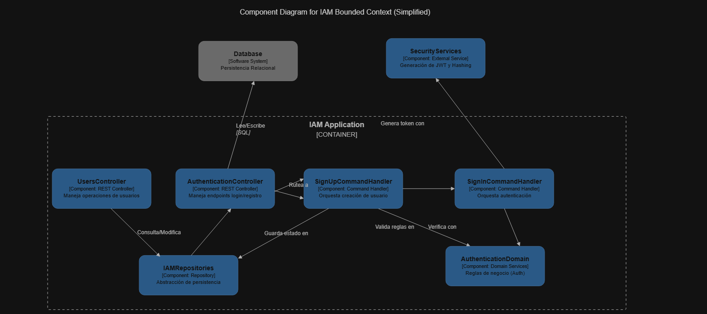

#### 2.6.1.6. Bounded Context Software Architecture Code Level Diagrams

##### 2.6.1.6.1. Bounded Context Domain Layer Class Diagrams

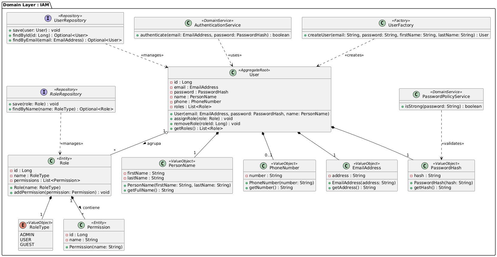

##### 2.6.1.6.2. Bounded Context Database Design Diagram

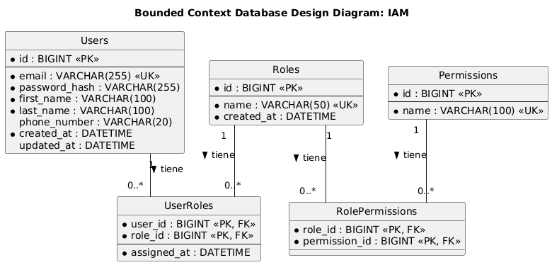

### 2.6.2. Bounded Context: User Management

* **Entities:** `Driver` (Conductor), `TransportCompany` (Empresa), `Passenger` (Pasajero), `QrCredential`
* **Value Objects:** `LicenseNumber` (licencia de conducir), `Ruc`, `Dni`, `Address`, `ContactInfo`, `QrCode`, `Habilitation` (habilitación), `ValidationStatus` (VALIDATED / REJECTED / PENDING)
* **Aggregates:** `DriverProfile` (aggregate root), `CompanyProfile`, `PassengerProfile`
* **Factories:** `ProfileFactory`, `QrCredentialFactory`
* **Domain Services:** `ProfileValidationService`, `OperatorHabilitationService`, `QrValidationService`
* **Repository interfaces:** `DriverRepository`, `CompanyRepository`, `PassengerRepository`, `QrCredentialRepository`

#### 2.6.2.2. Interface Layer

* **Controllers:** `DriversController`, `CompaniesController`, `PassengersController`, `OperatorValidationController`
* **Consumers:** `UserRegisteredConsumer` (crea el perfil cuando IAM registra un usuario)

#### 2.6.2.4. Infrastructure Layer

* **Repository implementations:** `DriverRepositoryImpl`, `CompanyRepositoryImpl`, `PassengerRepositoryImpl`, `QrCredentialRepositoryImpl`
* **Message Brokers:** consume `UserRegisteredEvent`; publica `DriverProfileCreatedEvent` y `OperatorValidatedEvent`
* **Servicios externos:** validación de licencias/habilitación ante MTC/SUTRAN, `QrCodeGeneratorService` (ZXing)

#### 2.6.2.5. Bounded Context Software Architecture Component Level Diagrams

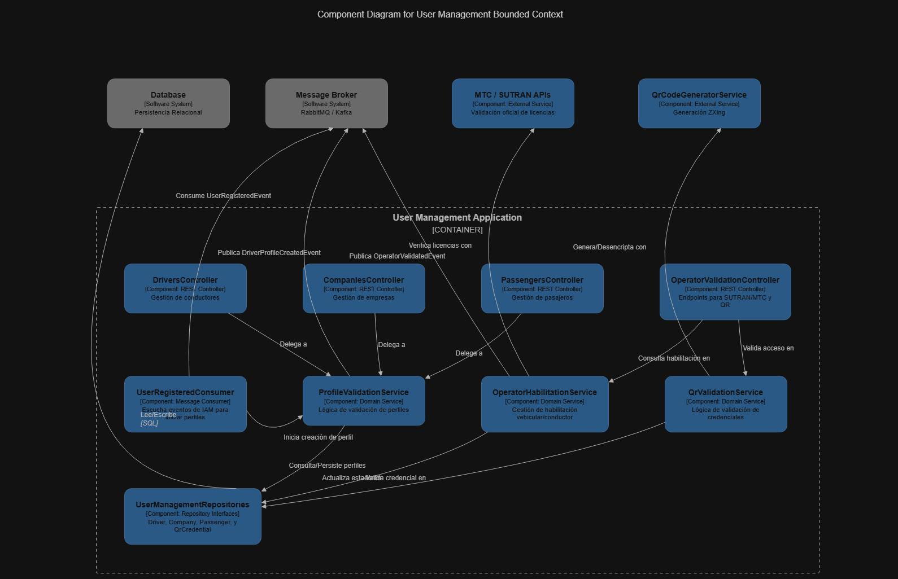

#### 2.6.2.6. Bounded Context Software Architecture Code Level Diagrams

##### 2.6.2.6.1. Bounded Context Domain Layer Class Diagrams

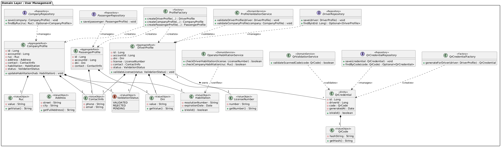

##### 2.6.2.6.2. Bounded Context Database Design Diagram

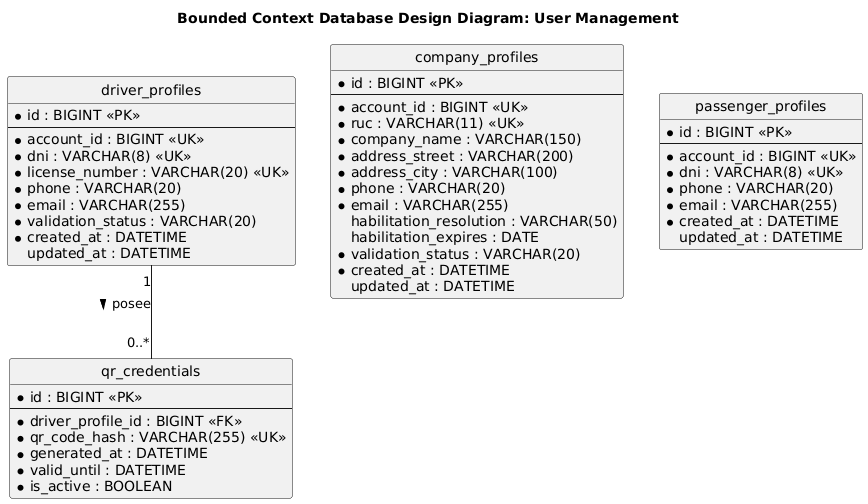

### 2.6.3. Bounded Context: Alert Management

#### 2.6.3.1. Domain Layer

* **Entities:** `EmergencyAlert`, `Incident`, `ResponseAction`
* **Value Objects:** `GeoLocation` (latitud/longitud), `AlertType` (asalto, siniestro, extorsión), `AlertStatus` (ACTIVE / ATTENDED / CLOSED), `Severity`
* **Aggregates:** `EmergencyAlert` (aggregate root; agrupa sus `ResponseAction`)
* **Factories:** `AlertFactory`
* **Domain Services:** `AlertDispatchService`, `EmergencyPriorityService`
* **Repository interfaces:** `AlertRepository`, `IncidentRepository`

#### 2.6.3.2. Interface Layer

* **Controllers:** `PanicButtonController`, `EmergencyAlertsController`
* **Consumers:** —

#### 2.6.3.3. Application Layer

* **Command Handlers:** `TriggerPanicAlertCommandHandler`, `AttendAlertCommandHandler`, `CloseIncidentCommandHandler`
* **Event Handlers:** `AlertTriggeredEventHandler`

#### 2.6.3.4. Infrastructure Layer

* **Repository implementations:** `AlertRepositoryImpl`, `IncidentRepositoryImpl`
* **Message Brokers:** publica `EmergencyAlertTriggeredEvent` (hacia Monitoring)
* **Servicios externos:** notificaciones push (Firebase Cloud Messaging), pasarela SMS, integración con central de emergencias / serenazgo

#### 2.6.3.5. Bounded Context Software Architecture Component Level Diagrams

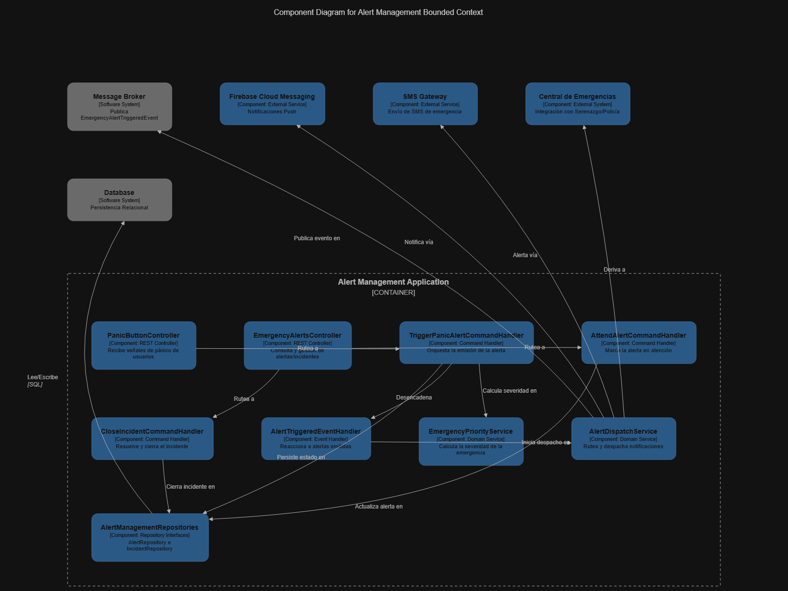

#### 2.6.3.6. Bounded Context Software Architecture Code Level Diagrams

##### 2.6.3.6.1. Bounded Context Domain Layer Class Diagrams

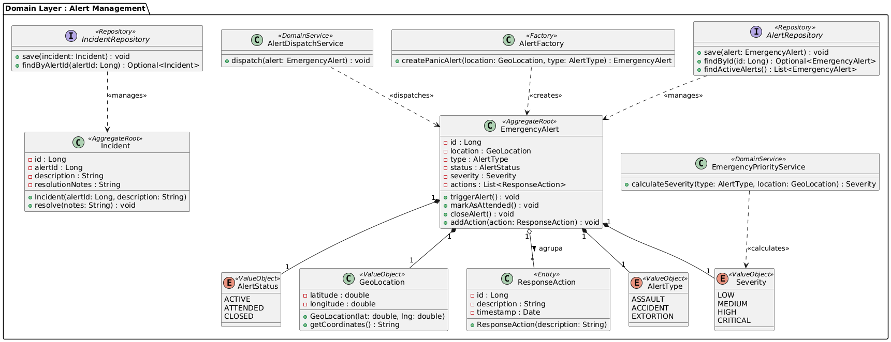

##### 2.6.3.6.2. Bounded Context Database Design Diagram

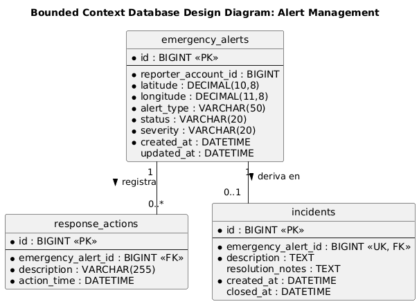