[← Volver al índice](00-chapter0.md#contenido)

# Capítulo II: Requirements Development and Software Solution Design

## 2.1. Competidores

### 2.1.1. Análisis competitivo

#### Competitive analysis landscape

| Competitive Analysis Landscape | | | | |
|---|---|---|---|---|
| **¿Por qué llevar a cabo este análisis?** | Identificar ventajas competitivas frente a soluciones existentes en el mercado de seguridad para transporte público. | | | |
| | **SafeBus (Nuestro startup)** | **Competidor 1 (Metropolitano)** | **Competidor 2 (RTP)** | **Competidor 3 (Mi Transporte)** |
| **Ventaja competitiva** | Monitoreo en tiempo real, emergencia directa del conductor, solicitudes de pasajeros con evidencia y aprobación empresarial, y conteo para la empresa. | Infraestructura organizada, estaciones, rutas definidas, carriles exclusivos y cámaras de videovigilancia. | Tecnología incorporada: cámaras de seguridad, monitoreo en tiempo real y capacitación del personal. | Monitoreo y protocolos de seguimiento en tiempo real, reportes ciudadanos. |
| **Mercado objetivo** | Consorcios/empresas de transporte público, conductores y pasajeros de unidades asociadas. | Usuarios urbanos de Lima Metropolitana. | Población de zonas periféricas, estudiantes y grupos vulnerables. | Población de zonas periféricas y estudiantes. |
| **Estrategia de marketing** | Enfatiza la seguridad durante la ruta con un sistema integrado al vehículo. | Servicio rápido, moderno, formal y seguro, destacando eficiencia y orden. | Campaña "Yo Soy RTP", sustentabilidad con unidades eléctricas. | Posiciona el transporte como sistema integrado, moderno y eficiente. |
| **Productos & Servicios** | Emergencia prioritaria del conductor, solicitudes de pasajeros con mensaje y foto, consulta de alertas del bus y aforo empresarial. | Transporte troncal, tarjeta recargable, estaciones seguras, información de rutas. | Servicio ordinario, expreso, Ecobús y Nochebús. | Transporte multimodal, Tarjeta Mi Movilidad, App Mi Saldo, Mi Pasaje. |
| **Precios & Costos** | Desde S/. 99 por unidad/mes incluyendo instalación. 20% de descuento a partir de 3 unidades. | S/. 3.50 por viaje. | 40 céntimos (ordinario) a 1.50 soles (Nochebús). | Tarifa plana S/. 2.00, tarifa preferencial S/. 1.00. |
| **Canales de distribución** | Web y móvil. | Web, móvil/recarga digital, puntos físicos. | App CDMX, tarjeta de movilidad integrada, sitio web oficial. | Web, móvil (App Mi Saldo), puntos físicos (OXXO, estaciones). |
| **Fortalezas** | Equipo profesional comprometido con el bienestar del cliente. | Marca reconocida, sistema formal, modernización digital. | Tarifas sociales subsidiadas, flota moderna eléctrica, conductores capacitados. | Marca unificada, interoperabilidad, modernización de flota. |
| **Oportunidades** | Expansión a provincias, acuerdos formales con la policía. | Expansión urbana, digitalización del servicio. | Expansión de rutas eléctricas para el Mundial 2026. | Crecimiento urbano hacia otros estados, crisis de combustibles. |
| **Amenazas** | Alto índice de extorsiones a transportistas en sus rutas. | Inseguridad ciudadana, saturación en horas punta, fallas operativas. | Competencia del transporte concesionado informal, congestión vial. | Resistencia al cambio, inseguridad, incidentes de vandalismo. |

## Análisis SWOT — SafeBus

| Fortalezas | Debilidades |
|---|---|
| Tecnología diferenciadora: monitoreo en tiempo real, emergencia directa del conductor, solicitudes de pasajeros con evidencia y aprobación empresarial, y conteo para la empresa. | Marca nueva y poco reconocida frente a competidores consolidados (Metropolitano, RTP). |
| Enfoque especializado en seguridad, que los competidores tratan solo como característica secundaria. | Canales limitados: solo web y móvil, sin puntos físicos de venta/atención. |
| Precio competitivo y escalable: desde S/. 99 por unidad/mes, con 20% de descuento a partir de 3 unidades. | Dependencia de hardware/sensores: costos de instalación, mantenimiento y riesgo de fallas técnicas. |
| Sistema integrado al vehículo, sin depender de estaciones ni infraestructura fija. | Mercado objetivo estrecho (consorcios y empresas): ingresos concentrados en pocos clientes grandes. |
| Equipo profesional comprometido con el bienestar del cliente. | Startup en etapa temprana, aún no probada a gran escala. |

| Oportunidades | Amenazas |
|---|---|
| Expansión a provincias. | Alto índice de extorsiones a transportistas en las rutas de operación. |
| Acuerdos formales con la policía y autoridades. | Competidores grandes con más recursos podrían incorporar funciones de seguridad similares. |
| Demanda creciente de soluciones de seguridad por el aumento de la inseguridad y la extorsión. | Resistencia al cambio y baja adopción tecnológica entre los transportistas. |
| Tendencia a la formalización del transporte público y a exigir estándares de seguridad. | Informalidad del sector y dependencia de los presupuestos de los consorcios. |

### 2.1.2. Estrategias y tácticas frente a competidores

Para posicionar a SafeBus de manera competitiva, se plantean las siguientes estrategias:

**Estrategias de vinculación y fidelización con usuarios clave:**

**#1 Implementación colaborativa con conductores y empresas**  
SafeBus adoptará un enfoque participativo, donde conductores y empresas de transporte formen parte del proceso de implementación y adaptación del sistema. Esto permitirá reducir la resistencia al cambio y asegurar que la solución se ajuste a necesidades reales del entorno.

**#2 Programa integral de capacitación y soporte técnico continuo**  
Se ofrecerán programas de capacitación para conductores y empresas, junto con soporte técnico constante. Esta estrategia responde a la baja adopción tecnológica en el sector.

**#3 Empoderamiento del usuario como actor activo**  
SafeBus integrará funcionalidades visibles para los usuarios (como monitoreo de rutas o estado del viaje), aumentando la percepción de seguridad.

**Estrategias de diferenciación tecnológica y funcional:**

**#1 Sistema integral de seguridad en tiempo real**  
SafeBus integra una emergencia directa y prioritaria del conductor con solicitudes documentadas de pasajeros. Tres pasajeros distintos del mismo bus y turno en cinco minutos habilitan la aprobación empresarial. El pasajero se registra con DNI y foto de rostro, consulta alertas y finaliza su viaje automáticamente al alejarse del bus; la empresa conserva el monitoreo de aforo.

**#2 Plataforma centralizada de información**  
Se consolidará toda la información del vehículo (ubicación, alertas, estado) en un sistema único accesible para empresas.

**#3 Integración de hardware y software**  
La primera versión utiliza el GPS del teléfono y botones de pánico digitales. La fuente externa de conteo se integra mediante un contrato de eventos; el prototipo debe identificar si utiliza sensores reales o un simulador. Un botón físico adicional queda como posible ampliación.

**#4 Seguimiento de alertas de seguridad**

La central distingue emergencias directas del conductor y solicitudes de pasajeros pendientes de umbral o aprobación. Conserva evidencia, decisión, responsable y resultado, mientras los pasajeros consultan resúmenes de alertas de su bus y sus solicitudes propias.

**Estrategias de posicionamiento y enfoque de mercado:**

**#1 Enfoque en seguridad como valor principal**  
SafeBus se posicionará como una solución centrada en la protección de conductores y pasajeros, destacando su impacto social.

**#2 Segmentación hacia empresas formales de transporte**  
Se priorizará trabajar con consorcios organizados que busquen mejorar su gestión y seguridad.

**#3 Adaptación al contexto local (Perú)**  
La solución estará diseñada considerando problemáticas reales como extorsión, informalidad y falta de regulación tecnológica.

**#4 Alianzas estratégicas**  
Se buscarán acuerdos con autoridades, municipalidades y entidades de seguridad para fortalecer la credibilidad y efectividad del sistema.

---

## 2.2. Entrevistas

### 2.2.1. Diseño de entrevistas
A continuación se presentan las preguntas para las entrevistas a los segmentos objetivos

La siguiente guía incorpora a los tres segmentos. Es un instrumento propuesto: las respuestas y conclusiones se registrarán después de realizar las entrevistas.

| Segmento | Preguntas principales | Aspectos a profundizar |
|---|---|---|
| Conductor | ¿Cómo inicia y termina su turno? ¿Cómo solicita ayuda actualmente? ¿Qué ocurre si pierde conexión? | Tiempo disponible, uso del teléfono con el vehículo detenido, validación de identidad y comprensión de una alerta pendiente de envío. |
| Empresa / supervisor | ¿Cómo asigna buses y conductores? ¿Quién recibe alertas y en qué horario? ¿Cómo registra la atención y contacta autoridades? | Datos disponibles, responsable del caso, necesidad de ubicación y aforo, restricciones de operación y capacidad de respuesta. |
| Pasajero | ¿Cómo identifica el bus y al conductor? ¿Qué haría ante un peligro a bordo? ¿Qué necesita saber después de enviar evidencia y esperar otras solicitudes o la aprobación de la empresa? | Registro con DNI y rostro, QR, consulta de alertas del bus, mensaje y foto de evidencia, umbral de solicitudes, aprobación empresarial y cierre del viaje por ubicación. |

### 2.2.2. Registro de entrevistas

Video consolidado: `upc-pre-<periodo>-1acc0238-<NRC>-<startup>-needfinding-<avn/tbn>.mp4`

### Entrevista 1: Carlos Garcia

| Campo | Detalle |
| :--- | :--- |
| **Entrevistado** | Carlos Garcia |
| **Imagen** | {width=80%} |
| **Edad** | 45 |
| **Ocupación** | Conductor de transporte público |
| **Link** | [https://upcedupe-my.sharepoint.com/:v:/g/personal/u202410344_upc_edu_pe/IQDxbGA3NcI4QJTFe6GnCx8pAQvz3SOZwqUSE4nQZNJK-xc?e=GFwsLX&nav=eyJyZWZlcnJhbEluZm8iOnsicmVmZXJyYWxBcHAiOiJTdHJlYW1XZWJBcHAiLCJyZWZlcnJhbFZpZXciOiJTaGFyZURpYWxvZy1MaW5rIiwicmVmZXJyYWxBcHBQbGF0Zm9ybSI6IldlYiIsInJlZmVycmFsTW9kZSI6InZpZXcifX0%3D](https://upcedupe-my.sharepoint.com/:v:/g/personal/u202410344_upc_edu_pe/IQDxbGA3NcI4QJTFe6GnCx8pAQvz3SOZwqUSE4nQZNJK-xc?e=GFwsLX&nav=eyJyZWZlcnJhbEluZm8iOnsicmVmZXJyYWxBcHAiOiJTdHJlYW1XZWJBcHAiLCJyZWZlcnJhbFZpZXciOiJTaGFyZURpYWxvZy1MaW5rIiwicmVmZXJyYWxBcHBQbGF0Zm9ybSI6IldlYiIsInJlZmVycmFsTW9kZSI6InZpZXcifX0%3D) |
| **Resumen** | La entrevista presenta a Carlos Garcia, conductor de transporte público en Lima, quien describe una jornada extensa y desgastante que inicia a las 4:00 a. m. y termina entre las 9:00 y 10:00 p. m. Señala que los momentos de mayor riesgo son de madrugada y durante la noche, especialmente al atravesar “zonas rojas” y al quedar solos en los paraderos finales. Destaca que la extorsión y los cobros de cupos son frecuentes, mientras que actualmente cuentan con pocas herramientas de seguridad, sin cámaras, botón de pánico ni comunicación rápida con la empresa. Carlos considera fundamental el monitoreo GPS en tiempo real y una alerta discreta para emergencias. Además, muestra una actitud positiva hacia SafeBus, especialmente hacia la validación mediante QR para identificar al conductor autorizado. Finalmente, considera que el botón de emergencia sería la función más importante, acompañado del monitoreo de ubicación para facilitar una respuesta rápida ante situaciones de peligro. | 

### Entrevista 2: Miguel Torres

| Campo | Detalle |
| :--- | :--- |
| **Entrevistado** | Miguel Torres |
| **Imagen** | {width=80%} |
| **Edad** | 42 |
| **Ocupación** | Conductor de transporte público |
| **Link** | [https://upcedupe-my.sharepoint.com/:v:/g/personal/u202410344_upc_edu_pe/IQC9FCvjAeQ1RZ8q5zTOY0kYAV6r-v6TR54tpsqDX0SajP4?e=ueAqmB&nav=eyJyZWZlcnJhbEluZm8iOnsicmVmZXJyYWxBcHAiOiJTdHJlYW1XZWJBcHAiLCJyZWZlcnJhbFZpZXciOiJTaGFyZURpYWxvZy1MaW5rIiwicmVmZXJyYWxBcHBQbGF0Zm9ybSI6IldlYiIsInJlZmVycmFsTW9kZSI6InZpZXcifX0%3D](https://upcedupe-my.sharepoint.com/:v:/g/personal/u202410344_upc_edu_pe/IQC9FCvjAeQ1RZ8q5zTOY0kYAV6r-v6TR54tpsqDX0SajP4?e=ueAqmB&nav=eyJyZWZlcnJhbEluZm8iOnsicmVmZXJyYWxBcHAiOiJTdHJlYW1XZWJBcHAiLCJyZWZlcnJhbFZpZXciOiJTaGFyZURpYWxvZy1MaW5rIiwicmVmZXJyYWxBcHBQbGF0Zm9ybSI6IldlYiIsInJlZmVycmFsTW9kZSI6InZpZXcifX0%3D) |
| **Resumen** | Miguel Torres, conductor de transporte público de 42 años con 10 años de experiencia, señala que los mayores riesgos ocurren cuando hay pocos pasajeros, especialmente de madrugada o noche, y en zonas con antecedentes de robos. Menciona que actualmente la comunicación ante problemas depende principalmente del celular y de otros conductores, sin un sistema especializado. Considera útil un monitoreo en tiempo real que permita conocer la ubicación del vehículo y detectar situaciones inusuales. Estaría dispuesto a utilizar SafeBus si se garantiza la privacidad de sus datos y valora la validación mediante código QR. Finalmente, considera que la función más importante sería una alerta de emergencia que envíe automáticamente la ubicación del vehículo para facilitar una respuesta rápida.
| 

### Entrevista 3: Jorge Mendoza

| Campo | Detalle |
| :--- | :--- |
| **Entrevistado** | Jorge Mendoza |
| **Imagen** | {width=80%} |
| **Edad** | 38 |
| **Ocupación** | Conductor de transporte público |
| **Link** | [https://upcedupe-my.sharepoint.com/:v:/g/personal/u202410344_upc_edu_pe/IQD4wjK9m5zCTYguNpfw6csmAUHHSHx-iHAi5NocSGR3BJU?e=ujXq9R&nav=eyJyZWZlcnJhbEluZm8iOnsicmVmZXJyYWxBcHAiOiJTdHJlYW1XZWJBcHAiLCJyZWZlcnJhbFZpZXciOiJTaGFyZURpYWxvZy1MaW5rIiwicmVmZXJyYWxBcHBQbGF0Zm9ybSI6IldlYiIsInJlZmVycmFsTW9kZSI6InZpZXcifX0%3D](https://upcedupe-my.sharepoint.com/:v:/g/personal/u202410344_upc_edu_pe/IQD4wjK9m5zCTYguNpfw6csmAUHHSHx-iHAi5NocSGR3BJU?e=ujXq9R&nav=eyJyZWZlcnJhbEluZm8iOnsicmVmZXJyYWxBcHAiOiJTdHJlYW1XZWJBcHAiLCJyZWZlcnJhbFZpZXciOiJTaGFyZURpYWxvZy1MaW5rIiwicmVmZXJyYWxBcHBQbGF0Zm9ybSI6IldlYiIsInJlZmVycmFsTW9kZSI6InZpZXcifX0%3D) |
| **Resumen** | Jorge Mendoza, conductor de transporte público de 38 años, señala que los mayores riesgos ocurren durante las primeras horas de la mañana y al anochecer, especialmente en zonas con pocos pasajeros y antecedentes de robos. Menciona que los conductores cuentan con pocas herramientas de seguridad y dependen principalmente del celular para comunicarse ante emergencias. Considera importante contar con un sistema de monitoreo en tiempo real que permita conocer la ubicación del vehículo y detectar situaciones inusuales. Estaría dispuesto a utilizar SafeBus si su objetivo es mejorar la seguridad y se comunica claramente su funcionamiento. También considera útil la validación mediante código QR. Finalmente, identifica el botón de emergencia como la función más importante, especialmente si permite enviar automáticamente una alerta junto con la ubicación del vehículo.

**Estado del registro:** entrevistas pendientes de documentar. No se atribuyen respuestas a personas ni se presentan resultados de validación en esta versión.

### 2.2.3. Análisis de entrevistas

El registro incluye la entrevista de conductor incorporada por el equipo. El análisis por segmento deberá distinguir esa evidencia de los cambios acordados en QA; no se atribuyen resultados nuevos a entrevistas de pasajeros o empresas.

---

## 2.3. Needfinding

Las necesidades siguientes son hipótesis que deberán contrastarse mediante entrevistas de los tres segmentos. Los nuevos requisitos de pasajero proceden de QA; no se presentan como conclusiones estadísticas de la entrevista registrada.

#### 2.3.1 User Personas

Los perfiles representan a los actores del alcance. Los materiales existentes de conductor y supervisor deben contrastarse con entrevistas; el perfil de pasajero incorporado en esta revisión es provisional, sin atribuirle evidencia empírica.

**Segmento #1: Conductores (operarios) de transporte público**

**Segmento #2: Empresas o consorcios de transporte público**

**Segmento #3: Pasajeros de transporte público — perfil provisional**

| Aspecto | Hipótesis de perfil a validar |
|---|---|
| Identificación | Pasajero frecuente de una unidad asociada a SafeBus; no representa a una persona entrevistada. |
| Contexto | Usa transporte público en Lima y Callao y dispone de un teléfono compatible. |
| Objetivos | Identificar el bus y su conductor, consultar alertas de la unidad, enviar evidencia de un incidente y terminar su asociación al bajar. |
| Dificultades | Distinguir solicitud de emergencia, reunir evidencia, conocer el estado del umbral y aprobación y evitar que el viaje permanezca activo al bajar. |
| Necesidades | Registro con DNI y foto de rostro, QR de viaje, solicitud con mensaje y foto del incidente, historial resumido del bus, seguimiento privado y cierre automático con permisos de ubicación. |
| Validación pendiente | Entrevistas, frecuencia de uso, barreras de accesibilidad y acceso efectivo a teléfono y datos móviles. |

El perfil y los mapas del tercer segmento deben trasladarse a UXPressia. Los materiales gráficos previos de los otros segmentos requieren revisión contra este alcance móvil; no se consideran actualizados automáticamente por esta edición textual.

---

### 2.3.2. User Task Matrix

Las matrices existentes describen actividades del contexto del conductor y de la empresa, incluyendo tareas que SafeBus no automatiza. Sus frecuencias e importancia son hipótesis pendientes de contraste; no se presentan como mediciones de entrevistas. El alcance implementable se determina en 2.4.

**Segmento objetivo #1 — José Mamani Quispe**

| Actividades | Frecuencia | Importancia |
|-------------|-----------|-------------|
| Iniciar jornada y verificar el estado de la unidad antes de salir | Con frecuencia | Alta |
| Confirmar la ruta asignada y horario de salida con la empresa | Con frecuencia | Alta |
| Cobrar pasaje y controlar el flujo de subida y bajada de pasajeros | Con frecuencia | Alta |
| Reportar incidentes o percances al encargado de la empresa | A veces | Alta |
| Evaluar zonas de riesgo durante la ruta y tomar desvíos si es necesario | Frecuente | Alta |
| Pagar cuota o cupo a personas externas que operan en la ruta | Frecuente | Media |
| Comunicarse con otros conductores vía celular ante situaciones de riesgo | A veces | Alta |
| Registrar el cierre de turno y entregar la unidad al siguiente conductor | Con frecuencia | Alta |

**Segmento objetivo #2 — Luis Ramírez Nombera**

| Actividades | Frecuencia | Importancia |
|-------------|-----------|-------------|
| Supervisar las unidades de transporte en ruta | Con frecuencia | Alta |
| Coordinar con conductores durante la jornada | Con frecuencia | Alta |
| Atender incidentes o reportes de seguridad | Con frecuencia | Alta |
| Comunicarse con autoridades (policía, emergencia) | A veces | Alta |
| Verificar documentación de conductores | A veces | Media |
| Gestionar problemas de extorsión o amenazas | Con frecuencia | Alta |
| Revisar estado operativo de las unidades | Con frecuencia | Alta |
| Recibir reportes de pasajeros o quejas | A veces | Media |
| Resolver problemas sin información en tiempo real | Con frecuencia | Alta |
| Evaluar implementación de nuevas tecnologías | A veces | Media |

**Segmento objetivo #3 — Pasajero frecuente (tareas propuestas, pendientes de validación)**

| Actividad | Momento previsto | Importancia propuesta |
|---|---|---|
| Registrarse con DNI y foto de rostro | Antes del primer viaje | Alta |
| Escanear el QR y verificar la unidad | Al abordar | Alta |
| Consultar alertas registradas en el bus | Durante el viaje | Alta |
| Enviar solicitud de pánico con mensaje y foto | Ante un peligro durante el viaje | Alta |
| Consultar umbral, aprobación y atención de su solicitud | Después de reportar | Alta |
| Comprobar el cierre automático al alejarse o terminar el viaje manualmente | Al bajar de la unidad | Media |

### 2.3.3. User Journey Mapping

Los gráficos existentes describen hipótesis del recorrido **actual, sin SafeBus (As-Is)**: aparición del incidente, dificultad para pedir ayuda y respuesta limitada. Se conservan como antecedentes a contrastar mediante entrevistas. La matriz del pasajero completa ese mismo enfoque. El recorrido futuro con la aplicación se especifica por separado en el To-Be Scenario Mapping de 2.4.

**Segmento objetivo #1 — José Mamani Quispe**

**Segmento objetivo #2 — Luis Ramírez Nombera**

**Segmento objetivo #3 — Pasajero (hipótesis del recorrido actual, sin SafeBus)**

| Etapa | Acción actual supuesta | Dificultad a validar | Oportunidad para SafeBus |
|---|---|---|---|
| Registro | Utiliza medios de transporte sin una cuenta vinculada a reportes. | Puede no existir una identidad asociada a una solicitud. | Registro con DNI y rostro mediante US23. |
| Abordaje | Observa la placa y la información visible del vehículo. | No cuenta con una referencia digital del conductor asignado. | Verificar los datos registrados de la unidad mediante US06. |
| Información de seguridad | Consulta comentarios o avisos informales sobre la unidad. | No conoce qué alertas se registraron en el bus. | Consultar el resumen de alertas y solicitudes mediante US07. |
| Incidente | Busca ayuda de otra persona o intenta llamar. | Le cuesta documentar el hecho y saber cómo será evaluado. | Solicitud con mensaje y foto, umbral de pasajeros y aprobación empresarial (US08, US10). |
| Seguimiento | Espera una respuesta o vuelve a contactar. | No distingue recepción, evaluación y atención. | Consulta de umbral, aprobación y estado mediante US09 y US10. |
| Salida | Baja de la unidad y continúa su trayecto. | Una asociación digital podría quedar activa por olvido. | Cierre automático por alejamiento o manual mediante US24. |

---

### 2.3.4. Empathy Mapping

Para entender mejor a nuestros usuarios, usamos el Empathy Map, para ponernos en su lugar y entender mejor sus necesidades y deseos.

**#1er Segmento Objetivo:**

**#2do Segmento Objetivo:**

**#3er Segmento Objetivo — Pasajero (hipótesis de empatía, no citas de entrevistas):**

| Dimensión | Hipótesis a contrastar |
|---|---|
| Piensa / siente | Necesita saber si puede pedir ayuda sin llamar la atención y si alguien recibió el aviso. |
| Ve / oye | Encuentra información limitada sobre la unidad y recibe comentarios sobre inseguridad en el transporte. |
| Dice / hace | Revisa datos y alertas del bus, documenta incidentes y consulta el estado de su solicitud. |
| Dificultades | Falta de conexión, desconocimiento del conductor y falta de respuesta visible. |
| Beneficios esperados | Identificar la unidad, consultar alertas, enviar evidencia, conocer la decisión de la empresa y terminar el viaje al bajar. |

---

### 2.3.5. Big Picture EventStorming

### 2.3.6. Ubiquitous Language

| Term (English) | Término (Español) | Definición |
|---|---|---|
| Driver Shift | Turno del conductor | Periodo asignado a conductor, bus y ruta; su cierre conserva los registros de seguridad. |
| Passenger Account | Cuenta de pasajero | Cuenta creada con DNI, foto de rostro y contraseña; el registro no equivale a una verificación oficial de identidad. |
| Passenger Journey | Viaje del pasajero | Asociación de una cuenta con bus y turno mediante QR; termina por alejamiento válido, cierre manual, salida de sesión o cierre del turno. |
| Passenger Panic Request | Solicitud de pánico del pasajero | Reporte con mensaje y foto del incidente; una solicitud individual no activa una emergencia. |
| Passenger Request Group | Agrupación de solicitudes | Solicitudes del mismo bus y turno en una ventana de cinco minutos; cuenta una contribución por pasajero registrado. |
| Approval Threshold | Umbral de aprobación | Tres pasajeros distintos con solicitudes completas en cinco minutos habilitan revisión de la empresa. |
| Driver Emergency | Emergencia del conductor | Alerta directa de prioridad Critical que no requiere umbral, mensaje, foto ni aprobación previa. |
| Passenger Emergency | Emergencia de pasajeros | Alerta de prioridad High activada por aprobación empresarial de una agrupación elegible. |
| Incident Evidence | Evidencia del incidente | Mensaje y foto adjuntos a una solicitud, distintos del DNI y foto del registro. |
| Emergency Status | Estado de emergencia | Active, In progress y Closed; no se confunde con Collecting requests o Awaiting company approval. |
| Automatic Journey Completion | Cierre automático de viaje | Finalización por separación mayor a 100 metros durante 60 segundos con ubicaciones recientes y precisas. |
| Operations Central | Central de operaciones | Supervisores de la empresa que revisan solicitudes y atienden emergencias. |
| Passenger Count | Conteo de pasajeros | Aforo derivado de eventos de entrada y salida, disponible para la empresa con estado de validez. |
| Bus Capacity | Capacidad del bus | Límite registrado por la empresa para interpretar la ocupación. |

---

## 2.4. Requirements specification

SafeBus atiende a conductores, pasajeros registrados y supervisores de empresas de transporte. El conductor valida su turno y su botón de pánico activa directamente una emergencia de prioridad máxima para la empresa. El pasajero se registra con DNI, foto de su rostro y contraseña, vincula su viaje mediante el QR del bus y consulta las alertas registradas en esa unidad.

El botón del pasajero envía una **solicitud con mensaje y foto del incidente**. Al reunir **3 pasajeros distintos del mismo bus y turno en 5 minutos**, el sistema habilita la revisión de la empresa; la emergencia se activa después de su aprobación. Cada cuenta aporta una sola contribución al umbral por agrupación. La consulta de aforo corresponde a la empresa. El viaje del pasajero termina automáticamente al permanecer a **más de 100 metros del bus durante 60 segundos**, con ubicaciones válidas, o mediante cierre manual.

La especificación contiene **24 historias, numeradas de US01 a US24 y agrupadas en 7 épicas**: 18 funcionales, 4 técnicas y 2 Spike Stories. Las condiciones de cada función se detallan en sus criterios de aceptación.

#### To-Be Scenario Mapping

| Actor | Inicio del servicio | Durante el viaje | Ante un incidente | Finalización |
|---|---|---|---|---|
| Conductor | Ingresa, consulta su asignación y valida el turno (US16, US02, US01). | Comparte la ubicación del bus (US03). | Activa una emergencia directa y prioritaria sin requerir solicitudes de pasajeros ni aprobación (US04). | Cierra el turno y detiene su ubicación; conserva casos abiertos (US05). |
| Pasajero | Registra DNI, foto de rostro y contraseña; inicia sesión y escanea el QR de la unidad (US23, US16, US06). | Consulta alertas del bus; la app compara su ubicación con la del bus para detectar la salida (US07, US18, US24). | Envía mensaje y foto; su solicitud participa en el umbral de 3 pasajeros en 5 minutos y consulta la decisión de la empresa (US08, US09, US10). | Al alejarse más de 100 metros durante 60 segundos se cierra el viaje y se detiene la ubicación; puede terminarlo manualmente y mantiene acceso a sus solicitudes (US24, US09). |
| Supervisor | Ingresa y asigna conductor, bus, ruta y capacidad (US16, US13, US12). | Supervisa posición, aforo y estados de seguridad (US11). | Atiende primero emergencias del conductor; revisa evidencia de grupos elegibles y aprueba o rechaza emergencias de pasajeros (US10, US20). | Registra atención y resultado de cierre sin confundir cierre de viaje con cierre de emergencia (US10). |

### 2.4.1. User Stories

Las historias identifican actor, necesidad, beneficio, prioridad y épica. Los criterios siguen Given–When–Then y describen resultados comprobables. Las Technical Stories utilizan el actor Developer; las Spike Stories incluyen un objetivo, un límite de tiempo y evidencia de investigación.

#### Epics

| Epic ID | Epic | Propósito | User Stories |
|---|---|---|---|
| EP01 | **Driver Shift and Safety** — Turno y seguridad del conductor | Validar el turno, compartir la ubicación del bus y activar emergencias directas con prioridad máxima. | US01, US02, US03, US04, US05 |
| EP02 | **Passenger Identity, Journey and Safety** — Identidad, viaje y seguridad del pasajero | Registrar DNI y rostro, vincular el viaje, consultar alertas, enviar solicitudes con evidencia y terminar el viaje al alejarse del bus. | US06, US07, US08, US09, US23, US24 |
| EP03 | **Emergency Review and Response** — Revisión y atención de emergencias | Priorizar emergencias del conductor y aprobar o rechazar agrupaciones de solicitudes de pasajeros antes de atenderlas. | US10 |
| EP04 | **Fleet Monitoring and Setup** — Monitoreo y asignación de unidades | Consultar ubicación, aforo y estado de seguridad de la flota; registrar capacidades y asignar unidades. | US11, US12, US13 |
| EP05 | **Service Information and Contact** — Presentación y contacto | Explicar el servicio y sus dos procesos de alerta mediante la landing y recibir solicitudes de información. | US14, US15 |
| EP06 | **User Access and Protected Service Integration** — Acceso y comunicación protegida | Autenticar los tres roles y proteger identidad, evidencia y servicios de ubicación, conteo y notificaciones. | US16, US17, US18, US19, US20 |
| EP07 | **Technical Feasibility Spikes** — Investigaciones técnicas breves | Evaluar el GPS de conductor y pasajero y la recepción consistente de eventos de conteo. | US21, US22 |

#### User Story Catalogue

| Story ID | User | Title | Priority | Epic | Type |
|---|---|---|---|---|---|
| **US01** | Public Transport Driver | Validate an Assigned Shift with a Driver QR Credential | High | EP01 | Functional |
| **US02** | Public Transport Driver | Consult Assigned Route and Shift Details | High | EP01 | Functional |
| **US03** | Public Transport Driver | Share Bus Location During an Active Shift | High | EP01 | Functional |
| **US04** | Public Transport Driver | Trigger an Immediate Driver Emergency Alert | High | EP01 | Functional |
| **US05** | Public Transport Driver | Close a Driver Shift | Medium | EP01 | Functional |
| **US06** | Bus Passenger | Verify a Bus and Start a Passenger Journey | High | EP02 | Functional |
| **US07** | Bus Passenger | Consult the Alerts Reported on My Bus | High | EP02 | Functional |
| **US08** | Bus Passenger | Submit a Passenger Panic Request with Message and Photo | High | EP02 | Functional |
| **US09** | Bus Passenger | Consult the Status of My Passenger Panic Requests | Medium | EP02 | Functional |
| **US10** | Fleet Supervisor | Approve Passenger Emergencies and Prioritize Driver Alerts | High | EP03 | Functional |
| **US11** | Fleet Supervisor | Monitor Fleet Location and Occupancy | High | EP04 | Functional |
| **US12** | Fleet Supervisor | Maintain the Recorded Capacity of a Bus | Medium | EP04 | Functional |
| **US13** | Fleet Supervisor | Assign a Driver and Bus to a Route Shift | High | EP04 | Functional |
| **US14** | Transport Company Representative | Consult SafeBus Service Information | Medium | EP05 | Functional |
| **US15** | Transport Company Representative | Submit a Company Contact Request | Medium | EP05 | Functional |
| **US16** | Registered User | Sign In and Sign Out by User Role | High | EP06 | Functional |
| **US17** | Developer | Protect Role Access, Passenger Identity and Evidence | High | EP06 | Technical |
| **US18** | Developer | Provide Bus Location for Monitoring and Journey Completion | High | EP06 | Technical |
| **US19** | Developer | Provide a RESTful Passenger-Count Service | High | EP06 | Technical |
| **US20** | Developer | Deliver Driver Emergencies and Passenger Review Notifications | High | EP06 | Technical |
| **US21** | Developer | Spike Background GPS for Driver Tracking and Passenger Exit | High | EP07 | Spike |
| **US22** | Developer | Spike Ordered Passenger-Count Event Ingestion | High | EP07 | Spike |
| **US23** | Bus Passenger | Register a Passenger Account with DNI and Face Photo | High | EP02 | Functional |
| **US24** | Bus Passenger | Automatically End a Journey When Moving Away from the Bus | High | EP02 | Functional |

#### Detailed User Stories

##### US01 — Validate an Assigned Shift with a Driver QR Credential

| Story ID | User | Priority | Epic |
|---|---|---|---|
| **US01** | Public Transport Driver | High | EP01 — Driver Shift and Safety |
| **Title** | Validate an Assigned Shift with a Driver QR Credential | | |
| **Description** | As a Public Transport Driver, I want to validate my assigned shift with my driver QR credential so that the company identifies the authorized driver responsible for the bus. | | |
| **Acceptance Criteria** | **Scenario 1: Activate an assigned shift** Given the authenticated driver has a valid company-issued QR credential and an assigned, unstarted shift When SafeBus validates the credential for that shift Then SafeBus activates the shift, associates the driver, bus and route, and records the start time  **Scenario 2: Reject an invalid assignment** Given the credential is expired, disabled, belongs to another driver, or has no matching assignment When the driver requests shift validation Then SafeBus rejects activation, identifies the reason, and preserves the existing shift state | | |

##### US02 — Consult Assigned Route and Shift Details

| Story ID | User | Priority | Epic |
|---|---|---|---|
| **US02** | Public Transport Driver | High | EP01 — Driver Shift and Safety |
| **Title** | Consult Assigned Route and Shift Details | | |
| **Description** | As a Public Transport Driver, I want to consult my assigned route and shift details so that I know the bus, route and service schedule that I must follow. | | |
| **Acceptance Criteria** | **Scenario 1: Consult an assignment** Given the authenticated driver has an assigned shift When the driver requests the assignment Then SafeBus provides the bus plate, route name, origin, destination, scheduled start and scheduled end  **Scenario 2: Handle a missing assignment** Given the authenticated driver has no assigned shift When the driver requests the assignment Then SafeBus reports that no assignment is available and does not substitute another driver's assignment | | |

##### US03 — Share Bus Location During an Active Shift

| Story ID | User | Priority | Epic |
|---|---|---|---|
| **US03** | Public Transport Driver | High | EP01 — Driver Shift and Safety |
| **Title** | Share Bus Location During an Active Shift | | |
| **Description** | As a Public Transport Driver, I want the mobile app to share my bus location during my active shift so that Operations Central can locate the unit when assistance is needed. | | |
| **Acceptance Criteria** | **Scenario 1: Share a current location** Given the driver has an active shift, grants location permission and has connectivity When the app obtains a location sample at a sampling interval of 30 seconds Then SafeBus sends the event identifier, coordinates, accuracy, capture time, bus and shift to the location service  **Scenario 2: Synchronize locally stored samples** Given the app captures three samples while connectivity is unavailable When connectivity returns during an authenticated session Then the app submits the locally persisted samples with their original identifiers and times, removes acknowledged samples from the pending queue, and does not replace a newer current position with an older sample  **Scenario 3: Stop collecting location** Given the shift closes or the driver withdraws location permission When the app evaluates location collection Then the app stops collecting new samples and reports that live location is unavailable; already pending samples remain associated with their original shift | | |

##### US04 — Trigger an Immediate Driver Emergency Alert

| Story ID | User | Priority | Epic |
|---|---|---|---|
| **US04** | Public Transport Driver | High | EP01 — Driver Shift and Safety |
| **Title** | Trigger an Immediate Driver Emergency Alert | | |
| **Description** | As a Public Transport Driver, I want to trigger an emergency directly from my driver panic button so that my company receives a critical alert without waiting for passenger requests or supervisor approval. | | |
| **Acceptance Criteria** | **Scenario 1: Activate a driver emergency immediately** Given the authenticated driver has an active assigned shift and connectivity When the driver activates the panic function Then SafeBus immediately creates a Critical emergency in Active state for the company, preserving driver, bus, route, activation time and available location and count; it requires neither a message nor a photo, no passenger threshold and no prior approval, and emits no activation sound or vibration on the driver device  **Scenario 2: Record an emergency without connectivity** Given the driver has a locally stored active-shift association and no network connection When the driver activates panic Then the app stores the alert securely as Pending transmission with its original context and identifier; after reconnection and authorized delivery, SafeBus activates one Critical emergency and records both original activation time and receipt time  **Scenario 3: Preserve driver priority** Given passenger requests for the same bus are below threshold, awaiting approval or already approved When the server receives a driver panic activation Then SafeBus creates or identifies the driver emergency with Critical priority, processes it ahead of passenger review items and does not wait for or change the approval decision on those passenger requests  **Scenario 4: Consult a driver emergency** Given the authenticated driver owns a delivered driver alert When the driver requests its status Then SafeBus returns Active, In progress or Closed with its timestamp and permitted response, without exposing private information from other reports | | |

##### US05 — Close a Driver Shift

| Story ID | User | Priority | Epic |
|---|---|---|---|
| **US05** | Public Transport Driver | Medium | EP01 — Driver Shift and Safety |
| **Title** | Close a Driver Shift | | |
| **Description** | As a Public Transport Driver, I want to close my completed shift so that the company records the end of my responsibility and the app stops collecting my location. | | |
| **Acceptance Criteria** | **Scenario 1: Close an active shift** Given the authenticated driver has an active shift When the driver requests closure Then SafeBus records the closing time and last available operational data, closes the shift, ends passenger journeys associated with that shift and stops further collection of driver and passenger journey location  **Scenario 2: Keep existing safety records** Given an emergency or passenger request group remains open when its original shift closes When SafeBus closes the shift Then SafeBus preserves requests, evidence, contributor counts already accepted, approval state and emergency history for company follow-up; it does not close or reject a safety record solely because the shift ended | | |

##### US06 — Verify a Bus and Start a Passenger Journey

| Story ID | User | Priority | Epic |
|---|---|---|---|
| **US06** | Bus Passenger | High | EP02 — Passenger Identity, Journey and Safety |
| **Title** | Verify a Bus and Start a Passenger Journey | | |
| **Description** | As a Bus Passenger, I want to verify a bus QR after signing into my passenger account and start a journey so that my requests and journey location belong to the correct bus and my registered identity. | | |
| **Acceptance Criteria** | **Scenario 1: Start an authenticated journey** Given the passenger has an active account created with DNI and face photo, is signed in and scans a registered bus QR with connectivity and an active driver shift When SafeBus validates the bus Then SafeBus returns plate, company, route, assigned driver public name and company validation status, then creates one active journey linked to the passenger account, bus and shift and stores that association securely on the device  **Scenario 2: Reject an invalid start** Given the passenger is not authenticated, the QR is unreadable or unknown, or the bus has no active shift When the passenger requests journey activation Then SafeBus creates no journey and identifies the access or verification problem without exposing private account information  **Scenario 3: Enable location for journey completion** Given the authenticated passenger starts a verified journey and grants the location permissions required by the mobile platform When the app begins checking the separation from the bus Then the app collects passenger location only during the active journey to evaluate US24, uses the current bus location and reports the availability of automatic completion; denied permission leaves manual completion available and does not block an otherwise valid journey  **Scenario 4: Avoid overlapping journeys** Given the passenger already has an active journey When the passenger repeats the same bus scan or requests a different bus Then SafeBus returns the existing journey for the same bus and requires the current journey to end before starting a different one | | |

##### US07 — Consult the Alerts Reported on My Bus

| Story ID | User | Priority | Epic |
|---|---|---|---|
| **US07** | Bus Passenger | High | EP02 — Passenger Identity, Journey and Safety |
| **Title** | Consult the Alerts Reported on My Bus | | |
| **Description** | As a Bus Passenger, I want to consult a privacy-preserving summary of alerts and passenger requests on the bus of my active journey so that I can understand the reported safety situation and its response status. | | |
| **Acceptance Criteria** | **Scenario 1: Consult bus safety reports** Given the authenticated passenger has an active journey and the same bus and shift have driver emergencies or passenger request groups When the passenger requests the bus alert history Then SafeBus returns each public reference, source, recorded time, distinct request count where applicable and state: Collecting requests, Awaiting company approval, Not approved, Expired, Active, In progress or Closed; it excludes DNI, face photos, evidence photos, free-text reports, passenger identity and internal notes  **Scenario 2: Handle an empty history** Given the passenger has an active journey but its bus and shift have no safety records When the passenger requests bus alerts Then SafeBus returns an empty history and states that no reports are recorded, without claiming that the bus is risk-free  **Scenario 3: Limit access to the journey bus** Given the requested bus or shift differs from the passenger's active journey, or the journey has ended When the passenger requests the bus-wide history Then SafeBus rejects access; the account retains access to its own submitted requests through US09 | | |

##### US08 — Submit a Passenger Panic Request with Message and Photo

| Story ID | User | Priority | Epic |
|---|---|---|---|
| **US08** | Bus Passenger | High | EP02 — Passenger Identity, Journey and Safety |
| **Title** | Submit a Passenger Panic Request with Message and Photo | | |
| **Description** | As a Bus Passenger, I want to submit a panic request with a message and an incident photo for my active bus journey so that the company can review documented requests when enough distinct passengers report danger. | | |
| **Acceptance Criteria** | **Scenario 1: Record a complete request below threshold** Given the authenticated passenger has an active verified journey and provides a message of 1 to 500 characters and one decodable JPEG or PNG incident photo no larger than 5 MB When SafeBus receives the complete request with an original activation time no older than five minutes Then SafeBus records the request, evidence, account, journey, bus, shift and timestamps once, associates it with the current bus-and-shift group, and counts that account at most once; fewer than three distinct accounts leave the group Collecting requests and create no emergency  **Scenario 2: Reach the passenger threshold** Given a Collecting requests group for the same bus and shift contains complete requests from two distinct registered passenger accounts within a five-minute window starting at the first accepted request When SafeBus receives the third eligible request from a different account before the window expires Then SafeBus freezes the qualifying contributors, moves the group to Awaiting company approval and notifies the company that approval is available; it does not activate an emergency before approval and simultaneous qualifying submissions create only one approval item  **Scenario 3: Reject incomplete evidence and prevent duplicate votes** Given a request has no message or incident photo, the photo cannot be decoded or exceeds 5 MB, or the same passenger retries or submits another request for the same group When SafeBus validates the submission Then SafeBus rejects incomplete evidence without counting it, returns the original reference for an identical retry, and allows at most one contribution per passenger account to the group; a face photo supplied at registration is not automatically reused as incident evidence  **Scenario 4: Expire a group below threshold** Given a Collecting requests group has fewer than three distinct contributors and its five-minute window expires When SafeBus evaluates the group Then SafeBus marks it Expired, retains its records and creates no emergency; a later eligible request starts a new window without reusing expired contributions  **Scenario 5: Synchronize an offline request** Given the app securely stores a complete passenger request and its original journey context without connectivity When connectivity and authorized account access return Then SafeBus accepts the record once and preserves evidence and original timestamps; it contributes to the threshold only if it arrives within five minutes of activation, the journey is still active and a collecting group window is open; a timely request for an existing review or emergency follows Scenario 6, while an ineligible late request is stored as Late without contributing to a threshold  **Scenario 6: Preserve an existing review or emergency** Given a group for the bus and shift is Awaiting company approval or is linked to an Active or In progress emergency When another eligible passenger submits a complete request Then SafeBus attaches it as additional evidence without creating a second approval item or emergency and preserves the original threshold evidence; after a group is Not approved or Closed, new eligible requests start a new group | | |

##### US09 — Consult the Status of My Passenger Panic Requests

| Story ID | User | Priority | Epic |
|---|---|---|---|
| **US09** | Bus Passenger | Medium | EP02 — Passenger Identity, Journey and Safety |
| **Title** | Consult the Status of My Passenger Panic Requests | | |
| **Description** | As a Bus Passenger, I want to consult the status of my submitted panic requests and their linked emergencies so that I know whether my evidence is waiting for other requests, company approval or emergency attention. | | |
| **Acceptance Criteria** | **Scenario 1: Consult request progress** Given the authenticated passenger owns a recorded request When the passenger requests its status Then SafeBus returns the account's own message and evidence reference, submission time, group count and current status, distinguishing Collecting requests, Awaiting company approval, Expired, Not approved and Late from an Active, In progress or Closed emergency  **Scenario 2: Consult a decision after leaving** Given the passenger journey has ended but the passenger account owns a request in a group reviewed by the company When the passenger requests that record Then SafeBus returns the approval or non-approval state, decision time and user-facing response without requiring an active journey or exposing other passengers' evidence  **Scenario 3: Protect another account** Given the authenticated passenger requests another passenger's private record When SafeBus evaluates ownership Then SafeBus rejects the request and discloses no message, evidence or personal data  **Scenario 4: Distinguish an offline draft** Given a request remains on the device without server acknowledgement When the passenger consults its status Then the app reports Pending transmission and does not count it toward the server threshold or describe it as a received emergency | | |

##### US10 — Approve Passenger Emergencies and Prioritize Driver Alerts

| Story ID | User | Priority | Epic |
|---|---|---|---|
| **US10** | Fleet Supervisor | High | EP03 — Emergency Review and Response |
| **Title** | Approve Passenger Emergencies and Prioritize Driver Alerts | | |
| **Description** | As a Fleet Supervisor, I want to approve eligible passenger request groups and attend emergencies while prioritizing direct driver alerts so that the company distinguishes corroborated passenger requests from immediate driver emergencies and records each response. | | |
| **Acceptance Criteria** | **Scenario 1: Attend a direct driver emergency** Given SafeBus has received a driver panic and activated a Critical emergency When an authorized company supervisor starts attention Then SafeBus changes the emergency from Active to In progress and records the responsible supervisor and attention time without a passenger threshold or approval step  **Scenario 2: Approve a qualifying passenger group** Given a group for the supervisor's company has at least three distinct eligible passenger accounts within its five-minute window and is Awaiting company approval When the supervisor reviews the messages and incident photos and approves the group Then SafeBus records the approver and time, activates exactly one High-priority passenger emergency, notifies company operations and updates the linked passenger requests; a repeated approval returns the same emergency  **Scenario 3: Prevent premature approval or record non-approval** Given a group is below threshold or has expired, or the supervisor declines an eligible group with a reason When the supervisor submits a decision Then SafeBus rejects approval for an ineligible group; for a declined eligible group it records Not approved, the reason and a user-facing response without creating an emergency  **Scenario 4: Start attention and close an emergency** Given a driver or approved passenger emergency belongs to the company When the authorized supervisor starts attention and later submits an outcome Then SafeBus records Active to In progress with responsible supervisor and start time, then In progress to Closed with outcome and closing time; closure without started attention or an outcome is rejected  **Scenario 5: Preserve the agreed priority** Given driver emergencies, approved passenger emergencies and groups awaiting approval coexist When the supervisor consults pending work Then SafeBus orders direct driver emergencies first, approved passenger emergencies next and passenger approval items separately; a driver panic is never blocked by an unfinished passenger approval | | |

##### US11 — Monitor Fleet Location and Occupancy

| Story ID | User | Priority | Epic |
|---|---|---|---|
| **US11** | Fleet Supervisor | High | EP04 — Fleet Monitoring and Setup |
| **Title** | Monitor Fleet Location and Occupancy | | |
| **Description** | As a Fleet Supervisor, I want to consult my company's active buses and their location and occupancy status so that I can locate a unit and assess the available information during an incident. | | |
| **Acceptance Criteria** | **Scenario 1: Consult fleet and safety state** Given the authenticated supervisor has buses assigned to their company When the supervisor requests fleet information Then SafeBus returns bus, route, driver, shift, available location and count with timestamps, direct driver emergencies, passenger group counts and approval states; the mobile client uses an external cartographic service for bus positions and distinguishes Awaiting company approval from Active emergencies  **Scenario 2: Identify outdated location** Given the latest bus location sample is older than three minutes or absent When SafeBus evaluates fleet location Then SafeBus reports Stale with the last capture time or Unavailable when absent and does not present an old sample as current  **Scenario 3: Handle map-service failure** Given the external map service is unavailable but fleet data is accessible When the supervisor requests fleet information Then SafeBus retains coordinates, timestamps, occupancy and safety records and reports that the map is unavailable | | |

##### US12 — Maintain the Recorded Capacity of a Bus

| Story ID | User | Priority | Epic |
|---|---|---|---|
| **US12** | Fleet Supervisor | Medium | EP04 — Fleet Monitoring and Setup |
| **Title** | Maintain the Recorded Capacity of a Bus | | |
| **Description** | As a Fleet Supervisor, I want to record the passenger capacity of a bus using its company-held technical record so that SafeBus evaluates occupancy against the correct limit. | | |
| **Acceptance Criteria** | **Scenario 1: Record a capacity** Given the supervisor is authorized for the bus and supplies a positive integer capacity and a technical-record reference When SafeBus receives the capacity update Then SafeBus stores the capacity, reference, author and update time and applies the capacity to subsequent occupancy queries without changing the passenger count  **Scenario 2: Reject an invalid capacity** Given the submitted capacity is zero, negative or non-integer, or the reference is absent When SafeBus validates the update Then SafeBus rejects the update, identifies the reason and preserves the last valid capacity | | |

##### US13 — Assign a Driver and Bus to a Route Shift

| Story ID | User | Priority | Epic |
|---|---|---|---|
| **US13** | Fleet Supervisor | High | EP04 — Fleet Monitoring and Setup |
| **Title** | Assign a Driver and Bus to a Route Shift | | |
| **Description** | As a Fleet Supervisor, I want to assign an existing driver and bus to a route and shift period so that the driver can validate the correct service and the company knows who is responsible. | | |
| **Acceptance Criteria** | **Scenario 1: Create a shift assignment** Given the company has an enabled driver, bus and route with no overlapping assignment and a valid start and end period When the supervisor records the assignment Then SafeBus stores driver, bus, route, planned period and author and makes the assignment available to that driver  **Scenario 2: Reject a conflicting or foreign assignment** Given the driver or bus has an overlapping assignment, belongs to another company, or is disabled When the supervisor submits the assignment Then SafeBus rejects the request, identifies the conflict or access limitation and preserves existing assignments | | |

##### US14 — Consult SafeBus Service Information

| Story ID | User | Priority | Epic |
|---|---|---|---|
| **US14** | Transport Company Representative | Medium | EP05 — Service Information and Contact |
| **Title** | Consult SafeBus Service Information | | |
| **Description** | As a Transport Company Representative, I want to consult the published SafeBus service information so that I understand its benefits and the service scope for my company. | | |
| **Acceptance Criteria** | **Scenario 1: Explain both safety processes** Given a representative requests the static landing content When the site serves the service description Then the content explains driver QR validation, passenger registration with DNI and face photo, bus alert history, immediate driver emergencies, passenger message-and-photo requests with a three-passenger threshold in five minutes and company approval, automatic journey completion, company-only occupancy monitoring and contact options  **Scenario 2: Consult service terms and languages** Given the representative requests terms or a supported language When the site serves the corresponding content Then the site provides current terms and consistent English or Latin American Spanish content, using English by default | | |

##### US15 — Submit a Company Contact Request

| Story ID | User | Priority | Epic |
|---|---|---|---|
| **US15** | Transport Company Representative | Medium | EP05 — Service Information and Contact |
| **Title** | Submit a Company Contact Request | | |
| **Description** | As a Transport Company Representative, I want to submit my company and contact details so that the SafeBus team can respond to my request for information or a demonstration. | | |
| **Acceptance Criteria** | **Scenario 1: Register a contact request** Given the representative supplies a company name, contact name, syntactically valid email and contact consent When SafeBus receives the contact request with a unique submission identifier Then SafeBus stores the request and receipt time and returns a receipt reference; retries with the same identifier return the same reference  **Scenario 2: Reject invalid contact details** Given a required name, a valid email or contact consent is missing When SafeBus validates the request Then SafeBus identifies the invalid field and stores no contact request | | |

##### US16 — Sign In and Sign Out by User Role

| Story ID | User | Priority | Epic |
|---|---|---|---|
| **US16** | Registered User | High | EP06 — User Access and Protected Service Integration |
| **Title** | Sign In and Sign Out by User Role | | |
| **Description** | As a Registered User, I want to sign in and sign out with the credentials for my driver, supervisor or passenger account so that I access my permitted operations and end access on the device. | | |
| **Acceptance Criteria** | **Scenario 1: Sign in with role-based credentials** Given an active driver or supervisor has a company account, or a passenger has completed DNI-and-face-photo registration When the user submits valid account credentials Then SafeBus creates an authenticated session for the stored role; passengers use DNI and password, while company users use their provisioned credentials  **Scenario 2: Reject invalid sign-in** Given the account is disabled, registration is incomplete or the supplied credentials are invalid When the user attempts sign-in Then SafeBus creates no authenticated session and returns a generic sign-in failure without exposing stored DNI or photos  **Scenario 3: Sign out and stop personal collection** Given an authenticated user signs out from the mobile device When the app completes sign-out Then the app removes local access credentials and stops collecting location; for a passenger it ends or queues the end of the active journey with reason Sign out, preserves existing submitted requests and requires renewed authorized access to synchronize protected pending records | | |

##### US17 — Protect Role Access, Passenger Identity and Evidence

| Story ID | User | Priority | Epic |
|---|---|---|---|
| **US17** | Developer | High | EP06 — User Access and Protected Service Integration |
| **Title** | Protect Role Access, Passenger Identity and Evidence | | |
| **Description** | As a Developer, I want to protect account identity, journeys and incident evidence by role, ownership and company so that clients access only the information necessary for their permitted operations. | | |
| **Acceptance Criteria** | **Scenario 1: Authorize a company operation** Given a supervisor has a valid unexpired signed token and a matching company scope When the client requests its fleet or a passenger group awaiting review Then the API returns HTTP 200 with authorized operational data and incident evidence; DNI and registration face photos are excluded from routine fleet and alert responses  **Scenario 2: Reject invalid authentication** Given a protected request has a missing, expired or invalid token When the API evaluates authentication Then the API returns HTTP 401 and discloses no private resource  **Scenario 3: Reject a forbidden operation** Given a driver requests a supervisor decision, a supervisor requests another company's data, or a passenger requests someone else's private request When the API evaluates permissions Then the API returns HTTP 403 and preserves the protected resource  **Scenario 4: Provide redacted bus history** Given an authenticated passenger has an active journey for a bus When GET /api/v1/vehicles/{id}/safety-history is requested for that bus and shift Then the API returns HTTP 200 with the US07 summary and no identities, registration photos, incident photos or free-text reports; requests without an active association return HTTP 403  **Scenario 5: Protect identity and images at storage and delivery** Given the registration or request service receives a permitted image When the service stores it and later serves it to an authorized operation Then the service keeps the object private, transmits it through an authenticated protected channel, stores passwords as hashes and excludes DNI and images from routine logs and public media URLs; requesting another account's identity image is denied | | |

##### US18 — Provide Bus Location for Monitoring and Journey Completion

| Story ID | User | Priority | Epic |
|---|---|---|---|
| **US18** | Developer | High | EP06 — User Access and Protected Service Integration |
| **Title** | Provide Bus Location for Monitoring and Journey Completion | | |
| **Description** | As a Developer, I want to receive driver location events and provide the latest bus position to authorized supervisors and associated passengers so that fleet monitoring and automatic passenger journey completion use timestamped bus data. | | |
| **Acceptance Criteria** | **Scenario 1: Accept driver location** Given an authorized driver submits an event identifier, its assigned shift, capture time, accuracy and valid coordinates When POST /api/v1/location-events validates the event Then the API returns HTTP 201, persists the event and updates the current position only if it is newer than the stored sample; an identical retry returns HTTP 200 without duplication  **Scenario 2: Reject invalid coordinates or unauthorized tracking** Given a payload is missing a required field, has latitude outside -90 to 90 or longitude outside -180 to 180, or the client is not the assigned driver When the location API validates the request Then the API returns HTTP 422 for invalid data or HTTP 403 for an unauthorized source and preserves the last valid position  **Scenario 3: Expose the journey bus position** Given a valid passenger account has an active journey or an authorized supervisor manages the bus When GET /api/v1/vehicles/{id}/location processes the request Then the API returns HTTP 200 with coordinates, capture time and accuracy for the authorized bus; US24 independently requires data no older than 60 seconds and accuracy at most 30 meters before ending a journey  **Scenario 4: Reject unrelated passenger access** Given a passenger has no active journey for the requested bus or their journey has ended When the passenger requests the bus position Then the API returns HTTP 403; passenger location used for separation checks remains local to the device and is not exposed in the company fleet feed | | |

##### US19 — Provide a RESTful Passenger-Count Service

| Story ID | User | Priority | Epic |
|---|---|---|---|
| **US19** | Developer | High | EP06 — User Access and Protected Service Integration |
| **Title** | Provide a RESTful Passenger-Count Service | | |
| **Description** | As a Developer, I want to process ordered entry and exit events from a registered counting source so that SafeBus provides a reliable passenger count without double counting retries. | | |
| **Acceptance Criteria** | **Scenario 1: Initialize and process an ordered count** Given a registered source has an authenticated association with a bus and shift and a confirmed initial empty-bus count of zero When POST /api/v1/occupancy-events receives the next sequential entry or exit event with an identifier and capture time Then the API returns HTTP 201, applies the increment or decrement once and records the resulting count and sequence; counts above capacity remain valid and are classified as Over capacity  **Scenario 2: Reject an impossible or unregistered event** Given the payload is malformed, the source is not registered, or the next exit would reduce the count below zero When the occupancy API validates the request Then the API returns HTTP 422 for malformed or impossible data or HTTP 403 for an unauthorized source, preserves the last valid count and marks a count inconsistency as Unavailable pending reconciliation  **Scenario 3: Handle repeated and out-of-order delivery** Given the API has accepted sequence 10 and receives an identical retry of 10 or sequence 12 before 11 When the API evaluates the sequence Then the identical retry returns HTTP 200 without changing the count; sequence 12 returns HTTP 409 identifying expected sequence 11 and marks the count Unavailable until the source replays the missing sequence and following events successfully  **Scenario 4: Maintain source freshness** Given a registered source has a valid initialized count and sends a heartbeat at least once per minute even when no passenger boards or exits When an authorized company supervisor requests occupancy Then the API returns HTTP 200 with count, capacity, last count time, last heartbeat time and validity; it reports Stale when the heartbeat is older than two minutes and Unavailable when initialization or sequence consistency is missing  **Scenario 5: Restrict occupancy access** Given an authenticated passenger requests fleet occupancy data When the occupancy API evaluates the role Then the API returns HTTP 403; passenger bus information is provided through US06 and US07 without occupancy values | | |

##### US20 — Deliver Driver Emergencies and Passenger Review Notifications

| Story ID | User | Priority | Epic |
|---|---|---|---|
| **US20** | Developer | High | EP06 — User Access and Protected Service Integration |
| **Title** | Deliver Driver Emergencies and Passenger Review Notifications | | |
| **Description** | As a Developer, I want to deliver different notifications for direct emergencies and passenger approval items so that the company receives the right urgency and can recover safety state after disconnection. | | |
| **Acceptance Criteria** | **Scenario 1: Notify a direct emergency** Given the driver emergency has been persisted and authorized supervisor subscriptions are connected under a test network with round-trip time at most 200 ms, two buses and five subscriptions When the service publishes the driver event Then the service delivers EmergencyActivated with Critical priority within five seconds after persistence, independent of any passenger request count  **Scenario 2: Notify threshold and approval separately** Given a passenger group reaches three distinct contributors within five minutes When the group becomes Awaiting company approval Then the service sends PassengerReviewRequired to the responsible company without sending EmergencyActivated; approval through US10 subsequently sends EmergencyActivated with High priority once  **Scenario 3: Recover state without duplicates** Given a supervisor connection is interrupted while driver emergencies, passenger requests or decisions are stored When the client reconnects and authenticates Then the client retrieves open emergencies and review groups via REST, reconciles records by identifier and resumes authorized live notifications without duplicating cases or approvals  **Scenario 4: Reject a foreign subscription** Given a supervisor token belongs to one company When the client subscribes to another company's events Then the service rejects the subscription and sends no foreign data | | |

##### US21 — Spike Background GPS for Driver Tracking and Passenger Exit

| Story ID | User | Priority | Epic |
|---|---|---|---|
| **US21** | Developer | High | EP07 — Technical Feasibility Spikes |
| **Title** | Spike Background GPS for Driver Tracking and Passenger Exit | | |
| **Description** | As a Developer, I want to compare background-location behavior for driver tracking and passenger separation checks within a 12-hour investigation so that US03 and US24 use a measured configuration with known battery, accuracy and permission behavior. | | |
| **Acceptance Criteria** | **Scenario 1: Compare the two mobile uses** Given the developer has a physical Android device, 15- and 30-second profiles and a budget of at most 10 battery percentage points per hour When the developer runs one-hour tests for each profile in driver and passenger modes plus one baseline hour within 12 hours Then the report records device and OS, raw measurements, sample gaps, accuracy and battery consumption and recommends a profile or rejects both; it distinguishes measured results from any full-shift estimates  **Scenario 2: Test automatic exit boundaries** Given the app under test compares passenger and bus positions and the exit condition is more than 100 meters for at least 60 seconds with samples no more than 30 seconds apart, accuracy at most 30 meters and age at most 60 seconds When the developer tests below-boundary distances, brief separation, sustained separation, denied permission and stale or inaccurate positions Then the report records correct and false closures, background limitations and source documentation, and identifies implementation requirements for native and cross-platform clients without claiming unperformed platform tests | | |

##### US22 — Spike Ordered Passenger-Count Event Ingestion

| Story ID | User | Priority | Epic |
|---|---|---|---|
| **US22** | Developer | High | EP07 — Technical Feasibility Spikes |
| **Title** | Spike Ordered Passenger-Count Event Ingestion | | |
| **Description** | As a Developer, I want to test passenger-count event ingestion through the REST contract within a 16-hour investigation so that the team knows whether the counting source can maintain a consistent count despite interruptions. | | |
| **Acceptance Criteria** | **Scenario 1: Run the ingestion proof of concept** Given a prototype sensor adapter or an explicitly identified simulator emits device, bus, shift, sequence, event identifier and entry or exit events using the US19 REST contract When the developer tests a known event sequence, a five-minute interruption and reconnection within the 16-hour time box Then the report compares the final count against the known expected count, records receipt delay and event loss, identifies the actual source used and provides an implementation recommendation for US19  **Scenario 2: Test duplicate and missing events** Given the source repeats an entry, delays an exit and omits a sequence number When the developer runs the proof of concept Then the report demonstrates or records failure of duplicate rejection, gap handling and recovery, lists the sources consulted and the implementation tasks; a simulator-only test explicitly leaves physical-sensor accuracy unvalidated | | |

##### US23 — Register a Passenger Account with DNI and Face Photo

| Story ID | User | Priority | Epic |
|---|---|---|---|
| **US23** | Bus Passenger | High | EP02 — Passenger Identity, Journey and Safety |
| **Title** | Register a Passenger Account with DNI and Face Photo | | |
| **Description** | As a Bus Passenger, I want to register an account with my DNI, a photo of my face and a password so that my journeys and requests are associated with one registered passenger account. | | |
| **Acceptance Criteria** | **Scenario 1: Create a complete passenger account** Given the passenger provides an eight-digit DNI not already registered, a password of at least eight characters, one decodable JPEG or PNG face photo no larger than 5 MB and acceptance of current terms and the stated data-use purpose When SafeBus receives the complete registration Then SafeBus creates a Passenger account with a unique account identifier, stores the normalized DNI and face image privately and the password as a hash, records the acceptance version and time and allows subsequent sign-in; registration records supplied identity data and does not claim an official identity or biometric match  **Scenario 2: Reject missing or invalid registration data** Given the DNI format is invalid, a required field or acceptance is absent, or the face image is missing, undecodable or larger than 5 MB When SafeBus validates registration Then SafeBus creates no active account and identifies the invalid field; an interrupted upload does not leave a usable account without the required photo  **Scenario 3: Prevent duplicate DNI accounts** Given an account already uses the submitted normalized DNI When another registration is submitted with that DNI Then SafeBus creates no second account and exposes no stored identity data or photo; requests from one account count as one contributor in US08  **Scenario 4: Keep the two photo purposes separate** Given the passenger completed registration with a face photo When the passenger later submits a panic request Then SafeBus requires a separate incident evidence photo for US08 and does not expose or substitute the registration photo as bus-alert evidence | | |

##### US24 — Automatically End a Journey When Moving Away from the Bus

| Story ID | User | Priority | Epic |
|---|---|---|---|
| **US24** | Bus Passenger | High | EP02 — Passenger Identity, Journey and Safety |
| **Title** | Automatically End a Journey When Moving Away from the Bus | | |
| **Description** | As a Bus Passenger, I want the app to end my journey when location samples show that I have moved away from the bus so that I am no longer associated with a bus after leaving it and location collection stops. | | |
| **Acceptance Criteria** | **Scenario 1: End after sustained separation** Given the passenger has an active journey, grants the required location permission and passenger and bus samples have capture ages at most 60 seconds and reported accuracy at most 30 meters When valid separation samples remain greater than 100 meters for at least 60 seconds, with no gap between consecutive comparisons greater than 30 seconds Then the app ends that journey once with reason Automatic separation, records completion time and the qualifying distance-and-time summary, informs the passenger and stops new passenger location collection; the service retains the end summary without storing a continuous passenger GPS history  **Scenario 2: Avoid premature or unreliable completion** Given the separation check has not yet established more than 100 meters for 60 continuous seconds When the app evaluates the next comparison Then valid separation above 100 meters continues the timer until 60 seconds; separation at most 100 meters, missing or stale locations, insufficient accuracy or a comparison gap greater than 30 seconds resets it; the app keeps the journey active until the full condition holds and never infers exit from lost connectivity or permission alone  **Scenario 3: Allow explicit completion and synchronize a queued end** Given automatic completion is unavailable or a valid local completion cannot reach the server When the passenger ends the journey manually or authorized connectivity returns after a local automatic end Then the app stops local journey collection immediately and synchronizes one end event with its original identifier, time and reason; the server rejects new requests activated after that end time and retains earlier safety submissions without counting late offline submissions toward a new threshold  **Scenario 4: Preserve existing requests after exit** Given the journey has recorded passenger requests or an approved emergency When the journey ends automatically, manually, on sign-out or on driver shift closure Then SafeBus preserves submitted evidence, frozen qualifying contributions and company decisions, keeps US09 available to the authenticated owner and does not silently cancel a request or emergency because the passenger left | | |

### 2.4.2. Impact Mapping

El Impact Mapping vincula la identificación del servicio, la atención diferenciada de emergencias, la experiencia del pasajero registrado y la adopción empresarial con sus historias. Las siguientes metas corresponden al primer mes de operación piloto y expresan resultados esperados. BG02 mide por separado el porcentaje de emergencias del conductor atendidas en plazo y el de grupos de pasajeros con decisión en plazo; la espera para reunir el umbral se registra aparte. BG03 mide los porcentajes de éxito de pasajeros y supervisores sobre los participantes evaluados de cada rol.

### 2.4.3. Product Backlog

El Product Backlog ordena las historias por valor para el servicio y utiliza Story Points de la escala 1, 2, 3, 5 y 8. La landing se considera desde el primer sprint. El orden de valor no reemplaza las dependencias: el registro y acceso del pasajero habilitan el inicio del viaje, sus solicitudes con evidencia y el cierre automático.

| # Orden | User Story Id | Título | Story Points | Sprint |
|---|---|---|---|---|
| 1 | US04 | Trigger an Immediate Driver Emergency Alert | 5 | |
| 2 | US08 | Submit a Passenger Panic Request with Message and Photo | 8 | |
| 3 | US10 | Approve Passenger Emergencies and Prioritize Driver Alerts | 8 | |
| 4 | US23 | Register a Passenger Account with DNI and Face Photo | 5 | |
| 5 | US01 | Validate an Assigned Shift with a Driver QR Credential | 3 | |
| 6 | US06 | Verify a Bus and Start a Passenger Journey | 3 | |
| 7 | US07 | Consult the Alerts Reported on My Bus | 3 | |
| 8 | US24 | Automatically End a Journey When Moving Away from the Bus | 5 | |
| 9 | US11 | Monitor Fleet Location and Occupancy | 5 | |
| 10 | US03 | Share Bus Location During an Active Shift | 5 | |
| 11 | US14 | Consult SafeBus Service Information | 2 | |
| 12 | US15 | Submit a Company Contact Request | 2 | |
| 13 | US13 | Assign a Driver and Bus to a Route Shift | 3 | |
| 14 | US16 | Sign In and Sign Out by User Role | 3 | |
| 15 | US17 | Protect Role Access, Passenger Identity and Evidence | 5 | |
| 16 | US02 | Consult Assigned Route and Shift Details | 2 | |
| 17 | US21 | Spike Background GPS for Driver Tracking and Passenger Exit | 5 | |
| 18 | US22 | Spike Ordered Passenger-Count Event Ingestion | 5 | |
| 19 | US19 | Provide a RESTful Passenger-Count Service | 5 | |
| 20 | US18 | Provide Bus Location for Monitoring and Journey Completion | 3 | |
| 21 | US20 | Deliver Driver Emergencies and Passenger Review Notifications | 5 | |
| 22 | US12 | Maintain the Recorded Capacity of a Bus | 2 | |
| 23 | US05 | Close a Driver Shift | 3 | |
| 24 | US09 | Consult the Status of My Passenger Panic Requests | 3 | |

---

## 2.5. Strategic-Level Domain-Driven Design

En esta sección el equipo aplica Domain-Driven Design a nivel estratégico para
descomponer el sistema SafeBus en Bounded Contexts con límites naturales. El
proceso parte del Big Picture EventStorming elaborado en la sección 2.3.5,
avanza hacia la identificación de contexts candidatos, modela la colaboración
entre ellos mediante Domain Storytelling, profundiza cada context con su
Bounded Context Canvas, y cierra con el Context Mapping que define las
relaciones y patrones de integración entre todos los contexts identificados.

### 2.5.1. EventStorming

El proceso de EventStorming de nivel general se desarrolló en la sección
2.3.5 (Big Picture EventStorming), donde se identificaron los eventos de
negocio para los flujos de generación y atención de alertas, gestión de
flota, escalamiento externo, prevención por zonas de riesgo y verificación de
pasajeros. A partir de ese modelo, el equipo avanzó hacia un análisis de
mayor detalle para identificar los Bounded Contexts candidatos de la
solución.

#### 2.5.1.1. Candidate Context Discovery

Para identificar los Bounded Contexts candidatos, el equipo aplicó la técnica
**look-for-pivotal-events** sobre el conjunto completo de eventos del Big
Picture. Un evento pivotal es aquel en el que la responsabilidad del negocio
cambia de actor o de subdominio; estos eventos se resaltaron en amarillo
dentro de cada agrupación.

Como resultado, se identificaron siete Bounded Contexts candidatos:

| # | Bounded Context candidato | Evento pivotal |
|---|---|---|
| 1 | Identity & Access Management | — (soporte transversal) |
| 2 | Fleet & Workforce Management | Conductor asignado a la empresa |
| 3 | Trip & Location Tracking | Viaje iniciado |
| 4 | Passenger Journey & Occupancy | Unidad verificada por pasajero |
| 5 | Safety Case Management | Botón de alerta activado |
| 6 | External Escalation | Alerta escalada |
| 7 | Risk Zone Intelligence | Zona de riesgo confirmada por otros conductores |

El evento "Alerta escalada" (Safety Case Management) es el punto de conexión
más claro con "Incidente reportado a autoridades" (External Escalation): ahí
el negocio deja de manejar el caso internamente y lo transfiere a un actor
externo (policía o aseguradora), lo que justifica tratarlos como contexts
independientes en lugar de fusionarlos.

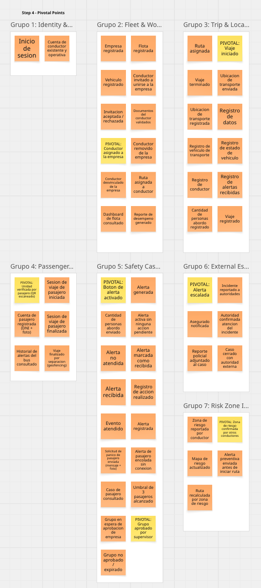

#### 2.5.1.2. Domain Message Flows Modeling

Para visualizar cómo colaboran los Bounded Contexts candidatos al resolver
los casos de uso principales del negocio, el equipo aplicó la técnica de
Domain Storytelling sobre cuatro historias representativas, seleccionadas
por involucrar la interacción de más de un context.

**Historia 1 — Conductor inicia un viaje:** el conductor inicia sesión en
Identity & Access Management, que consulta a Fleet & Workforce Management si
el conductor está activo y asignado; Fleet confirma la asignación (conductor,
bus, ruta) y Trip & Location Tracking activa el viaje y comienza a recibir la
ubicación.

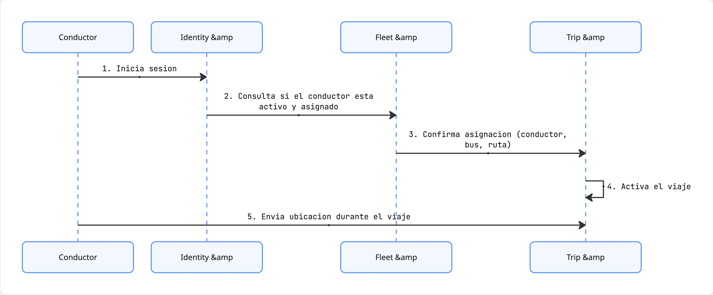

**Historia 2 — Pasajero verifica la unidad y consulta aforo:** Passenger
Journey & Occupancy consulta a Trip & Location Tracking si la unidad
escaneada tiene un viaje activo; al confirmarse, crea la sesión de viaje del
pasajero y consulta el aforo actual.

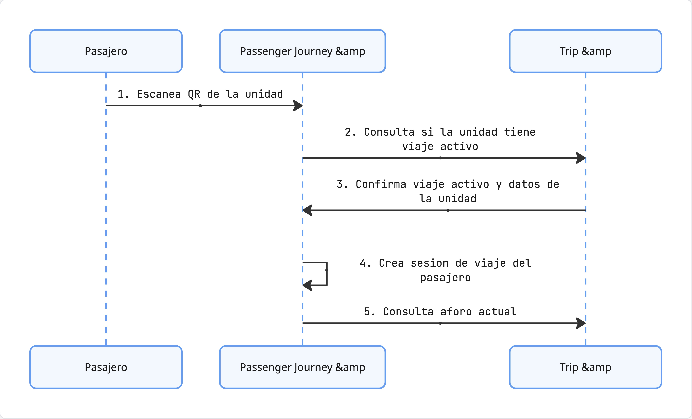

**Historia 3 — Se activa una alerta de pánico:** el conductor o el pasajero
activan el botón de pánico en Safety Case Management, que consulta la
ubicación más reciente a Trip & Location Tracking y notifica el nuevo caso a
Fleet & Workforce Management (Operations Central), quien registra la acción
realizada.

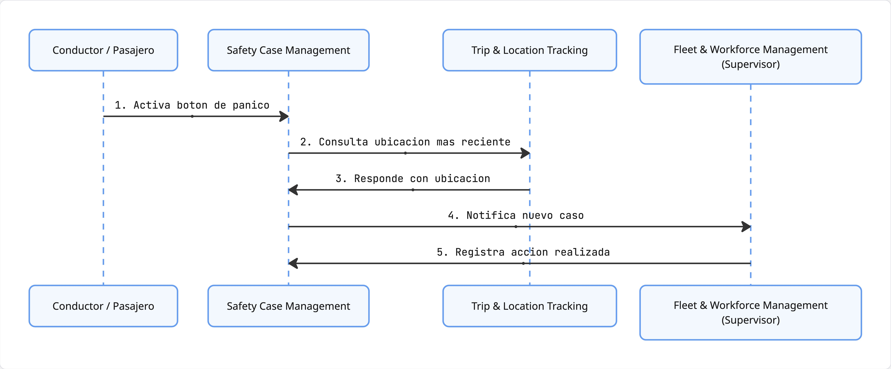

**Historia 4 — Una alerta no atendida se escala externamente:** Safety Case
Management detecta el evento pivotal "Alerta escalada" y notifica a External
Escalation, que reporta el incidente a la autoridad correspondiente y
confirma el cierre del caso de vuelta a Safety Case Management.

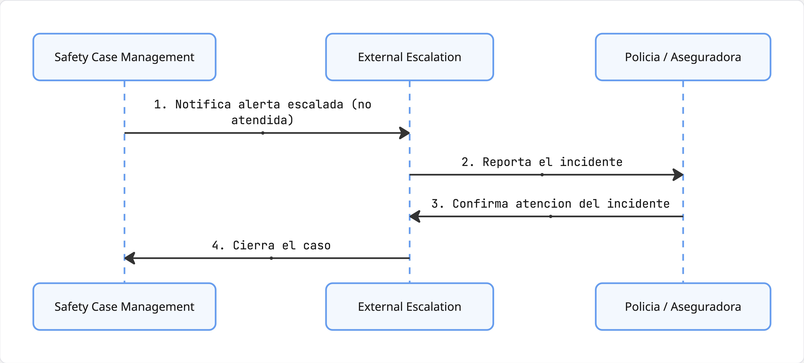

#### 2.5.1.3. Bounded Context Canvases

El equipo elaboró el Bounded Context Canvas de cada context candidato,
priorizando según su importancia para el negocio. Los cuatro contexts core
del sistema (Safety Case Management, Trip & Location Tracking, Passenger
Journey & Occupancy y Fleet & Workforce Management) se desarrollaron con el
proceso iterativo completo (Context Overview Definition, Business Rules
Distillation & Ubiquitous Language Capture, Capability Analysis, Capability
Layering, Dependencies Capture y Design Critique). Los tres contexts
restantes (External Escalation, Risk Zone Intelligence e Identity & Access
Management) se desarrollaron con un nivel de detalle inicial (Context
Overview Definition y Capability Analysis), a profundizar en la siguiente
entrega.

**Safety Case Management**

Recibe, prioriza y gestiona el ciclo de vida completo de una alerta de
pánico desde su activación hasta su cierre. Es el context core del sistema:
concentra las capabilities de Alert Activation, Case Prioritization y Case
Status Tracking. Depende de Trip & Location Tracking para la ubicación de la
unidad y de Passenger Journey & Occupancy para el contexto del viaje cuando
la alerta proviene de un pasajero; provee casos a Fleet & Workforce
Management y dispara el escalamiento hacia External Escalation.

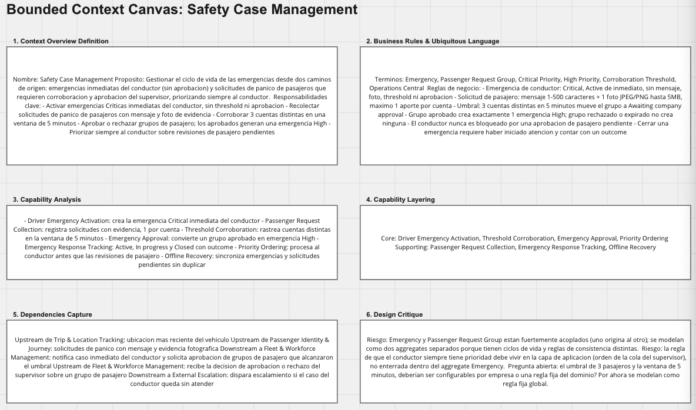

**Trip & Location Tracking**

Gestiona el ciclo de vida del viaje de una unidad: inicio, ubicación en
tiempo real y cierre. Sus capabilities core son Location Ingestion y Trip
Lifecycle. Depende de Fleet & Workforce Management para la asignación
(conductor, bus, ruta), y es upstream crítico tanto de Safety Case
Management como de Passenger Journey & Occupancy.

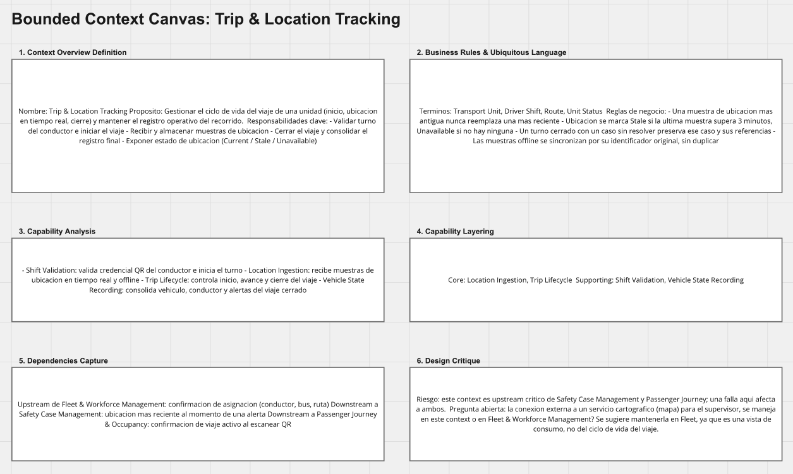

**Passenger Journey & Occupancy**

Vincula a un pasajero con un viaje verificado y le da visibilidad del aforo
de la unidad. Sus capabilities core son Unit Verification y Occupancy Query.
Depende de Trip & Location Tracking para confirmar el viaje activo y el
conteo de pasajeros, y origina la alerta de pánico del pasajero hacia Safety
Case Management.

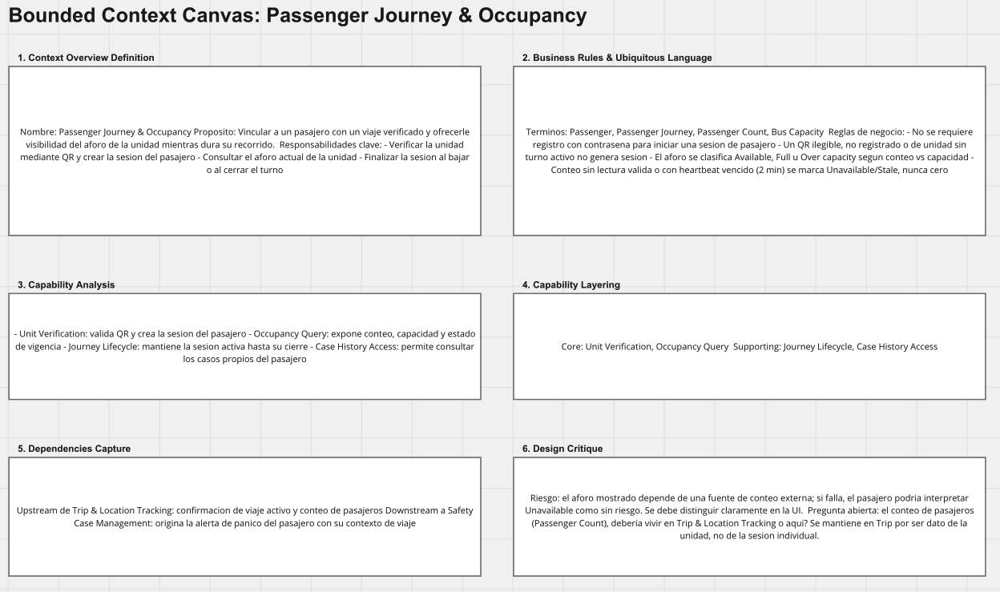

**Fleet & Workforce Management**

Administra la relación entre la empresa, sus conductores y su flota,
asignando recursos a rutas y supervisando el desempeño operativo. Sus
capabilities core son Shift Assignment y Case Response (ejercida como
Operations Central). Provee la asignación que necesita Trip & Location
Tracking y recibe los casos notificados por Safety Case Management.

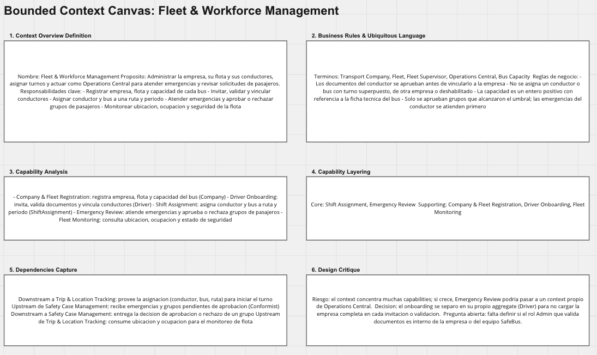

**External Escalation** *(nivel de detalle inicial)*

Deriva un caso hacia una autoridad externa (policía, aseguradora) cuando la
gestión interna de la empresa no lo atiende a tiempo, y hace seguimiento
hasta su cierre. Capabilities: Escalation Trigger, Authority Reporting y
Resolution Confirmation.

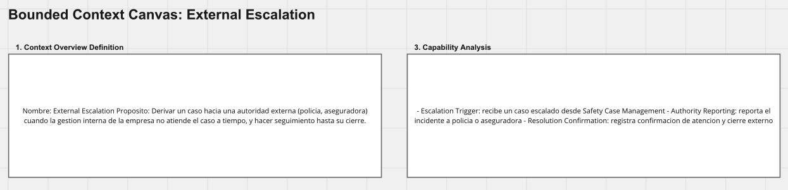

**Risk Zone Intelligence** *(nivel de detalle inicial)*

Recolecta y valida reportes de zonas de riesgo hechos por conductores, para
anticipar y prevenir el paso por rutas peligrosas. Capabilities: Risk Report
Collection, Report Corroboration y Preventive Alerting.

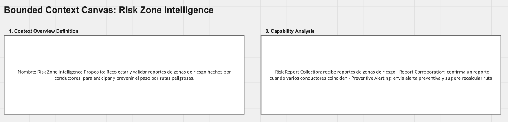

**Identity & Access Management** *(nivel de detalle inicial)*

Autentica a conductores y supervisores, y protege el acceso a las
operaciones y datos según su rol y empresa. Capabilities: Authentication,
Session Management y Access Control.

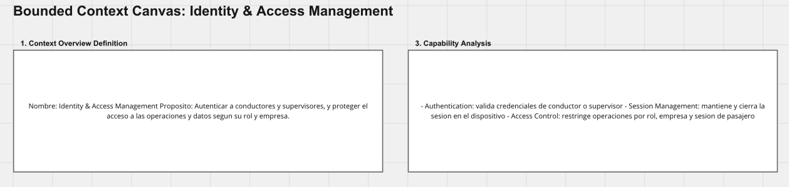

### 2.5.2. Context Mapping

A partir de las dependencias identificadas en cada Bounded Context Canvas, el
equipo elaboró el Context Map de la solución, aplicando los patrones de
relación entre Bounded Contexts establecidos en Domain-Driven Design.

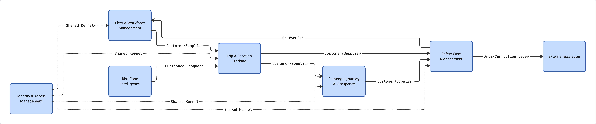

| Upstream | Downstream | Patrón | Justificación |
|---|---|---|---|
| Fleet & Workforce Management | Trip & Location Tracking | Customer/Supplier | Fleet provee la asignación (conductor, bus, ruta) que Trip necesita para iniciar el viaje. |
| Trip & Location Tracking | Safety Case Management | Customer/Supplier | Safety Case consume la ubicación más reciente, con manejo propio de indisponibilidad (Stale/Unavailable) para no bloquearse ante una falla upstream. |
| Trip & Location Tracking | Passenger Journey & Occupancy | Customer/Supplier | Passenger Journey depende de que Trip confirme el viaje activo antes de crear la sesión del pasajero. |
| Passenger Journey & Occupancy | Safety Case Management | Customer/Supplier | La alerta del pasajero nace con el contexto de su sesión de viaje. |
| Safety Case Management | Fleet & Workforce Management | Conformist | Fleet, como Operations Central, se adapta al modelo de caso definido por Safety Case Management sin negociar su estructura. |
| Safety Case Management | External Escalation | Anti-Corruption Layer | External Escalation traduce el modelo interno de caso al formato que espera una autoridad externa, aislando el modelo propio de un sistema que el equipo no controla. |
| Risk Zone Intelligence | Trip & Location Tracking | Published Language | Risk Zone publica información de zonas de riesgo de forma informativa, sin una dependencia transaccional fuerte. |
| Identity & Access Management | Fleet & Workforce Management, Trip & Location Tracking, Safety Case Management, Passenger Journey & Occupancy | Shared Kernel | Todos los contexts comparten el mismo modelo de identidad y sesión, al ser infraestructura transversal y no lógica de negocio propia de cada context. |

### 2.5.3. Software Architecture

La arquitectura de SafeBus describe cómo se organizan las aplicaciones móviles, los servicios y los datos que permiten identificar un viaje, registrar incidentes y coordinar su atención. Se utiliza C4 Model con Structurizr para presentar cuatro perspectivas complementarias: contexto, contenedores, componentes y despliegue. Las vistas representan una propuesta de diseño para las 24 historias de la sección 2.4; no constituyen evidencia de infraestructura ya implementada.

El diseño conserva un backend modular compartido por las aplicaciones nativa y multiplataforma. Las responsabilidades de negocio se separan dentro de ese backend, con una base de datos operativa, almacenamiento privado de imágenes y un mecanismo de eventos de integración. De esta forma, las dos aplicaciones aplican las mismas condiciones para registro, aprobación de emergencias y finalización del viaje.

La selección móvil se fundamenta en el sílabo: la Unidad 2 desarrolla Android con Kotlin y su bibliografía incluye Jetpack Compose; la Unidad 3 desarrolla Flutter, Dart y almacenamiento local con SQFLite y Drift. Se propone Kotlin con Jetpack Compose para Android y Flutter con Dart y Drift para la versión multiplataforma. Para los servicios se propone Java con Spring Boot, alternativa permitida por el enunciado, junto con PostgreSQL, RabbitMQ y un volumen privado de archivos. Estas últimas elecciones concretan el diseño y no se presentan como tecnologías obligatorias del sílabo. Firebase forma parte del temario, pero su mención no obliga a sustituir la API REST ni a incorporar otro servicio al flujo de emergencias.

El límite funcional corresponde a las historias US01–US24. La atención y aprobación pertenecen a la empresa de transporte; External Escalation y Risk Zone Intelligence, identificados como candidatos en el análisis estratégico, quedan fuera de este despliegue inicial. La arquitectura utiliza las responsabilidades de Identity & Access Management, Fleet & Workforce Management, Trip & Location Tracking, Passenger Journey & Occupancy y Safety Case Management para cubrir el alcance vigente.

Las cuatro vistas se generan desde un único [modelo Structurizr DSL](../docs/c4/software-architecture/workspace.dsl), que mantiene los mismos elementos y relaciones entre niveles.

#### 2.5.3.1. Software Architecture Context Level Diagrams

**Introducción**

La vista de contexto presenta SafeBus como un sistema completo y delimita sus relaciones con las personas y la fuente externa de conteo. Su propósito es explicar quién utiliza la solución y qué información intercambia, antes de describir las aplicaciones y servicios internos.

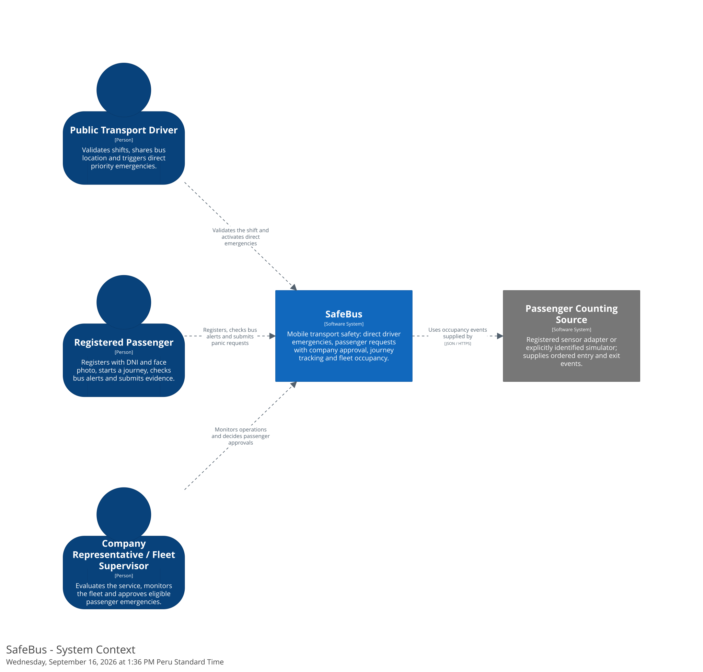

**Explicación**

El conductor valida su turno, comparte la ubicación del bus y activa una emergencia directa de prioridad Critical. El pasajero registra su cuenta con DNI y foto del rostro, verifica el QR de la unidad, consulta alertas y envía solicitudes de pánico con mensaje y foto del incidente. El representante de empresa conoce el servicio y solicita información mediante la landing; cuando actúa como supervisor autorizado, consulta la flota y registra las decisiones de atención.

La solicitud de un pasajero no activa por sí sola una emergencia. Tres pasajeros distintos del mismo bus y turno, dentro de una ventana de cinco minutos, habilitan la revisión empresarial. La aprobación activa una emergencia High. El conductor mantiene prioridad y no depende de ese umbral ni de una aprobación previa.

El único sistema externo de esta vista es la fuente de conteo de pasajeros, que entrega entradas, salidas y señales de vigencia para calcular el aforo que consulta la empresa. Puede consistir en un adaptador de sensores o en un simulador identificado durante el prototipo. El GPS y la cámara son recursos de los teléfonos utilizados por las aplicaciones; no se presentan como plataformas externas de negocio. La empresa coordina la atención a través de SafeBus, sin una integración automática con autoridades en este alcance.

#### 2.5.3.2. Software Architecture Container Level Diagrams

**Introducción**

La vista de contenedores descompone SafeBus en sus aplicaciones, servicio de backend y almacenes de información. Cada contenedor representa una unidad de ejecución o almacenamiento del modelo C4. El diagrama muestra su responsabilidad, la tecnología propuesta y la comunicación necesaria para completar los recorridos de los tres roles.

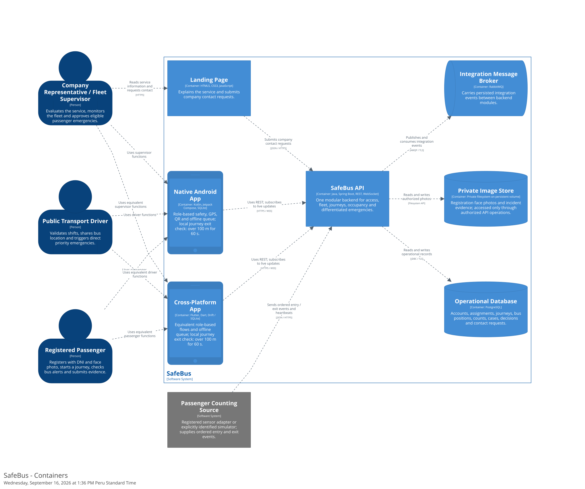

**Explicación**

La solución contiene siete contenedores:

| Contenedor | Tecnología propuesta | Responsabilidad |
|---|---|---|
| Landing Page | HTML5, CSS3 y JavaScript | Explicar el servicio y enviar solicitudes de contacto de empresas a la API. |
| Native Android App | Kotlin, Jetpack Compose y SQLite | Ofrecer los recorridos por rol, utilizar GPS y cámara, y conservar datos pendientes cuando falta conexión. |
| Cross-Platform App | Flutter, Dart y Drift sobre SQLite | Implementar los mismos recorridos y contratos de servicio para la estrategia multiplataforma. |
| SafeBus API | Java y Spring Boot; REST y WebSocket | Aplicar las condiciones de acceso, asignación, viaje, aforo, solicitud, aprobación y atención. |
| Operational Database | PostgreSQL | Conservar cuentas, asignaciones, viajes, posiciones del bus, conteos, solicitudes, decisiones y contactos. |
| Private Image Store | Sistema de archivos en un volumen persistente privado | Guardar por separado las fotos del registro y las fotos de evidencia, con acceso a través de operaciones autorizadas de la API. |
| Integration Message Broker | RabbitMQ | Transportar eventos de integración entre módulos del backend. |

Las aplicaciones móviles consumen la API mediante HTTPS: utilizan JSON para operaciones y consultas, y cargas multipart para las imágenes. Los supervisores conectados reciben actualizaciones mediante WebSocket seguro (WSS). La fuente de conteo envía eventos ordenados y heartbeats por JSON/HTTPS. La landing consulta contenido estático y utiliza la API únicamente para registrar el contacto comercial; no accede a los datos operativos de la empresa.

La API accede a PostgreSQL mediante JDBC, al volumen privado mediante operaciones del sistema de archivos y a RabbitMQ mediante AMQP. Los clientes no acceden directamente a esos almacenes. La base local de cada aplicación pertenece al contenedor móvil y permite conservar identificadores de viaje y envíos pendientes; su contenido sensible se protege con almacenamiento privado y mecanismos de claves de la plataforma.

El teléfono del pasajero compara localmente su posición con la última ubicación autorizada del bus. Si la distancia supera 100 metros durante al menos 60 segundos y las muestras cumplen las condiciones de vigencia y precisión de US24, termina el viaje y comunica su finalización. El backend conserva el resumen del cierre, sin recibir un historial continuo de posiciones del pasajero. Kotlin y Flutter son implementaciones alternativas para el usuario y comparten estas mismas condiciones.

#### 2.5.3.3. Software Architecture Components Level Diagrams

**Introducción**

La vista de componentes muestra la organización interna de SafeBus API. El límite del contenedor agrupa los módulos que colaboran para atender las solicitudes de los clientes. Se distinguen cinco componentes de negocio y dos componentes de soporte, todos dentro de un único backend desplegable.

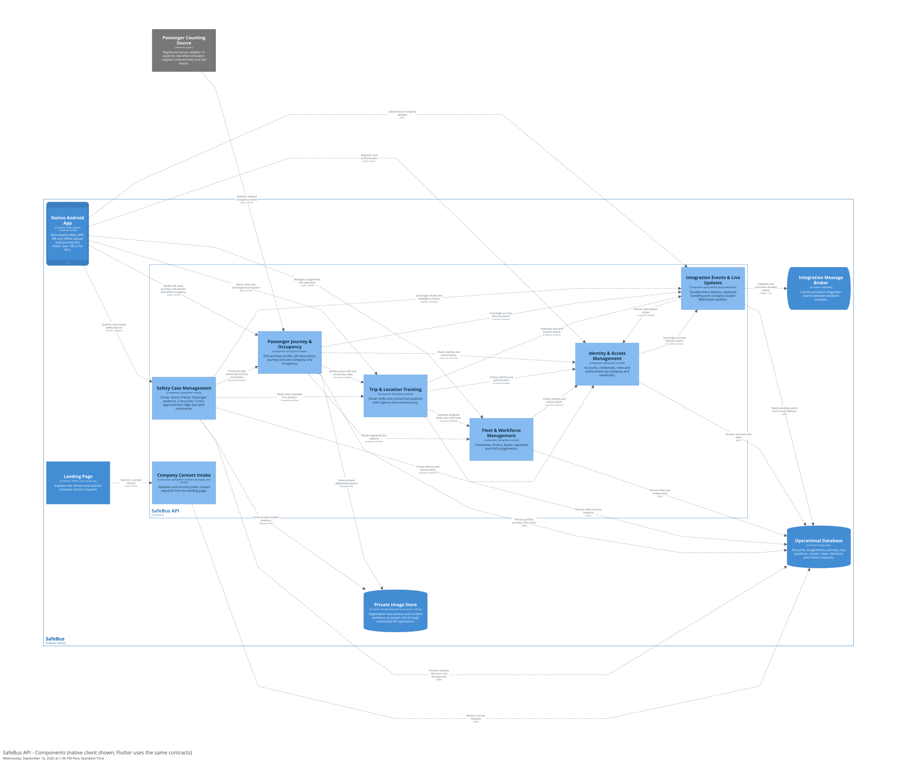

**Explicación**

Identity & Access Management administra cuentas, autenticación y autorización por rol, empresa y titularidad. Fleet & Workforce Management administra empresas, conductores, buses, capacidades y asignaciones. Trip & Location Tracking valida la asignación al abrir el turno y conserva la ubicación del bus con su hora de captura y precisión.

Passenger Journey & Occupancy completa el perfil del pasajero con DNI y foto del rostro, verifica el viaje mediante QR y registra su finalización. También procesa las entradas y salidas de la fuente de conteo y entrega el aforo únicamente al supervisor autorizado. Para cumplir estas responsabilidades consulta el turno activo en Trip & Location Tracking y la capacidad registrada en Fleet & Workforce Management.

Safety Case Management conserva la evidencia y diferencia la activación directa del conductor de la agrupación de solicitudes de pasajeros. Este módulo verifica el viaje asociado, cuenta como máximo una contribución por cuenta dentro de la ventana y habilita la decisión empresarial al alcanzar tres participantes. La aprobación crea una sola emergencia y las repeticiones de una solicitud o decisión conservan el mismo resultado. El cierre del viaje mantiene la evidencia y las revisiones pendientes. La consulta compartida del bus entrega resúmenes; la consulta de solicitudes propias aplica la autorización del titular.

Company Contact Intake valida y registra los contactos de la landing. Integration Events & Live Updates coordina la publicación y recepción de eventos y la entrega de actualizaciones WSS a la empresa correspondiente. Son componentes de soporte y no nuevos Bounded Contexts. La vista utiliza el cliente Android como representante de las interfaces móviles; Flutter consume los mismos contratos definidos en la vista de contenedores.

Las consultas que requieren una respuesta inmediata se realizan mediante interfaces internas del backend. Los cambios de ciclo de vida se distribuyen mediante eventos de integración, como cierre de turno, cierre de viaje, grupo listo para revisión y emergencia activada. El backend registra los eventos pendientes junto con el cambio de negocio antes de publicarlos y utiliza identificadores para procesar reintentos sin duplicar efectos. La emergencia directa se registra antes de notificarla: una demora del broker no convierte su activación en una aprobación pendiente. Los clientes pueden recuperar el estado persistido mediante REST al reconectarse.

La base de datos se comparte físicamente, pero cada módulo conserva la responsabilidad de escritura sobre sus datos. La colaboración entre módulos utiliza sus interfaces o eventos. Las imágenes permanecen en el volumen privado y se entregan a través de la API después de comprobar el permiso correspondiente.

#### 2.5.3.4. Software Architecture Deployment Diagrams

**Introducción**

La vista de despliegue presenta un entorno piloto propuesto y ubica los contenedores en dispositivos y servicios de ejecución. Permite distinguir qué funciona en los teléfonos, qué se ejecuta en el servidor y dónde se conservan los datos persistentes.

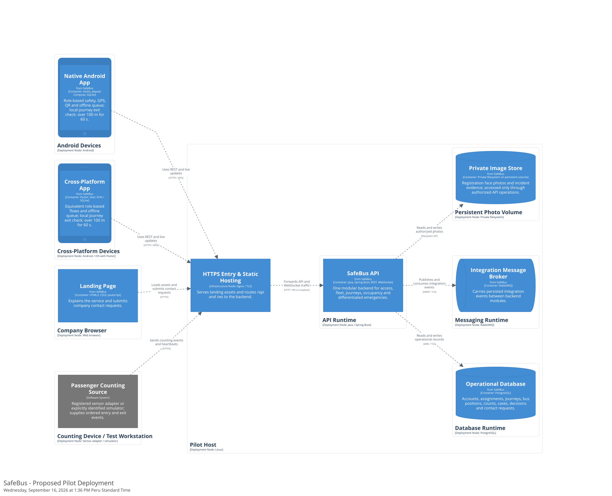

**Explicación**

Los teléfonos de conductor, pasajero y supervisor ejecutan una de las aplicaciones móviles. El navegador del representante ejecuta el JavaScript de la landing descargada desde el servidor web. El adaptador de conteo funciona en el dispositivo asociado al bus; durante las pruebas puede sustituirse por un simulador en una estación de trabajo identificada.

El piloto se aloja en un servidor Linux con una entrada HTTPS y alojamiento estático mediante Nginx. Esta entrada sirve la landing y encamina las solicitudes de API y las conexiones WebSocket hacia un proceso Java con Spring Boot. PostgreSQL, RabbitMQ y el volumen persistente de imágenes pertenecen al entorno privado del servidor. El directorio de fotos no se publica como contenido estático.

Las conexiones lógicas de los clientes con la API atraviesan la entrada HTTPS; el tramo interno hacia el proceso Java utiliza loopback. Los servicios de datos y mensajería no se exponen como puntos de acceso de los usuarios. El diagrama representa un único host para el piloto y no presupone alta disponibilidad ni un proveedor de nube contratado. Los datos operativos y las fotos se conservan en almacenamiento persistente independiente del reinicio de la API.

Ante una pérdida de conectividad, la aplicación mantiene los envíos pendientes y señala su estado. El servidor aplica las condiciones temporales de las solicitudes de pasajeros al recibirlas y conserva los registros anteriores al cierre del viaje. Este despliegue permite evaluar la solución compartiendo infraestructura entre las dos implementaciones móviles.

---

## 2.6. Tactical-Level Domain-Driven Design

El backend de SafeBus se organiza en tres (3) Bounded Contexts que concentran los componentes del dominio y distinguen autenticación, perfil/viaje y gestión de seguridad. Cada contexto expone su API REST y se comunica de forma asíncrona con los demás mediante eventos de dominio publicados en un Message Broker, lo que permite reaccionar en tiempo real a validaciones y alertas de emergencia .

| # | Bounded Context | Capabilities core | Rol en el Context Map |
| :--- | :--- | :--- | :--- |
| 2.6.1 | **IAM** | `iam` | Registro, autenticación y autorización de todos los actores. |
| 2.6.2 | **User Management** | `usermanagement` | Perfiles, DNI y foto de rostro del pasajero, validación de operadores y ciclo del viaje con cierre por ubicación. |
| 2.6.3 | **Alert Management** | `alertmanagement` | Emergencia directa del conductor; solicitudes de pasajeros con evidencia, umbral, aprobación y atención de emergencias. |

### 2.6.1. Bounded Context: Identity & Access Management

Autentica a conductores y supervisores y protege el acceso a las operaciones y datos según el rol y la empresa. Al ser infraestructura transversal, se relaciona con los demás contextos como **Shared Kernel**.

#### 2.6.1.1. Domain Layer

* **Entities:** `User`, `Role`, `Permission`
* **Value Objects:** `EmailAddress`, `PasswordHash`, `PersonName`, `PhoneNumber`, `RoleType`, `PassengerLoginId` (identificador asociado al DNI, único y privado)
* **Aggregates:** `User` (aggregate root; agrupa sus `Role` asignados)
* **Factories:** `UserFactory`
* **Domain Services:** `AuthenticationService`, `AccessControlPolicy`
* **Repository interfaces:** `UserRepository`, `RoleRepository`, `SessionRepository`

#### 2.6.1.2. Interface Layer

* **Controllers:** `AuthenticationController`, `UsersController`, `RolesController`
* **Consumers:** `PassengerJourneyEndedConsumer` (entrega el evento al manejador que conserva solicitudes previas y limita nuevas activaciones)

#### 2.6.1.3. Application Layer

* **Command Handlers:** `SignUpCommandHandler`, `SignInCommandHandler`, `SignOutCommandHandler`, `AssignRoleToUserCommandHandler`
* **Event Handlers:** `SeedRolesEventHandler`, `PassengerProfileCompletedEventHandler` (habilita la cuenta al completarse el perfil obligatorio)

#### 2.6.1.4. Infrastructure Layer

* **Repository implementations:** `UserRepositoryImpl`, `RoleRepositoryImpl`
* **Message Brokers:** publica `UserRegisteredEvent` con identificador de cuenta y rol, sin DNI ni fotos, y `PassengerSignedOutEvent` para terminar el viaje al cerrar sesión; el registro del pasajero solo queda activo al completarse su perfil con la foto obligatoria. La coordinación de registro reutiliza un identificador de operación y compensa altas incompletas.
* **Servicios externos:** `JwtTokenService` (generación de JWT/BearerToken), `HashingService` (BCrypt)

#### 2.6.1.5. Bounded Context Software Architecture Component Level Diagrams

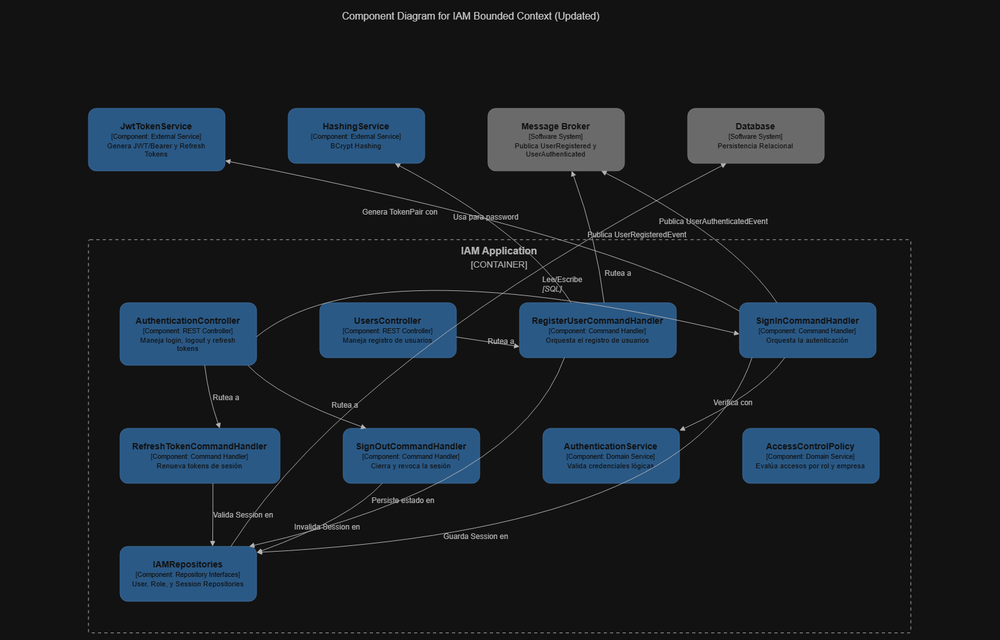

#### 2.6.1.6. Bounded Context Software Architecture Code Level Diagrams

##### 2.6.1.6.1. Bounded Context Domain Layer Class Diagrams

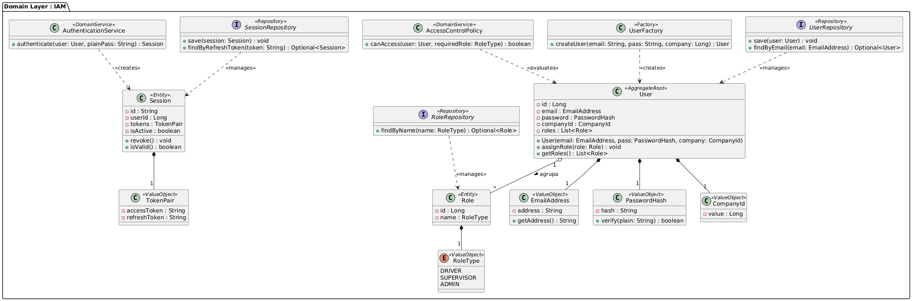

##### 2.6.1.6.2. Bounded Context Database Design Diagram

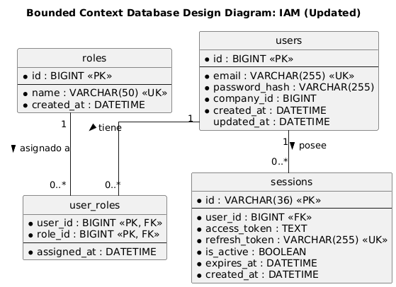

### 2.6.2. Bounded Context: Fleet & Workforce Management

#### 2.6.2.1. Domain Layer

* **Entities:** `Driver` (Conductor), `TransportCompany` (Empresa), `Passenger` (Pasajero), `QrCredential`, `PassengerJourney`
* **Value Objects:** `LicenseNumber` (licencia de conducir), `Ruc`, `Dni`, `Address`, `ContactInfo`, `QrCode`, `Habilitation` (habilitación), `ValidationStatus` (VALIDATED / REJECTED / PENDING), `FacePhotoReference`, `JourneyStatus` (ACTIVE / ENDED), `JourneyEndReason`, `SeparationEvidence` (distancia y duración, sin historial continuo de coordenadas del pasajero)
* **Aggregates:** `DriverProfile` (aggregate root), `CompanyProfile`, `PassengerProfile`, `PassengerJourney`
* **Factories:** `ProfileFactory`, `QrCredentialFactory`, `PassengerJourneyFactory`
* **Domain Services:** `ProfileValidationService`, `OperatorHabilitationService`, `QrValidationService`, `PassengerRegistrationService`, `JourneyCompletionService`
* **Repository interfaces:** `DriverRepository`, `CompanyRepository`, `PassengerRepository`, `QrCredentialRepository`, `PassengerJourneyRepository`

#### 2.6.2.2. Interface Layer

* **Controllers:** `DriversController`, `CompaniesController`, `PassengersController`, `OperatorValidationController`, `PassengerJourneysController`
* **Consumers:** `UserRegisteredConsumer` (crea el perfil cuando IAM registra un usuario)

#### 2.6.2.3. Application Layer

* **Command Handlers:** `CompletePassengerRegistrationCommandHandler`, `StartPassengerJourneyCommandHandler`, `EndPassengerJourneyCommandHandler`
* **Event Handlers:** `DriverShiftClosedEventHandler` (termina viajes asociados), `PassengerSignedOutEventHandler`
* **Cierre de viaje:** el móvil compara las ubicaciones durante el viaje; el backend registra una sola finalización con motivo y resumen de distancia/tiempo. No se expone el recorrido GPS del pasajero a la flota.

#### 2.6.2.4. Infrastructure Layer

* **Repository implementations:** `DriverRepositoryImpl`, `CompanyRepositoryImpl`, `PassengerRepositoryImpl`, `QrCredentialRepositoryImpl`, `PassengerJourneyRepositoryImpl`
* **Message Brokers:** consume `UserRegisteredEvent`; publica `DriverProfileCreatedEvent`, `OperatorValidatedEvent`, `PassengerProfileCompletedEvent` y `PassengerJourneyEndedEvent`; los eventos no incluyen DNI ni fotos de rostro
* **Servicios externos:** `QrCodeGeneratorService` (ZXing) y almacenamiento privado de fotos de registro. La validación del QR utiliza registros de la empresa; recopilar DNI y foto de rostro no introduce reconocimiento facial ni consultas oficiales automáticas

#### 2.6.2.5. Bounded Context Software Architecture Component Level Diagrams

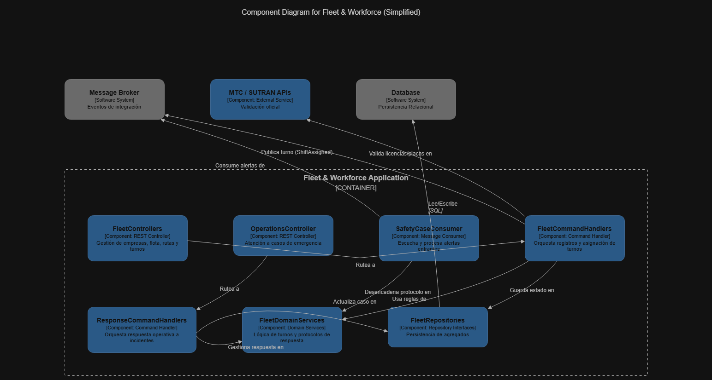

#### 2.6.2.6. Bounded Context Software Architecture Code Level Diagrams

##### 2.6.2.6.1. Bounded Context Domain Layer Class Diagrams

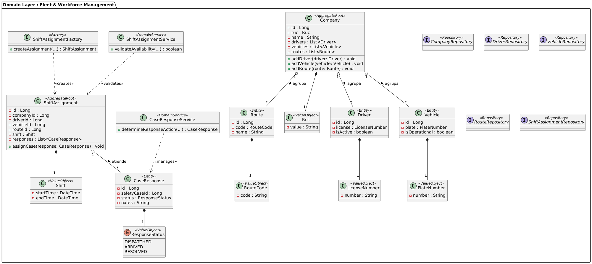

##### 2.6.2.6.2. Bounded Context Database Design Diagram

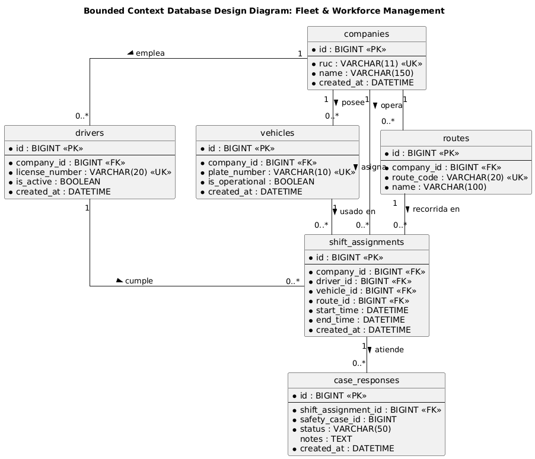

### 2.6.3. Bounded Context: Trip & Location Tracking

Gestiona el ciclo de vida del viaje de una unidad: inicio, ubicación en tiempo real y cierre. Depende de Fleet & Workforce Management para la asignación (conductor, bus, ruta) y es *upstream* crítico de Safety Case Management y Passenger Journey & Occupancy.

#### 2.6.3.1. Domain Layer

* **Entities:** `EmergencyAlert`, `PassengerPanicRequest`, `IncidentEvidence`, `ApprovalDecision`, `ResponseAction`
* **Value Objects:** `GeoLocation`, `EmergencySource` (DRIVER / PASSENGER_GROUP), `EmergencyStatus` (ACTIVE / IN_PROGRESS / CLOSED), `RequestGroupStatus` (COLLECTING / AWAITING_APPROVAL / EXPIRED / NOT_APPROVED / ACTIVATED), `RequestEligibility` (ELIGIBLE / LATE), `EvidencePhotoReference`, `Severity` (CRITICAL para conductor / HIGH para pasajeros), `ApprovalThreshold` (3 cuentas distintas / 5 minutos)
* **Aggregates:** `EmergencyAlert` (agrupa respuesta y cierre), `PassengerRequestGroup` (bus y turno, solicitudes, evidencia de umbral y decisión de aprobación)
* **Factories:** `DriverEmergencyFactory`, `PassengerRequestFactory`, `PassengerEmergencyFactory`
* **Domain Services:** `AlertDispatchService`, `EmergencyPriorityService`, `PassengerThresholdService`, `PassengerApprovalService`
* **Repository interfaces:** `AlertRepository`, `PassengerRequestGroupRepository`

#### 2.6.3.2. Interface Layer

* **Controllers:** `DriverPanicController`, `PassengerPanicRequestsController`, `PassengerApprovalsController`, `EmergencyAlertsController`, `BusSafetyHistoryController`
* **Consumers:** `PassengerJourneyEndedConsumer` (entrega el evento al manejador que conserva solicitudes previas y limita nuevas activaciones)

#### 2.6.3.3. Application Layer

* **Command Handlers:** `TriggerDriverEmergencyCommandHandler`, `SubmitPassengerPanicRequestCommandHandler`, `ApprovePassengerEmergencyCommandHandler`, `DeclinePassengerEmergencyCommandHandler`, `AttendEmergencyCommandHandler`, `CloseEmergencyCommandHandler`
* **Event Handlers:** `PassengerThresholdReachedEventHandler`, `PassengerJourneyEndedEventHandler` (conserva aportes ya recibidos y rechaza nuevas activaciones posteriores al fin del viaje)
* **Atomicidad:** reintentos, solicitudes simultáneas y aprobaciones repetidas conservan un aporte por cuenta y una emergencia por agrupación aprobada. El cierre del viaje no elimina evidencia ni cancela una revisión ya habilitada.

#### 2.6.3.4. Infrastructure Layer

* **Repository implementations:** `AlertRepositoryImpl`, `PassengerRequestGroupRepositoryImpl`
* **Message Brokers:** publica `DriverEmergencyActivatedEvent`, `PassengerReviewRequiredEvent`, `PassengerEmergencyApprovedEvent` y `EmergencyStatusChangedEvent`; la notificación a clientes se filtra por rol y empresa
* **Servicios externos:** almacenamiento privado de evidencia y entrega autenticada de eventos a la empresa mediante WebSocket. La revisión de solicitudes no envía una alarma de emergencia hasta que se registra su aprobación

#### 2.6.3.5. Bounded Context Software Architecture Component Level Diagrams

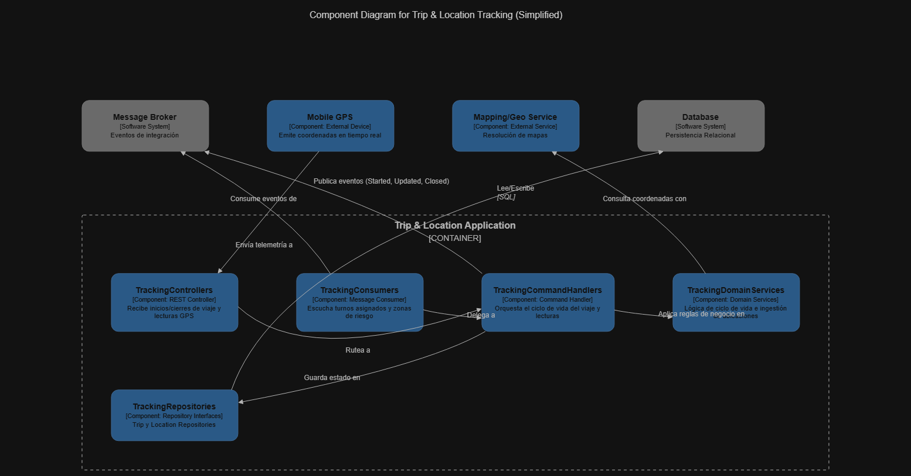

#### 2.6.3.6. Bounded Context Software Architecture Code Level Diagrams

##### 2.6.3.6.1. Bounded Context Domain Layer Class Diagrams

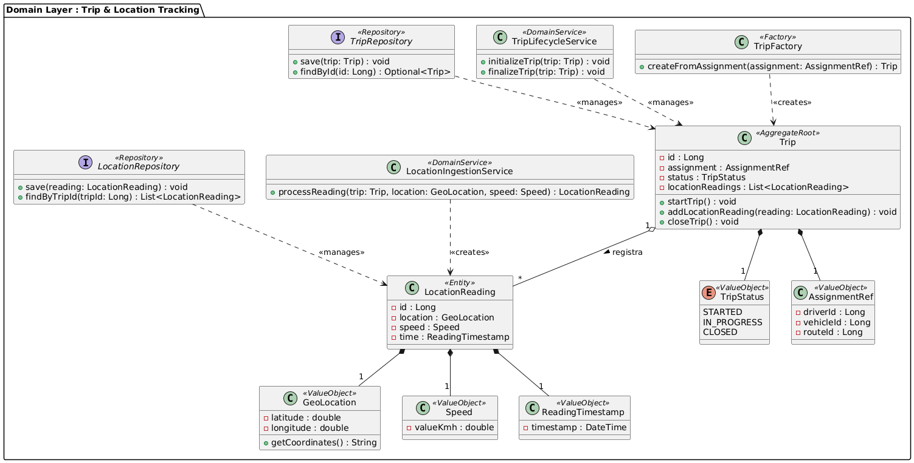

##### 2.6.3.6.2. Bounded Context Database Design Diagram

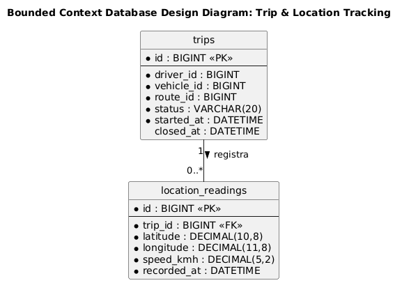

### 2.6.4. Bounded Context: Passenger Journey & Occupancy

Vincula a un pasajero con un viaje verificado y le da visibilidad del aforo de la unidad. Depende de Trip & Location Tracking para confirmar el viaje activo y el conteo de pasajeros, y origina la alerta de pánico del pasajero hacia Safety Case Management.

#### 2.6.4.1. Domain Layer

* **Entities:** `PassengerJourney` (sesión de viaje del pasajero), `UnitVerification`, `OccupancySnapshot`
* **Value Objects:** `QrCode`, `VerificationStatus` (VERIFIED / REJECTED), `PassengerCount`, `Capacity` (aforo máximo), `OccupancyLevel` (LOW / MEDIUM / FULL)
* **Aggregates:** `PassengerJourney` (aggregate root)
* **Factories:** `PassengerJourneyFactory`
* **Domain Services:** `UnitVerificationService`, `OccupancyQueryService`
* **Repository interfaces:** `PassengerJourneyRepository`, `OccupancyRepository`

#### 2.6.4.2. Interface Layer

* **Controllers:** `UnitVerificationController`, `OccupancyController`, `PassengerJourneysController`
* **Consumers:** `TripStartedConsumer`, `TripClosedConsumer` (de Trip & Location Tracking)

#### 2.6.4.3. Application Layer

* **Command Handlers:** `VerifyUnitCommandHandler`, `StartPassengerJourneyCommandHandler`, `RequestPassengerPanicCommandHandler`
* **Event Handlers:** `TripClosedEventHandler` (cierra las sesiones de pasajeros de la unidad)

#### 2.6.4.4. Infrastructure Layer

* **Repository implementations:** `PassengerJourneyRepositoryImpl`, `OccupancyRepositoryImpl`
* **Message Brokers:** consume `TripStartedEvent` y `TripClosedEvent`; publica `UnitVerifiedEvent` y `PassengerPanicRequestedEvent` (hacia Safety Case)
* **Servicios externos:** fuente externa de conteo de pasajeros integrada mediante contrato de eventos (sensor real o simulador, según el prototipo)

#### 2.6.4.5. Bounded Context Software Architecture Component Level Diagrams

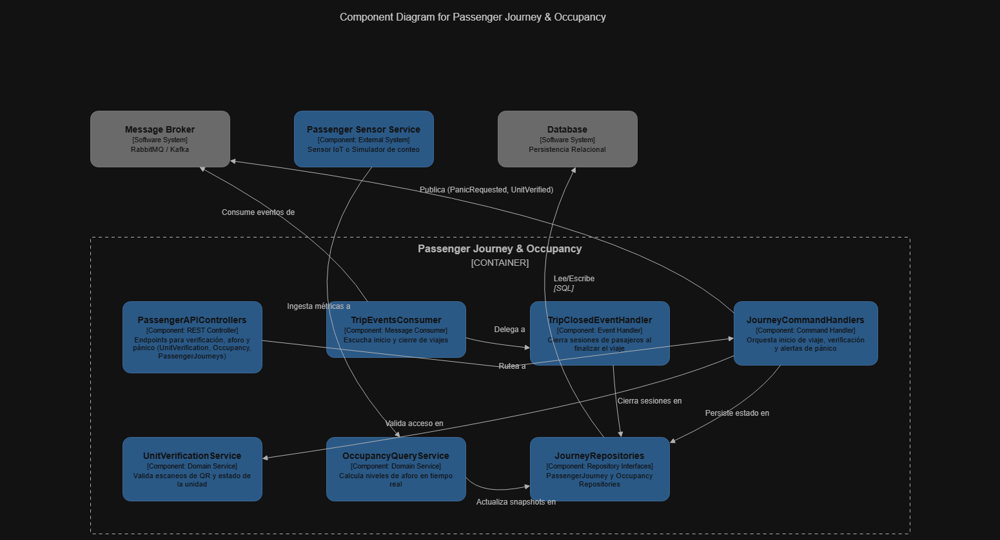

#### 2.6.4.6. Bounded Context Software Architecture Code Level Diagrams

##### 2.6.4.6.1. Bounded Context Domain Layer Class Diagrams

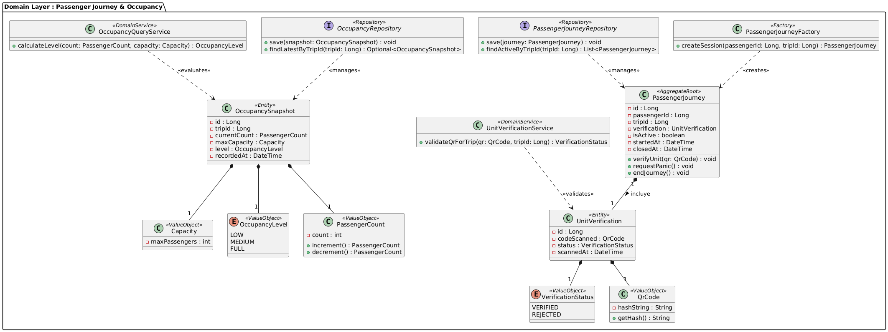

##### 2.6.4.6.2. Bounded Context Database Design Diagram

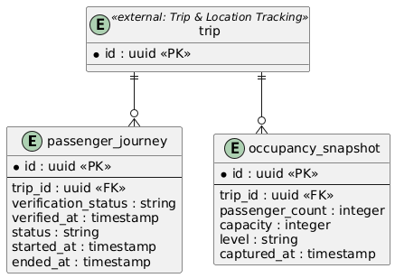

---

### 2.6.5. Bounded Context: Safety Case Management

Context core del sistema: recibe, prioriza y gestiona el ciclo de vida completo de una alerta de pánico, desde su activación hasta su cierre. Depende de Trip & Location Tracking (ubicación) y Passenger Journey & Occupancy (contexto del viaje del pasajero); provee casos a Fleet & Workforce Management y dispara el escalamiento hacia External Escalation.

#### 2.6.5.1. Domain Layer

* **Entities:** `SafetyCase` (caso de seguridad), `Alert`, `CaseStatusHistory`
* **Value Objects:** `AlertSource` (DRIVER / PASSENGER), `Priority`, `CaseStatus` (ACTIVE / ATTENDED / ESCALATED / CLOSED), `GeoLocation` (snapshot), `AlertType`
* **Aggregates:** `SafetyCase` (aggregate root; agrupa `Alert` y `CaseStatusHistory`)
* **Factories:** `SafetyCaseFactory`
* **Domain Services:** `AlertActivationService`, `CasePrioritizationService`, `CaseStatusTrackingService`
* **Repository interfaces:** `SafetyCaseRepository`, `AlertRepository`

#### 2.6.5.2. Interface Layer

* **Controllers:** `PanicButtonController`, `SafetyCasesController`
* **Consumers:** `PassengerPanicRequestedConsumer` (de Passenger Journey), `CaseResolvedByAuthorityConsumer` (de External Escalation)

#### 2.6.5.3. Application Layer

* **Command Handlers:** `ActivateAlertCommandHandler`, `PrioritizeCaseCommandHandler`, `UpdateCaseStatusCommandHandler`, `EscalateCaseCommandHandler`
* **Event Handlers:** `PassengerPanicRequestedEventHandler`, `CaseResolvedByAuthorityEventHandler`

#### 2.6.5.4. Infrastructure Layer

* **Repository implementations:** `SafetyCaseRepositoryImpl`, `AlertRepositoryImpl`
* **Message Brokers:** consume `TripLocationUpdatedEvent` y `PassengerPanicRequestedEvent`; publica `PanicAlertActivatedEvent` (a Fleet) y `AlertEscalatedEvent` (a External Escalation)
* **Servicios externos:** consulta de ubicación a Trip & Location Tracking con manejo propio de indisponibilidad (estados Stale / Unavailable) para no bloquearse ante fallas *upstream*

#### 2.6.5.5. Bounded Context Software Architecture Component Level Diagrams

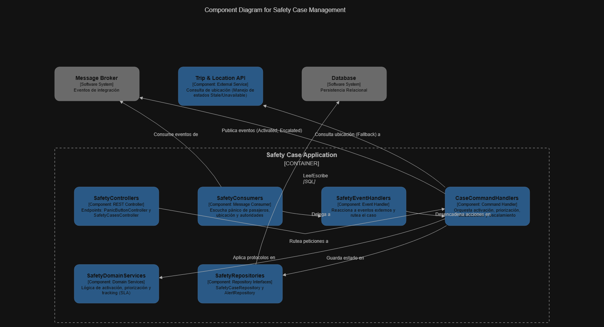

#### 2.6.5.6. Bounded Context Software Architecture Code Level Diagrams

##### 2.6.5.6.1. Bounded Context Domain Layer Class Diagrams

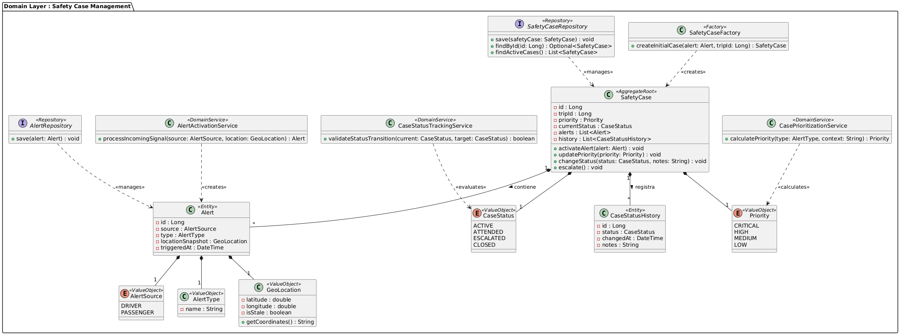

##### 2.6.5.6.2. Bounded Context Database Design Diagram

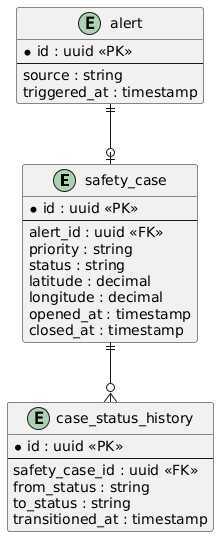

---

### 2.6.6. Bounded Context: External Escalation

Deriva un caso hacia una autoridad externa (policía, aseguradora) cuando la gestión interna de la empresa no lo atiende a tiempo, y hace seguimiento hasta su cierre. Se integra con Safety Case Management mediante un **Anti-Corruption Layer** que traduce el modelo interno de caso al formato que espera la autoridad externa.

#### 2.6.6.1. Domain Layer

* **Entities:** `EscalationCase`, `AuthorityReport`
* **Value Objects:** `AuthorityType` (POLICE / INSURER), `EscalationStatus` (TRIGGERED / REPORTED / RESOLVED), `ReportReference`
* **Aggregates:** `EscalationCase` (aggregate root; agrupa sus `AuthorityReport`)
* **Factories:** `EscalationCaseFactory`
* **Domain Services:** `AuthorityReportingService`, `ResolutionConfirmationService`
* **Repository interfaces:** `EscalationRepository`

#### 2.6.6.2. Interface Layer

* **Controllers:** `ExternalEscalationController`
* **Consumers:** `AlertEscalatedConsumer` (de Safety Case Management, vía ACL)

#### 2.6.6.3. Application Layer

* **Command Handlers:** `TriggerEscalationCommandHandler`, `ReportToAuthorityCommandHandler`, `ConfirmResolutionCommandHandler`
* **Event Handlers:** `AlertEscalatedEventHandler`

#### 2.6.6.4. Infrastructure Layer

* **Repository implementations:** `EscalationRepositoryImpl`
* **Message Brokers:** consume `AlertEscalatedEvent`; publica `CaseResolvedByAuthorityEvent` (de vuelta a Safety Case)
* **Servicios externos:** Anti-Corruption Layer hacia las APIs de la policía/aseguradora; notificaciones a la autoridad

#### 2.6.6.5. Bounded Context Software Architecture Component Level Diagrams

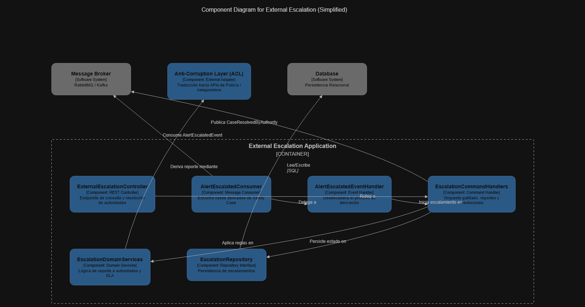

#### 2.6.6.6. Bounded Context Software Architecture Code Level Diagrams

##### 2.6.6.6.1. Bounded Context Domain Layer Class Diagrams

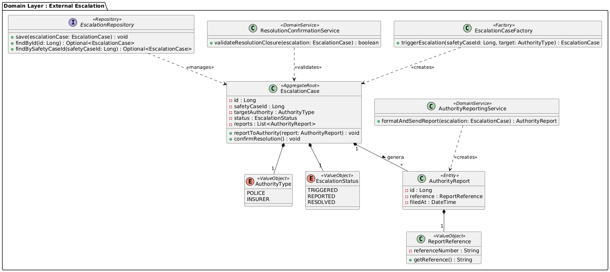

##### 2.6.6.6.2. Bounded Context Database Design Diagram

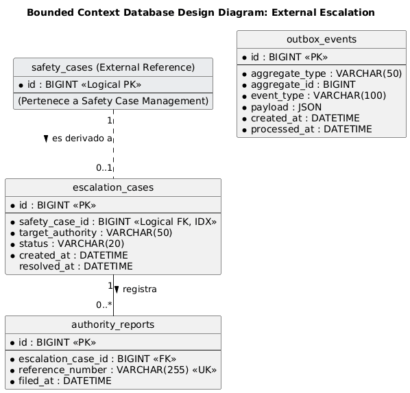

---

### 2.6.7. Bounded Context: Risk Zone Intelligence

Recolecta y valida reportes de zonas de riesgo hechos por conductores, para anticipar y prevenir el paso por rutas peligrosas. Publica la información de zonas de riesgo hacia Trip & Location Tracking mediante un **Published Language**, sin dependencia transaccional fuerte.

#### 2.6.7.1. Domain Layer

* **Entities:** `RiskReport` (reporte de zona), `RiskZone` (zona de riesgo)
* **Value Objects:** `GeoArea` (área/polígono geográfico), `RiskLevel` (LOW / MEDIUM / HIGH), `CorroborationCount`, `ReportStatus` (PENDING / CONFIRMED)
* **Aggregates:** `RiskZone` (aggregate root; agrupa los `RiskReport` que la corroboran)
* **Factories:** `RiskReportFactory`
* **Domain Services:** `ReportCorroborationService`, `PreventiveAlertingService`
* **Repository interfaces:** `RiskReportRepository`, `RiskZoneRepository`

#### 2.6.7.2. Interface Layer

* **Controllers:** `RiskReportsController`, `RiskZonesController`
* **Consumers:** —

#### 2.6.7.3. Application Layer

* **Command Handlers:** `SubmitRiskReportCommandHandler`, `CorroborateReportCommandHandler`
* **Event Handlers:** `RiskReportSubmittedEventHandler`

#### 2.6.7.4. Infrastructure Layer

* **Repository implementations:** `RiskReportRepositoryImpl`, `RiskZoneRepositoryImpl`
* **Message Brokers:** publica `RiskZoneConfirmedEvent` (Published Language, consumido por Trip & Location Tracking)
* **Servicios externos:** servicio de mapas/geolocalización para el modelado de zonas

#### 2.6.7.5. Bounded Context Software Architecture Component Level Diagrams

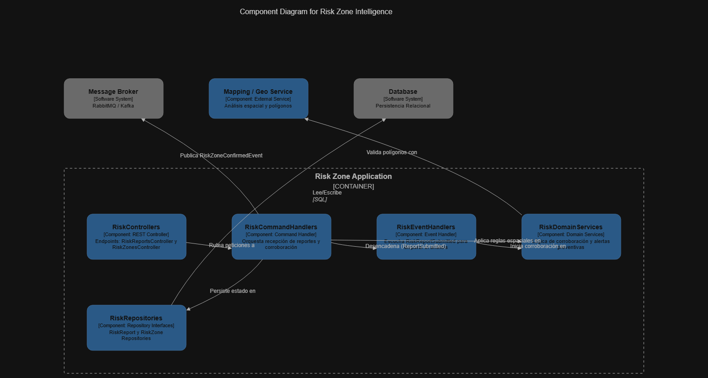

#### 2.6.7.6. Bounded Context Software Architecture Code Level Diagrams

##### 2.6.7.6.1. Bounded Context Domain Layer Class Diagrams

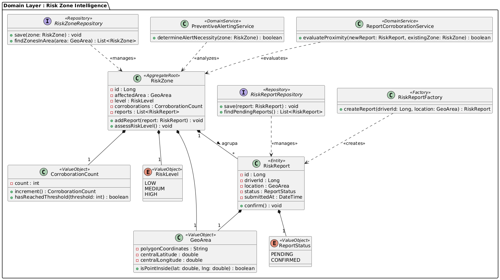

##### 2.6.7.6.2. Bounded Context Database Design Diagram

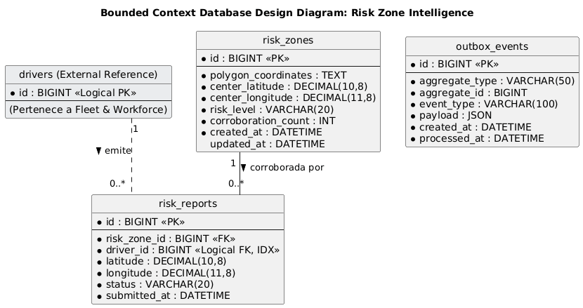