[← Volver al índice](00-chapter0.md#contenido)

# Capítulo III: Solution UI/UX Design

## 3.1. Product design

En esta sección se define el diseño de producto de SafeBus: las pautas visuales y de comunicación que comparten la landing page y las dos implementaciones móviles (Android nativa con Kotlin y Jetpack Compose, y multiplataforma con Flutter), y la arquitectura de información que organiza los recorridos de los tres roles del alcance: conductor, pasajero registrado y supervisor de empresa. Las decisiones se derivan de las historias US01–US24 (sección 2.4), de los hallazgos de las entrevistas (sección 2.2.3) y del lenguaje ubicuo (sección 2.3.6). Ambas aplicaciones móviles aplican las mismas pautas, de modo que un usuario reconozca los mismos colores, etiquetas, estados y recorridos en cualquiera de ellas.

Dos principios guían todo el diseño:

1. **La urgencia se distingue a simple vista.** Una emergencia directa del conductor (Critical), una emergencia de pasajeros aprobada (High) y una agrupación de solicitudes pendiente de aprobación nunca comparten color, etiqueta ni posición en pantalla.
2. **La información sensible no se expone.** El DNI, la foto del rostro y la evidencia de un pasajero solo aparecen en las pantallas de su titular o de la empresa autorizada (US17); las vistas compartidas muestran resúmenes.

### 3.1.1. Style Guidelines

En esta sección, el equipo establece un repositorio organizado y central de elementos comunes (logotipo, fuentes, colores, iconografía, espaciados y dimensiones de componentes) para mantener una presentación visual consistente entre la landing page, la aplicación Android nativa y la aplicación Flutter. Se toma como base el sistema Material Design 3, disponible tanto en Jetpack Compose como en Flutter, y se adapta al espíritu de SafeBus: **confiable, protector y sereno**. El contexto de uso condiciona cada decisión: personas que interactúan con el teléfono en movimiento, de noche, con conectividad variable y, en ocasiones, bajo estrés.

Cada pauta se presenta con su lámina de referencia y con los valores exactos que deben implementarse, de manera que el equipo de desarrollo no dependa de aproximaciones al construir las pantallas.

#### 3.1.1.1. General Style Guidelines

##### Branding

**Nombre y concepto.** SafeBus es el producto de la startup DreamTeam. El nombre combina *Safe* (seguro) y *Bus* y comunica en una sola palabra la propuesta de valor: seguridad durante el viaje en transporte público. La identidad visual es moderna y profesional, y transmite **protección, confiabilidad y respuesta oportuna**, sin recurrir al miedo ni al alarmismo.

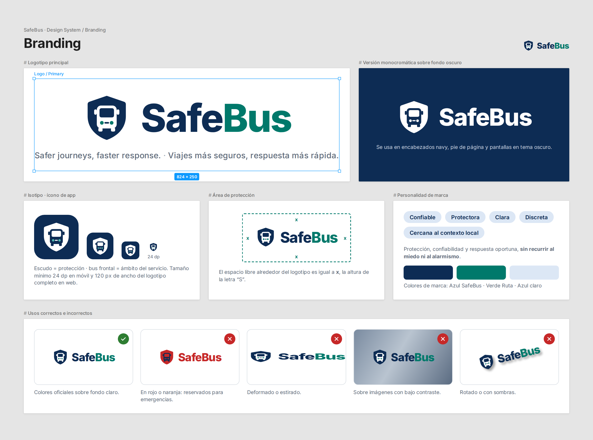

**Personalidad de marca.**

| Atributo | Cómo se expresa |
|---|---|
| Confiable | Información con hora de registro y estado de vigencia; nunca se presenta un dato antiguo como actual. |
| Protectora | Acciones de ayuda siempre visibles para quien las necesita (botón del conductor durante el turno activo, solicitud del pasajero durante el viaje). |
| Clara | Un estado, una etiqueta y un color por situación; sin ambigüedad entre solicitud y emergencia. |
| Discreta | La activación de emergencia del conductor no emite sonido ni vibración (US04) y las notificaciones no revelan datos de terceros. |
| Cercana al contexto local | Pensada para Lima y Callao: consciente de la extorsión, la informalidad y la conectividad irregular. |

**Logotipo.** Se compone de un isotipo y un logotipo tipográfico:

- **Isotipo:** escudo de esquinas redondeadas que contiene la silueta frontal simplificada de un bus. El escudo representa protección y el bus, el ámbito del servicio. Se utiliza como ícono de la aplicación, favicon y avatar de redes.
- **Logotipo:** la palabra *SafeBus* escrita en una sola pieza, con *Safe* en Azul SafeBus y *Bus* en Verde Ruta (ver Colors).
- **Eslogan:** *Safer journeys, faster response.* — en español: *Viajes más seguros, respuesta más rápida.*

**Reglas de uso de la marca.**

- Área de protección alrededor del logotipo igual a la altura de la letra "S".
- Tamaño mínimo: 24 dp (isotipo) en móvil y 120 px de ancho (logotipo completo) en web.
- El logotipo nunca utiliza el rojo ni el naranja de alerta: esos colores están reservados para emergencias, para que la marca no se confunda con un aviso.
- Sobre fondos oscuros se usa la versión monocromática blanca.
- No se deforma, rota, sombrea ni se coloca sobre imágenes con bajo contraste.

**Iconografía.** Se utilizan los íconos **Material Symbols (estilo Rounded)**, disponibles en ambas tecnologías móviles, para mantener coherencia entre Kotlin y Flutter. Son íconos simples y reconocibles para las acciones principales (viaje, alertas, solicitudes, turno, flota, emergencias, revisiones y cuenta). Todo ícono de acción o estado va acompañado de su etiqueta de texto; un ícono no comunica por sí solo una situación de seguridad. En la landing se emplean ilustraciones planas de buses, rutas y teléfonos, sin fotografías de personas identificables ni escenas de violencia.

##### Typography

Se adopta **Inter** como familia tipográfica única para la landing y las dos aplicaciones. Es una fuente sans serif de código abierto (Google Fonts), diseñada para pantallas, con alta legibilidad en tamaños pequeños, soporte completo de caracteres del español (tildes, ñ, ¿ ¡) y cifras tabulares, útiles para placas, horas y conteos que no deben "saltar" al actualizarse. Como respaldo se utiliza la fuente del sistema (Roboto en Android, San Francisco en iOS).

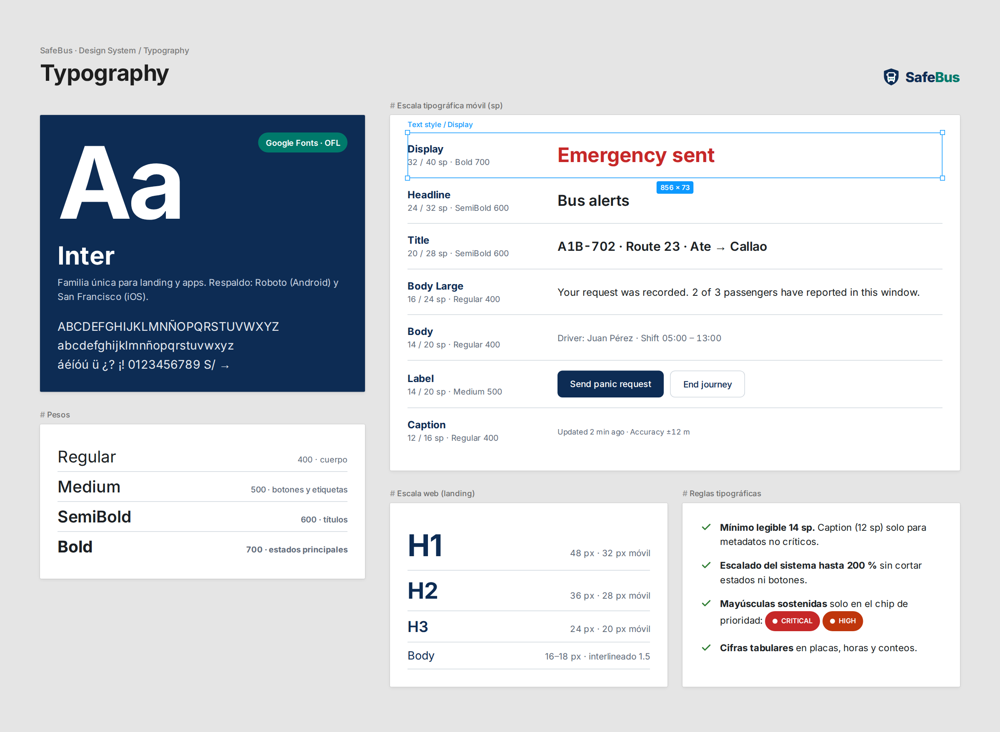


**Escala tipográfica móvil** (unidades sp, que respetan el tamaño de texto configurado por el usuario):

| Estilo | Tamaño / interlineado | Peso | Uso en SafeBus |
|---|---|---|---|
| Display | 32 / 40 sp | Bold (700) | Estado principal en pantalla completa: "Emergency sent", contador de umbral. |
| Headline | 24 / 32 sp | SemiBold (600) | Título de pantalla: "Bus alerts", "Fleet". |
| Title | 20 / 28 sp | SemiBold (600) | Encabezado de tarjeta: placa y ruta del bus, referencia de una solicitud. |
| Body Large | 16 / 24 sp | Regular (400) | Texto principal, mensajes de estado y descripciones. |
| Body | 14 / 20 sp | Regular (400) | Detalles secundarios, hora de captura, conductor asignado. |
| Label | 14 / 20 sp | Medium (500) | Botones, pestañas, chips de estado y etiquetas de formularios. |
| Caption | 12 / 16 sp | Regular (400) | Metadatos: "Updated 2 min ago", precisión del GPS. |

**Escala tipográfica web (landing):** H1 48 px (32 px en móvil), H2 36 px (28 px), H3 24 px (20 px), cuerpo 16–18 px con interlineado 1.5, botones 16 px Medium.

**Reglas tipográficas.**

- Tamaño mínimo de texto legible: 14 sp; el Caption (12 sp) solo se usa para metadatos no críticos.
- Las interfaces se prueban con el escalado de fuente del sistema hasta 200 % sin cortar etiquetas de estado ni botones.
- Las mayúsculas sostenidas se evitan en textos largos; se reservan para el chip de prioridad (CRITICAL / HIGH).
- Las placas, horas y conteos usan cifras tabulares.

##### Colors

La paleta separa tres funciones: **marca**, **estados de seguridad** y **neutros**. Los colores de estado son semánticos: cada uno tiene un único significado en todo el producto. A diferencia de una paleta con un solo color de acento para alertas, SafeBus necesita distinguir varios niveles de urgencia, por lo que cada estado del lenguaje ubicuo tiene un color asignado.

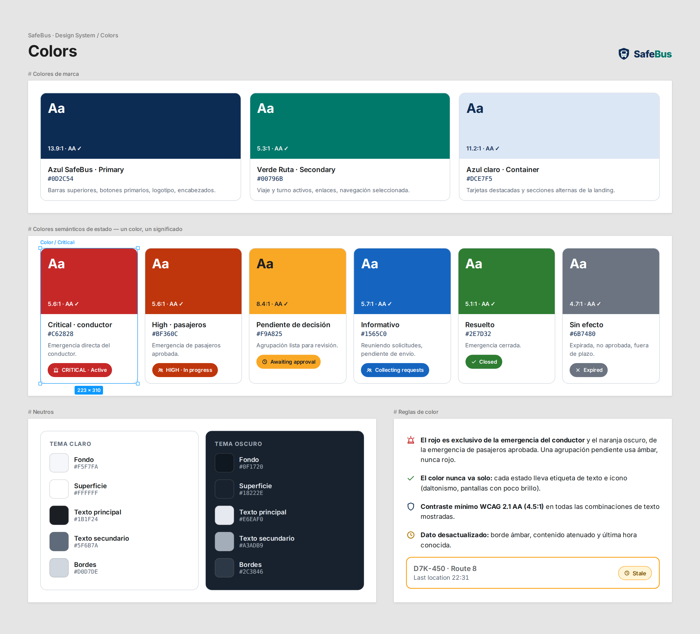

**Colores de marca**

| Nombre | HEX | Contraste con su texto | Uso |
|---|---|---|---|
| Azul SafeBus (Primary) | `#0D2C54` | 13.9:1 (blanco) | Barras superiores, botones primarios, logotipo, encabezados de la landing. |
| Verde Ruta (Secondary) | `#00796B` | 5.3:1 (blanco) | Viaje activo, turno activo, enlaces, elementos de navegación seleccionados. |
| Azul claro (Primary Container) | `#DCE7F5` | 11.2:1 (Azul SafeBus) | Fondos de tarjetas destacadas y secciones alternas de la landing. |

**Colores semánticos de estado**

| Significado | HEX | Texto sobre el color | Contraste | Estados del lenguaje ubicuo |
|---|---|---|---|---|
| Emergencia del conductor — prioridad Critical | `#C62828` | Blanco | 5.6:1 | Driver emergency: Active, In progress |
| Emergencia de pasajeros — prioridad High | `#BF360C` | Blanco | 5.6:1 | Passenger emergency: Active, In progress |
| Pendiente de decisión | `#F9A825` | Gris oscuro `#1B1F24` | 8.4:1 | Awaiting company approval |
| En recopilación / informativo | `#1565C0` | Blanco | 5.7:1 | Collecting requests, Pending transmission |
| Resuelto | `#2E7D32` | Blanco | 5.1:1 | Closed |
| Inactivo / sin efecto | `#6B7480` | Blanco | 4.7:1 | Expired, Not approved, Late |
| Dato desactualizado | `#F9A825` (borde) | Gris oscuro | — | Stale (ubicación o conteo) |

**Neutros**

| Nombre | HEX (tema claro) | HEX (tema oscuro) | Uso |
|---|---|---|---|
| Fondo | `#F5F7FA` | `#0F1720` | Fondo general de pantallas. |
| Superficie | `#FFFFFF` | `#18222E` | Tarjetas, hojas inferiores, diálogos. |
| Texto principal | `#1B1F24` | `#E6EAF0` | Títulos y cuerpo. |
| Texto secundario | `#5F6B7A` | `#A3ADB9` | Metadatos y ayudas. |
| Bordes y divisores | `#D0D7DE` | `#2C3846` | Separadores, contornos de campos. |

**Reglas de color.**

- **El rojo es exclusivo de la emergencia del conductor y el naranja oscuro, de la emergencia de pasajeros aprobada.** Una agrupación que espera aprobación usa ámbar, nunca rojo, para que la empresa no confunda una solicitud con una emergencia activa (US10, US20).
- **El color nunca es el único portador de significado.** Cada estado se acompaña de etiqueta de texto e ícono, considerando usuarios con daltonismo y pantallas con brillo reducido.
- Todas las combinaciones de texto cumplen como mínimo el contraste **WCAG 2.1 AA** (4.5:1 para texto normal). Por esa razón el naranja de prioridad High es `#BF360C` y el verde de marca es `#00796B`, variantes más oscuras que superan ese umbral con texto blanco.
- Ambas aplicaciones ofrecen **tema claro y tema oscuro**. El tema oscuro sigue la configuración del sistema y resulta especialmente útil para el conductor durante la madrugada y la noche, horarios de mayor riesgo según las entrevistas (sección 2.2.3). Los colores semánticos se conservan en ambos temas.

##### Spacing

Se utiliza una **grilla base de 8 dp** (con medio paso de 4 dp) para márgenes, rellenos y separaciones, tanto en móvil (dp) como en web (px). Los valores son fijos, no rangos, para que ambas implementaciones produzcan pantallas idénticas y transmitan una sensación de orden y claridad visual.

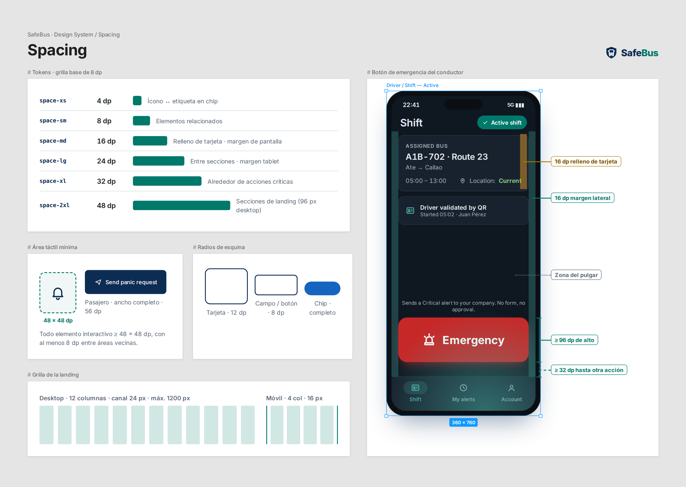

| Token | Valor | Uso |
|---|---|---|
| `space-xs` | 4 dp | Separación entre ícono y etiqueta dentro de un chip. |
| `space-sm` | 8 dp | Separación entre elementos relacionados (título y subtítulo de una tarjeta); separación mínima entre áreas táctiles. |
| `space-md` | 16 dp | Relleno interno de tarjetas y margen lateral de pantalla en teléfonos. |
| `space-lg` | 24 dp | Separación entre secciones de una pantalla; margen lateral en tabletas. |
| `space-xl` | 32 dp | Separación alrededor de acciones críticas. |
| `space-2xl` | 48 dp | Separación entre secciones de la landing en móvil (96 px en escritorio). |

**Reglas de espaciado.**

- El **botón de emergencia del conductor** se separa al menos 32 dp de cualquier otra acción, incluida la barra de navegación, para reducir activaciones accidentales sin añadir pasos de aprobación.
- Radios de esquina: 12 dp en tarjetas, 8 dp en campos de formulario y botones, redondeo completo en chips de estado.
- Landing: contenedor máximo de 1200 px, grilla de 12 columnas con canales de 24 px en escritorio y de 4 columnas con márgenes de 16 px en móvil.

##### Communication Tone

El tono se define con las cuatro dimensiones de tono de voz del Nielsen Norman Group. El resultado es un tono **claro y directo** en instrucciones, **profesional y sereno** en mensajes de seguridad, y **conciso** en etiquetas y descripciones.

| Dimensión | Posición de SafeBus | Justificación |
|---|---|---|
| Divertido ↔ **Serio** | **Serio** | El producto atiende situaciones de riesgo real (asaltos, extorsión); el humor restaría credibilidad. |
| **Formal** ↔ Casual | **Formal moderado** | Lenguaje correcto y profesional, pero sencillo y directo. En español se emplea el trato de *usted*, adecuado para un público amplio que incluye adultos mayores, conductores y supervisores. |
| **Respetuoso** ↔ Irreverente | **Respetuoso** | Se respeta la privacidad y la situación de cada usuario; nunca se culpa a quien reporta ni se minimiza un incidente. |
| Entusiasta ↔ **Sereno** | **Sereno** | En momentos de estrés los mensajes deben calmar e informar. Sin signos de exclamación en mensajes de seguridad ni palabras alarmistas. |

**Pautas de redacción.**

- Indicar **qué ocurrió y qué sigue**: estado actual, hora y siguiente paso.
- **No prometer resultados que el sistema no controla.** SafeBus no está integrado con la policía en este alcance; por ello se dice "Your company received the emergency" y no "Help is on the way".
- **No afirmar seguridad cuando no hay datos.** Un historial vacío dice "No reports recorded for this bus" y nunca "This bus is safe" (US07).
- Usar los términos del lenguaje ubicuo (sección 2.3.6) sin sinónimos: una *request* no se llama *alert* ni *emergency* hasta que la empresa la aprueba.
- Mensajes de error que expliquen la causa y la salida: "Location permission is off. You can end your journey manually."

| Situación | Se escribe | Se evita |
|---|---|---|
| Conductor activa emergencia | "Emergency sent to your company at 22:41." | "¡ALERTA ENVIADA! ¡Ayuda en camino!" |
| Solicitud del pasajero bajo umbral | "Your request was recorded. 2 of 3 passengers have reported in this window." | "¡Tu emergencia fue activada!" |
| Sin conexión | "No connection. Your emergency is saved and will be sent automatically." | "Error de red." |
| Historial vacío | "No reports recorded for this bus." | "Este bus es seguro." |
| Rechazo de la empresa | "Your company did not approve this group. Reason: …" | "Solicitud inválida." |

El inglés es el idioma inicial de la interfaz y cada texto cuenta con su equivalente en español latinoamericano (US14); el tono se mantiene igual en ambos idiomas.

##### Dimension Guidelines

Las dimensiones de los componentes de interfaz se fijan con un valor exacto para cada elemento, siguiendo las medidas de Material Design 3 y la regla de área táctil mínima de 48 × 48 dp. Los componentes vinculados con la seguridad reciben dimensiones mayores que el estándar.

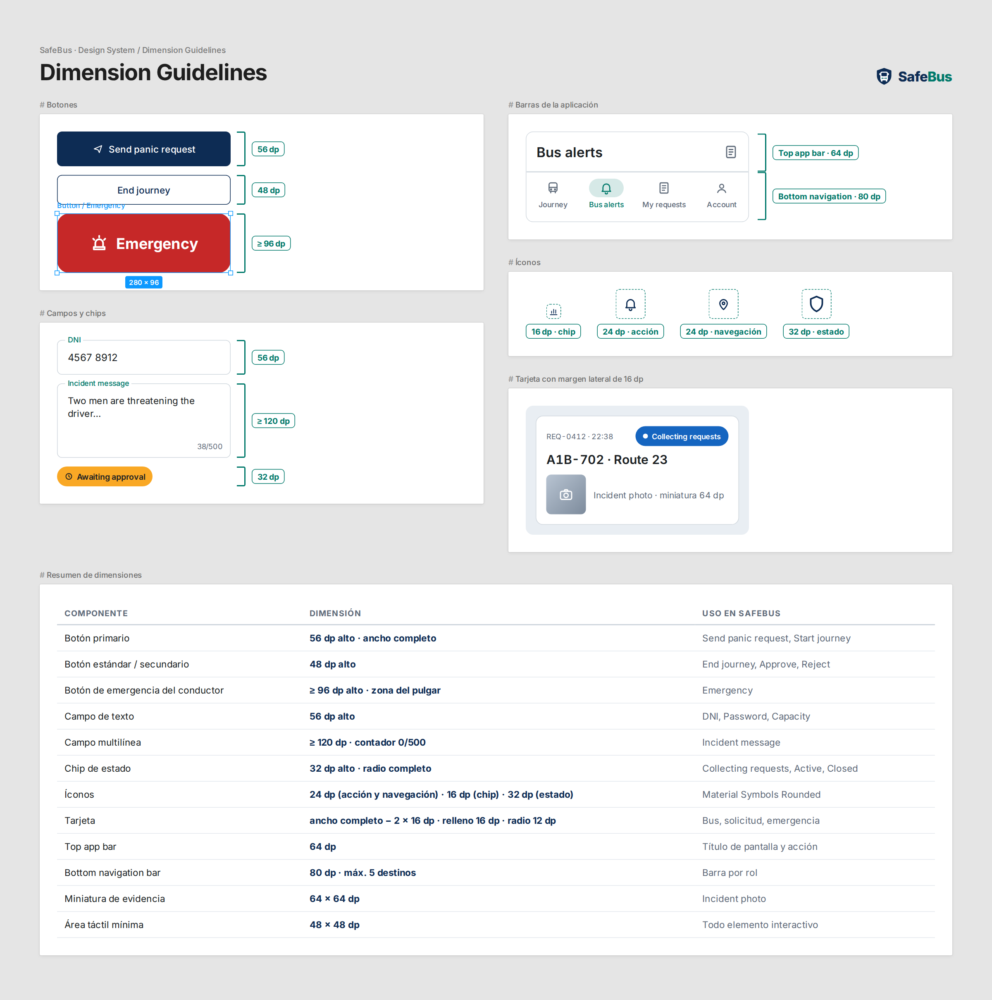

*Figura 3.6. Dimensiones de los componentes de SafeBus.*

| Componente | Dimensión | Uso en SafeBus |
|---|---|---|
| Botón primario | 56 dp de alto · ancho completo | Send panic request, Start journey. |
| Botón estándar / secundario | 48 dp de alto | End journey, Approve, Reject. |
| Botón de emergencia del conductor | Mínimo 96 dp de alto · zona inferior de la pantalla, alcanzable con el pulgar | Emergency. |
| Campo de texto | 56 dp de alto | DNI, Password, Capacity. |
| Campo multilínea | Mínimo 120 dp de alto · contador 0/500 | Incident message. |
| Chip de estado | 32 dp de alto · radio completo | Collecting requests, Active, Closed. |
| Íconos | 24 dp en acciones y navegación · 16 dp dentro de chips · 32 dp en estados destacados | Material Symbols Rounded. |
| Tarjeta de información | Ancho completo menos 2 × 16 dp de margen · relleno 16 dp · radio 12 dp | Bus, solicitud, emergencia. |
| Top app bar | 64 dp de alto | Título de pantalla y acción secundaria. |
| Bottom navigation bar | 80 dp de alto · máximo 5 destinos | Barra de navegación por rol. |
| Miniatura de evidencia | 64 × 64 dp | Incident photo. |
| Área táctil mínima | 48 × 48 dp, con 8 dp entre áreas vecinas | Todo elemento interactivo. |

##### Aplicación de la guía en pantallas

La siguiente lámina muestra cómo se combinan las pautas anteriores en una pantalla representativa de cada rol. No reemplaza los mock-ups de la sección 3.1.4.3; sirve como referencia rápida de la guía aplicada.

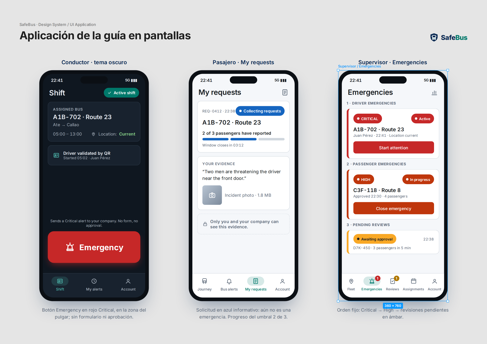

- **Conductor:** el botón *Emergency* usa el rojo Critical, ocupa la zona del pulgar y no tiene formulario ni aprobación.
- **Pasajero:** la solicitud aparece en azul informativo porque todavía no es una emergencia; el indicador muestra el progreso del umbral (2 de 3 pasajeros).
- **Supervisor:** la bandeja mantiene el orden Critical → High → revisiones pendientes en ámbar.

### 3.1.2. Information Architecture

La arquitectura de información define cómo se organiza, etiqueta, encuentra y recorre el contenido de SafeBus. Parte de una decisión central: **cada rol ve solo lo que necesita para su tarea y su permiso**. Después del inicio de sesión (US16), la aplicación dirige a cada usuario a un espacio distinto según su rol almacenado, mientras que la landing page se dirige a representantes de empresas que aún no son clientes.

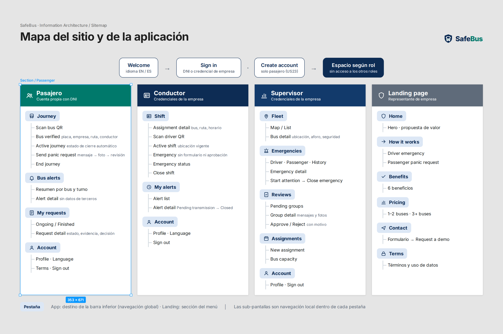

#### 3.1.2.1. Organization Systems

La navegación se organiza por rol y por estado del viaje o emergencia. Se combinan cinco esquemas de organización.

**Jerárquico (jerarquía visual).** En cada pantalla el contenido se ordena de lo más urgente a lo informativo. En el espacio del conductor, el botón de emergencia ocupa el lugar dominante durante el turno activo. En el espacio del supervisor, las emergencias del conductor aparecen antes que cualquier otro elemento (US10, escenario 5). En el espacio del pasajero, el viaje activo y su acción de ayuda aparecen antes que el historial.

**Secuencial (paso a paso).** Las tareas con pasos obligatorios se presentan como flujos guiados con indicador de progreso, sin permitir saltar pasos:

| Flujo | Secuencia | Historia |
|---|---|---|
| Registro del pasajero | DNI → foto del rostro → contraseña → aceptación de términos y uso de datos → confirmación. | US23 |
| Inicio de viaje | Escanear QR → verificar placa, empresa, ruta y conductor → permisos de ubicación → viaje activo. | US06 |
| Solicitud del pasajero | Mensaje (1–500 caracteres) → foto del incidente (JPEG/PNG ≤ 5 MB) → revisión → envío. | US08 |
| Validación del turno | Consultar asignación → escanear credencial QR → turno activo. | US02, US01 |
| Asignación de turno | Conductor → bus → ruta → periodo → confirmación. | US13 |
| Decisión de la empresa | Revisar mensajes y fotos de evidencia → aprobar, o rechazar con motivo obligatorio. | US10 |
| Atención de emergencia | Active → iniciar atención (In progress) → registrar resultado → Closed. | US10 |

**Por tópicos.** Dentro de cada rol, la información se agrupa en secciones temáticas que coinciden con las pestañas de la barra inferior:

| Rol | Sección | Contenido |
|---|---|---|
| Pasajero | **Journey** | Verificación del bus, viaje activo, solicitud de pánico y cierre del viaje. |
| Pasajero | **Bus alerts** | Resumen de alertas del bus y turno del viaje activo. |
| Pasajero | **My requests** | Solicitudes propias y su estado. |
| Conductor | **Shift** | Asignación, validación QR, turno activo y emergencia. |
| Conductor | **My alerts** | Alertas propias y su estado. |
| Supervisor | **Fleet** | Ubicación, aforo y estado de seguridad de los buses. |
| Supervisor | **Emergencies** | Emergencias del conductor y de pasajeros, e historial. |
| Supervisor | **Reviews** | Agrupaciones de solicitudes pendientes de aprobación. |
| Supervisor | **Assignments** | Asignaciones de turno y capacidad de los buses. |
| Todos | **Account** | Perfil, idioma, términos y cierre de sesión. |

Dentro de *Emergencies* y *My requests*, los elementos se agrupan además **por estado y prioridad**, con un orden que el usuario no puede alterar:

1. **Driver emergencies** (Critical): Active e In progress.
2. **Passenger emergencies** (High): aprobadas, Active e In progress.
3. **Pending reviews**: agrupaciones en Awaiting company approval.
4. **History**: Closed, Not approved y Expired.

Las solicitudes del pasajero se agrupan en **Ongoing** (Pending transmission, Collecting requests, Awaiting company approval, Active, In progress) y **Finished** (Closed, Not approved, Expired, Late).

**Según audiencia.** Es el esquema principal. Las aplicaciones móviles agrupan las funciones en tres espacios independientes, y la landing atiende a un cuarto público: el representante de empresa interesado.

| Audiencia | Recorrido principal |
|---|---|
| Pasajero | Registro con DNI, foto de rostro y contraseña → acceso → QR e inicio de viaje → alertas del bus / solicitud con mensaje y foto / mis solicitudes → cierre automático o manual. |
| Conductor | Acceso → asignación y validación QR → turno activo → botón de emergencia inmediata → estado de la emergencia → cierre de turno. |
| Supervisor | Acceso → flota con ubicación y aforo → emergencias del conductor / revisión de grupos de pasajeros → aprobar o rechazar → atención y cierre. |
| Representante de empresa (landing) | Propuesta de valor → cómo funciona → beneficios → precios → solicitud de contacto. |

**Cronológico.** Las listas de historial (Bus alerts, My requests, My alerts e historial de la empresa) se ordenan de la más reciente a la más antigua y muestran la hora de registro de cada elemento.

**Inventario de contenido por espacio.**

| Espacio | Pantallas principales | Contenido |
|---|---|---|
| Acceso (común) | Welcome, Sign in, Create account (solo pasajero) | Selección de idioma, credenciales, enlace a términos. |
| Pasajero | Journey, Bus alerts, My requests, Account | Datos del bus verificado, estado de cierre automático, resumen de alertas, solicitudes propias y su estado, datos de cuenta. |
| Conductor | Shift, My alerts, Account | Asignación (placa, ruta, origen, destino, horario), estado del turno y de la ubicación, botón de emergencia, alertas propias. |
| Supervisor | Fleet, Emergencies, Reviews, Assignments, Account | Mapa y lista de buses, aforo y vigencia de datos, bandeja priorizada, evidencia autorizada, asignaciones y capacidades. |
| Landing | Home, How it works, Benefits, Pricing, Contact, Terms | Propuesta de valor, explicación de los dos procesos de alerta, precio desde S/ 99 por unidad/mes, formulario de contacto. |

#### 3.1.2.2. Labelling Systems

Las etiquetas distinguen la acción y su efecto: **Emergency** para la activación inmediata del conductor y **Send panic request** para el envío con evidencia del pasajero. La consulta del pasajero se denomina **Bus alerts** y el seguimiento privado **My requests**. El registro solicita **DNI**, **Face photo** y **Password**; la evidencia de US08 usa **Incident message** e **Incident photo**.

Los estados visibles separan Pending transmission, Collecting requests, Awaiting company approval, Expired, Late y Not approved de una emergencia Active, In progress o Closed. Los textos cuentan con sus equivalentes en español; el inglés es el idioma inicial.

**Criterios del sistema de etiquetado.**

- **Una etiqueta, un significado.** Las etiquetas provienen del lenguaje ubicuo (sección 2.3.6) y no se reemplazan por sinónimos entre pantallas o entre las dos aplicaciones.
- **Verbos para acciones, sustantivos para lugares.** Los botones inician con verbo ("Start journey", "Approve"), mientras que las pestañas usan sustantivos ("Fleet", "My requests").
- **Etiquetas breves.** Máximo tres palabras en pestañas y botones, para que no se corten con el escalado de fuente.
- **Ícono y texto juntos** en navegación y estados.
- **Dos fotos con nombres distintos.** *Face photo* (registro) e *Incident photo* (evidencia) nunca comparten etiqueta, porque cumplen propósitos diferentes y no son intercambiables (US23, escenario 4).

**Etiquetas de autenticación**

| Etiqueta (EN) | Equivalente (ES) | Pantalla |
|---|---|---|
| Welcome | Bienvenida | Inicio de la aplicación. |
| Sign in | Iniciar sesión | Acceso de los tres roles. |
| Create your account | Cree su cuenta | Registro del pasajero. |
| Sign out | Cerrar sesión | Account. |

**Etiquetas de navegación**

| Rol | Etiqueta (EN) | Equivalente (ES) | Ícono (Material Symbols) |
|---|---|---|---|
| Pasajero | Journey | Viaje | `directions_bus` |
| Pasajero | Bus alerts | Alertas del bus | `notifications` |
| Pasajero | My requests | Mis solicitudes | `assignment` |
| Conductor | Shift | Turno | `badge` |
| Conductor | My alerts | Mis alertas | `history` |
| Supervisor | Fleet | Flota | `map` |
| Supervisor | Emergencies | Emergencias | `emergency` |
| Supervisor | Reviews | Revisiones | `fact_check` |
| Supervisor | Assignments | Asignaciones | `event_note` |
| Todos | Account | Cuenta | `account_circle` |

**Etiquetas de acción**

| Etiqueta (EN) | Equivalente (ES) | Rol | Efecto |
|---|---|---|---|
| Emergency | Emergencia | Conductor | Activa de inmediato una emergencia Critical. |
| Scan driver QR | Escanear QR del conductor | Conductor | Valida la credencial y activa el turno. |
| Close shift | Cerrar turno | Conductor | Cierra el turno y detiene la ubicación. |
| Scan bus QR | Escanear QR del bus | Pasajero | Verifica la unidad e inicia el viaje. |
| Send panic request | Enviar solicitud de pánico | Pasajero | Registra una solicitud con evidencia; no activa una emergencia por sí sola. |
| End journey | Terminar viaje | Pasajero | Cierre manual del viaje. |
| Approve | Aprobar | Supervisor | Activa una emergencia High a partir del grupo. |
| Reject | No aprobar | Supervisor | Registra Not approved con motivo obligatorio. |
| Start attention | Iniciar atención | Supervisor | Cambia la emergencia de Active a In progress. |
| Close emergency | Cerrar emergencia | Supervisor | Registra el resultado y cambia a Closed. |
| Request a demo | Solicitar una demostración | Representante | Envía el formulario de contacto de la landing. |

**Etiquetas de formularios**

| Campo (EN) | Equivalente (ES) | Ayuda visible |
|---|---|---|
| DNI | DNI | "8 digits" / "8 dígitos" |
| Face photo | Foto del rostro | "Used only to identify your account." |
| Password | Contraseña | "At least 8 characters" / "Mínimo 8 caracteres" |
| Incident message | Mensaje del incidente | Contador "0/500" |
| Incident photo | Foto del incidente | "JPEG or PNG, up to 5 MB" |
| Capacity | Capacidad | "As stated in the bus technical record" |
| Technical record reference | Referencia de la ficha técnica | — |
| Company name / Contact name / Email | Nombre de la empresa / Nombre del contacto / Correo | — |

**Etiquetas de estado**

| Estado (EN) | Equivalente (ES) | Aplica a | Color |
|---|---|---|---|
| Pending transmission | Pendiente de envío | Alerta del conductor o solicitud guardada en el dispositivo | Azul informativo |
| Collecting requests | Reuniendo solicitudes | Agrupación bajo umbral | Azul informativo |
| Awaiting company approval | En espera de aprobación | Agrupación con 3 pasajeros | Ámbar |
| Not approved | No aprobada | Agrupación rechazada | Gris |
| Expired | Expirada | Agrupación que no alcanzó el umbral en 5 minutos | Gris |
| Late | Fuera de plazo | Solicitud recibida fuera de la ventana | Gris |
| Active | Activa | Emergencia | Rojo (Critical) / naranja (High) |
| In progress | En atención | Emergencia | Rojo (Critical) / naranja (High) |
| Closed | Cerrada | Emergencia | Verde |

**Etiquetas de prioridad y vigencia de datos**

| Etiqueta (EN) | Equivalente (ES) | Significado |
|---|---|---|
| CRITICAL | CRÍTICA | Emergencia directa del conductor. |
| HIGH | ALTA | Emergencia de pasajeros aprobada por la empresa. |
| Current | Vigente | Ubicación o conteo reciente. |
| Stale | Desactualizado | Ubicación con más de 3 minutos o conteo sin heartbeat por más de 2 minutos; se muestra la última hora conocida. |
| Unavailable | No disponible | Sin datos o conteo inconsistente. |
| Over capacity | Sobre la capacidad | El conteo supera la capacidad registrada del bus. |
| Automatic completion unavailable | Cierre automático no disponible | Faltan permisos, GPS o precisión suficiente. |

**Asociaciones entre etiquetas.** Las etiquetas relacionadas se vinculan para que el usuario anticipe a dónde lo lleva cada una:

| Etiqueta | Se asocia con | Relación |
|---|---|---|
| Journey | Bus alerts · My requests | El viaje activo habilita la consulta de alertas del bus; las solicitudes enviadas durante el viaje se siguen en My requests. |
| Send panic request | My requests · Reviews | La solicitud se sigue en My requests (pasajero) y, al alcanzar el umbral, aparece en Reviews (supervisor). |
| Emergency | My alerts · Emergencies | La alerta del conductor se consulta en My alerts y se atiende en Emergencies. |
| Approve | Emergencies | La aprobación de un grupo crea una emergencia High en Emergencies. |
| Shift | Assignments · Fleet | El turno del conductor proviene de Assignments y su bus aparece en Fleet. |
| Fleet | Emergencies · Assignments | Desde el detalle del bus se accede a sus casos abiertos y a su asignación. |
| Face photo ≠ Incident photo | — | Asociación prohibida: la foto del registro nunca se usa como evidencia. |

#### 3.1.2.3. SEO Tags and Meta Tags

La landing page es el principal canal de adquisición de empresas de transporte (US14, US15), por lo que se optimiza para buscadores. Se publica en inglés (idioma por defecto) y en español latinoamericano, con URLs independientes por idioma. Como las búsquedas del público objetivo en Lima y Callao se realizan mayormente en español, se definen ambos juegos de metadatos. Los títulos se mantienen por debajo de 60 caracteres y las descripciones por debajo de 160, para que se muestren completos en los resultados de búsqueda.

**Landing Page / Web Application — versión en inglés (`/en/`)**

| Página | Title | Description | Keywords | Author |
|--------|-------|--------------|----------|--------|
| Home | SafeBus \| Public Transport Safety in Lima | Driver QR validation, priority driver emergencies and passenger reports with evidence for transport companies in Lima and Callao. | public transport safety, bus panic button, fleet monitoring, Lima, Callao | DreamTeam — SafeBus |
| How it works | How SafeBus Works \| Driver and Passenger Alerts | Driver emergencies reach your company instantly. Three passenger reports in five minutes enable company review and approval. | driver emergency alert, passenger panic request, bus safety app | DreamTeam — SafeBus |
| Benefits | SafeBus Benefits for Transport Companies | Know which driver runs each shift, see bus location and occupancy, and record every response to a safety incident. | bus fleet tracking, driver identification, bus occupancy monitoring | DreamTeam — SafeBus |
| Pricing | SafeBus Pricing \| From S/ 99 per Bus per Month | SafeBus starts at S/ 99 per bus per month, installation included. 20% discount for companies with three or more buses. | bus safety pricing, fleet safety subscription, Peru transport | DreamTeam — SafeBus |
| Contact | Contact SafeBus \| Request a Demo | Tell us about your transport company and the SafeBus team will contact you to answer questions or schedule a demonstration. | SafeBus demo, contact SafeBus, transport safety solution | DreamTeam — SafeBus |
| Terms | SafeBus Terms of Service and Data Use | Terms of service and how SafeBus uses driver, passenger and company data, including DNI, face photos and location. | SafeBus terms, data use, privacy | DreamTeam — SafeBus |

**Landing Page / Web Application — versión en español (`/es/`)**

| Página | Title | Description | Keywords | Author |
|--------|-------|--------------|----------|--------|
| Inicio | SafeBus \| Seguridad en el transporte público | Validación del conductor con QR, emergencias prioritarias y reportes de pasajeros con evidencia para empresas de transporte de Lima y Callao. | seguridad transporte público Lima, botón de pánico bus, monitoreo de flota, Callao | DreamTeam — SafeBus |
| Cómo funciona | Cómo funciona SafeBus \| Alertas de conductor y pasajero | La emergencia del conductor llega de inmediato a su empresa. Tres reportes de pasajeros en cinco minutos habilitan su revisión y aprobación. | alerta de emergencia conductor, botón de pánico pasajero, app seguridad bus | DreamTeam — SafeBus |
| Beneficios | Beneficios de SafeBus para empresas de transporte | Sepa qué conductor opera cada turno, consulte ubicación y aforo de sus buses y registre la atención de cada incidente. | rastreo de flota, identificación del conductor, aforo de buses, extorsión transportistas | DreamTeam — SafeBus |
| Precios | Precios de SafeBus \| Desde S/ 99 por bus al mes | SafeBus cuesta desde S/ 99 por unidad al mes, con instalación incluida, y 20 % de descuento desde tres unidades. | precio seguridad transporte, suscripción monitoreo de flota, Perú | DreamTeam — SafeBus |
| Contacto | Contacte a SafeBus \| Solicite una demostración | Cuéntenos sobre su empresa de transporte y el equipo de SafeBus le responderá para resolver dudas o agendar una demostración. | demostración SafeBus, contacto SafeBus, solución de seguridad para transporte | DreamTeam — SafeBus |
| Términos | Términos de servicio y uso de datos de SafeBus | Condiciones del servicio y uso de los datos de conductores, pasajeros y empresas, incluidos DNI, foto del rostro y ubicación. | términos SafeBus, uso de datos, privacidad | DreamTeam — SafeBus |

**Meta tags técnicos comunes**

```html
<meta charset="UTF-8">
<meta name="viewport" content="width=device-width, initial-scale=1">
<meta name="author" content="DreamTeam — SafeBus">
<meta name="robots" content="index, follow">
<link rel="canonical" href="https://[dominio]/es/">
<link rel="alternate" hreflang="en" href="https://[dominio]/en/">
<link rel="alternate" hreflang="es-419" href="https://[dominio]/es/">
<link rel="alternate" hreflang="x-default" href="https://[dominio]/en/">
<meta property="og:type" content="website">
<meta property="og:title" content="SafeBus | Seguridad en el transporte público">
<meta property="og:description" content="Emergencias prioritarias del conductor y reportes de pasajeros con evidencia para empresas de transporte.">
<meta property="og:image" content="https://[dominio]/assets/og-safebus.png">
<meta name="theme-color" content="#0D2C54">
```

`[dominio]` se reemplaza por el dominio definitivo de la landing. La página de términos y la confirmación del formulario de contacto no contienen datos personales en la URL. La etiqueta *keywords* se incluye porque la plantilla la solicita, aunque los buscadores actuales le otorgan poco peso; el posicionamiento depende principalmente del título, la descripción y el contenido.

**Aplicación móvil — títulos de pantalla**

Las aplicaciones nativas no utilizan meta tags HTML. Su equivalente es el **título de cada pantalla**, que se muestra en la barra superior, en el selector de aplicaciones recientes y es leído por los lectores de pantalla (TalkBack en Android y VoiceOver en iOS). En Jetpack Compose se define como título de la pantalla y en Flutter mediante `Semantics` y el título del `Scaffold`; ambas implementaciones usan los mismos textos.

| Pantalla | Title (EN) | Título (ES) | Descripción accesible |
|---|---|---|---|
| Welcome | Welcome \| SafeBus | Bienvenida \| SafeBus | Selección de idioma e inicio de sesión. |
| Sign in | Sign in \| SafeBus | Iniciar sesión \| SafeBus | Acceso con DNI o con la credencial de la empresa. |
| Create account | Create your account \| SafeBus | Cree su cuenta \| SafeBus | Registro del pasajero con DNI, foto del rostro y contraseña. |
| Journey | My journey \| SafeBus | Mi viaje \| SafeBus | Bus verificado, estado del cierre automático y solicitud de ayuda. |
| Send panic request | Send panic request \| SafeBus | Enviar solicitud de pánico \| SafeBus | Mensaje y foto del incidente para la empresa. |
| Bus alerts | Bus alerts \| SafeBus | Alertas del bus \| SafeBus | Resumen de alertas del bus del viaje activo. |
| My requests | My requests \| SafeBus | Mis solicitudes \| SafeBus | Estado de las solicitudes propias. |
| Shift | My shift \| SafeBus | Mi turno \| SafeBus | Asignación, validación QR y botón de emergencia. |
| My alerts | My alerts \| SafeBus | Mis alertas \| SafeBus | Estado de las alertas del conductor. |
| Fleet | Fleet \| SafeBus | Flota \| SafeBus | Ubicación, aforo y estado de seguridad de los buses. |
| Emergencies | Emergencies \| SafeBus | Emergencias \| SafeBus | Bandeja priorizada de emergencias. |
| Reviews | Reviews \| SafeBus | Revisiones \| SafeBus | Agrupaciones de solicitudes pendientes de aprobación. |
| Assignments | Assignments \| SafeBus | Asignaciones \| SafeBus | Asignación de turnos y capacidad de los buses. |

**Mobile App (ASO)**

La implementación Kotlin se distribuye en Google Play; la implementación Flutter permite publicar también en App Store. Se respetan los límites de cada tienda: título de hasta 30 caracteres, subtítulo de hasta 30 caracteres (App Store), palabras clave de hasta 100 caracteres (App Store) y descripción corta de hasta 80 caracteres (Google Play).

| App Title | App Keywords | App Subtitle | App Description |
|-----------|----------------|----------------|--------------------|
| SafeBus: Transporte Seguro | bus,transporte,seguridad,pánico,emergencia,alerta,conductor,pasajero,flota,QR,Lima,Callao | Alertas y viajes seguros en bus | SafeBus ayuda a conductores, pasajeros y empresas de transporte de Lima y Callao a actuar ante situaciones de riesgo. **Conductores:** validan su turno con QR y envían una emergencia directa a su empresa, incluso sin conexión. **Pasajeros:** se registran con DNI, verifican el bus con QR, consultan las alertas de la unidad y envían solicitudes con mensaje y foto; la empresa revisa los reportes cuando tres pasajeros coinciden en cinco minutos. El viaje termina automáticamente al alejarse del bus. **Empresas:** consultan ubicación y aforo de su flota, atienden emergencias y registran cada decisión. SafeBus funciona en buses de empresas asociadas. |

**Descripción corta (Google Play, ≤ 80 caracteres):** "Emergencias del conductor, alertas del bus y reportes con evidencia."

**Versión en inglés del listado:** título *SafeBus: Safer Bus Rides*, subtítulo *Bus alerts and safe journeys*.

Como la aplicación solicita DNI, foto del rostro, cámara y ubicación, el listado debe completar con precisión la sección de seguridad de datos de Google Play y las etiquetas de privacidad de App Store, de forma coherente con los términos de uso aceptados en el registro (US23).

#### 3.1.2.4. Searching Systems

La consulta Bus alerts se limita al bus y turno del viaje activo. My requests permite consultar registros propios incluso después de terminar el viaje. La empresa filtra su flota y distingue emergencias del conductor, emergencias de pasajeros aprobadas y agrupaciones pendientes de revisión.

El volumen de información por usuario es acotado, por lo que SafeBus prioriza **filtros, orden y alcance automático** sobre un buscador de texto libre. Solo el supervisor, que administra varios buses, dispone de un campo de búsqueda. Toda búsqueda respeta los permisos de US17: ningún resultado incluye DNI, fotos de registro ni datos de otra empresa.

**Búsqueda por filtros**

| Rol / pantalla | Alcance de la consulta | Búsqueda y filtros | Orden | Restricciones |
|---|---|---|---|---|
| Pasajero — Bus alerts | Solo el bus y turno del viaje activo (US07). | Chips: *All*, *Ongoing* (Collecting requests, Awaiting company approval, Active, In progress), *Finished* (Closed, Expired, Not approved). | Más reciente primero. | Sin DNI, fotos, mensajes ni identidades de terceros. Si el viaje terminó, la pantalla se deshabilita y remite a My requests. |
| Pasajero — My requests | Solo las solicitudes propias, con o sin viaje activo (US09). | Chips: *Ongoing* / *Finished*; selector por estado. | Pending transmission arriba; luego más reciente primero. | Ninguna solicitud de otra cuenta. |
| Conductor — My alerts | Solo las alertas propias (US04, escenario 4). | Filtro por estado: Pending transmission, Active, In progress, Closed. | Más reciente primero. | Sin información privada de reportes de pasajeros. |
| Supervisor — Fleet | Solo los buses de su empresa (US11). | Búsqueda por **placa, ruta o nombre del conductor**. Filtros: estado de seguridad, vigencia de ubicación (Current / Stale / Unavailable), aforo (incluido Over capacity) y ruta. | Buses con emergencia primero; luego por placa. | Sin datos de otras empresas; sin ubicación de pasajeros. |
| Supervisor — Emergencies / Reviews | Casos de su empresa (US10). | Búsqueda por placa o referencia del caso. Filtros por prioridad, estado y fecha. | Orden fijo: emergencias del conductor, emergencias de pasajeros, revisiones pendientes. | La evidencia solo se abre desde el detalle autorizado. |
| Supervisor — Assignments | Conductores, buses y rutas de su empresa (US13). | Búsqueda por conductor o placa; filtro por fecha del turno. | Por hora de inicio planificada. | Solo recursos habilitados de su empresa. |
| Landing | Contenido público. | Sin buscador interno; la información se encuentra mediante el menú y los buscadores web (sección 3.1.2.3). | — | Sin acceso a datos operativos. |

**Resultados de búsqueda**

Los resultados se muestran en tarjetas con la información clave de cada tipo de registro:

| Tipo de resultado | Información visible en la tarjeta |
|---|---|
| Alerta del bus (pasajero) | Referencia pública, origen (conductor o pasajeros), hora, número de solicitudes cuando corresponde y estado. |
| Solicitud propia (pasajero) | Referencia, placa y ruta, hora de envío, progreso del umbral (por ejemplo, 2 de 3), estado y miniatura de la evidencia propia. |
| Alerta propia (conductor) | Hora de activación, hora de recepción si se envió sin conexión y estado. |
| Bus (supervisor) | Placa, ruta, conductor, ubicación con hora y vigencia, aforo frente a capacidad y estado de seguridad. |
| Caso (supervisor) | Prioridad, estado, placa, ruta, hora y acción principal (Start attention, Close emergency o Review). |

**Navegación por mapa**

El supervisor dispone de la vista **Map** dentro de *Fleet*, que ubica los buses de su empresa con un servicio cartográfico externo (US11). Cada marcador muestra el color del estado de seguridad del bus y, al tocarlo, abre su tarjeta de resultado. Los buses con ubicación *Stale* se muestran atenuados con su última hora conocida. Si el servicio de mapas no está disponible, la vista cambia automáticamente a **List**, que conserva coordenadas, horas, aforo y estados (US11, escenario 3). El pasajero no dispone de un mapa de la flota: su ubicación solo se compara localmente con la del bus para el cierre automático del viaje (US18, US24).

**Pautas de presentación de resultados.**

- Cada resultado muestra su **estado, hora de registro y vigencia**; un dato Stale indica la última hora conocida.
- Los **estados vacíos** explican qué significa la ausencia de resultados ("No reports recorded for this bus") y, cuando corresponde, qué puede hacer el usuario.
- Los filtros seleccionados permanecen visibles como chips y se pueden quitar con un toque.

#### 3.1.2.5. Navigation Systems

El pasajero recibe confirmación del cierre automático y conserva acceso a My requests. La falta de permisos, GPS o precisión informa que la finalización automática está indisponible y mantiene End journey como alternativa. El mensaje y la foto son obligatorios para enviar solicitudes de pasajeros; el botón del conductor activa su emergencia sin ese formulario. Las notificaciones se ajustan al rol y no revelan fotos o DNI de otros pasajeros.

El sistema de navegación combina **navegación global** (barra inferior por rol), **navegación local** (pestañas y pasos dentro de una sección), **navegación contextual** (notificaciones y accesos directos a un caso) y **navegación de recuperación** (estados sin conexión, sin permisos o sin datos).

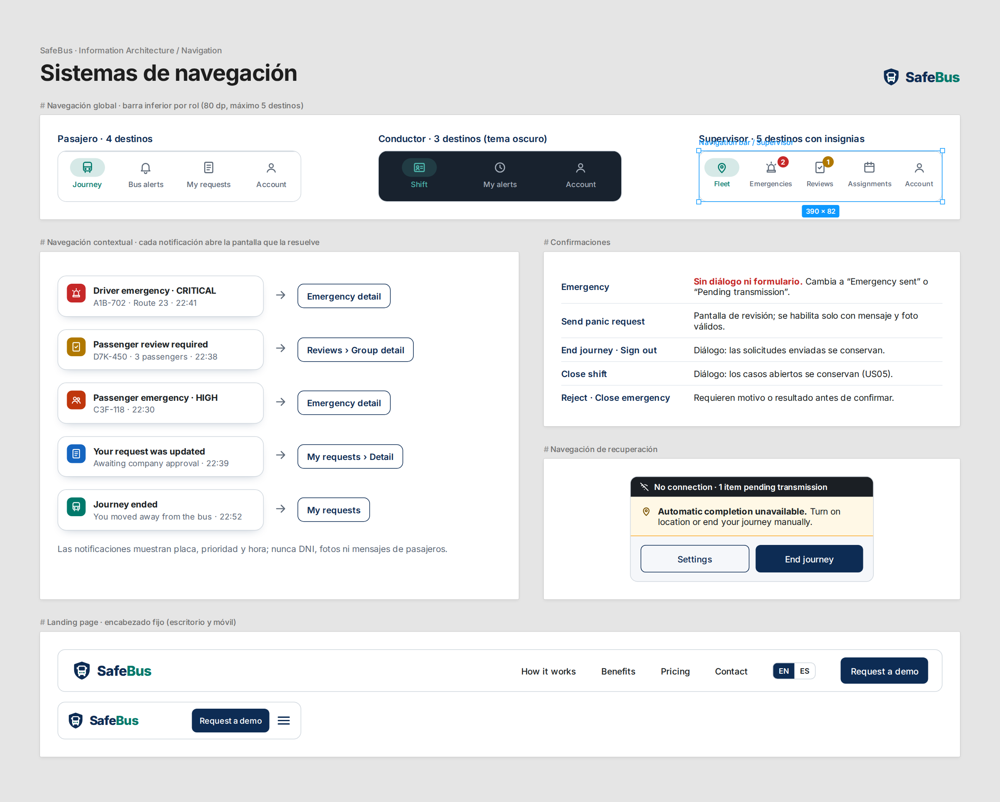

*Figura 3.9. Sistemas de navegación de SafeBus.*

**Navegación de acceso.** La aplicación inicia en *Welcome*, con selector de idioma (English / Español), *Sign in* y *Create account*. La creación de cuenta está disponible solo para pasajeros; conductores y supervisores usan las credenciales que provee su empresa (US16). Tras el inicio de sesión, la aplicación dirige al usuario al espacio de su rol y no ofrece acceso a los demás.

**Navegación global por rol (barra inferior).**

| Rol | Pestañas | Comportamiento particular |
|---|---|---|
| Pasajero | Journey · Bus alerts · My requests · Account | *Journey* muestra "Scan bus QR" si no hay viaje activo y, durante el viaje, los datos del bus, el estado del cierre automático, **Send panic request** y **End journey**. *Bus alerts* solo se habilita con un viaje activo. |
| Conductor | Shift · My alerts · Account | Durante el turno activo, el botón **Emergency** permanece visible en todas las pantallas del espacio del conductor, en la zona inferior y con las dimensiones definidas en Dimension Guidelines. |
| Supervisor | Fleet · Emergencies · Reviews · Assignments · Account | *Emergencies* y *Reviews* muestran insignias con la cantidad de casos abiertos; la insignia de emergencias usa el color Critical. |

Se limita la barra inferior a un máximo de cinco destinos, según la guía de Material Design 3, para que cada pestaña conserve un área táctil suficiente.

**Navegación local.**

- **Flujos secuenciales** (registro, inicio de viaje, solicitud, decisión) con indicador de pasos y botón *Back* que conserva lo ya ingresado.
- **Pestañas internas** en *Emergencies* (Driver / Passenger / History) y en *Fleet* (Map / List).
- **Detalle de caso** como pantalla independiente con su propia barra superior y acción principal (Start attention, Close emergency, Approve, Reject).

**Navegación contextual (notificaciones y accesos directos).** Cada notificación abre directamente la pantalla que la resuelve:

| Notificación | Destinatario | Destino al tocarla | Contenido visible en la notificación |
|---|---|---|---|
| EmergencyActivated — Critical | Supervisor | Detalle de la emergencia del conductor | Placa, ruta, prioridad y hora; sin datos personales. |
| PassengerReviewRequired | Supervisor | Detalle de la agrupación en Reviews | Placa, número de pasajeros y hora; sin fotos ni mensajes. |
| EmergencyActivated — High | Supervisor | Detalle de la emergencia de pasajeros | Placa, prioridad y hora. |
| Cambio de estado de solicitud | Pasajero | Detalle en My requests | Nuevo estado y hora. |
| Viaje cerrado automáticamente | Pasajero | My requests | Confirmación del cierre. |

Al reconectarse, el supervisor recupera los casos abiertos y las revisiones pendientes antes de reanudar las notificaciones en vivo, sin duplicar casos (US20, escenario 3).

**Confirmaciones y acciones irreversibles.**

| Acción | Tratamiento de navegación |
|---|---|
| Emergency (conductor) | **Sin diálogo de confirmación ni formulario**, para no retrasar la activación (US04). La pantalla cambia a "Emergency sent" o "Pending transmission", sin sonido ni vibración. |
| Send panic request (pasajero) | Pantalla de revisión antes del envío; el botón se habilita solo con mensaje y foto válidos. |
| End journey | Diálogo de confirmación que indica que las solicitudes enviadas se conservan. |
| Sign out (pasajero con viaje activo) | Aviso de que el viaje terminará con motivo *Sign out*. |
| Close shift | Diálogo que indica que los casos abiertos se conservan para seguimiento (US05). |
| Reject | Requiere motivo obligatorio antes de confirmar. |
| Close emergency | Requiere resultado; no se habilita si la atención no se inició. |

**Navegación de recuperación y estados especiales.**

- **Sin conexión:** banner persistente en la parte superior. Las alertas y solicitudes guardadas aparecen como *Pending transmission* y se envían automáticamente al recuperar la conexión.
- **Sin permisos de ubicación o sin precisión suficiente:** el viaje continúa; *Journey* muestra "Automatic completion unavailable" con acceso a la configuración del sistema y a **End journey**. La pérdida de conexión o de permisos nunca cierra el viaje por sí sola (US24, escenario 2).
- **Datos desactualizados:** el bus en el mapa del supervisor se muestra atenuado con la etiqueta *Stale* y la última hora conocida.
- **Mapa no disponible:** la vista *Fleet* cambia automáticamente a lista.

**Navegación de la landing page.**

- **Encabezado fijo** con logotipo (enlace a inicio), anclas a *How it works*, *Benefits*, *Pricing* y *Contact*, selector de idioma EN / ES y botón destacado **Request a demo**.
- En pantallas móviles, el menú se agrupa en un ícono de hamburguesa y el botón **Request a demo** permanece visible.
- **Pie de página** con enlaces a *Terms*, *Contact* y redes de SafeBus.
- La landing no contiene enlaces de acceso a los datos operativos de las empresas; la operación se realiza desde la aplicación móvil.

---

## 3.1.3. Landing Page UI Design

### 3.1.3.1. Landing Page Wireframe

[Wireframes Desktop y Mobile Web Browser — Figma]

### 3.1.3.2. Landing Page Mock-up

[Mock-ups Desktop y Mobile Web Browser]

---

## 3.1.4. Mobile Applications UX/UI Design

### 3.1.4.1. Mobile Applications Wireframes

Los wireframes deben representar los siguientes flujos y estados del alcance, con las mismas funciones en las implementaciones móviles nativa y cross-platform.

| Flujo | Elementos y estados | Historias |
|---|---|---|
| Registro y acceso del pasajero | DNI, captura de rostro, contraseña, aceptación del uso de datos, errores de formato/duplicado y acceso. | US23, US16 |
| Inicio de viaje | QR, datos de unidad, viaje activo y permiso de ubicación con alternativa manual. | US06 |
| Alertas del bus | Lista de resúmenes por bus y turno, origen, fecha, conteo y estado; sin DNI, fotos ni mensajes de terceros. | US07 |
| Solicitud con evidencia | Mensaje, foto del incidente, validación y estados de envío, umbral, aprobación y atención. | US08, US09 |
| Emergencia del conductor | Activación inmediata, prioridad máxima, envío sin conexión y seguimiento. | US04 |
| Revisión de la empresa | Evidencia autorizada, umbral alcanzado, aprobar/rechazar y resultado de atención. | US10, US11 || Fin de viaje | Detección de alejamiento, cierre confirmado, falta de precisión o permisos y opción manual. | US24 |

A continuación se mostrara los diversos wireframes que se ha realizado teniendo en cuenta las user stories de nuestro proyecto:

US01 Escaner QR del Conductor y Turno Validado:


US02 Sin Turno Asignado y Turno Asignado:


US04 Emergencia del Conductor:

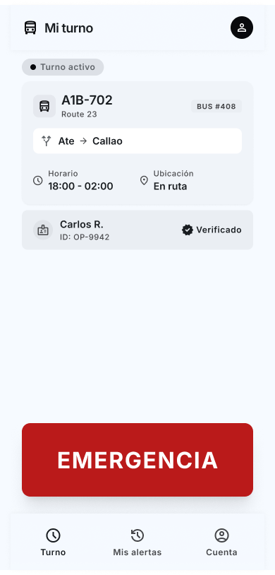
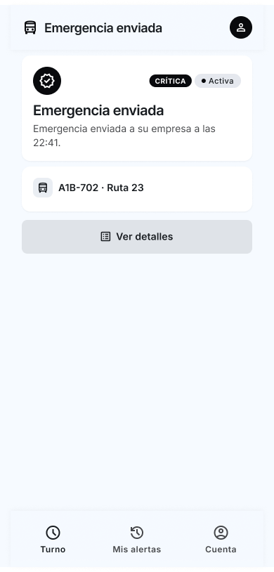

US06 Bus Verificado y Viaje:


US07 Alerta de Bus y Sin reportes:


US08 Solicitud con evidencia:
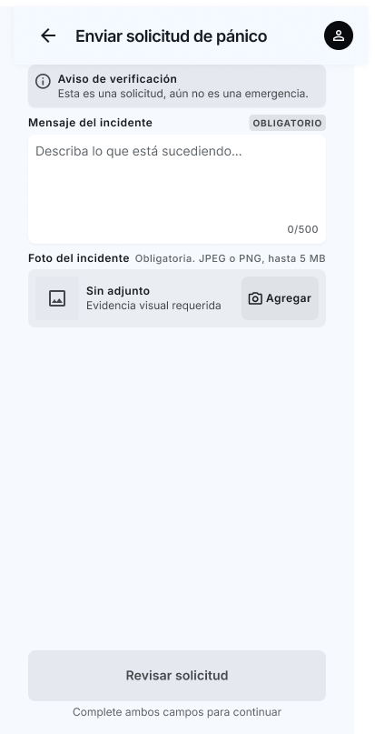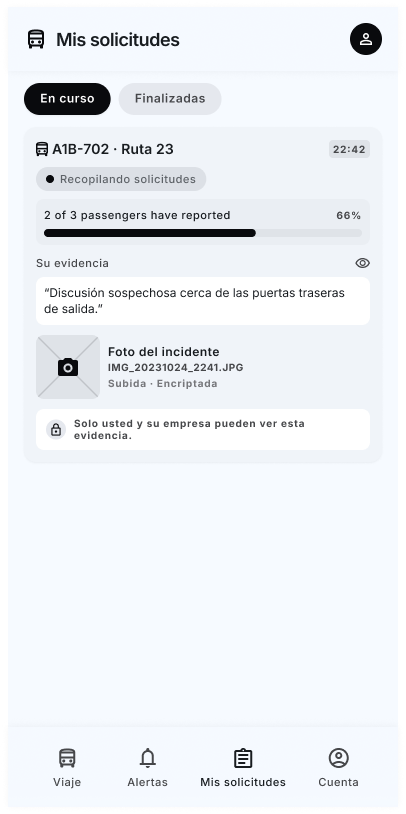

US010 Revisión de la Empresa:
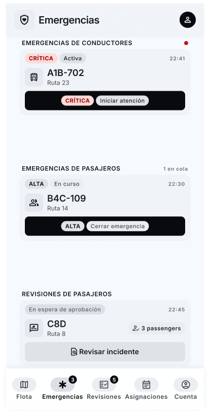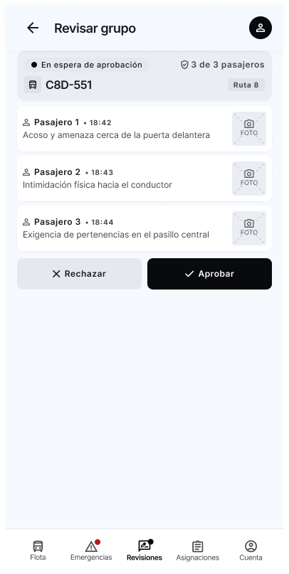

US11 Flota en Lista y Mapa:


US16 Crear Cuenta e Iniciar Sesion:


US23 Contraseña-Termino y Foto del Rostro:


### 3.1.4.2. Mobile Applications Wireflow Diagrams

Un Wireflow por cada User Goal.

**User Goal:** [completar]

[Diagrama + explicación del flujo]

### 3.1.4.3. Mobile Applications Mock-ups

US01 Escaner QR y Turno valido:


US02 Turno Asignado:


US04 Emergencia Enviada y Turno:


US06 Bus Verificado y Viaje activo:


US07 Alertas Bus y Sin reportes:


US08 Enviar Solicitudes y Mis Solicitudes:


US10 Emergencias y Revisar grupo:


US11 Flota en lista y Mapa:


US16 Bienvenida, Crear Cuenta e Iniciar:


US23 Contraseña y Terminos con Foto del Rostro:


### 3.1.4.4. Mobile Applications User Flow Diagrams

Un User Flow por cada User Goal (happy path + unhappy paths).

### 3.1.4.5. Mobile Applications Prototyping

[Prototipos con simulación de interacción — 1 screenshot + enlace a video de Microsoft
Stream por aplicación]
