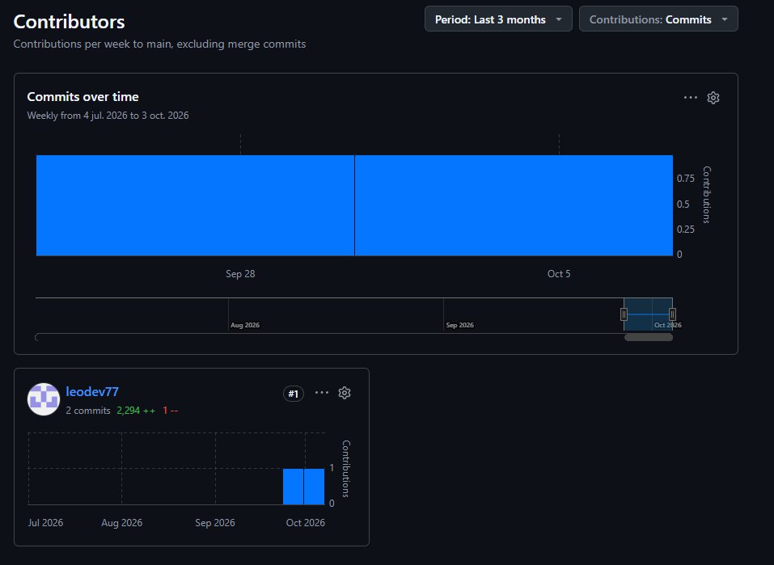
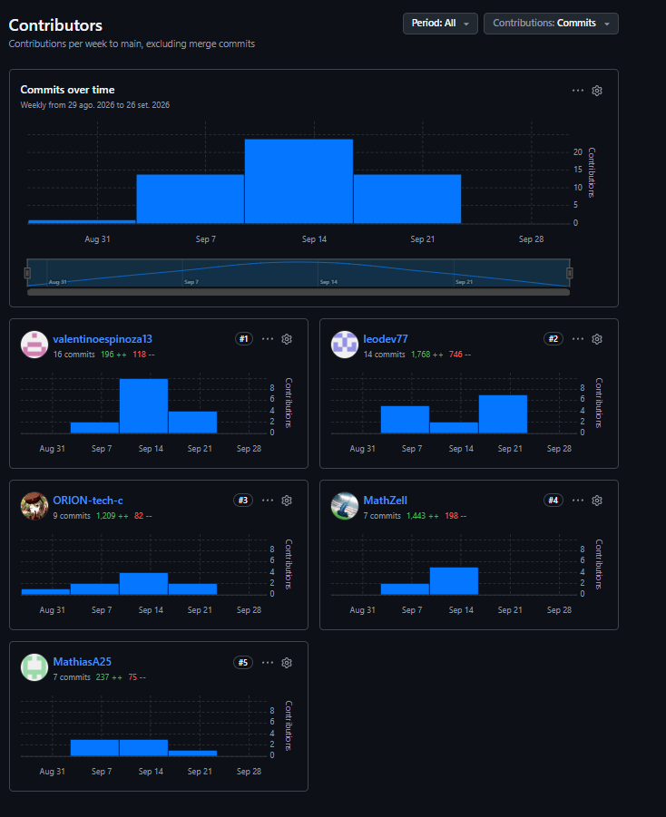

[← Volver al índice](00-chapter0.md#contenido)

# Capítulo IV: Product Implementation & Validation

### 4.1. Software Configuration Management

Esta sección establece las decisiones y convenciones que mantienen la consistencia durante el ciclo de vida de los productos: las herramientas de trabajo del equipo, la organización del código fuente, las guías de estilo y la configuración de despliegue.

#### 4.1.1. Software Development Environment Configuration

| Actividad | Producto | Propósito en el proyecto | Ruta de referencia |
|---|---|---|---|
| Gestión de proyecto | Trello | Product Backlog y tablero de Sprint | https://trello.com/invite/b/6ac31b86ef414ba1ccffcc9e/ATTI662ff4f0de4372693f4e82297df87b6451C57B66/safebus-sprint-1 |
| Needfinding | UXPressia | User Personas, Journey Maps, Empathy Maps e Impact Map | https://uxpressia.com |
| Modelado de dominio | Miro | EventStorming, Domain Storytelling, Bounded Context Canvas y Context Map | https://miro.com |
| Diseño UX/UI | Figma | Wireframes, mock-ups y prototipos | https://www.figma.com |
| Wireflows y User Flows | LucidChart / Overflow | Diagramas de flujo de las aplicaciones | https://www.lucidchart.com |
| Arquitectura de software | Structurizr (C4 Model) | Diagramas de contexto, contenedores, componentes y despliegue | https://structurizr.com |
| Desarrollo backend | Java 21 (Eclipse Temurin), Maven, Spring Boot 4.0.6, Spring Data JPA, Lombok | Implementación de los Web Services RESTful | https://adoptium.net · https://maven.apache.org · https://spring.io/projects/spring-boot |
| Desarrollo de la Landing Page | HTML5, CSS3 y JavaScript | Sitio web estático del modelo de negocio | https://developer.mozilla.org |
| Desarrollo móvil | Kotlin, Android Studio y Gradle | Aplicación móvil para Android | https://kotlinlang.org · https://developer.android.com/studio |
| Documentación de servicios | springdoc-openapi (Swagger UI) | Documentación OpenAPI de los endpoints | https://springdoc.org |
| Pruebas | JUnit 5 y Spring Boot Test | Pruebas unitarias y de integración del backend | https://junit.org/junit5 |
| Base de datos | H2 (desarrollo local) y MySQL 8 (producción) | Persistencia | https://www.mysql.com |
| Contenedores | Docker | Empaquetado del backend | https://www.docker.com |
| Despliegue | Microsoft Azure (Container Registry, App Service, Database for MySQL, Static Web Apps) y Azure CLI | Publicación de los productos | https://portal.azure.com · https://learn.microsoft.com/cli/azure |
| Distribución móvil | Firebase App Distribution | Pruebas de la aplicación en dispositivos reales | https://firebase.google.com/docs/app-distribution |
| Control de versiones | Git y GitHub | Repositorios y colaboración | https://github.com |
| Documentación del informe | Markdown con Visual Studio Code | Redacción del informe en el repositorio | https://code.visualstudio.com |

#### 4.1.2. Source Code Management

El equipo utiliza GitHub como plataforma de control de versiones, dentro de la organización pública del equipo.

| Producto | Repositorio |
|---|---|
| Informe del proyecto | https://github.com/upc-pre-202620-1acc0238-4939-dreamteam/dreamteam-report |
| Landing Page | https://github.com/upc-pre-202620-1acc0238-4939-dreamteam/safebus-landing |
| Web Services (backend) | https://github.com/upc-pre-202620-1acc0238-4939-dreamteam/safebus-backend |
| Aplicación móvil | https://github.com/upc-pre-202620-1acc0238-4939-dreamteam/safebus-mobile-app |

El repositorio del backend incluye el proyecto y sus archivos de pruebas, tanto unitarias como de integración y aceptación.

**GitFlow.** El equipo aplica GitFlow como flujo de trabajo, con las siguientes ramas:

| Rama | Se crea desde | Se integra en | Propósito |
|---|---|---|---|
| `main` | — | — | Código estable. Solo recibe merges de `release/*` y `hotfix/*`, y cada merge se etiqueta con una versión |
| `develop` | `main` | — | Rama de integración de las features |
| `feature/<contexto>-<descripcion>` | `develop` | `develop` | Una rama por feature. Ejemplos: `feature/safety-case-driver-emergency`, `feature/iam-jwt-authentication` |
| `release/<x.y.z>` | `develop` | `main` y `develop` | Preparación de una entrega. Ejemplo: `release/0.1.0` |
| `hotfix/<descripcion>` | `main` | `main` y `develop` | Corrección urgente sobre código publicado |

Todo cambio llega a `develop` o `main` mediante Pull Request revisado por al menos otro integrante; no se hacen commits directos a esas ramas.

**Conventional Commits.** Los mensajes siguen el formato `<tipo>(<alcance>): <descripción>`, con los tipos `feat`, `fix`, `docs`, `style`, `refactor`, `test`, `build`, `ci` y `chore`. El alcance corresponde al Bounded Context o al módulo afectado. Ejemplos:

```
feat(iam): add JWT authentication
fix(location): reject out-of-range coordinates
test(safety-case): add driver emergency integration test
build: add Dockerfile for Azure deployment
```

**Semantic Versioning.** Las versiones siguen el formato `MAJOR.MINOR.PATCH`. Mientras el producto no alcance su Release Review, las entregas son versiones `0.x.y`: `v0.1.0` para el Sprint 1 (TB1) y `v0.2.0` para el Sprint 2 (AV2). La versión `v1.0.0` corresponde al Release Review (TB2).

#### 4.1.3. Source Code Style Guide & Conventions

Todos los identificadores (paquetes, clases, métodos, variables, tablas y rutas) se nombran en inglés.

| Lenguaje o artefacto | Guía adoptada | Referencia |
|---|---|---|
| Java | Google Java Style Guide | https://google.github.io/styleguide/javaguide.html |
| HTML y CSS | Google HTML/CSS Style Guide | https://google.github.io/styleguide/htmlcssguide.html |
| JavaScript | Google JavaScript Style Guide | https://google.github.io/styleguide/jsguide.html |
| Kotlin | Kotlin Coding Conventions | https://kotlinlang.org/docs/coding-conventions.html |
| Gherkin (`.feature`) | Writing better Gherkin | https://cucumber.io/docs/bdd/better-gherkin/ |

La adopción se verifica en la revisión de cada Pull Request.

**Convenciones propias del backend.** Cada Bounded Context se organiza en cuatro capas: `domain`, `application`, `infrastructure` e `interfaces`. Los nombres siguen estos sufijos:

| Elemento | Convención | Ejemplo |
|---|---|---|
| Command | `<Verbo><Entidad>Command` | `CreateAlertCommand` |
| Query | `Get<Entidad>By<Criterio>Query` | `GetAlertByIdQuery` |
| Servicios de aplicación | `<Entidad>CommandService`, `<Entidad>QueryService` y su `Impl` | `AlertCommandServiceImpl` |
| Resource (DTO REST) | `<Entidad>Resource` | `AlertResource` |
| Assembler | `<Entidad>ResourceFromEntityAssembler` | `AlertResourceFromEntityAssembler` |
| Endpoints REST | `/api/v1/<recurso-en-plural-kebab-case>` | `/api/v1/bus-units` |
| Tablas y columnas | `snake_case` | `bus_unit`, `plate_number` |

#### 4.1.4. Software Deployment Configuration

Los tres productos digitales se publican sobre Microsoft Azure y Firebase. El backend se empaqueta como imagen Docker, se almacena en Azure Container Registry y se ejecuta en Azure App Service sobre una base de datos MySQL administrada.

| Producto | Plataforma | Origen | Mecanismo de despliegue |
|---|---|---|---|
| Web Services | Azure Container Registry y Azure App Service (Linux, contenedor) | Repositorio del backend, rama `main` | Imagen Docker construida con el `Dockerfile` del repositorio |
| Base de datos | Azure Database for MySQL, Flexible Server | — | El esquema lo crea Hibernate al iniciar la aplicación |
| Landing Page | Azure Static Web Apps | Repositorio de la Landing Page, rama `main` | Flujo de GitHub Actions que Azure genera y que se ejecuta en cada push a `main` |
| Aplicación móvil | Firebase App Distribution | Repositorio de la aplicación móvil | Compilación del APK o AAB con Gradle y distribución a un grupo de testers *(se completa en TB2)* |

**Entornos del backend.**

| | Local | Producción |
|---|---|---|
| Perfil de Spring | por defecto | `prod` |
| Base de datos | H2 en archivo | MySQL en Azure (TLS obligatorio) |
| Datos de ejemplo (seeders) | activos | desactivados |
| Origen de la configuración | `application.properties` | Application Settings del App Service |

**Variables de configuración en Azure App Service.**

| Variable | Descripción |
|---|---|
| `WEBSITES_PORT` | Puerto en el que escucha el contenedor (`8080`) |
| `SPRING_PROFILES_ACTIVE` | Perfil de Spring (`prod`) |
| `SPRING_DATASOURCE_URL` | URL JDBC del servidor MySQL, con `sslMode=REQUIRED` |
| `SPRING_DATASOURCE_USERNAME` | Usuario de la base de datos |
| `SPRING_DATASOURCE_PASSWORD` | Contraseña de la base de datos |
| `APP_CORS_ALLOWED_ORIGINS` | Orígenes web autorizados a consumir la API |
| `SAFEBUS_JWT_SECRET` | Secreto con el que se firman los tokens JWT (mínimo 32 caracteres) |
| `SAFEBUS_BOOTSTRAP_COMPANY` | Nombre de la empresa que se crea en el primer arranque |
| `SAFEBUS_BOOTSTRAP_SUPERVISOR_LOGIN` | Código del primer supervisor, creado solo si la base está vacía |
| `SAFEBUS_BOOTSTRAP_SUPERVISOR_PASSWORD` | Contraseña inicial de ese supervisor |

Los secretos se configuran únicamente como Application Settings y nunca se versionan en el repositorio.

**Pasos de despliegue del backend.** Se parte del repositorio del backend, con Docker y Azure CLI instalados y la sesión iniciada con `az login`.

1. **Crear los recursos de Azure** (una sola vez):

```bash
RG=rg-safebus
LOC=<region-permitida-por-la-suscripcion>
ACR=<nombre-unico-acr>
PLAN=plan-safebus
APP=<nombre-unico-app>
MYSQL=<nombre-unico-mysql>

az group create -n $RG -l $LOC
az acr create -g $RG -n $ACR --sku Basic --admin-enabled true
az mysql flexible-server create -g $RG -n $MYSQL -l $LOC \
  --admin-user safebusadmin --admin-password '<password>' \
  --tier Burstable --sku-name Standard_B1ms --storage-size 20 \
  --public-access 0.0.0.0
az mysql flexible-server db create -g $RG --server-name $MYSQL --database-name safebus
az appservice plan create -g $RG -n $PLAN --is-linux --sku B1
```

2. **Construir y publicar la imagen.** Se indica la plataforma `linux/amd64` porque Azure App Service ejecuta contenedores para esa arquitectura, incluso cuando se compila desde un equipo con procesador ARM:

```bash
az acr login -n $ACR
docker buildx build --platform linux/amd64 \
  -t $ACR.azurecr.io/safebus-api:0.1.0 --push .
```

3. **Crear la aplicación y enlazarla a la imagen:**

```bash
az webapp create -g $RG -p $PLAN -n $APP \
  --deployment-container-image-name $ACR.azurecr.io/safebus-api:0.1.0
az webapp config container set -g $RG -n $APP \
  --container-image-name $ACR.azurecr.io/safebus-api:0.1.0 \
  --container-registry-url https://$ACR.azurecr.io \
  --container-registry-user $(az acr credential show -n $ACR --query username -o tsv) \
  --container-registry-password $(az acr credential show -n $ACR --query "passwords[0].value" -o tsv)
```

4. **Configurar las variables** descritas en la tabla anterior:

```bash
az webapp config appsettings set -g $RG -n $APP --settings \
  WEBSITES_PORT=8080 \
  SPRING_PROFILES_ACTIVE=prod \
  SPRING_DATASOURCE_URL="jdbc:mysql://$MYSQL.mysql.database.azure.com:3306/safebus?sslMode=REQUIRED" \
  SPRING_DATASOURCE_USERNAME=safebusadmin \
  SPRING_DATASOURCE_PASSWORD='<password>' \
  APP_CORS_ALLOWED_ORIGINS="https://<url-de-la-landing>" \
  SAFEBUS_JWT_SECRET='<secreto-de-32-caracteres-o-mas>' \
  SAFEBUS_BOOTSTRAP_COMPANY="<nombre-de-la-empresa>" \
  SAFEBUS_BOOTSTRAP_SUPERVISOR_LOGIN="<codigo-del-supervisor>" \
  SAFEBUS_BOOTSTRAP_SUPERVISOR_PASSWORD='<password-inicial>'
az webapp restart -g $RG -n $APP
```

5. **Verificar el despliegue.** La documentación Swagger debe responder en `https://<nombre-app>.azurewebsites.net/swagger-ui.html`. Si no responde, los registros del contenedor se consultan con `az webapp log tail -g $RG -n $APP`.

Para publicar una nueva versión se repite el paso 2 con una nueva etiqueta de imagen y se actualiza el paso 3.

**Landing Page.** Desde el portal de Azure se crea un recurso Static Web Apps y se enlaza al repositorio de la Landing Page en GitHub, rama `main`. Azure agrega al repositorio un flujo de GitHub Actions que publica el sitio en cada push a `main`.

**Aplicación móvil.** El APK o AAB se carga a Firebase App Distribution, desde la consola o con `firebase appdistribution:distribute`, y se asigna a un grupo de testers que recibe la invitación por correo.

**Deployment Diagram (C4 Model).** El siguiente diagrama muestra cómo se distribuyen los contenedores de SafeBus sobre la infraestructura.


---

## 4.2. Landing Page & Mobile Application Implementation

Esta sección registra la implementación de los productos de SafeBus por Sprint: la planificación, la distribución del trabajo, el Sprint Backlog y las evidencias de desarrollo, pruebas, ejecución, documentación de servicios, despliegue y colaboración. Los repositorios de producto pertenecen a la organización del equipo en GitHub y siguen las convenciones de la sección 4.1.2 (GitFlow, Conventional Commits y Semantic Versioning).

| Producto | Repositorio | Rama de integración |
|---|---|---|
| Web Services | https://github.com/upc-pre-202620-1acc0238-4939-dreamteam/safebus-backend | `develop` |
| Landing Page | https://github.com/upc-pre-202620-1acc0238-4939-dreamteam/safebus-landing | `main` |
| Aplicación móvil | [Falta-completar] | `main` |


### 4.2.1. Sprint 1

El Sprint 1 construye la base sobre la que se apoyan las demás historias: el proyecto de Web Services, el acceso por rol (US16) y el registro de buses, rutas, conductores y asignaciones de turno (US13). Estas dos historias se adelantan en el orden del Product Backlog porque son dependencias de las historias de mayor valor: sin una cuenta autenticada y sin un turno asignado, el conductor no puede validar su turno (US01) ni activar una emergencia (US04). El Sprint incluye además la Landing Page (US14 y US15), considerada desde el primer Sprint en la sección 2.4.3.

#### 4.2.1.1. Sprint Planning 1

| Sprint # | Sprint 1 |
|----------|----------|
| **Date** | 30/09/2026 |
| **Time** | 8:00 PM |
| **Location** | Reunión virtual por Discord |
| **Prepared By** | Fernández Linares, Alvaro Sebastian |
| **Attendees** | Acuache Lucas, Mathias Joaquin, Arechaga Saavedra, Mathias Augusto, Delgado Arriola, Leonardo Sebastian, Espinoza Orrego, Valentino Andre, Fernández Linares, Alvaro Sebastian |
| **Sprint n-1 Review Summary** | N/A  |
| **Sprint n-1 Retrospective Summary** | N/A |
| **Sprint Goal** | Nuestro enfoque está en habilitar la base del servicio: el acceso por rol, el registro de buses, rutas y conductores, y la asignación de conductor, bus y ruta a un turno, junto con la Landing Page que presenta SafeBus a las empresas de transporte. Creemos que esto entrega a los supervisores la capacidad de registrar sus recursos y turnos de forma protegida, y a los representantes de empresa un medio para conocer el servicio y solicitar contacto. Esto se confirmará cuando un supervisor inicie sesión, registre un bus, una ruta y un conductor y cree una asignación de turno sin solapamientos mediante los Web Services documentados, y cuando la Landing Page publicada permita consultar la información del servicio y enviar una solicitud de contacto. |
| **Sprint Velocity** | 10 Story Points (estimada: al ser el primer Sprint no existe una velocidad histórica) |
| **Sum of Story Points** | 10 (US16: 3, US13: 3, US14: 2, US15: 2) |

**Historias seleccionadas para el Sprint.**

| User Story Id | Título | Story Points | Producto |
|---|---|---|---|
| US16 | Sign In and Sign Out by User Role | 3 | Web Services |
| US13 | Assign a Driver and Bus to a Route Shift | 3 | Web Services |
| US14 | Consult SafeBus Service Information | 2 | Landing Page |
| US15 | Submit a Company Contact Request | 2 | Landing Page |

El Sprint incluye también un conjunto de tareas técnicas sin Story Points (configuración del proyecto de Web Services, manejo de errores, documentación OpenAPI, empaquetado en Docker y despliegue), necesarias para que las historias puedan implementarse y publicarse.


#### 4.2.1.2. Aspect Leaders and Collaborators

Cada aspecto del Sprint tiene un líder (L), responsable de coordinar el trabajo y de integrar los cambios, y colaboradores (C) que aportan en ese aspecto.

| Team Member (Apellidos, Nombres) | GitHub Username | Landing Page | Web Services | Mobile Application UX/UI |
|-------------------------------------|--------------------|:---:|:---:|:---:|
| Acuache Lucas, Mathias Joaquin | MathiasA25 | C| — | L |
| Arechaga Saavedra, Mathias Augusto | MathZell | C | — | C |
| Delgado Arriola, Leonardo Sebastian | leodev77 | L | C | — |
| Espinoza Orrego, Valentino Andre | valentinoespinoza13 | C| — | C |
| Fernández Linares, Alvaro Sebastian | ORION-tech-c | — | L | — |

#### 4.2.1.3. Sprint Backlog 1

El Sprint Backlog descompone cada historia en tareas de hasta 6 horas. Las tareas sin historia asociada corresponden a la base técnica del proyecto de Web Services y al despliegue.

> URL público del Board: https://trello.com/invite/b/6ac31b86ef414ba1ccffcc9e/ATTI662ff4f0de4372693f4e82297df87b6451C57B66/safebus-sprint-1

| Sprint | US Id | US Title | Work-Item Id | Task Title | Description | Estimation (h) | Assigned To | Status |
|--------|-------|----------|----------------|-------------|--------------|------------------|---------------|--------|
| 1 | — | Web Services project setup | T01 | Generate and configure the Spring Boot project | Crear el proyecto con Java 21 y Maven, definir dependencias y los perfiles `dev`, `test` y `prod`. | 2 | Fernández Linares, Alvaro | Done |
| 1 | — | Web Services project setup | T02 | Shared error handling | Jerarquía de excepciones de dominio y `GlobalExceptionHandler` con respuestas `ProblemDetail` y código de error. | 3 | Fernández Linares, Alvaro | Done |
| 1 | — | Web Services project setup | T03 | Health check, CORS and OpenAPI | Endpoint de estado, filtro CORS y documentación Swagger UI con esquema Bearer. | 2 | Fernández Linares, Alvaro | Done |
| 1 | — | Web Services project setup | T04 | Docker image | `Dockerfile` multi-stage y `.dockerignore` para el despliegue en Azure. | 2 | Fernández Linares, Alvaro | Done |
| 1 | US16 | Sign In and Sign Out by User Role | T05 | UserAccount aggregate | Agregado `UserAccount`, enumeración `UserRole` y repositorio. | 3 | Fernández Linares, Alvaro | Done |
| 1 | US16 | Sign In and Sign Out by User Role | T06 | Account creation service | Creación de cuentas con hash BCrypt, longitud mínima de contraseña e `IamContextFacade` para otros contextos. | 3 | Fernández Linares, Alvaro | Done |
| 1 | US16 | Sign In and Sign Out by User Role | T07 | Sign-in service and JWT issuer | Autenticación con respuesta genérica ante credenciales inválidas y emisión de token JWT con rol y empresa. | 4 | Fernández Linares, Alvaro | Done |
| 1 | US16 | Sign In and Sign Out by User Role | T08 | Auth REST endpoints | `POST /api/v1/auth/sign-in` y `POST /api/v1/auth/sign-out`. | 3 | Fernández Linares, Alvaro | Done |
| 1 | US16 | Sign In and Sign Out by User Role | T09 | JWT resource server and role checks | Validación del token en cada solicitud y autorización por rol (respuestas 401 y 403). | 3 | Fernández Linares, Alvaro | Done |
| 1 | US16 | Sign In and Sign Out by User Role | T10 | IAM tests | Pruebas unitarias y de integración de cuentas, inicio de sesión y seguridad. | 4 | Fernández Linares, Alvaro | Done |
| 1 | US13 | Assign a Driver and Bus to a Route Shift | T11 | Fleet aggregates | Agregados `Company`, `Bus`, `Driver`, `Route` y `ShiftAssignment` con la regla de solapamiento. | 5 | Fernández Linares, Alvaro | Done |
| 1 | US13 | Assign a Driver and Bus to a Route Shift | T12 | Bus, route and driver services | Servicios y repositorios para registrar buses (con QR), rutas y conductores (con credencial QR y cuenta). | 4 | Fernández Linares, Alvaro | Done |
| 1 | US13 | Assign a Driver and Bus to a Route Shift | T13 | Shift assignment service | Validación de periodo, pertenencia a la empresa, recursos habilitados y solapamientos bajo concurrencia. | 5 | Fernández Linares, Alvaro | Done |
| 1 | US13 | Assign a Driver and Bus to a Route Shift | T14 | Fleet REST endpoints | `POST` de `/api/v1/buses`, `/routes`, `/drivers` y `/shift-assignments`, restringidos al rol supervisor. | 4 | Fernández Linares, Alvaro | Done |
| 1 | US13 | Assign a Driver and Bus to a Route Shift | T15 | Seed and bootstrap data | Datos de ejemplo para el perfil `dev` y creación de la primera empresa y supervisor en `prod`. | 2 | Fernández Linares, Alvaro | Done |
| 1 | US13 | Assign a Driver and Bus to a Route Shift | T16 | Fleet tests | Pruebas unitarias, de integración y de concurrencia de la asignación de turnos. | 6 | Fernández Linares, Alvaro | Done |
| 1 | US14 | Consult SafeBus Service Information | T17 | Landing sections | Secciones Home, How it works, Benefits, Fleet, Tools y Pricing según los mock-ups de la sección 3.1.3.2. | 6 | Delgado Arriola, Leonardo | Done |
| 1 | US14 | Consult SafeBus Service Information | T18 | Responsive layout and languages | Adaptación de 320 a 1440 px y páginas en inglés (`/en/`) y español (`/es/`). | 3 | Delgado Arriola, Leonardo | Done |
| 1 | US14 | Consult SafeBus Service Information | T19 | SEO meta tags and terms | Meta tags (title, description, author, robots, hreflang y Open Graph), `robots.txt`, `sitemap.xml` y páginas de términos en ambos idiomas. | 2 | Delgado Arriola, Leonardo | Done |
| 1 | US15 | Submit a Company Contact Request | T20 | Contact form | Formulario con validación de empresa, contacto, correo y consentimiento, y confirmación con referencia. | 3 | Delgado Arriola, Leonardo | Done |
| 1 | US15 | Submit a Company Contact Request | T21 | Contact request service | `POST /api/contact`: registro de la solicitud con identificador único de envío y referencia de recepción. | 4 | Delgado Arriola, Leonardo | Done |
| 1 | US14, US15 | Landing Page tests | T22 | Landing tests | Prueba de API del servicio de contacto y pruebas de navegador con verificación automática de accesibilidad. | 3 | Delgado Arriola, Leonardo | Done |
| 1 | — | Deployment | T23 | Deploy Web Services | Publicar la imagen en Azure Container Registry y ejecutarla en Azure App Service con MySQL. | 3 | Por asignar | To-do |
| 1 | — | Deployment | T24 | Deploy Landing Page | Publicar el sitio y su servicio de contacto en Azure. | 2 | Por asignar | To-do |

#### 4.2.1.4. Development Evidence for Sprint Review

Durante el Sprint se implementaron en el repositorio de Web Services la base compartida del proyecto, el Bounded Context de Identity & Access Management (paquete `iam`) y el de Fleet & Workforce Management (paquete `fleet`), cada uno organizado en las capas `domain`, `application`, `infrastructure` e `interfaces`. El trabajo se integró en `develop` mediante cuatro Pull Requests.

En el repositorio de la Landing Page se implementó el sitio en HTML, CSS y JavaScript sin framework, con un servidor Node.js que entrega las páginas y recibe las solicitudes de contacto. El contenido en inglés y español se define en `src/content.mjs`, el HTML se genera con `src/render.mjs`, los estilos aplican los tokens de la sección 3.1.1 en `src/styles.css`, el comportamiento del menú y del formulario está en `src/app.js`, y `server.mjs` almacena las solicitudes en una base de datos SQLite. La implementación se integró en `main` con el commit `e65cbb5`.

**Pulls integrados en `develop` (safebus-backend).**

| PR | Rama de origen | Merge Commit Id | Contenido | Integrado el |
|---|---|---|---|---|
| #1 | `feature/shared-project-setup` | `52baa04` | Proyecto Spring Boot generado | 03/10/2026 |
| #2 | `feature/shared-project-setup` | `fdcc020` | Configuración, manejo de errores, seguridad base, Swagger y Dockerfile | 03/10/2026 |
| #3 | `feature/iam-authentication` | `ba53b33` | Cuentas, inicio y cierre de sesión con JWT (US16) | 04/10/2026 |
| #4 | `feature/fleet-shift-assignment` | `bbe4c7f` | Buses, rutas, conductores y asignación de turnos (US13) | 04/10/2026 |

**Commits de implementación.**

| Repository | Branch | Commit Id | Commit Message | Commit Message Body | Committed on |
|------------|--------|-----------|-------------------|------------------------|-----------------|
| safebus-backend | `main` | `15c8ad8` | Initial commit | — | 30/09/2026 |
| safebus-backend | `feature/shared-project-setup` | `26e9a3b` | chore: generate spring boot project | — | 03/10/2026 |
| safebus-backend | `feature/shared-project-setup` | `54cf4c7` | build(shared): update pom.xml and .gitignore for phase 0 | - Set version to 0.1.0-SNAPSHOT, name and description - Remove empty url, licenses, developers and scm blocks - Remove spring-boot-h2console dependency - Add springdoc-openapi-starter-webmvc-ui:3.1.1 | 03/10/2026 |
| safebus-backend | `feature/shared-project-setup` | `0949bf3` | chore(shared): configure application properties for dev and prod profiles | — | 03/10/2026 |
| safebus-backend | `feature/shared-project-setup` | `0f6d136` | feat(shared): add Clock bean and domain exception hierarchy | — | 03/10/2026 |
| safebus-backend | `feature/shared-project-setup` | `ee45b5b` | feat(shared): add GlobalExceptionHandler and CorsConfig | — | 03/10/2026 |
| safebus-backend | `feature/shared-project-setup` | `80153db` | feat(shared): add SecurityConfig (stateless) and HealthController | — | 03/10/2026 |
| safebus-backend | `feature/shared-project-setup` | `20e607e` | build(shared): add multi-stage Dockerfile and .dockerignore | — | 03/10/2026 |
| safebus-backend | `feature/shared-project-setup` | `b0ab320` | feat(shared): add custom-code constructor to domain exceptions | Code is now a field in DomainException; each subclass keeps a single-arg constructor with its default code and gains a two-arg (code, message) constructor for caller-supplied codes. | 03/10/2026 |
| safebus-backend | `feature/iam-authentication` | `fa18a6e` | chore(shared): add test properties, jwt.ttl, and @ActiveProfiles to base test | — | 04/10/2026 |
| safebus-backend | `feature/iam-authentication` | `8066fcc` | feat(shared): add UnauthorizedException (401) and its handler mapping | — | 04/10/2026 |
| safebus-backend | `feature/iam-authentication` | `32d9b18` | feat(shared): add AuthenticatedUser record and CurrentUserProvider | — | 04/10/2026 |
| safebus-backend | `feature/iam-authentication` | `a814232` | feat(iam): add UserRole, UserAccount aggregate, repository, and unit tests | — | 04/10/2026 |
| safebus-backend | `feature/iam-authentication` | `9bdda03` | feat(iam): add account creation service with BCrypt and password length rules | — | 04/10/2026 |
| safebus-backend | `feature/iam-authentication` | `0eecc91` | feat(iam): add sign-in service with timing-safe auth and JWT token issuer | — | 04/10/2026 |
| safebus-backend | `feature/iam-authentication` | `e5091e2` | feat(iam): add IamContextFacade as ACL for inter-context account creation | — | 04/10/2026 |
| safebus-backend | `feature/iam-authentication` | `79feba7` | feat(shared): replace SecurityConfig with JWT oauth2ResourceServer and method security | — | 04/10/2026 |
| safebus-backend | `feature/iam-authentication` | `3515fb7` | feat(iam): add sign-in and sign-out controllers with OpenAPI bearer scheme | — | 04/10/2026 |
| safebus-backend | `feature/iam-authentication` | `cf5199f` | feat(iam): add DevSeeder with SUP-001 and DRV-001 for dev profile | — | 04/10/2026 |
| safebus-backend | `feature/iam-authentication` | `31f9f90` | fix(iam): use default table name for UserAccount aggregate | — | 04/10/2026 |
| safebus-backend | `feature/iam-authentication` | `5557ddc` | refactor(iam): remove IfAbsent facade methods and guard seeder with existsByLoginId | — | 04/10/2026 |
| safebus-backend | `feature/iam-authentication` | `87de45b` | fix(iam): catch DataIntegrityViolationException on concurrent duplicate insert | — | 04/10/2026 |
| safebus-backend | `feature/iam-authentication` | `1df326b` | fix(iam): normalize loginId to lowercase on store and lookup | — | 04/10/2026 |
| safebus-backend | `feature/iam-authentication` | `dd6676a` | fix(iam): remove readOnly transaction from sign-in service | — | 04/10/2026 |
| safebus-backend | `feature/iam-authentication` | `9b92b70` | fix(shared): add CORS filter and restrict sign-in permit to POST method | — | 04/10/2026 |
| safebus-backend | `feature/iam-authentication` | `e3bf1a7` | chore(iam): remove feature files written without the real stories | — | 04/10/2026 |
| safebus-backend | `feature/iam-authentication` | `c1695f4` | fix(iam): count code points for minimum password length and add null guards | — | 04/10/2026 |
| safebus-backend | `feature/fleet-shift-assignment` | `a58f4ca` | feat(fleet): add Company aggregate and unit test | — | 04/10/2026 |
| safebus-backend | `feature/fleet-shift-assignment` | `aeed1d4` | feat(fleet): add ShiftAssignment aggregate with overlaps rule and unit tests | — | 04/10/2026 |
| safebus-backend | `feature/fleet-shift-assignment` | `0be2b6b` | feat(fleet): add QrCodeGenerator port, Bus aggregate, and unit tests | — | 04/10/2026 |
| safebus-backend | `feature/fleet-shift-assignment` | `5abe579` | feat(fleet): add Route aggregate and unit test | — | 04/10/2026 |
| safebus-backend | `feature/fleet-shift-assignment` | `1b63774` | feat(fleet): add CredentialGenerator port, Driver aggregate with TTL, and unit tests | — | 04/10/2026 |
| safebus-backend | `feature/fleet-shift-assignment` | `6255cda` | feat(fleet): add CreateBus application service, repositories, and unit tests | — | 04/10/2026 |
| safebus-backend | `feature/fleet-shift-assignment` | `3db87cf` | feat(fleet): add CreateRoute application service, repository, and unit test | — | 04/10/2026 |
| safebus-backend | `feature/fleet-shift-assignment` | `7559e01` | feat(fleet): add CreateDriver application service, repository, and atomicity tests | — | 04/10/2026 |
| safebus-backend | `feature/fleet-shift-assignment` | `8ef6b48` | feat(fleet): add CreateShiftAssignment service, repository, and overlap tests | — | 04/10/2026 |
| safebus-backend | `feature/fleet-shift-assignment` | `920a343` | feat(fleet): add BusController and integration test | — | 04/10/2026 |
| safebus-backend | `feature/fleet-shift-assignment` | `a585681` | feat(fleet): add RouteController and integration test | — | 04/10/2026 |
| safebus-backend | `feature/fleet-shift-assignment` | `f31c8ef` | feat(fleet): add ShiftAssignmentController and integration test | — | 04/10/2026 |
| safebus-backend | `feature/fleet-shift-assignment` | `c854042` | chore(fleet): replace IAM DevSeeder with FleetDevSeeder as ApplicationRunner | — | 04/10/2026 |
| safebus-backend | `feature/fleet-shift-assignment` | `4173f7d` | feat(fleet): add ProdBootstrap ApplicationRunner with missing-var guard and unit test | — | 04/10/2026 |
| safebus-backend | `feature/fleet-shift-assignment` | `ff5134b` | feat(fleet): add DriverController and integration test | — | 04/10/2026 |
| safebus-backend | `feature/fleet-shift-assignment` | `f69ac40` | fix(fleet): use READ_COMMITTED isolation in CreateShiftAssignmentCommandServiceImpl to prevent MySQL MVCC phantom overlap | — | 04/10/2026 |
| safebus-backend | `feature/fleet-shift-assignment` | `e85d695` | fix(fleet): set qr-credential-ttl default to P365D (Duration.parse accepts ISO-8601 period notation) | — | 04/10/2026 |
| safebus-landing | `main` | `e876136` | Initial commit | — | 30/09/2026 |
| safebus-landing | `main` | `e65cbb5` | feat: landing page implementation | — | 04/10/2026 |


#### 4.2.1.5. Testing Suite Evidence for Sprint Review

**Web Services.** La suite de pruebas del repositorio de Web Services se ejecuta con JUnit 5 y Spring Boot Test sobre una base de datos H2 en memoria (perfil `test`). Contiene **151 pruebas en 24 clases**: 54 pruebas unitarias, que verifican las reglas de los agregados y servicios sin levantar el contexto de Spring, y 97 pruebas de integración, que ejecutan los endpoints con MockMvc o los servicios con persistencia real.

| Tipo | Alcance | Clases de prueba | Pruebas |
|---|---|---|---:|
| Unit | Dominio `iam` | `UserAccountTest` | 11 |
| Unit | Dominio `fleet` | `CompanyTest`, `BusTest`, `DriverTest`, `RouteTest`, `ShiftAssignmentTest` | 33 |
| Unit | Servicios e infraestructura | `CreateBusCommandServiceTest`, `CreateRouteCommandServiceTest`, `UserAccountCommandServiceImplTest`, `ProdBootstrapTest`, `JwtConfigTest` | 10 |
| Integration | Base del proyecto y seguridad | `SafebusApplicationTests`, `Phase0IntegrationTests`, `SecurityIntegrationTest` | 17 |
| Integration | Servicios `iam` | `UserAccountCommandServiceTest`, `SignInCommandServiceTest` | 17 |
| Integration | API `iam` | `AuthControllerTest` | 14 |
| Integration | Servicios `fleet` | `CreateDriverCommandServiceTest`, `CreateShiftAssignmentCommandServiceTest` | 12 |
| Integration | API `fleet` | `BusControllerTest`, `RouteControllerTest`, `DriverControllerTest`, `ShiftAssignmentControllerTest`, `ShiftAssignmentConcurrencyTest` | 37 |
| | | **Total** | **151** |

Las pruebas de integración cubren los criterios de aceptación de las historias del Sprint:

| Historia | Escenario del criterio de aceptación | Pruebas que lo verifican |
|---|---|---|
| US16 | Scenario 1: Sign in with role-based credentials | `signIn_validCredentials_returns200WithAllFields`, `signIn_driverCredentials_returns200WithRoleDriver`, `signIn_caseInsensitiveLoginId_returns200` |
| US16 | Scenario 2: Reject invalid sign-in | `signIn_unknownLoginId_returns401WithCode`, `signIn_wrongPassword_returns401WithCode`, `signIn_disabledAccount_returns401WithCode`, `signIn_allFailureCases_returnIdenticalBody` |
| US16 | Scenario 3: Sign out (parte del servicio) | `signOut_validToken_returns204`, `signOut_noToken_returns401`, `signOut_expiredToken_returns401` |
| US13 | Scenario 1: Create a shift assignment | `createShiftAssignment_valid_returns201WithFields`, `createShiftAssignment_contiguous_returns201` |
| US13 | Scenario 2: Reject a conflicting or foreign assignment | `createShiftAssignment_driverOverlap_returns409`, `createShiftAssignment_busOverlap_returns409`, `createShiftAssignment_disabledDriver_returns422`, `createShiftAssignment_disabledBus_returns422`, `createShiftAssignment_company2SupervisorCannotUseCompany1Resources_returns422`, `ShiftAssignmentConcurrencyTest` |
| US14 | Scenario 2: Consult service terms and languages | `tests/browser.mjs`: páginas `/en/` y `/es/`, enlace a términos y cambio de idioma a `/es/terms/` con `lang="es-419"` |
| US15 | Scenario 1: Register a contact request | `tests/api.test.mjs`: respuesta 201 con referencia y hora de recepción; el reintento con el mismo identificador devuelve el mismo recibo, también después de reiniciar el servidor |
| US15 | Scenario 2: Reject invalid contact details | `tests/api.test.mjs`: respuesta 422 con los campos inválidos para empresa, nombre, correo y consentimiento. `tests/browser.mjs`: cuatro campos marcados como inválidos al enviar el formulario vacío |

La suite se ejecuta con el siguiente comando desde la raíz del repositorio:

```bash
./mvnw test
```

[completar: captura del resultado de `./mvnw test` con el resumen `Tests run`]

**Landing Page.** El repositorio de la Landing Page contiene dos conjuntos de pruebas, que utilizan bases de datos temporales o en memoria y no dependen de los datos del proyecto.

| Tipo | Archivo | Herramienta | Qué verifica |
|---|---|---|---|
| Integration (API) | `tests/api.test.mjs` | `node:test` | Servicio de contacto (US15): validación de campos, recibo con referencia, idempotencia por identificador de envío, persistencia tras reiniciar el servidor, rechazo de un identificador reutilizado con datos distintos (409), de orígenes ajenos (403) y de JSON inválido (400), ausencia de una ruta pública hacia los datos y límite de diez solicitudes nuevas por minuto. |
| Acceptance (UI) | `tests/browser.mjs` | Playwright y axe-core | Páginas en inglés y español a 320, 390, 768 y 1440 px sin desbordamiento horizontal; criterios automáticos WCAG 2.1 A y AA en escritorio y móvil; menú móvil con teclado (Escape); errores del formulario; reintento tras un fallo de red con el mismo identificador de envío; confirmación con referencia; páginas de términos; y texto ampliado al 200 %. |

Las pruebas se ejecutan con los siguientes comandos desde la raíz del repositorio:

```bash
npm test
npm run test:ui
```

Resultado de la ejecución sobre el commit `e65cbb5`:

```text
# Subtest: US15: validation, durable receipts, idempotency and private storage
ok 1 - US15: validation, durable receipts, idempotency and private storage
1..1
# tests 1
# pass 1
# fail 0
```

```text
PASS: EN/ES, 320–1440px, WCAG automated checks, menu/keyboard, contact errors + retry + receipt, terms, 200% text, no browser errors.
```

**Acceptance tests.** Los criterios de aceptación de las historias del Sprint se especifican en archivos `.feature` escritos en Gherkin: los de US16 y US13 en la ruta `src/test/resources/features/` del repositorio de Web Services, y los de US14 y US15 en la ruta `tests/features/` del repositorio de la Landing Page.

`us16-sign-in-and-sign-out-by-user-role.feature`

```gherkin
Feature: US16 - Sign In and Sign Out by User Role
  As a Registered User
  I want to sign in and sign out with the credentials for my driver, supervisor or passenger account
  So that I access my permitted operations and end access on the device

  Scenario Outline: Sign in with role-based credentials
    Given an active <role> has an account
    When the user submits valid account credentials
    Then SafeBus creates an authenticated session for the stored role "<role>"

    Examples:
      | role       |
      | driver     |
      | supervisor |

  Scenario Outline: Reject invalid sign-in
    Given <condition>
    When the user attempts sign-in
    Then SafeBus creates no authenticated session
    And SafeBus returns a generic sign-in failure

    Examples:
      | condition                            |
      | the account is disabled              |
      | the supplied login does not exist    |
      | the supplied password is not correct |

  Scenario: Sign out
    Given an authenticated user
    When the user signs out
    Then SafeBus confirms the sign-out
    And a later request without valid credentials is rejected
```

`us13-assign-a-driver-and-bus-to-a-route-shift.feature`

```gherkin
Feature: US13 - Assign a Driver and Bus to a Route Shift
  As a Fleet Supervisor
  I want to assign an existing driver and bus to a route and shift period
  So that the driver can validate the correct service and the company knows who is responsible

  Background:
    Given a supervisor is signed in for a company

  Scenario: Create a shift assignment
    Given the company has an enabled driver, bus and route with no overlapping assignment
    And a valid start and end period
    When the supervisor records the assignment
    Then SafeBus stores driver, bus, route, planned period and author
    And the assignment has the status "ASSIGNED"

  Scenario Outline: Reject a conflicting or foreign assignment
    Given <condition>
    When the supervisor submits the assignment
    Then SafeBus rejects the request and identifies "<reason>"
    And existing assignments are preserved

    Examples:
      | condition                                      | reason                  |
      | the driver has an overlapping assignment       | ASSIGNMENT_OVERLAP      |
      | the bus has an overlapping assignment          | ASSIGNMENT_OVERLAP      |
      | the driver or bus belongs to another company   | RESOURCE_NOT_IN_COMPANY |
      | the driver, bus or route is disabled           | RESOURCE_DISABLED       |
      | the end of the period is not after its start   | INVALID_PERIOD          |
```

`us14-consult-safebus-service-information.feature`

```gherkin
Feature: US14 - Consult SafeBus Service Information
  As a Transport Company Representative
  I want to consult the published SafeBus service information
  So that I understand its benefits and the service scope for my company

  Scenario: Explain both safety processes
    Given a representative requests the landing content
    When the site serves the service description
    Then the content explains the direct driver emergency
    And the content explains passenger requests with a three-passenger threshold in five minutes and company approval
    And the content shows the contact options

  Scenario Outline: Consult service terms and languages
    Given the representative requests the "<page>" page in "<language>"
    When the site serves the corresponding content
    Then the page is delivered in "<language>"

    Examples:
      | page  | language               |
      | home  | English                |
      | home  | Latin American Spanish |
      | terms | English                |
      | terms | Latin American Spanish |

  Scenario: Use English by default
    Given the representative opens the site without choosing a language
    When the site serves the home page
    Then the content is delivered in English
```

`us15-submit-a-company-contact-request.feature`

```gherkin
Feature: US15 - Submit a Company Contact Request
  As a Transport Company Representative
  I want to submit my company and contact details
  So that the SafeBus team can respond to my request for information or a demonstration

  Scenario: Register a contact request
    Given the representative supplies a company name, contact name, syntactically valid email and contact consent
    When SafeBus receives the contact request with a unique submission identifier
    Then SafeBus stores the request and receipt time
    And SafeBus returns a receipt reference

  Scenario: Retry with the same submission identifier
    Given a contact request was already registered with a submission identifier
    When SafeBus receives the same request with the same identifier
    Then SafeBus returns the same receipt reference

  Scenario Outline: Reject invalid contact details
    Given the contact request has <problem>
    When SafeBus validates the request
    Then SafeBus identifies the invalid field "<field>"
    And SafeBus stores no contact request

    Examples:
      | problem                  | field   |
      | no company name          | company |
      | no contact name          | name    |
      | an invalid email address | email   |
      | no contact consent       | consent |
```

**Commits de la suite de pruebas.**

| Repository | Branch | Commit Id | Commit Message | Commit Message Body | Committed on |
|------------|--------|-----------|-------------------|------------------------|-----------------|
| safebus-backend | `feature/shared-project-setup` | `3cc7aa0` | test(shared): add phase 0 integration tests for health, security and exception mapping | — | 03/10/2026 |
| safebus-backend | `feature/shared-project-setup` | `e7cd2eb` | test(shared): prove caller-supplied exception code reaches JSON response | — | 03/10/2026 |
| safebus-backend | `feature/shared-project-setup` | `992f4b4` | test(shared): add validation failure test for GlobalExceptionHandler | — | 03/10/2026 |
| safebus-backend | `feature/shared-project-setup` | `8c441ef` | test(shared): add swagger tests and remove duplicate contextLoads | — | 03/10/2026 |
| safebus-backend | `feature/iam-authentication` | `ca9c82f` | test(iam): add security integration tests and update Phase0 to expect exact 401 | — | 04/10/2026 |
| safebus-backend | `feature/iam-authentication` | `8c3af59` | test(iam): fix disabled-account tests, add identical-body, wrong-issuer and jwt-secret tests | — | 04/10/2026 |
| safebus-backend | `feature/iam-authentication` | `a408457` | test(iam): add loginId lowercasing, password character-count, and null-input tests | — | 04/10/2026 |
| safebus-backend | `feature/iam-authentication` | `3272226` | test(iam): add driver sign-in and case-insensitive loginId integration tests | — | 04/10/2026 |
| safebus-backend | `feature/fleet-shift-assignment` | `f5c2bf2` | test(fleet): add concurrency test for overlapping shift assignment requests | — | 04/10/2026 |
| safebus-backend | `feature/fleet-shift-assignment` | `e56d3df` | test(fleet): add concurrency test under REPEATABLE_READ isolation to expose MySQL MVCC gap | — | 04/10/2026 |
| safebus-backend | `feature/fleet-shift-assignment` | `c55c8e5` | test(fleet): add missing coverage for foreign driver/route, non-existent ids, count invariants, and PASSENGER 403 | — | 04/10/2026 |
| safebus-backend | `feature/fleet-shift-assignment` | `b509436` | test(fleet): remove repeatable-read test that cannot reproduce MySQL on H2 | — | 04/10/2026 |
| safebus-landing | `main` | `e65cbb5` | feat: landing page implementation (incluye `tests/api.test.mjs` y `tests/browser.mjs`) | — | 04/10/2026 |

#### 4.2.1.6. Execution Evidence for Sprint Review

Al término del Sprint, los Web Services permiten ejecutar de extremo a extremo el flujo de configuración que realiza un supervisor antes de operar: iniciar sesión, registrar un bus, una ruta y un conductor, y asignarlos a un turno. La Landing Page presenta el servicio en inglés y español y registra solicitudes de contacto.

**Web Services.**

| # | Funcionalidad ejecutable | Resultado observable | Historia |
|---|---|---|---|
| 1 | Verificación de estado del servicio | `GET /api/v1/health` responde `{"status":"UP"}` sin autenticación. | — |
| 2 | Inicio de sesión por rol | Un supervisor o conductor obtiene un token Bearer con su rol y la hora de expiración. Las credenciales inválidas, las cuentas deshabilitadas y los usuarios inexistentes reciben la misma respuesta 401. | US16 |
| 3 | Cierre de sesión | El servicio confirma el cierre con 204; una solicitud sin token válido recibe 401. | US16 |
| 4 | Registro de bus | El supervisor registra una placa; el servicio la normaliza a mayúsculas y genera el código QR de la unidad. Una placa repetida recibe 409. | US13 |
| 5 | Registro de ruta | El supervisor registra nombre, origen y destino de la ruta. | US13 |
| 6 | Registro de conductor | El supervisor registra al conductor; el servicio crea su cuenta de acceso y su credencial QR con fecha de expiración. | US13 |
| 7 | Asignación de turno | El supervisor asigna conductor, bus y ruta a un periodo. El servicio rechaza periodos inválidos, recursos deshabilitados o de otra empresa (422) y solapamientos de conductor o bus (409). | US13 |
| 8 | Protección por rol | Un conductor o pasajero que intenta registrar recursos o asignaciones recibe 403. | US16, US13 |

**Ejecución local de los Web Services.** Con Java 21 instalado, el servicio se inicia desde la raíz del repositorio de Web Services. El perfil `dev` utiliza una base de datos H2 en archivo y carga una empresa, un supervisor, un conductor, un bus y una ruta de ejemplo, definidos en `FleetDevSeeder`.

```bash
./mvnw spring-boot:run
```

La documentación interactiva queda disponible en `http://localhost:8080/swagger-ui.html`.

[completar: captura de Swagger UI con los grupos Auth, Buses, Routes, Drivers y Shift Assignments]

[completar: captura de `POST /api/v1/auth/sign-in` con respuesta 200 y el token]

[completar: captura de `POST /api/v1/shift-assignments` con respuesta 201]

[completar: captura de `POST /api/v1/shift-assignments` con respuesta 409 por solapamiento]

**Landing Page.**

| # | Vista o funcionalidad | Resultado observable | Historia |
|---|---|---|---|
| 1 | Página principal en inglés (`/en/`) y en español (`/es/`) | La raíz del sitio redirige a `/en/`. Cada página muestra las secciones Hero, How it works, Benefits, Fleet, Tools, Pricing, Contact y el pie de página. | US14 |
| 2 | How it works | Dos recorridos separados: la emergencia directa del conductor, sin formulario ni aprobación, y la solicitud del pasajero, que requiere tres pasajeros distintos en cinco minutos y la aprobación de la empresa. | US14 |
| 3 | Pricing | Precio desde S/ 99 por bus al mes, instalación incluida y 20 % de descuento desde tres buses. | US14 |
| 4 | Encabezado y navegación | Encabezado fijo con anclas a las secciones, selector EN / ES y botón Request a demo; en móvil, el menú se despliega y se cierra con la tecla Escape. | US14 |
| 5 | Términos | Páginas `/en/terms/` y `/es/terms/` con el alcance del servicio y el uso de datos. | US14 |
| 6 | Formulario de contacto | Al enviar el formulario vacío se marcan los cuatro campos obligatorios; con datos válidos se muestra la referencia de recepción y la hora. | US15 |

*Landing Page en inglés (`/en/`), vista de escritorio de 1440 px.*


*Landing Page en español (`/es/`), vista de escritorio de 1440 px.*


*Landing Page en móvil (390 px): inicio, menú desplegado, sección Pricing y formulario de contacto.*


*Formulario de contacto: validación de los campos obligatorios.*


*Formulario de contacto: solicitud registrada con su referencia de recepción.*


*Página de términos en español (`/es/terms/`).*

**Ejecución local de la Landing Page.** Con Node.js 24.14 o posterior, el sitio se compila y se inicia desde la raíz de su repositorio y queda disponible en `http://127.0.0.1:3000`:

```bash
npm ci
npm run build
npm start
```

#### 4.2.1.7. Services Documentation Evidence for Sprint Review

Los Web Services se documentan con OpenAPI mediante springdoc-openapi. Cada controlador declara su grupo (`@Tag`), el resumen de la operación (`@Operation`) y los códigos de respuesta (`@ApiResponse`); los endpoints protegidos utilizan el esquema de seguridad `bearerAuth` (JWT). Todas las rutas siguen la convención `/api/v1/<recurso-en-plural-kebab-case>` de la sección 4.1.3.

| Endpoint | Verbo HTTP | Sintaxis | Parámetros | Ejemplo Response |
|----------|-------------|----------|--------------|----------------------|
| Health check | GET | `/api/v1/health` | Ninguno. No requiere token. | `200 OK` `{"status":"UP"}` |
| Sign in | POST | `/api/v1/auth/sign-in` | Body: `loginId` (string), `password` (string). No requiere token. | `200 OK` `{"accessToken":"eyJ…","tokenType":"Bearer","role":"SUPERVISOR","expiresAt":"2026-10-05T10:15:00Z"}` |
| Sign out | POST | `/api/v1/auth/sign-out` | Header: `Authorization: Bearer <token>`. | `204 No Content` |
| Create a bus | POST | `/api/v1/buses` | Header: token de supervisor. Body: `plate` (string, máximo 15 caracteres). | `201 Created` `{"id":1,"plate":"ABC-123","qrCode":"0b9f6c1e-5d2a-4f7e-9c3b-1a2d3e4f5a6b","enabled":true}` |
| Create a route | POST | `/api/v1/routes` | Header: token de supervisor. Body: `name`, `origin`, `destination` (string). | `201 Created` `{"id":1,"name":"Main Route","origin":"Terminal Norte","destination":"Terminal Sur","enabled":true}` |
| Create a driver | POST | `/api/v1/drivers` | Header: token de supervisor. Body: `fullName`, `loginId`, `initialPassword` (string, mínimo 8 caracteres). | `201 Created` `{"id":2,"fullName":"Juan Pérez","loginId":"drv-002","qrCredential":"<token de 43 caracteres>","qrCredentialExpiresAt":"2027-10-04T22:15:00Z"}` |
| Create a shift assignment | POST | `/api/v1/shift-assignments` | Header: token de supervisor. Body: `driverId`, `busId`, `routeId` (number), `plannedStart`, `plannedEnd` (fecha y hora ISO-8601 en UTC). | `201 Created` `{"id":1,"driverId":1,"busId":1,"routeId":1,"plannedStart":"2026-10-05T10:00:00Z","plannedEnd":"2026-10-05T18:00:00Z","status":"ASSIGNED","createdByUserId":1,"createdAt":"2026-10-04T22:20:00Z"}` |

Los identificadores, tokens y fechas de los ejemplos son ilustrativos; la estructura corresponde a los recursos `SignInResponse`, `BusResource`, `RouteResource`, `DriverResource` y `ShiftAssignmentResource` del código.

**Respuestas de error.** Los errores se devuelven con el formato `ProblemDetail` y una propiedad `code` que identifica la causa:

```json
{
  "type": "about:blank",
  "title": "Conflict",
  "status": 409,
  "detail": "driver has an overlapping assignment",
  "instance": "/api/v1/shift-assignments",
  "code": "ASSIGNMENT_OVERLAP"
}
```

| Estado HTTP | `code` | Situación |
|---|---|---|
| 401 | `INVALID_CREDENTIALS` | Credenciales inválidas, cuenta deshabilitada o usuario inexistente. |
| 401 | — | Token ausente, expirado o inválido en un endpoint protegido. |
| 403 | — | El rol del token no es supervisor. |
| 409 | `PLATE_TAKEN` | La placa ya está registrada. |
| 409 | `LOGIN_ID_TAKEN` | El identificador de acceso del conductor ya está en uso. |
| 409 | `ASSIGNMENT_OVERLAP` | El conductor o el bus tienen una asignación que se solapa con el periodo. |
| 422 | `VALIDATION_FAILED` | Falta un campo obligatorio; la respuesta incluye la lista `errors`. |
| 422 | `PASSWORD_TOO_SHORT` | La contraseña inicial tiene menos de 8 caracteres. |
| 422 | `INVALID_PERIOD` | El fin del periodo no es posterior al inicio. |
| 422 | `RESOURCE_NOT_IN_COMPANY` | El conductor, bus o ruta no existe o pertenece a otra empresa. |
| 422 | `RESOURCE_DISABLED` | El conductor, bus o ruta está deshabilitado. |

**Servicio de contacto de la Landing Page.** La Landing Page expone un único servicio, implementado en su servidor Node.js y documentado en el `README.md` de su repositorio. No requiere autenticación y rechaza las solicitudes enviadas desde un origen distinto al del sitio (403).

| Endpoint | Verbo HTTP | Sintaxis | Parámetros | Ejemplo Response |
|----------|-------------|----------|--------------|----------------------|
| Submit a contact request | POST | `/api/contact` | Body (JSON): `submissionId` (UUID v4), `company` (string, máximo 120 caracteres), `name` (string, máximo 120 caracteres), `email` (string), `consent` (`true`). | `201 Created` `{"reference":"SB-2e0aac53-7de6-4d5f-bde9-708c2253e3bb","receivedAt":"2026-10-05T03:02:33.112Z"}` |

| Estado HTTP | Situación | Ejemplo Response |
|---|---|---|
| 200 | Reintento con el mismo `submissionId` y los mismos datos: se devuelve el mismo recibo. | `{"reference":"SB-2e0aac53-7de6-4d5f-bde9-708c2253e3bb","receivedAt":"2026-10-05T03:02:33.112Z"}` |
| 409 | El `submissionId` ya se utilizó con datos distintos. | `{"error":"Submission identifier already used"}` |
| 422 | Falta un dato obligatorio, el correo no es válido o no hay consentimiento; no se almacena la solicitud. | `{"error":"Invalid contact details","fields":["company","email","consent"]}` |
| 429 | Más de diez solicitudes nuevas por minuto desde la misma dirección. | `{"error":"Please retry later"}` |

URL del repositorio de Web Services: https://github.com/upc-pre-202620-1acc0238-4939-dreamteam/safebus-backend

URL del repositorio de la Landing Page: https://github.com/upc-pre-202620-1acc0238-4939-dreamteam/safebus-landing

URL de la documentación desplegada: [completar: `https://<nombre-app>.azurewebsites.net/swagger-ui.html`]

[completar: captura de Swagger UI con la lista de endpoints]

Commits relacionados con documentación:

| Repository | Branch | Commit Id | Commit Message | Committed on |
|---|---|---|---|---|
| safebus-backend | `feature/shared-project-setup` | `54cf4c7` | build(shared): update pom.xml and .gitignore for phase 0 (agrega `springdoc-openapi-starter-webmvc-ui`) | 03/10/2026 |
| safebus-backend | `feature/shared-project-setup` | `80153db` | feat(shared): add SecurityConfig (stateless) and HealthController | 03/10/2026 |
| safebus-backend | `feature/shared-project-setup` | `8c441ef` | test(shared): add swagger tests and remove duplicate contextLoads | 03/10/2026 |
| safebus-backend | `feature/iam-authentication` | `3515fb7` | feat(iam): add sign-in and sign-out controllers with OpenAPI bearer scheme | 04/10/2026 |
| safebus-backend | `feature/fleet-shift-assignment` | `920a343` | feat(fleet): add BusController and integration test | 04/10/2026 |
| safebus-backend | `feature/fleet-shift-assignment` | `a585681` | feat(fleet): add RouteController and integration test | 04/10/2026 |
| safebus-backend | `feature/fleet-shift-assignment` | `f31c8ef` | feat(fleet): add ShiftAssignmentController and integration test | 04/10/2026 |
| safebus-backend | `feature/fleet-shift-assignment` | `ff5134b` | feat(fleet): add DriverController and integration test | 04/10/2026 |
| safebus-landing | `main` | `e65cbb5` | feat: landing page implementation (documenta `POST /api/contact` en el `README.md`) | 04/10/2026 |


#### 4.2.1.8. Software Deployment Evidence for Sprint Review

El despliegue sigue el procedimiento de la sección 4.1.4. Durante el Sprint se dejó preparado en el repositorio de Web Services todo lo necesario para publicar el servicio como contenedor, y en el repositorio de la Landing Page, la compilación del sitio y la configuración de su servidor.

**Web Services.**

| Elemento | Ubicación en el repositorio | Commit Id |
|---|---|---|
| Imagen Docker multi-stage (compilación con Maven y ejecución con JRE 21, usuario sin privilegios, puerto 8080) | `Dockerfile` y `.dockerignore` | `20e607e` |
| Perfiles `dev` y `prod`; el perfil `prod` toma la base de datos y el secreto JWT de variables de entorno | `application.properties` y `application-prod.properties` | `0949bf3` |
| Creación de la primera empresa y supervisor en producción a partir de las variables `SAFEBUS_BOOTSTRAP_*`, con verificación de variables faltantes | `ProdBootstrap` | `4173f7d` |
| Filtro CORS configurable con `APP_CORS_ALLOWED_ORIGINS` | `CorsConfig` | `ee45b5b`, `9b92b70` |

**Landing Page.**

| Elemento | Ubicación en el repositorio | Commit Id |
|---|---|---|
| Compilación del sitio en la carpeta `dist`: páginas en inglés y español, términos, estilos, fuentes locales, `robots.txt` y `sitemap.xml` | `scripts/build.mjs` (`npm run build`) | `e65cbb5` |
| Servidor que entrega el sitio y recibe las solicitudes de contacto; requiere Node.js 24.14 o posterior | `server.mjs` (`npm start`) | `e65cbb5` |
| Variables de entorno: `SITE_URL` (dominio para las URL canónicas y el sitemap), `HOST`, `PORT` y `DATA_FILE` (archivo SQLite de las solicitudes) | `README.md` | `e65cbb5` |

El formulario de contacto depende del servidor Node.js: publicar únicamente la carpeta `dist` en un hosting estático muestra el sitio, pero no registra solicitudes. El archivo SQLite debe guardarse en un almacenamiento persistente y privado.

**Recursos en la nube.**

| Producto | Servicio | Nombre del recurso | URL pública |
|---|---|---|---|
| Web Services | Azure Container Registry | [completar] | — |
| Web Services | Azure App Service (Linux, contenedor) | [completar] | [completar] |
| Base de datos | Azure Database for MySQL, Flexible Server | [completar] | — |
| Landing Page | [completar: servicio de Azure que ejecute el servidor Node.js] | [completar] | [completar] |


#### 4.2.1.9. Team Collaboration Insights during Sprint

Los siguientes analíticos se obtuvieron del historial de commits de los tres repositorios de la organización (todas las ramas, sin contar los merge commits), entre el 30/09/2026 y el 04/10/2026.

**Web Services (safebus-backend)** [Completar]


**Landing Page (safebus-landing)**



**Informe (dreamteam-report)**



**Acciones para el siguiente Sprint.** Asignar tareas de la aplicación móvil y de los Web Services a los integrantes que aún no registran commits en repositorios de producto; crear la rama `develop` en el repositorio de la Landing Page e integrar sus cambios mediante ramas `feature/*` y Pull Requests, con commits pequeños por funcionalidad; distribuir el trabajo a lo largo del Sprint en lugar de concentrarlo en los últimos días; y registrar la revisión de cada Pull Request por un integrante distinto de su autor.


## 4.3. Validation Interviews

### 4.3.1. Diseño de Entrevistas

Las sesiones contrastan la comprensión y uso de los flujos de seguridad por rol. Se emplean cuentas y datos de prueba autorizados para el registro y las imágenes; las grabaciones del informe no muestran DNI completos ni fotos privadas de otros participantes.

| Segmento | Tareas a observar | Preguntas de validación |
|---|---|---|
| Pasajero | Registro con DNI y rostro, QR, consulta de alertas, envío de mensaje y foto, seguimiento y fin de viaje. | ¿Distingue foto de registro y evidencia? ¿Comprende que una solicitud individual no activa una emergencia? ¿Identifica espera de umbral, aprobación y atención? ¿Reconoce cuándo termina el viaje? |
| Conductor | Activación directa y seguimiento de emergencia. | ¿Comprende que su alerta tiene prioridad y no necesita evidencia, otras solicitudes ni aprobación? ¿Distingue envío pendiente y emergencia recibida? |
| Supervisor | Atención prioritaria y revisión de agrupaciones elegibles. | ¿Identifica qué emergencias ya están activas? ¿Puede revisar evidencia y aprobar/rechazar? ¿Distingue cierre de viaje de cierre de caso? |

| Caso de aceptación | Resultado que debe verificarse |
|---|---|
| Registro incompleto o DNI repetido | No se crea una segunda cuenta ni una cuenta activa sin foto requerida. |
| Uno o dos pasajeros; falta de mensaje/foto; reintento del mismo pasajero | No se habilita aprobación antes del umbral y un reintento no suma una persona. |
| Tercer pasajero en cinco minutos | Se crea una sola revisión pendiente; la emergencia se activa solamente al aprobarla. |
| Expiración, rechazo o solicitud offline tardía | No se genera una emergencia automática ni se arrastran contribuciones vencidas a otro grupo. |
| Pánico del conductor con grupos de pasajeros pendientes | La emergencia Critical se activa directamente y recibe prioridad. |
| Separación a 100 metros, breve, imprecisa o con datos antiguos | No se termina automáticamente el viaje. |
| Más de 100 metros durante 60 segundos con muestras válidas | Se termina una vez, se detiene la ubicación y se conserva acceso a solicitudes propias. |
| Salida del pasajero con una revisión pendiente | La evidencia y los aportes ya aceptados se conservan; no se cancela la revisión. |
| Acceso a alertas del bus y evidencia ajena | Se ven solo resúmenes permitidos; el servidor impide acceso a DNI, rostros y evidencia de otro pasajero. |

Estos son criterios de la sesión de validación; sus resultados se registran al ejecutar las pruebas.

### 4.3.2. Registro de Entrevistas

Video consolidado: `upc-pre-<periodo>-1acc0238-<NRC>-<startup>-validation-<avn/tbn>.mp4`

| # | Nombres y apellidos | Edad | Distrito | Timing | Duración | Screenshot |
|---|----------------------|------|----------|--------|----------|------------|
| 1 | | | | | | |

**Resumen entrevista 1:** [descriptivo]

### 4.3.3. Evaluaciones según heurísticas

[Aplicar el formato del Anexo E del enunciado — ver 05-chapter5.md]
