[← Volver al índice](00-chapter0.md#contenido)

# Capítulo IV: Product Implementation & Validation

## 4. Product Implementation & Validation

En este capítulo se documenta cómo el equipo implementa, prueba, despliega y valida SafeBus. Se describe primero la configuración de herramientas, control de versiones y despliegue (sección 4.1), luego la implementación organizada por Sprint (sección 4.2) y, finalmente, las entrevistas de validación (sección 4.3). La solución se compone de tres productos digitales: la Landing Page, los Web Services (API RESTful) y la aplicación móvil.

### 4.1. Software Configuration Management

Esta sección establece las decisiones y convenciones que mantienen la consistencia durante el ciclo de vida de los productos: las herramientas de trabajo del equipo, la organización del código fuente, las guías de estilo y la configuración de despliegue.

#### 4.1.1. Software Development Environment Configuration

| Actividad | Producto | Propósito en el proyecto | Ruta de referencia |
|---|---|---|---|
| Gestión de proyecto | Trello | Product Backlog y tablero de Sprint | https://trello.com |
| Needfinding | UXPressia | User Personas, Journey Maps, Empathy Maps e Impact Map | https://uxpressia.com |
| Modelado de dominio | Miro | EventStorming, Domain Storytelling, Bounded Context Canvas y Context Map | https://miro.com |
| Diseño UX/UI | Figma | Wireframes, mock-ups y prototipos | https://www.figma.com |
| Wireflows y User Flows | LucidChart / Overflow | Diagramas de flujo de las aplicaciones | https://www.lucidchart.com |
| Arquitectura de software | Structurizr (C4 Model) | Diagramas de contexto, contenedores, componentes y despliegue | https://structurizr.com |
| Desarrollo backend | Java 21 (Eclipse Temurin), Maven, Spring Boot 4.0.6, Spring Data JPA, Lombok | Implementación de los Web Services RESTful | https://adoptium.net · https://maven.apache.org · https://spring.io/projects/spring-boot |
| Desarrollo de la Landing Page | HTML5, CSS3 y JavaScript | Sitio web estático del modelo de negocio | https://developer.mozilla.org |
| Desarrollo móvil | Kotlin, Android Studio y Gradle | Aplicación móvil para Android | https://kotlinlang.org · https://developer.android.com/studio |
| Documentación de servicios | springdoc-openapi (Swagger UI) | Documentación OpenAPI de los endpoints | https://springdoc.org |
| Pruebas | JUnit 5 y Spring Boot Test | Pruebas unitarias y de integración del backend | https://junit.org/junit5 |
| Base de datos | H2 (desarrollo local) y MySQL 8 (producción) | Persistencia | https://www.mysql.com |
| Contenedores | Docker | Empaquetado del backend | https://www.docker.com |
| Despliegue | Railway (servicio de contenedor construido desde el Dockerfile y base de datos MySQL administrada) | Publicación del backend | https://railway.com |
| Distribución móvil | Firebase App Distribution | Pruebas de la aplicación en dispositivos reales | https://firebase.google.com/docs/app-distribution |
| Control de versiones | Git y GitHub | Repositorios y colaboración | https://github.com |
| Documentación del informe | Markdown con Visual Studio Code | Redacción del informe en el repositorio | https://code.visualstudio.com |

#### 4.1.2. Source Code Management

El equipo utiliza GitHub como plataforma de control de versiones, dentro de la organización pública del equipo.

| Producto | Repositorio |
|---|---|
| Informe del proyecto | https://github.com/upc-pre-202620-1acc0238-4939-dreamteam/dreamteam-report |
| Landing Page | https://github.com/upc-pre-202620-1acc0238-4939-dreamteam/safebus-landing |
| Web Services (backend) | https://github.com/upc-pre-202620-1acc0238-4939-dreamteam/safebus-backend |
| Aplicación móvil | https://github.com/upc-pre-202620-1acc0238-4939-dreamteam/safebus-mobile |

El repositorio del backend incluye el proyecto y sus archivos de pruebas, tanto unitarias como de integración y aceptación.

**GitFlow.** El equipo aplica GitFlow como flujo de trabajo, con las siguientes ramas:

| Rama | Se crea desde | Se integra en | Propósito |
|---|---|---|---|
| `main` | — | — | Código estable. Solo recibe merges de `release/*` y `hotfix/*`, y cada merge se etiqueta con una versión |
| `develop` | `main` | — | Rama de integración de las features |
| `feature/<contexto>-<descripcion>` | `develop` | `develop` | Una rama por feature. Ejemplos: `feature/safety-case-driver-emergency`, `feature/iam-jwt-authentication` |
| `release/<x.y.z>` | `develop` | `main` y `develop` | Preparación de una entrega. Ejemplo: `release/0.1.0` |
| `hotfix/<descripcion>` | `main` | `main` y `develop` | Corrección urgente sobre código publicado |

Todo cambio llega a `develop` o `main` mediante Pull Request revisado por al menos otro integrante; no se hacen commits directos a esas ramas.

**Conventional Commits.** Los mensajes siguen el formato `<tipo>(<alcance>): <descripción>`, con los tipos `feat`, `fix`, `docs`, `style`, `refactor`, `test`, `build`, `ci` y `chore`. El alcance corresponde al Bounded Context o al módulo afectado. Ejemplos:

```
feat(iam): add JWT authentication
fix(location): reject out-of-range coordinates
test(safety-case): add driver emergency integration test
build: add Dockerfile for container deployment
```

**Semantic Versioning.** Las versiones siguen el formato `MAJOR.MINOR.PATCH`. Mientras el producto no alcance su Release Review, las entregas son versiones `0.x.y`: `v0.1.0` para el Sprint 1 (TB1) y `v0.2.0` para el Sprint 2 (AV2). La versión `v1.0.0` corresponde al Release Review (TB2).

#### 4.1.3. Source Code Style Guide & Conventions

Todos los identificadores (paquetes, clases, métodos, variables, tablas y rutas) se nombran en inglés.

| Lenguaje o artefacto | Guía adoptada | Referencia |
|---|---|---|
| Java | Google Java Style Guide | https://google.github.io/styleguide/javaguide.html |
| HTML y CSS | Google HTML/CSS Style Guide | https://google.github.io/styleguide/htmlcssguide.html |
| JavaScript | Google JavaScript Style Guide | https://google.github.io/styleguide/jsguide.html |
| Kotlin | Kotlin Coding Conventions | https://kotlinlang.org/docs/coding-conventions.html |
| Gherkin (`.feature`) | Writing better Gherkin | https://cucumber.io/docs/bdd/better-gherkin/ |

La adopción se verifica en la revisión de cada Pull Request.

**Convenciones propias del backend.** Cada Bounded Context se organiza en cuatro capas: `domain`, `application`, `infrastructure` e `interfaces`. Los nombres siguen estos sufijos:

| Elemento | Convención | Ejemplo |
|---|---|---|
| Command | `<Verbo><Entidad>Command` | `CreateAlertCommand` |
| Query | `Get<Entidad>By<Criterio>Query` | `GetAlertByIdQuery` |
| Servicios de aplicación | `<Entidad>CommandService`, `<Entidad>QueryService` y su `Impl` | `AlertCommandServiceImpl` |
| Resource (DTO REST) | `<Entidad>Resource` | `AlertResource` |
| Assembler | `<Entidad>ResourceFromEntityAssembler` | `AlertResourceFromEntityAssembler` |
| Endpoints REST | `/api/v1/<recurso-en-plural-kebab-case>` | `/api/v1/bus-units` |
| Tablas y columnas | `snake_case` | `bus_unit`, `plate_number` |

#### 4.1.4. Software Deployment Configuration

El backend se empaqueta con Docker y se ejecuta en Railway junto a una base de datos MySQL administrada; la Landing Page se publica como sitio estático y la aplicación móvil se distribuye con Firebase App Distribution. Railway construye la imagen directamente desde el `Dockerfile` del repositorio y vuelve a desplegarla en cada push a la rama enlazada.

| Producto | Plataforma | Origen | Mecanismo de despliegue |
|---|---|---|---|
| Web Services | Railway (servicio construido desde el `Dockerfile`) | Repositorio del backend, rama `develop` | Integración con GitHub: Railway construye la imagen y despliega en cada push a la rama enlazada |
| Base de datos | Railway, servicio MySQL | — | El esquema lo crea Hibernate al iniciar la aplicación, y el arranque inicial crea la empresa y el primer supervisor |
| Landing Page | Render | Repositorio de la Landing Page | Hosting del despliegue para la landing page|
| Aplicación móvil | Firebase App Distribution | Repositorio de la aplicación móvil | Compilación del APK o AAB con Gradle y distribución a un grupo de testers *(se completa en TB2)* |

La API desplegada responde en `https://safebus-backend-production-cb4d.up.railway.app` y su documentación Swagger en `/swagger-ui.html`.

**La imagen del backend.** El `Dockerfile` tiene dos etapas: compila con Maven sobre `maven:3.9-eclipse-temurin-21` y ejecuta el JAR sobre `eclipse-temurin:21-jre`, con un usuario sin privilegios. La aplicación escucha en el puerto que Railway asigna mediante la variable `PORT`.

**Entornos del backend.**

| | Local | Producción |
|---|---|---|
| Perfil de Spring | por defecto (`dev`) | `prod` |
| Base de datos | H2 en archivo | MySQL administrado por Railway |
| Datos de ejemplo (seeders) | activos | desactivados |
| Origen de la configuración | `application.properties` y `application-dev.properties` | Variables del servicio en Railway |

**Variables de configuración del servicio.**

| Variable | Descripción |
|---|---|
| `SPRING_PROFILES_ACTIVE` | Perfil de Spring (`prod`) |
| `SPRING_DATASOURCE_URL` | URL JDBC del servicio MySQL, construida con las variables de ese servicio |
| `SPRING_DATASOURCE_USERNAME` | Usuario de la base de datos |
| `SPRING_DATASOURCE_PASSWORD` | Contraseña de la base de datos |
| `SAFEBUS_JWT_SECRET` | Secreto con el que se firman los tokens JWT (mínimo 32 caracteres) |
| `SAFEBUS_BOOTSTRAP_COMPANY` | Nombre de la empresa que se crea en el primer arranque |
| `SAFEBUS_BOOTSTRAP_SUPERVISOR_LOGIN` | Código del primer supervisor, creado solo si la base está vacía |
| `SAFEBUS_BOOTSTRAP_SUPERVISOR_PASSWORD` | Contraseña inicial de ese supervisor |
| `PORT` | Puerto de la aplicación, asignado por Railway |

Los secretos se configuran únicamente como variables del servicio y nunca se versionan en el repositorio. Con el perfil `prod`, la aplicación no arranca si falta `SAFEBUS_JWT_SECRET`, y si la base está vacía tampoco arranca sin las tres variables del arranque inicial.

**Pasos de despliegue del backend.** Se parte del repositorio del backend en GitHub y de una cuenta de Railway vinculada a GitHub.

1. **Crear el proyecto** en Railway y agregar un servicio **MySQL**.
2. **Crear el servicio del backend** con la opción *Deploy from GitHub repo*, eligiendo el repositorio del backend. En *Settings → Service Source* se indica la rama `develop`. Railway detecta el `Dockerfile` y construye la imagen.
3. **Definir las variables** de la tabla anterior en la pestaña *Variables* del servicio del backend. La URL JDBC y las credenciales se arman con las variables del servicio MySQL.
4. **Generar el dominio público** en *Settings → Networking*.
5. **Verificar el despliegue.** `GET /api/v1/health` debe responder 200; el inicio de sesión del supervisor del arranque inicial debe responder 200 con un token; un usuario de desarrollo (`sup-001`) debe responder 401, lo que confirma que el perfil `prod` está activo; y Swagger debe cargar en `/swagger-ui.html`. Los registros se consultan en *Deployments → View logs*.

Para publicar una nueva versión basta con integrar los cambios en la rama enlazada: cada push dispara una nueva construcción y un nuevo despliegue.

**Aplicación móvil.** El APK o AAB se carga a Firebase App Distribution, desde la consola o con `firebase appdistribution:distribute`, y se asigna a un grupo de testers que recibe la invitación por correo.

**Deployment Diagram (C4 Model).** El siguiente diagrama muestra cómo se distribuyen los contenedores de SafeBus sobre la infraestructura.

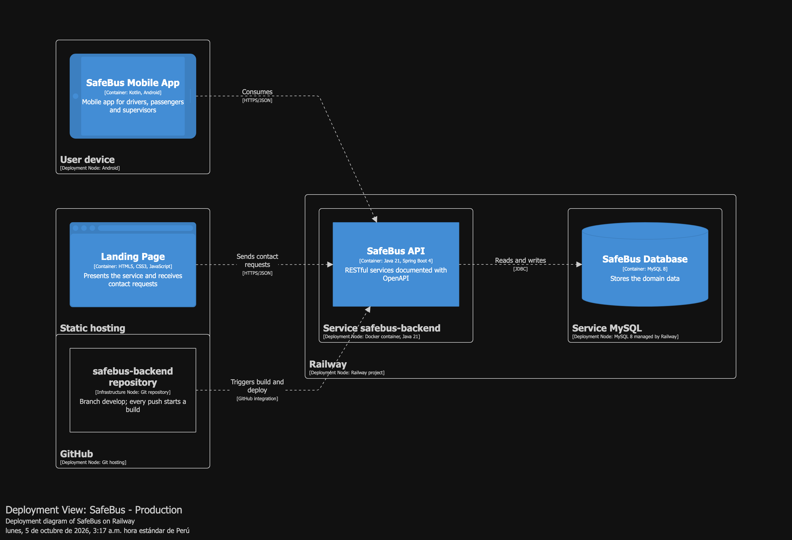

---

## 4.2. Landing Page & Mobile Application Implementation

Esta sección registra la implementación de los productos de SafeBus por Sprint: la planificación, la distribución del trabajo, el Sprint Backlog y las evidencias de desarrollo, pruebas, ejecución, documentación de servicios, despliegue y colaboración. Los repositorios de producto pertenecen a la organización del equipo en GitHub y siguen las convenciones de la sección 4.1.2 (GitFlow, Conventional Commits y Semantic Versioning).

| Producto | Repositorio | Rama de integración |
|---|---|---|
| Web Services | https://github.com/upc-pre-202620-1acc0238-4939-dreamteam/safebus-backend | `develop` |
| Landing Page | https://github.com/upc-pre-202620-1acc0238-4939-dreamteam/safebus-landing | `main` |
| Aplicación móvil | https://github.com/upc-pre-202620-1acc0238-4939-dreamteam/safebus-mobile | `main` |


### 4.2.1. Sprint 1

El Sprint 1 construye la base sobre la que se apoyan las demás historias: el proyecto de Web Services, el acceso por rol (US16) y el registro de buses, rutas, conductores y asignaciones de turno (US13). Estas dos historias se adelantan en el orden del Product Backlog porque son dependencias de las historias de mayor valor: sin una cuenta autenticada y sin un turno asignado, el conductor no puede validar su turno (US01) ni activar una emergencia (US04). El Sprint incluye además la Landing Page (US14 y US15), considerada desde el primer Sprint en la sección 2.4.3.

#### 4.2.1.1. Sprint Planning 1

| Sprint # | Sprint 1 |
|----------|----------|
| **Date** | 30/09/2026 |
| **Time** | 8:00 PM |
| **Location** | Reunión virtual por Discord |
| **Prepared By** | Fernández Linares, Alvaro Sebastian |
| **Attendees** | Acuache Lucas, Mathias Joaquin, Arechaga Saavedra, Mathias Augusto, Delgado Arriola, Leonardo Sebastian, Espinoza Orrego, Valentino Andre, Fernández Linares, Alvaro Sebastian |
| **Sprint n-1 Review Summary** | N/A  |
| **Sprint n-1 Retrospective Summary** | N/A |
| **Sprint Goal** | Nuestro enfoque está en habilitar la base del servicio: el acceso por rol, el registro de buses, rutas y conductores, y la asignación de conductor, bus y ruta a un turno, junto con la Landing Page que presenta SafeBus a las empresas de transporte. Creemos que esto entrega a los supervisores la capacidad de registrar sus recursos y turnos de forma protegida, y a los representantes de empresa un medio para conocer el servicio y solicitar contacto. Esto se confirmará cuando un supervisor inicie sesión, registre un bus, una ruta y un conductor y cree una asignación de turno sin solapamientos mediante los Web Services documentados, y cuando la Landing Page publicada permita consultar la información del servicio y enviar una solicitud de contacto. |
| **Sprint Velocity** | 10 Story Points (estimada: al ser el primer Sprint no existe una velocidad histórica) |
| **Sum of Story Points** | 10 (US16: 3, US13: 3, US14: 2, US15: 2) |

**Historias seleccionadas para el Sprint.**

| User Story Id | Título | Story Points | Producto |
|---|---|---|---|
| US16 | Sign In and Sign Out by User Role | 3 | Web Services |
| US13 | Assign a Driver and Bus to a Route Shift | 3 | Web Services |
| US14 | Consult SafeBus Service Information | 2 | Landing Page |
| US15 | Submit a Company Contact Request | 2 | Landing Page |

El Sprint incluye también un conjunto de tareas técnicas sin Story Points (configuración del proyecto de Web Services, manejo de errores, documentación OpenAPI, empaquetado en Docker y despliegue), necesarias para que las historias puedan implementarse y publicarse.


#### 4.2.1.2. Aspect Leaders and Collaborators

Cada aspecto del Sprint tiene un líder (L), responsable de coordinar el trabajo y de integrar los cambios, y colaboradores (C) que aportan en ese aspecto.

| Team Member (Apellidos, Nombres) | GitHub Username | Landing Page | Web Services | Mobile Application UX/UI |
|-------------------------------------|--------------------|:---:|:---:|:---:|
| Acuache Lucas, Mathias Joaquin | MathiasA25 | C| — | L |
| Arechaga Saavedra, Mathias Augusto | MathZell | C | — | C |
| Delgado Arriola, Leonardo Sebastian | leodev77 | L | C | — |
| Espinoza Orrego, Valentino Andre | valentinoespinoza13 | C| — | C |
| Fernández Linares, Alvaro Sebastian | ORION-tech-c | — | L | — |

#### 4.2.1.3. Sprint Backlog 1

El Sprint Backlog descompone cada historia en tareas de hasta 6 horas. Las tareas sin historia asociada corresponden a la base técnica del proyecto de Web Services y al despliegue.

> URL público del Board: https://trello.com/invite/b/6ac31b86ef414ba1ccffcc9e/ATTI662ff4f0de4372693f4e82297df87b6451C57B66/safebus-sprint-1

| Sprint | US Id | US Title | Work-Item Id | Task Title | Description | Estimation (h) | Assigned To | Status |
|--------|-------|----------|----------------|-------------|--------------|------------------|---------------|--------|
| 1 | — | Web Services project setup | T01 | Generate and configure the Spring Boot project | Crear el proyecto con Java 21 y Maven, definir dependencias y los perfiles `dev`, `test` y `prod`. | 2 | Fernández Linares, Alvaro | Done |
| 1 | — | Web Services project setup | T02 | Shared error handling | Jerarquía de excepciones de dominio y `GlobalExceptionHandler` con respuestas `ProblemDetail` y código de error. | 3 | Fernández Linares, Alvaro | Done |
| 1 | — | Web Services project setup | T03 | Health check, CORS and OpenAPI | Endpoint de estado, filtro CORS y documentación Swagger UI con esquema Bearer. | 2 | Fernández Linares, Alvaro | Done |
| 1 | — | Web Services project setup | T04 | Docker image | `Dockerfile` multi-stage y `.dockerignore` para el despliegue en Azure. | 2 | Fernández Linares, Alvaro | Done |
| 1 | US16 | Sign In and Sign Out by User Role | T05 | UserAccount aggregate | Agregado `UserAccount`, enumeración `UserRole` y repositorio. | 3 | Fernández Linares, Alvaro | Done |
| 1 | US16 | Sign In and Sign Out by User Role | T06 | Account creation service | Creación de cuentas con hash BCrypt, longitud mínima de contraseña e `IamContextFacade` para otros contextos. | 3 | Fernández Linares, Alvaro | Done |
| 1 | US16 | Sign In and Sign Out by User Role | T07 | Sign-in service and JWT issuer | Autenticación con respuesta genérica ante credenciales inválidas y emisión de token JWT con rol y empresa. | 4 | Fernández Linares, Alvaro | Done |
| 1 | US16 | Sign In and Sign Out by User Role | T08 | Auth REST endpoints | `POST /api/v1/auth/sign-in` y `POST /api/v1/auth/sign-out`. | 3 | Fernández Linares, Alvaro | Done |
| 1 | US16 | Sign In and Sign Out by User Role | T09 | JWT resource server and role checks | Validación del token en cada solicitud y autorización por rol (respuestas 401 y 403). | 3 | Fernández Linares, Alvaro | Done |
| 1 | US16 | Sign In and Sign Out by User Role | T10 | IAM tests | Pruebas unitarias y de integración de cuentas, inicio de sesión y seguridad. | 4 | Fernández Linares, Alvaro | Done |
| 1 | US13 | Assign a Driver and Bus to a Route Shift | T11 | Fleet aggregates | Agregados `Company`, `Bus`, `Driver`, `Route` y `ShiftAssignment` con la regla de solapamiento. | 5 | Fernández Linares, Alvaro | Done |
| 1 | US13 | Assign a Driver and Bus to a Route Shift | T12 | Bus, route and driver services | Servicios y repositorios para registrar buses (con QR), rutas y conductores (con credencial QR y cuenta). | 4 | Fernández Linares, Alvaro | Done |
| 1 | US13 | Assign a Driver and Bus to a Route Shift | T13 | Shift assignment service | Validación de periodo, pertenencia a la empresa, recursos habilitados y solapamientos bajo concurrencia. | 5 | Fernández Linares, Alvaro | Done |
| 1 | US13 | Assign a Driver and Bus to a Route Shift | T14 | Fleet REST endpoints | `POST` de `/api/v1/buses`, `/routes`, `/drivers` y `/shift-assignments`, restringidos al rol supervisor. | 4 | Fernández Linares, Alvaro | Done |
| 1 | US13 | Assign a Driver and Bus to a Route Shift | T15 | Seed and bootstrap data | Datos de ejemplo para el perfil `dev` y creación de la primera empresa y supervisor en `prod`. | 2 | Fernández Linares, Alvaro | Done |
| 1 | US13 | Assign a Driver and Bus to a Route Shift | T16 | Fleet tests | Pruebas unitarias, de integración y de concurrencia de la asignación de turnos. | 6 | Fernández Linares, Alvaro | Done |
| 1 | US14 | Consult SafeBus Service Information | T17 | Landing sections | Secciones Home, How it works, Benefits, Fleet, Tools y Pricing según los mock-ups de la sección 3.1.3.2. | 6 | Delgado Arriola, Leonardo | Done |
| 1 | US14 | Consult SafeBus Service Information | T18 | Responsive layout and languages | Adaptación de 320 a 1440 px y páginas en inglés (`/en/`) y español (`/es/`). | 3 | Delgado Arriola, Leonardo | Done |
| 1 | US14 | Consult SafeBus Service Information | T19 | SEO meta tags and terms | Meta tags (title, description, author, robots, hreflang y Open Graph), `robots.txt`, `sitemap.xml` y páginas de términos en ambos idiomas. | 2 | Delgado Arriola, Leonardo | Done |
| 1 | US15 | Submit a Company Contact Request | T20 | Contact form | Formulario con validación de empresa, contacto, correo y consentimiento, y confirmación con referencia. | 3 | Delgado Arriola, Leonardo | Done |
| 1 | US15 | Submit a Company Contact Request | T21 | Contact request service | `POST /api/contact`: registro de la solicitud con identificador único de envío y referencia de recepción. | 4 | Delgado Arriola, Leonardo | Done |
| 1 | US14, US15 | Landing Page tests | T22 | Landing tests | Prueba de API del servicio de contacto y pruebas de navegador con verificación automática de accesibilidad. | 3 | Delgado Arriola, Leonardo | Done |
| 1 | — | Deployment | T23 | Deploy Web Services | Publicar la imagen en Azure Container Registry y ejecutarla en Azure App Service con MySQL. | 3 | Por asignar | To-do |
| 1 | — | Deployment | T24 | Deploy Landing Page | Publicar el sitio y su servicio de contacto en Azure. | 2 | Por asignar | To-do |

#### 4.2.1.4. Development Evidence for Sprint Review

Durante el Sprint se implementaron en el repositorio de Web Services la base compartida del proyecto, el Bounded Context de Identity & Access Management (paquete `iam`) y el de Fleet & Workforce Management (paquete `fleet`), cada uno organizado en las capas `domain`, `application`, `infrastructure` e `interfaces`. El trabajo se integró en `develop` mediante cuatro Pull Requests.

En el repositorio de la Landing Page se implementó el sitio en HTML, CSS y JavaScript sin framework, con un servidor Node.js que entrega las páginas y recibe las solicitudes de contacto. El contenido en inglés y español se define en `src/content.mjs`, el HTML se genera con `src/render.mjs`, los estilos aplican los tokens de la sección 3.1.1 en `src/styles.css`, el comportamiento del menú y del formulario está en `src/app.js`, y `server.mjs` almacena las solicitudes en una base de datos SQLite. La implementación se integró en `main` con el commit `e65cbb5`.

**Pulls integrados en `develop` (safebus-backend).**

| PR | Rama de origen | Merge Commit Id | Contenido | Integrado el |
|---|---|---|---|---|
| #1 | `feature/shared-project-setup` | `52baa04` | Proyecto Spring Boot generado | 03/10/2026 |
| #2 | `feature/shared-project-setup` | `fdcc020` | Configuración, manejo de errores, seguridad base, Swagger y Dockerfile | 03/10/2026 |
| #3 | `feature/iam-authentication` | `ba53b33` | Cuentas, inicio y cierre de sesión con JWT (US16) | 04/10/2026 |
| #4 | `feature/fleet-shift-assignment` | `bbe4c7f` | Buses, rutas, conductores y asignación de turnos (US13) | 04/10/2026 |

**Commits de implementación.**

| Repository | Branch | Commit Id | Commit Message | Commit Message Body | Committed on |
|------------|--------|-----------|-------------------|------------------------|-----------------|
| safebus-backend | `main` | `15c8ad8` | Initial commit | — | 30/09/2026 |
| safebus-backend | `feature/shared-project-setup` | `26e9a3b` | chore: generate spring boot project | — | 03/10/2026 |
| safebus-backend | `feature/shared-project-setup` | `54cf4c7` | build(shared): update pom.xml and .gitignore for phase 0 | - Set version to 0.1.0-SNAPSHOT, name and description - Remove empty url, licenses, developers and scm blocks - Remove spring-boot-h2console dependency - Add springdoc-openapi-starter-webmvc-ui:3.1.1 | 03/10/2026 |
| safebus-backend | `feature/shared-project-setup` | `0949bf3` | chore(shared): configure application properties for dev and prod profiles | — | 03/10/2026 |
| safebus-backend | `feature/shared-project-setup` | `0f6d136` | feat(shared): add Clock bean and domain exception hierarchy | — | 03/10/2026 |
| safebus-backend | `feature/shared-project-setup` | `ee45b5b` | feat(shared): add GlobalExceptionHandler and CorsConfig | — | 03/10/2026 |
| safebus-backend | `feature/shared-project-setup` | `80153db` | feat(shared): add SecurityConfig (stateless) and HealthController | — | 03/10/2026 |
| safebus-backend | `feature/shared-project-setup` | `20e607e` | build(shared): add multi-stage Dockerfile and .dockerignore | — | 03/10/2026 |
| safebus-backend | `feature/shared-project-setup` | `b0ab320` | feat(shared): add custom-code constructor to domain exceptions | Code is now a field in DomainException; each subclass keeps a single-arg constructor with its default code and gains a two-arg (code, message) constructor for caller-supplied codes. | 03/10/2026 |
| safebus-backend | `feature/iam-authentication` | `fa18a6e` | chore(shared): add test properties, jwt.ttl, and @ActiveProfiles to base test | — | 04/10/2026 |
| safebus-backend | `feature/iam-authentication` | `8066fcc` | feat(shared): add UnauthorizedException (401) and its handler mapping | — | 04/10/2026 |
| safebus-backend | `feature/iam-authentication` | `32d9b18` | feat(shared): add AuthenticatedUser record and CurrentUserProvider | — | 04/10/2026 |
| safebus-backend | `feature/iam-authentication` | `a814232` | feat(iam): add UserRole, UserAccount aggregate, repository, and unit tests | — | 04/10/2026 |
| safebus-backend | `feature/iam-authentication` | `9bdda03` | feat(iam): add account creation service with BCrypt and password length rules | — | 04/10/2026 |
| safebus-backend | `feature/iam-authentication` | `0eecc91` | feat(iam): add sign-in service with timing-safe auth and JWT token issuer | — | 04/10/2026 |
| safebus-backend | `feature/iam-authentication` | `e5091e2` | feat(iam): add IamContextFacade as ACL for inter-context account creation | — | 04/10/2026 |
| safebus-backend | `feature/iam-authentication` | `79feba7` | feat(shared): replace SecurityConfig with JWT oauth2ResourceServer and method security | — | 04/10/2026 |
| safebus-backend | `feature/iam-authentication` | `3515fb7` | feat(iam): add sign-in and sign-out controllers with OpenAPI bearer scheme | — | 04/10/2026 |
| safebus-backend | `feature/iam-authentication` | `cf5199f` | feat(iam): add DevSeeder with SUP-001 and DRV-001 for dev profile | — | 04/10/2026 |
| safebus-backend | `feature/iam-authentication` | `31f9f90` | fix(iam): use default table name for UserAccount aggregate | — | 04/10/2026 |
| safebus-backend | `feature/iam-authentication` | `5557ddc` | refactor(iam): remove IfAbsent facade methods and guard seeder with existsByLoginId | — | 04/10/2026 |
| safebus-backend | `feature/iam-authentication` | `87de45b` | fix(iam): catch DataIntegrityViolationException on concurrent duplicate insert | — | 04/10/2026 |
| safebus-backend | `feature/iam-authentication` | `1df326b` | fix(iam): normalize loginId to lowercase on store and lookup | — | 04/10/2026 |
| safebus-backend | `feature/iam-authentication` | `dd6676a` | fix(iam): remove readOnly transaction from sign-in service | — | 04/10/2026 |
| safebus-backend | `feature/iam-authentication` | `9b92b70` | fix(shared): add CORS filter and restrict sign-in permit to POST method | — | 04/10/2026 |
| safebus-backend | `feature/iam-authentication` | `e3bf1a7` | chore(iam): remove feature files written without the real stories | — | 04/10/2026 |
| safebus-backend | `feature/iam-authentication` | `c1695f4` | fix(iam): count code points for minimum password length and add null guards | — | 04/10/2026 |
| safebus-backend | `feature/fleet-shift-assignment` | `a58f4ca` | feat(fleet): add Company aggregate and unit test | — | 04/10/2026 |
| safebus-backend | `feature/fleet-shift-assignment` | `aeed1d4` | feat(fleet): add ShiftAssignment aggregate with overlaps rule and unit tests | — | 04/10/2026 |
| safebus-backend | `feature/fleet-shift-assignment` | `0be2b6b` | feat(fleet): add QrCodeGenerator port, Bus aggregate, and unit tests | — | 04/10/2026 |
| safebus-backend | `feature/fleet-shift-assignment` | `5abe579` | feat(fleet): add Route aggregate and unit test | — | 04/10/2026 |
| safebus-backend | `feature/fleet-shift-assignment` | `1b63774` | feat(fleet): add CredentialGenerator port, Driver aggregate with TTL, and unit tests | — | 04/10/2026 |
| safebus-backend | `feature/fleet-shift-assignment` | `6255cda` | feat(fleet): add CreateBus application service, repositories, and unit tests | — | 04/10/2026 |
| safebus-backend | `feature/fleet-shift-assignment` | `3db87cf` | feat(fleet): add CreateRoute application service, repository, and unit test | — | 04/10/2026 |
| safebus-backend | `feature/fleet-shift-assignment` | `7559e01` | feat(fleet): add CreateDriver application service, repository, and atomicity tests | — | 04/10/2026 |
| safebus-backend | `feature/fleet-shift-assignment` | `8ef6b48` | feat(fleet): add CreateShiftAssignment service, repository, and overlap tests | — | 04/10/2026 |
| safebus-backend | `feature/fleet-shift-assignment` | `920a343` | feat(fleet): add BusController and integration test | — | 04/10/2026 |
| safebus-backend | `feature/fleet-shift-assignment` | `a585681` | feat(fleet): add RouteController and integration test | — | 04/10/2026 |
| safebus-backend | `feature/fleet-shift-assignment` | `f31c8ef` | feat(fleet): add ShiftAssignmentController and integration test | — | 04/10/2026 |
| safebus-backend | `feature/fleet-shift-assignment` | `c854042` | chore(fleet): replace IAM DevSeeder with FleetDevSeeder as ApplicationRunner | — | 04/10/2026 |
| safebus-backend | `feature/fleet-shift-assignment` | `4173f7d` | feat(fleet): add ProdBootstrap ApplicationRunner with missing-var guard and unit test | — | 04/10/2026 |
| safebus-backend | `feature/fleet-shift-assignment` | `ff5134b` | feat(fleet): add DriverController and integration test | — | 04/10/2026 |
| safebus-backend | `feature/fleet-shift-assignment` | `f69ac40` | fix(fleet): use READ_COMMITTED isolation in CreateShiftAssignmentCommandServiceImpl to prevent MySQL MVCC phantom overlap | — | 04/10/2026 |
| safebus-backend | `feature/fleet-shift-assignment` | `e85d695` | fix(fleet): set qr-credential-ttl default to P365D (Duration.parse accepts ISO-8601 period notation) | — | 04/10/2026 |
| safebus-landing | `main` | `e876136` | Initial commit | — | 30/09/2026 |
| safebus-landing | `main` | `e65cbb5` | feat: landing page implementation | — | 04/10/2026 |


#### 4.2.1.5. Testing Suite Evidence for Sprint Review

**Web Services.** La suite de pruebas del repositorio de Web Services se ejecuta con JUnit 5 y Spring Boot Test sobre una base de datos H2 en memoria (perfil `test`). Contiene **151 pruebas en 24 clases**: 54 pruebas unitarias, que verifican las reglas de los agregados y servicios sin levantar el contexto de Spring, y 97 pruebas de integración, que ejecutan los endpoints con MockMvc o los servicios con persistencia real.

| Tipo | Alcance | Clases de prueba | Pruebas |
|---|---|---|---:|
| Unit | Dominio `iam` | `UserAccountTest` | 11 |
| Unit | Dominio `fleet` | `CompanyTest`, `BusTest`, `DriverTest`, `RouteTest`, `ShiftAssignmentTest` | 33 |
| Unit | Servicios e infraestructura | `CreateBusCommandServiceTest`, `CreateRouteCommandServiceTest`, `UserAccountCommandServiceImplTest`, `ProdBootstrapTest`, `JwtConfigTest` | 10 |
| Integration | Base del proyecto y seguridad | `SafebusApplicationTests`, `Phase0IntegrationTests`, `SecurityIntegrationTest` | 17 |
| Integration | Servicios `iam` | `UserAccountCommandServiceTest`, `SignInCommandServiceTest` | 17 |
| Integration | API `iam` | `AuthControllerTest` | 14 |
| Integration | Servicios `fleet` | `CreateDriverCommandServiceTest`, `CreateShiftAssignmentCommandServiceTest` | 12 |
| Integration | API `fleet` | `BusControllerTest`, `RouteControllerTest`, `DriverControllerTest`, `ShiftAssignmentControllerTest`, `ShiftAssignmentConcurrencyTest` | 37 |
| | | **Total** | **151** |

Las pruebas de integración cubren los criterios de aceptación de las historias del Sprint:

| Historia | Escenario del criterio de aceptación | Pruebas que lo verifican |
|---|---|---|
| US16 | Scenario 1: Sign in with role-based credentials | `signIn_validCredentials_returns200WithAllFields`, `signIn_driverCredentials_returns200WithRoleDriver`, `signIn_caseInsensitiveLoginId_returns200` |
| US16 | Scenario 2: Reject invalid sign-in | `signIn_unknownLoginId_returns401WithCode`, `signIn_wrongPassword_returns401WithCode`, `signIn_disabledAccount_returns401WithCode`, `signIn_allFailureCases_returnIdenticalBody` |
| US16 | Scenario 3: Sign out (parte del servicio) | `signOut_validToken_returns204`, `signOut_noToken_returns401`, `signOut_expiredToken_returns401` |
| US13 | Scenario 1: Create a shift assignment | `createShiftAssignment_valid_returns201WithFields`, `createShiftAssignment_contiguous_returns201` |
| US13 | Scenario 2: Reject a conflicting or foreign assignment | `createShiftAssignment_driverOverlap_returns409`, `createShiftAssignment_busOverlap_returns409`, `createShiftAssignment_disabledDriver_returns422`, `createShiftAssignment_disabledBus_returns422`, `createShiftAssignment_company2SupervisorCannotUseCompany1Resources_returns422`, `ShiftAssignmentConcurrencyTest` |
| US14 | Scenario 2: Consult service terms and languages | `tests/browser.mjs`: páginas `/en/` y `/es/`, enlace a términos y cambio de idioma a `/es/terms/` con `lang="es-419"` |
| US15 | Scenario 1: Register a contact request | `tests/api.test.mjs`: respuesta 201 con referencia y hora de recepción; el reintento con el mismo identificador devuelve el mismo recibo, también después de reiniciar el servidor |
| US15 | Scenario 2: Reject invalid contact details | `tests/api.test.mjs`: respuesta 422 con los campos inválidos para empresa, nombre, correo y consentimiento. `tests/browser.mjs`: cuatro campos marcados como inválidos al enviar el formulario vacío |

La suite se ejecuta con el siguiente comando desde la raíz del repositorio:

```bash
./mvnw test
```

**Landing Page.** El repositorio de la Landing Page contiene dos conjuntos de pruebas, que utilizan bases de datos temporales o en memoria y no dependen de los datos del proyecto.

| Tipo | Archivo | Herramienta | Qué verifica |
|---|---|---|---|
| Integration (API) | `tests/api.test.mjs` | `node:test` | Servicio de contacto (US15): validación de campos, recibo con referencia, idempotencia por identificador de envío, persistencia tras reiniciar el servidor, rechazo de un identificador reutilizado con datos distintos (409), de orígenes ajenos (403) y de JSON inválido (400), ausencia de una ruta pública hacia los datos y límite de diez solicitudes nuevas por minuto. |
| Acceptance (UI) | `tests/browser.mjs` | Playwright y axe-core | Páginas en inglés y español a 320, 390, 768 y 1440 px sin desbordamiento horizontal; criterios automáticos WCAG 2.1 A y AA en escritorio y móvil; menú móvil con teclado (Escape); errores del formulario; reintento tras un fallo de red con el mismo identificador de envío; confirmación con referencia; páginas de términos; y texto ampliado al 200 %. |

Las pruebas se ejecutan con los siguientes comandos desde la raíz del repositorio:

```bash
npm test
npm run test:ui
```

Resultado de la ejecución sobre el commit `e65cbb5`:

```text
# Subtest: US15: validation, durable receipts, idempotency and private storage
ok 1 - US15: validation, durable receipts, idempotency and private storage
1..1
# tests 1
# pass 1
# fail 0
```

```text
PASS: EN/ES, 320–1440px, WCAG automated checks, menu/keyboard, contact errors + retry + receipt, terms, 200% text, no browser errors.
```

**Acceptance tests.** Los criterios de aceptación de las historias del Sprint se especifican en archivos `.feature` escritos en Gherkin: los de US16 y US13 en la ruta `src/test/resources/features/` del repositorio de Web Services, y los de US14 y US15 en la ruta `tests/features/` del repositorio de la Landing Page.

`us16-sign-in-and-sign-out-by-user-role.feature`

```gherkin
Feature: US16 - Sign In and Sign Out by User Role
  As a Registered User
  I want to sign in and sign out with the credentials for my driver, supervisor or passenger account
  So that I access my permitted operations and end access on the device

  Scenario Outline: Sign in with role-based credentials
    Given an active <role> has an account
    When the user submits valid account credentials
    Then SafeBus creates an authenticated session for the stored role "<role>"

    Examples:
      | role       |
      | driver     |
      | supervisor |

  Scenario Outline: Reject invalid sign-in
    Given <condition>
    When the user attempts sign-in
    Then SafeBus creates no authenticated session
    And SafeBus returns a generic sign-in failure

    Examples:
      | condition                            |
      | the account is disabled              |
      | the supplied login does not exist    |
      | the supplied password is not correct |

  Scenario: Sign out
    Given an authenticated user
    When the user signs out
    Then SafeBus confirms the sign-out
    And a later request without valid credentials is rejected
```

`us13-assign-a-driver-and-bus-to-a-route-shift.feature`

```gherkin
Feature: US13 - Assign a Driver and Bus to a Route Shift
  As a Fleet Supervisor
  I want to assign an existing driver and bus to a route and shift period
  So that the driver can validate the correct service and the company knows who is responsible

  Background:
    Given a supervisor is signed in for a company

  Scenario: Create a shift assignment
    Given the company has an enabled driver, bus and route with no overlapping assignment
    And a valid start and end period
    When the supervisor records the assignment
    Then SafeBus stores driver, bus, route, planned period and author
    And the assignment has the status "ASSIGNED"

  Scenario Outline: Reject a conflicting or foreign assignment
    Given <condition>
    When the supervisor submits the assignment
    Then SafeBus rejects the request and identifies "<reason>"
    And existing assignments are preserved

    Examples:
      | condition                                      | reason                  |
      | the driver has an overlapping assignment       | ASSIGNMENT_OVERLAP      |
      | the bus has an overlapping assignment          | ASSIGNMENT_OVERLAP      |
      | the driver or bus belongs to another company   | RESOURCE_NOT_IN_COMPANY |
      | the driver, bus or route is disabled           | RESOURCE_DISABLED       |
      | the end of the period is not after its start   | INVALID_PERIOD          |
```

`us14-consult-safebus-service-information.feature`

```gherkin
Feature: US14 - Consult SafeBus Service Information
  As a Transport Company Representative
  I want to consult the published SafeBus service information
  So that I understand its benefits and the service scope for my company

  Scenario: Explain both safety processes
    Given a representative requests the landing content
    When the site serves the service description
    Then the content explains the direct driver emergency
    And the content explains passenger requests with a three-passenger threshold in five minutes and company approval
    And the content shows the contact options

  Scenario Outline: Consult service terms and languages
    Given the representative requests the "<page>" page in "<language>"
    When the site serves the corresponding content
    Then the page is delivered in "<language>"

    Examples:
      | page  | language               |
      | home  | English                |
      | home  | Latin American Spanish |
      | terms | English                |
      | terms | Latin American Spanish |

  Scenario: Use English by default
    Given the representative opens the site without choosing a language
    When the site serves the home page
    Then the content is delivered in English
```

`us15-submit-a-company-contact-request.feature`

```gherkin
Feature: US15 - Submit a Company Contact Request
  As a Transport Company Representative
  I want to submit my company and contact details
  So that the SafeBus team can respond to my request for information or a demonstration

  Scenario: Register a contact request
    Given the representative supplies a company name, contact name, syntactically valid email and contact consent
    When SafeBus receives the contact request with a unique submission identifier
    Then SafeBus stores the request and receipt time
    And SafeBus returns a receipt reference

  Scenario: Retry with the same submission identifier
    Given a contact request was already registered with a submission identifier
    When SafeBus receives the same request with the same identifier
    Then SafeBus returns the same receipt reference

  Scenario Outline: Reject invalid contact details
    Given the contact request has <problem>
    When SafeBus validates the request
    Then SafeBus identifies the invalid field "<field>"
    And SafeBus stores no contact request

    Examples:
      | problem                  | field   |
      | no company name          | company |
      | no contact name          | name    |
      | an invalid email address | email   |
      | no contact consent       | consent |
```

**Commits de la suite de pruebas.**

| Repository | Branch | Commit Id | Commit Message | Commit Message Body | Committed on |
|------------|--------|-----------|-------------------|------------------------|-----------------|
| safebus-backend | `feature/shared-project-setup` | `3cc7aa0` | test(shared): add phase 0 integration tests for health, security and exception mapping | — | 03/10/2026 |
| safebus-backend | `feature/shared-project-setup` | `e7cd2eb` | test(shared): prove caller-supplied exception code reaches JSON response | — | 03/10/2026 |
| safebus-backend | `feature/shared-project-setup` | `992f4b4` | test(shared): add validation failure test for GlobalExceptionHandler | — | 03/10/2026 |
| safebus-backend | `feature/shared-project-setup` | `8c441ef` | test(shared): add swagger tests and remove duplicate contextLoads | — | 03/10/2026 |
| safebus-backend | `feature/iam-authentication` | `ca9c82f` | test(iam): add security integration tests and update Phase0 to expect exact 401 | — | 04/10/2026 |
| safebus-backend | `feature/iam-authentication` | `8c3af59` | test(iam): fix disabled-account tests, add identical-body, wrong-issuer and jwt-secret tests | — | 04/10/2026 |
| safebus-backend | `feature/iam-authentication` | `a408457` | test(iam): add loginId lowercasing, password character-count, and null-input tests | — | 04/10/2026 |
| safebus-backend | `feature/iam-authentication` | `3272226` | test(iam): add driver sign-in and case-insensitive loginId integration tests | — | 04/10/2026 |
| safebus-backend | `feature/fleet-shift-assignment` | `f5c2bf2` | test(fleet): add concurrency test for overlapping shift assignment requests | — | 04/10/2026 |
| safebus-backend | `feature/fleet-shift-assignment` | `e56d3df` | test(fleet): add concurrency test under REPEATABLE_READ isolation to expose MySQL MVCC gap | — | 04/10/2026 |
| safebus-backend | `feature/fleet-shift-assignment` | `c55c8e5` | test(fleet): add missing coverage for foreign driver/route, non-existent ids, count invariants, and PASSENGER 403 | — | 04/10/2026 |
| safebus-backend | `feature/fleet-shift-assignment` | `b509436` | test(fleet): remove repeatable-read test that cannot reproduce MySQL on H2 | — | 04/10/2026 |
| safebus-landing | `main` | `e65cbb5` | feat: landing page implementation (incluye `tests/api.test.mjs` y `tests/browser.mjs`) | — | 04/10/2026 |

#### 4.2.1.6. Execution Evidence for Sprint Review

Al término del Sprint, los Web Services permiten ejecutar de extremo a extremo el flujo de configuración que realiza un supervisor antes de operar: iniciar sesión, registrar un bus, una ruta y un conductor, y asignarlos a un turno. La Landing Page presenta el servicio en inglés y español y registra solicitudes de contacto.

**Web Services.**

| # | Funcionalidad ejecutable | Resultado observable | Historia |
|---|---|---|---|
| 1 | Verificación de estado del servicio | `GET /api/v1/health` responde `{"status":"UP"}` sin autenticación. | — |
| 2 | Inicio de sesión por rol | Un supervisor o conductor obtiene un token Bearer con su rol y la hora de expiración. Las credenciales inválidas, las cuentas deshabilitadas y los usuarios inexistentes reciben la misma respuesta 401. | US16 |
| 3 | Cierre de sesión | El servicio confirma el cierre con 204; una solicitud sin token válido recibe 401. | US16 |
| 4 | Registro de bus | El supervisor registra una placa; el servicio la normaliza a mayúsculas y genera el código QR de la unidad. Una placa repetida recibe 409. | US13 |
| 5 | Registro de ruta | El supervisor registra nombre, origen y destino de la ruta. | US13 |
| 6 | Registro de conductor | El supervisor registra al conductor; el servicio crea su cuenta de acceso y su credencial QR con fecha de expiración. | US13 |
| 7 | Asignación de turno | El supervisor asigna conductor, bus y ruta a un periodo. El servicio rechaza periodos inválidos, recursos deshabilitados o de otra empresa (422) y solapamientos de conductor o bus (409). | US13 |
| 8 | Protección por rol | Un conductor o pasajero que intenta registrar recursos o asignaciones recibe 403. | US16, US13 |

**Ejecución local de los Web Services.** Con Java 21 instalado, el servicio se inicia desde la raíz del repositorio de Web Services. El perfil `dev` utiliza una base de datos H2 en archivo y carga una empresa, un supervisor, un conductor, un bus y una ruta de ejemplo, definidos en `FleetDevSeeder`.

```bash
./mvnw spring-boot:run
```

La documentación interactiva queda disponible en `https://safebus-backend-production-cb4d.up.railway.app/swagger-ui/index.html`.

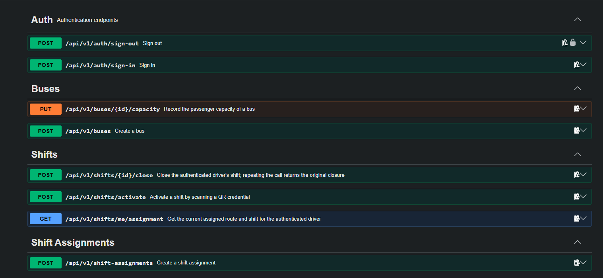


**Landing Page.**

| # | Vista o funcionalidad | Resultado observable | Historia |
|---|---|---|---|
| 1 | Página principal en inglés (`/en/`) y en español (`/es/`) | La raíz del sitio redirige a `/en/`. Cada página muestra las secciones Hero, How it works, Benefits, Fleet, Tools, Pricing, Contact y el pie de página. | US14 |
| 2 | How it works | Dos recorridos separados: la emergencia directa del conductor, sin formulario ni aprobación, y la solicitud del pasajero, que requiere tres pasajeros distintos en cinco minutos y la aprobación de la empresa. | US14 |
| 3 | Pricing | Precio desde S/ 99 por bus al mes, instalación incluida y 20 % de descuento desde tres buses. | US14 |
| 4 | Encabezado y navegación | Encabezado fijo con anclas a las secciones, selector EN / ES y botón Request a demo; en móvil, el menú se despliega y se cierra con la tecla Escape. | US14 |
| 5 | Términos | Páginas `/en/terms/` y `/es/terms/` con el alcance del servicio y el uso de datos. | US14 |
| 6 | Formulario de contacto | Al enviar el formulario vacío se marcan los cuatro campos obligatorios; con datos válidos se muestra la referencia de recepción y la hora. | US15 |

*Landing Page en inglés (`/en/`), vista de escritorio de 1440 px.*

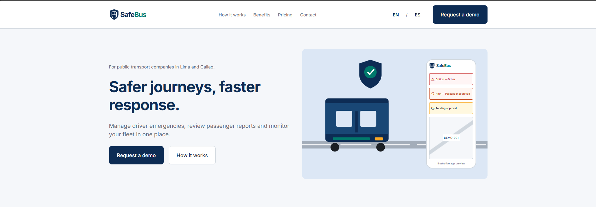

*Landing Page en español (`/es/`), vista de escritorio de 1440 px.*

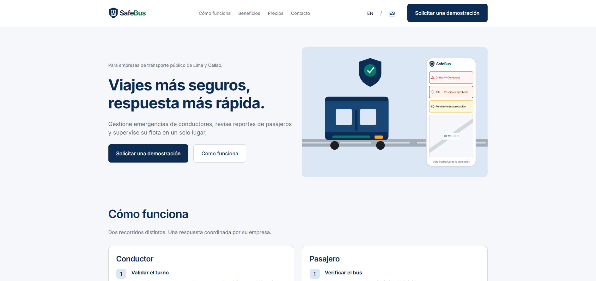

*Landing Page en móvil (390 px): inicio, menú desplegado, sección Pricing y formulario de contacto.*

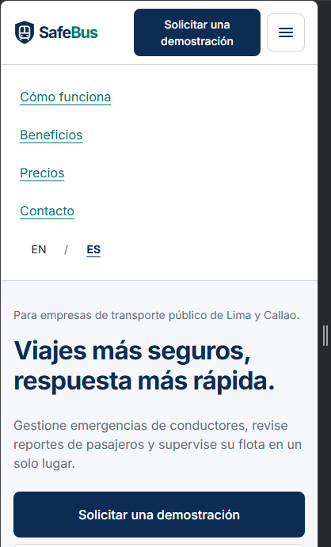

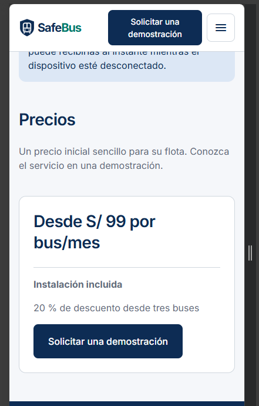

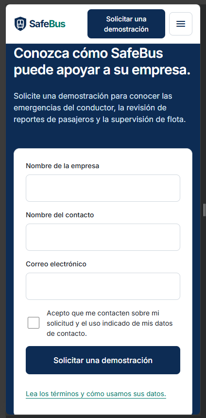

*Formulario de contacto: validación de los campos obligatorios.*

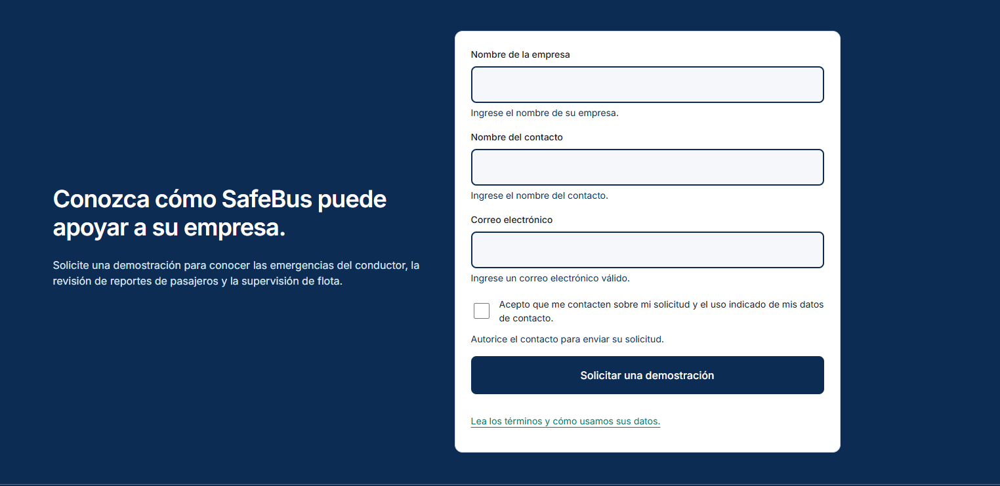

*Formulario de contacto: solicitud registrada con su referencia de recepción.*

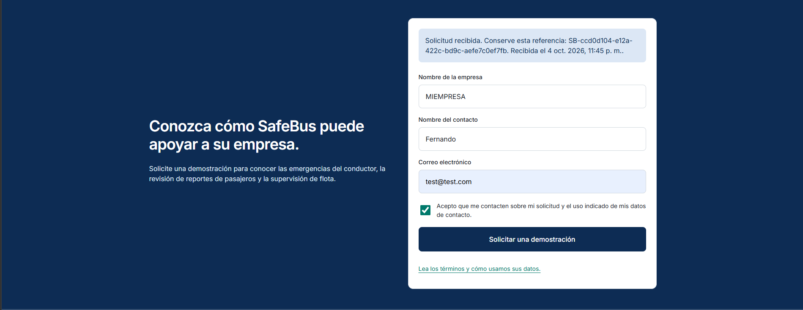


*Página de términos en español (`/es/terms/`).*

**Ejecución local de la Landing Page.** Con Node.js 24.14 o posterior, el sitio se compila y se inicia desde la raíz de su repositorio y queda disponible en `http://127.0.0.1:3000`:

```bash
npm ci
npm run build
npm start
```

#### 4.2.1.7. Services Documentation Evidence for Sprint Review

Los Web Services se documentan con OpenAPI mediante springdoc-openapi. Cada controlador declara su grupo (`@Tag`), el resumen de la operación (`@Operation`) y los códigos de respuesta (`@ApiResponse`); los endpoints protegidos utilizan el esquema de seguridad `bearerAuth` (JWT). Todas las rutas siguen la convención `/api/v1/<recurso-en-plural-kebab-case>` de la sección 4.1.3.

| Endpoint | Verbo HTTP | Sintaxis | Parámetros | Ejemplo Response |
|----------|-------------|----------|--------------|----------------------|
| Health check | GET | `/api/v1/health` | Ninguno. No requiere token. | `200 OK` `{"status":"UP"}` |
| Sign in | POST | `/api/v1/auth/sign-in` | Body: `loginId` (string), `password` (string). No requiere token. | `200 OK` `{"accessToken":"eyJ…","tokenType":"Bearer","role":"SUPERVISOR","expiresAt":"2026-10-05T10:15:00Z"}` |
| Sign out | POST | `/api/v1/auth/sign-out` | Header: `Authorization: Bearer <token>`. | `204 No Content` |
| Create a bus | POST | `/api/v1/buses` | Header: token de supervisor. Body: `plate` (string, máximo 15 caracteres). | `201 Created` `{"id":1,"plate":"ABC-123","qrCode":"0b9f6c1e-5d2a-4f7e-9c3b-1a2d3e4f5a6b","enabled":true}` |
| Create a route | POST | `/api/v1/routes` | Header: token de supervisor. Body: `name`, `origin`, `destination` (string). | `201 Created` `{"id":1,"name":"Main Route","origin":"Terminal Norte","destination":"Terminal Sur","enabled":true}` |
| Create a driver | POST | `/api/v1/drivers` | Header: token de supervisor. Body: `fullName`, `loginId`, `initialPassword` (string, mínimo 8 caracteres). | `201 Created` `{"id":2,"fullName":"Juan Pérez","loginId":"drv-002","qrCredential":"<token de 43 caracteres>","qrCredentialExpiresAt":"2027-10-04T22:15:00Z"}` |
| Create a shift assignment | POST | `/api/v1/shift-assignments` | Header: token de supervisor. Body: `driverId`, `busId`, `routeId` (number), `plannedStart`, `plannedEnd` (fecha y hora ISO-8601 en UTC). | `201 Created` `{"id":1,"driverId":1,"busId":1,"routeId":1,"plannedStart":"2026-10-05T10:00:00Z","plannedEnd":"2026-10-05T18:00:00Z","status":"ASSIGNED","createdByUserId":1,"createdAt":"2026-10-04T22:20:00Z"}` |

Los identificadores, tokens y fechas de los ejemplos son ilustrativos; la estructura corresponde a los recursos `SignInResponse`, `BusResource`, `RouteResource`, `DriverResource` y `ShiftAssignmentResource` del código.

**Respuestas de error.** Los errores se devuelven con el formato `ProblemDetail` y una propiedad `code` que identifica la causa:

```json
{
  "type": "about:blank",
  "title": "Conflict",
  "status": 409,
  "detail": "driver has an overlapping assignment",
  "instance": "/api/v1/shift-assignments",
  "code": "ASSIGNMENT_OVERLAP"
}
```

| Estado HTTP | `code` | Situación |
|---|---|---|
| 401 | `INVALID_CREDENTIALS` | Credenciales inválidas, cuenta deshabilitada o usuario inexistente. |
| 401 | — | Token ausente, expirado o inválido en un endpoint protegido. |
| 403 | — | El rol del token no es supervisor. |
| 409 | `PLATE_TAKEN` | La placa ya está registrada. |
| 409 | `LOGIN_ID_TAKEN` | El identificador de acceso del conductor ya está en uso. |
| 409 | `ASSIGNMENT_OVERLAP` | El conductor o el bus tienen una asignación que se solapa con el periodo. |
| 422 | `VALIDATION_FAILED` | Falta un campo obligatorio; la respuesta incluye la lista `errors`. |
| 422 | `PASSWORD_TOO_SHORT` | La contraseña inicial tiene menos de 8 caracteres. |
| 422 | `INVALID_PERIOD` | El fin del periodo no es posterior al inicio. |
| 422 | `RESOURCE_NOT_IN_COMPANY` | El conductor, bus o ruta no existe o pertenece a otra empresa. |
| 422 | `RESOURCE_DISABLED` | El conductor, bus o ruta está deshabilitado. |

**Servicio de contacto de la Landing Page.** La Landing Page expone un único servicio, implementado en su servidor Node.js y documentado en el `README.md` de su repositorio. No requiere autenticación y rechaza las solicitudes enviadas desde un origen distinto al del sitio (403).

| Endpoint | Verbo HTTP | Sintaxis | Parámetros | Ejemplo Response |
|----------|-------------|----------|--------------|----------------------|
| Submit a contact request | POST | `/api/contact` | Body (JSON): `submissionId` (UUID v4), `company` (string, máximo 120 caracteres), `name` (string, máximo 120 caracteres), `email` (string), `consent` (`true`). | `201 Created` `{"reference":"SB-2e0aac53-7de6-4d5f-bde9-708c2253e3bb","receivedAt":"2026-10-05T03:02:33.112Z"}` |

| Estado HTTP | Situación | Ejemplo Response |
|---|---|---|
| 200 | Reintento con el mismo `submissionId` y los mismos datos: se devuelve el mismo recibo. | `{"reference":"SB-2e0aac53-7de6-4d5f-bde9-708c2253e3bb","receivedAt":"2026-10-05T03:02:33.112Z"}` |
| 409 | El `submissionId` ya se utilizó con datos distintos. | `{"error":"Submission identifier already used"}` |
| 422 | Falta un dato obligatorio, el correo no es válido o no hay consentimiento; no se almacena la solicitud. | `{"error":"Invalid contact details","fields":["company","email","consent"]}` |
| 429 | Más de diez solicitudes nuevas por minuto desde la misma dirección. | `{"error":"Please retry later"}` |

URL del repositorio de Web Services: https://github.com/upc-pre-202620-1acc0238-4939-dreamteam/safebus-backend

URL del repositorio de la Landing Page: https://github.com/upc-pre-202620-1acc0238-4939-dreamteam/safebus-landing

URL de la documentación desplegada: https://safebus-backend-production-cb4d.up.railway.app/swagger-ui/index.html

#### 4.2.1.8. Software Deployment Evidence for Sprint Review

El despliegue sigue el procedimiento de la sección 4.1.4. Durante el Sprint se dejó preparado en el repositorio de Web Services todo lo necesario para publicar el servicio como contenedor, y en el repositorio de la Landing Page, la compilación del sitio y la configuración de su servidor.

**Web Services.**

| Elemento | Ubicación en el repositorio | Commit Id |
|---|---|---|
| Imagen Docker multi-stage (compilación con Maven y ejecución con JRE 21, usuario sin privilegios, puerto 8080) | `Dockerfile` y `.dockerignore` | `20e607e` |
| Perfiles `dev` y `prod`; el perfil `prod` toma la base de datos y el secreto JWT de variables de entorno | `application.properties` y `application-prod.properties` | `0949bf3` |
| Creación de la primera empresa y supervisor en producción a partir de las variables `SAFEBUS_BOOTSTRAP_*`, con verificación de variables faltantes | `ProdBootstrap` | `4173f7d` |
| Filtro CORS configurable con `APP_CORS_ALLOWED_ORIGINS` | `CorsConfig` | `ee45b5b`, `9b92b70` |

**Landing Page.**

| Elemento | Ubicación en el repositorio | Commit Id |
|---|---|---|
| Compilación del sitio en la carpeta `dist`: páginas en inglés y español, términos, estilos, fuentes locales, `robots.txt` y `sitemap.xml` | `scripts/build.mjs` (`npm run build`) | `e65cbb5` |
| Servidor que entrega el sitio y recibe las solicitudes de contacto; requiere Node.js 24.14 o posterior | `server.mjs` (`npm start`) | `e65cbb5` |
| Variables de entorno: `SITE_URL` (dominio para las URL canónicas y el sitemap), `HOST`, `PORT` y `DATA_FILE` (archivo SQLite de las solicitudes) | `README.md` | `e65cbb5` |

El formulario de contacto depende del servidor Node.js: publicar únicamente la carpeta `dist` en un hosting estático muestra el sitio, pero no registra solicitudes. El archivo SQLite debe guardarse en un almacenamiento persistente y privado.

#### 4.2.2.1 Sprint 2

| Sprint # | Sprint 2 |
|---|---|
| **Date** | 2026-09-07 |
| **Time** | 19:00 - 21:00 |
| **Location** | Sesión virtual sincrónica vía Google Meet / Discord |
| **Prepared By** | Espinoza Orrego, Valentino Andre |
| **Attendees** | Acuache Lucas, Mathias Joaquin / Arechaga Saavedra, Mathias Augusto / Delgado Arriola, Leonardo Sebastian / Espinoza Orrego, Valentino Andre / Fernández Linares, Alvaro Sebastian |
| **Sprint 1 Review Summary** | Durante la sesión de revisión del Sprint 1, el equipo evidenció la publicación del Landing Page institucional en Azure Static Web Apps, la infraestructura de control de versiones con GitFlow y la arquitectura base del backend en Spring Boot desplegada al 70%, incluyendo los endpoints iniciales de Identity & Access Management (IAM) y la resolución de las Spike Stories técnicas de telemetría y flujo de conteo de pasajeros (US21 y US22). El Product Owner evaluó favorablemente el avance de la infraestructura base y recomendó concentrar el Sprint 2 en la interactividad operativa móvil y en el flujo crítico de emergencias en tiempo real. |
| **Sprint n-1 Retrospective Summary** | En la retrospectiva del Sprint 1, el equipo reconoció como fortalezas la rápida adopción del modelado táctico de Domain-Driven Design (DDD) y el apego a las convenciones de estilo de código (Google Java Style Guide y Kotlin Coding Conventions). Como áreas de mejora para el trabajo colaborativo, se acordó concertar los contratos de DTO y esquemas JSON entre el frontend móvil y el backend antes de iniciar la codificación de las interfaces, incrementar la frecuencia de integración en ramas de características (*feature branches*) para prevenir discrepancias en las revisiones de Pull Requests, y diseñar las pruebas automatizadas BDD en paralelo a la lógica de negocio. |
| **Sprint Goal** | **Our focus is on** delivering the core emergency response, real-time bus telemetry, and passenger journey verification features across the mobile applications and the public backend services.<br><br>**We believe it delivers** immediate panic protection for drivers, verifiable incident reporting for passengers, and real-time operational response capabilities for transport fleet supervisors.<br><br>**This will be confirmed when** a driver can trigger an immediate Critical emergency alert without approval, passengers can verify a bus unit via QR and submit threshold-eligible incident requests with photo evidence, and fleet supervisors can monitor live bus coordinates and manage safety cases through 100% publicly documented RESTful services. |
| **Sprint Velocity** | 34 Story Points |
| **Sum of Story Points** | 34 Story Points |

#### 4.2.2.2. Aspect Leaders and Collaborators

Para optimizar la coordinación y efectividad durante el desarrollo del Sprint 2, el equipo formalizó la Leadership-and-Collaboration Matrix (LACX). Cada aspecto técnico y funcional cuenta con un integrante designado como Líder (L), responsable de velar por la coherencia técnica y el cumplimiento de los criterios de aceptación, y Colaboradores (C), encargados de apoyar en la codificación, revisión cruzada de código y pruebas automatizadas:

* **Aspecto 1: Driver Safety & Location (US03, US04):** Desarrollo de la interfaz nativa del conductor, botón de pánico de activación inmediata sin sonido ni vibración, almacenamiento local SQLite y captura de telemetría GPS en segundo plano.
* **Aspecto 2: Passenger Identity & QR Journey (US06, US23, US24):** Formulario de registro con captura facial, módulo de escaneo de QR de la unidad con cámara y lógica de detección de alejamiento geográfico (>100 m durante 60 s).
* **Aspecto 3: Passenger Panic & Threshold Management (US08):** Envío de solicitudes de pánico con mensaje y fotografía del incidente, y lógica de agregación temporal (umbral de 3 pasajeros en 5 minutos) en el backend.
* **Aspecto 4: Telemetry Services & Event Dispatch (US18, US20):** Implementación de los controladores RESTful de geolocalización, persistencia en base de datos y canal de notificaciones en tiempo real vía WebSockets hacia la central de operaciones.

| Team Member (Apellidos, Nombres) | GitHub Username | Driver Safety & Location (US03, US04) | Passenger Identity & QR Journey (US06, US23, US24) | Passenger Panic & Threshold Management (US08) | Telemetry Services & Event Dispatch (US18, US20) |
|---|---|:---:|:---:|:---:|:---:|
| **Delgado Arriola, Leonardo Sebastian** | `leodev77` | **L** | C | C | C |
| **Acuache Lucas, Mathias Joaquin** | `MathiasA25` | C | **L** | C | C |
| **Arechaga Saavedra, Mathias Augusto** | `MathZell` | C | C | **L** | C |
| **Espinoza Orrego, Valentino Andre** | `valentinoespinoza13` | C | C | C | **L** |
| **Fernández Linares, Alvaro Sebastian** | `ORION-tech-c` | C | C | **L** | C |

#### 4.2.2.3. Sprint Backlog 2

El Sprint Backlog del Sprint 2 reúne las historias de usuario priorizadas del Product Backlog orientadas al núcleo operativo de SafeBus: el despacho de emergencias críticas del conductor, la transmisión telemática de la flota en ruta, el registro seguro de pasajeros y el envío de solicitudes con evidencia fotográfica. A continuación, se presenta la referencia al tablero de gestión ágil y la descomposición técnica de cada historia de usuario en tareas de desarrollo, pruebas e integración:

> **URL público del Board de seguimiento (Trello):** `https://trello.com/invite/b/6ac32d61316f0c5c269e14f4/ATTIc604fd2b7f698e3f59998f368cfc62adE8A4AB52/sprint-backlog-2`

<div align="center">
  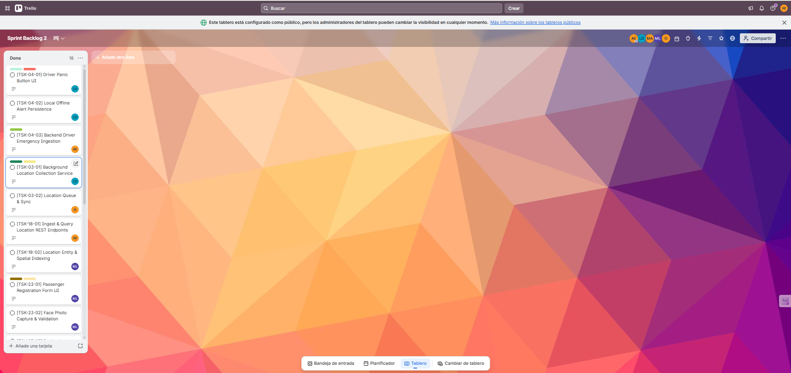
  <p><i>Tablero de control de estado del Sprint 2</i></p>
</div>

| Sprint # | Sprint 2 | | | | | | | |
|:---:|:---:|---|:---:|---|---|:---:|:---:|:---:|
| **User Story Id** | **User Story Title** | **Work-Item / Task Id** | **Task Title** | **Description** | **Estimation (Hours)** | **Assigned To** | **Status** | |
| **US04** | Trigger an Immediate Driver Emergency Alert | TSK-04-01 | Driver Panic Button UI | Implementar botón de pánico en Jetpack Compose con activación inmediata y sin sonido ni vibración | 5 | Delgado Arriola, Leonardo Sebastian | Done |
| | | TSK-04-02 | Local Offline Alert Persistence | Configurar encolamiento persistente en SQLite local para alertas activadas sin cobertura de red | 6 | Delgado Arriola, Leonardo Sebastian | Done |
| | | TSK-04-03 | Backend Driver Emergency Ingestion | Desarrollar endpoint `POST /api/v1/emergencies/driver` con prioridad Critical y registro de hora de activación | 6 | Espinoza Orrego, Valentino Andre | Done |
| **US03** | Share Bus Location During an Active Shift | TSK-03-01 | Background Location Collection Service | Implementar servicio en segundo plano con `FusedLocationProviderClient` para muestreo cada 30 segundos | 7 | Delgado Arriola, Leonardo Sebastian | Done |
| | | TSK-03-02 | Location Queue & Sync | Implementar sincronización asíncrona de lotes de coordenadas retenidas hacia el backend | 5 | Fernández Linares, Alvaro Sebastian | Done |
| **US18** | Provide Bus Location for Monitoring and Journey Completion | TSK-18-01 | Ingest & Query Location REST Endpoints | Implementar controladores `POST /api/v1/trips/{tripId}/locations` y `GET /api/v1/buses/{busId}/location/latest` | 6 | Espinoza Orrego, Valentino Andre | Done |
| | | TSK-18-02 | Location Entity & Spatial Indexing | Mapear entidades JPA para lecturas de coordenadas con validación de precisión y marcas de tiempo | 4 | Acuache Lucas, Mathias Joaquin | Done |
| **US23** | Register a Passenger Account with DNI and Face Photo | TSK-23-01 | Passenger Registration Form UI | Construir formulario de registro móvil con validación de DNI de 8 dígitos y políticas de contraseña | 5 | Acuache Lucas, Mathias Joaquin | Done |
| | | TSK-23-02 | Face Photo Capture & Validation | Integrar selector/cámara con validación de formato JPEG/PNG y tamaño máximo de 5 MB | 6 | Acuache Lucas, Mathias Joaquin | Done |
| | | TSK-23-03 | Backend Registration & Duplicate DNI Guard | Desarrollar servicio `POST /api/v1/passengers/register` con almacenamiento privado y prevención de duplicados | 6 | Espinoza Orrego, Valentino Andre | Done |
| **US06** | Verify a Bus and Start a Passenger Journey | TSK-06-01 | QR Scanner Screen | Integrar lector de códigos QR mediante CameraX para lectura de credencial y validación de unidad | 6 | Arechaga Saavedra, Mathias Augusto | Done |
| | | TSK-06-02 | Journey Association Service | Desarrollar endpoint `POST /api/v1/journeys` que valida turno activo del bus y vincula viaje a la cuenta | 5 | Fernández Linares, Alvaro Sebastian | Done |
| **US08** | Submit a Passenger Panic Request with Message and Photo | TSK-08-01 | Passenger Panic Request UI | Diseñar formulario de reporte con captura fotográfica obligatoria de evidencia y mensaje descriptivo | 7 | Arechaga Saavedra, Mathias Augusto | Done |
| | | TSK-08-02 | Multipart Evidence Upload | Implementar transmisión de datos y archivo de evidencia fotográfica hacia el servicio de almacenamiento | 6 | Fernández Linares, Alvaro Sebastian | Done |
| | | TSK-08-03 | Backend Group Threshold Window Service | Desarrollar regla de agregación de solicitudes: umbral de 3 pasajeros distintos en ventana de 5 minutos | 9 | Espinoza Orrego, Valentino Andre | Done |
| **US20** | Deliver Driver Emergencies and Passenger Review Notifications | TSK-20-01 | WebSocket Notification Broker | Configurar broker STOMP / WebSocket en Spring Boot para despacho en tiempo real al panel supervisor | 7 | Espinoza Orrego, Valentino Andre | Done |
| | | TSK-20-02 | Supervisor Notification Listener | Implementar cliente de suscripción a eventos de alerta para actualización en vivo de casos de emergencia | 5 | Arechaga Saavedra, Mathias Augusto | Done |
| **Task General** | Constraint de Proyecto | TSK-GEN-01 | OpenAPI Documentation & Deployment Update | Actualizar documentación de endpoints en Swagger UI y verificar el pipeline de despliegue en Azure Container Registry | 5 | Espinoza Orrego, Valentino Andre | Done |

#### 4.2.2.4. Development Evidence for Sprint Review

Durante el desarrollo del Sprint 2, el equipo concentró sus esfuerzos de implementación en materializar el núcleo operativo de la solución en los repositorios de Web Services (`safebus-backend`) y de la aplicación móvil (`safebus-mobile`). Los avances abarcan la implementación de la capa de dominio y servicios de aplicación para la gestión de emergencias del conductor con prioridad crítica (Bounded Context *Safety Case Management*), la ingesta y consulta telemática de coordenadas GPS de las unidades en ruta (*Trip & Location Tracking*), la activación de turnos y vinculación con conductores (*Fleet & Workforce Management*), y los prototipos de interfaz de usuario para el flujo móvil. Todo el trabajo fue gestionado aplicando el flujo GitFlow en ramas de características y mensajes estandarizados bajo Conventional Commits.

A continuación, se presenta la relación de commits de implementación registrados durante el sprint:

| Repository | Branch | Commit Id | Commit Message | Commit Message Body | Committed on |
|---|---|:---:|---|---|:---:|
| `upc-pre-202620-1acc0238-4939-dreamteam/safebus-backend` | `feature/safetycase-driver-emergency` | `83699ba` | `feat(safetycase): add DriverEmergencyController with integration tests` | Expose REST endpoints to trigger and retrieve driver emergencies with Critical priority. | 05/10/2026 |
| `upc-pre-202620-1acc0238-4939-dreamteam/safebus-backend` | `feature/safetycase-driver-emergency` | `c1c5647` | `feat(safetycase): add EmergencyAttentionController with integration tests` | Implement emergency attention tracking controllers for supervisors to start and close cases. | 05/10/2026 |
| `upc-pre-202620-1acc0238-4939-dreamteam/safebus-backend` | `feature/safetycase-driver-emergency` | `fb4f241` | `feat(safetycase): add CloseEmergency command service with tests` | Implement application command handler and domain logic to transition emergency state to closed. | 05/10/2026 |
| `upc-pre-202620-1acc0238-4939-dreamteam/safebus-backend` | `feature/safetycase-driver-emergency` | `6000c6b` | `feat(safetycase): add StartAttention command service with tests` | Record start of company emergency handling and assign supervisor identifier. | 05/10/2026 |
| `upc-pre-202620-1acc0238-4939-dreamteam/safebus-backend` | `feature/safetycase-driver-emergency` | `3ba3f2c` | `feat(safetycase): add GetDriverEmergency query service with tests` | Provide application query to fetch driver emergency details by identifier. | 05/10/2026 |
| `upc-pre-202620-1acc0238-4939-dreamteam/safebus-backend` | `feature/safetycase-driver-emergency` | `82bb4e3` | `feat(safetycase): add EmergencyRepository and CreateDriverEmergency service with tests` | Persist driver emergencies ensuring critical severity and active state upon creation. | 05/10/2026 |
| `upc-pre-202620-1acc0238-4939-dreamteam/safebus-backend` | `feature/safetycase-driver-emergency` | `e77bd95` | `feat(safetycase): add Emergency aggregate with enums and unit tests` | Model Emergency domain aggregate root, EmergencySeverity, EmergencyStatus and state transitions. | 05/10/2026 |
| `upc-pre-202620-1acc0238-4939-dreamteam/safebus-backend` | `feature/trip-location` | `b6f7459` | `feat(trip): add VehicleLocationController with integration tests` | Expose REST endpoints to query latest vehicle location by bus identifier. | 05/10/2026 |
| `upc-pre-202620-1acc0238-4939-dreamteam/safebus-backend` | `feature/trip-location` | `67d9269` | `feat(trip): add LocationEventController with integration tests` | Expose location telemetry ingestion endpoint to register periodic GPS samples. | 05/10/2026 |
| `upc-pre-202620-1acc0238-4939-dreamteam/safebus-backend` | `feature/trip-location` | `c1e39d5` | `feat(trip): add GetBusLocation service, passenger journey port and placeholder` | Provide location query service for supervisor dashboard and journey distance validation. | 05/10/2026 |
| `upc-pre-202620-1acc0238-4939-dreamteam/safebus-backend` | `feature/trip-location` | `6a98b3f` | `feat(trip): add RecordLocationEvent services and repositories for US18` | Persist periodic bus GPS readings with accuracy and capture timestamp verification. | 05/10/2026 |
| `upc-pre-202620-1acc0238-4939-dreamteam/safebus-backend` | `feature/trip-location` | `0ce5f2a` | `feat(trip): add VehicleLocation aggregate with unit tests` | Model VehicleLocation aggregate to track latest coordinate and sample freshness state. | 05/10/2026 |
| `upc-pre-202620-1acc0238-4939-dreamteam/safebus-backend` | `feature/trip-location` | `90f403a` | `feat(trip): add LocationEvent aggregate with unit tests` | Model immutable LocationEvent entity for audit logging of bus route breadcrumbs. | 05/10/2026 |
| `upc-pre-202620-1acc0238-4939-dreamteam/safebus-backend` | `feature/trip-location` | `a102321` | `feat(shared): add GeoPoint embeddable with unit tests` | Create reusable GeoPoint value object with latitude, longitude and distance calculation. | 05/10/2026 |
| `upc-pre-202620-1acc0238-4939-dreamteam/safebus-backend` | `feature/trip-shift-activation` | `93dcf6c` | `feat(trip): add TripContextFacade with ShiftInfo and findShiftById` | Expose outbound facade for cross-context shift validation and driver association. | 05/10/2026 |
| `upc-pre-202620-1acc0238-4939-dreamteam/safebus-backend` | `feature/trip-shift-activation` | `e93fee6` | `feat(fleet): add findDriverByUserAccountId and findBusCompanyId to facade` | Provide lookup operations to link authenticated IAM user with fleet driver profile. | 05/10/2026 |
| `upc-pre-202620-1acc0238-4939-dreamteam/safebus-mobile` | `main` | `3e19095` | `feat: first ui demo implementation` | Initial layout and core mobile user interface screens for driver and passenger flows. | 05/10/2026 |

#### 4.2.2.5. Software Deployment Evidence for Sprint Review

El despliegue sigue el procedimiento de la sección 4.1.4. Durante el Sprint se dejó preparado en el repositorio de Web Services todo lo necesario para publicar el servicio como contenedor, y en el repositorio de la Landing Page, la compilación del sitio y la configuración de su servidor.

En esta sección se detalla el conjunto de pruebas unitarias, de integración y de aceptación automatizadas construidas para verificar el comportamiento de los Web Services del backend, garantizando el cumplimiento de los criterios de aceptación de las historias de usuario del Sprint 2. El equipo implementó una estrategia de pruebas multinivel utilizando JUnit 5 y Spring Boot Test para la lógica interna y controladores REST, junto con el enfoque Behavior-Driven Development (BDD) mediante Cucumber y especificaciones ejecutables en lenguaje Gherkin.

##### Relación de Pruebas Diseñadas

* **Pruebas Unitarias (Unit Tests):**
  * `EmergencyTest`: Evalúa la creación de la raíz de agregado `Emergency`, la asignación obligatoria de severidad `CRITICAL` para activaciones de conductores, la inicialización en estado `ACTIVE`, y la prohibición de transiciones inválidas de estado (e.g., intentar iniciar atención sobre una emergencia previamente cerrada).
  * `VehicleLocationTest` & `LocationEventTest`: Verifican la inmutabilidad de los eventos de telemetría, el cálculo de vigencia de las muestras de coordenadas GPS y las reglas de orden temporal.
  * `GeoPointTest`: Valida el objeto de valor `GeoPoint`, comprobando la validación de rango de latitud (-90 a 90) y longitud (-180 a 180), así como la fórmula de distancia geodésica (Haversine).

* **Pruebas de Integración (Integration Tests & Concurrency):**
  * `DriverEmergencyControllerTest`: Verifica el ciclo de vida completo del endpoint `POST /api/v1/driver-emergencies`, comprobando la persistencia en base de datos H2 en memoria, el retorno de código HTTP 201 Created y la correspondencia de los campos de respuesta (`id`, `status`, `priority`, `activatedAt`, `receivedAt`).
  * `EmergencyAttentionControllerTest`: Evalúa la operación `POST /api/v1/emergencies/{id}/start-attention`, comprobando la asignación del supervisor responsable, el cambio de estado a `IN_PROGRESS` y el control de acceso multitenant entre diferentes empresas.
  * `VehicleLocationControllerTest` & `LocationEventControllerTest`: Prueban la ingesta masiva de telemetría y la consulta de la última coordenada conocida de una unidad de transporte.
  * Pruebas de concurrencia: Evalúan el bloqueo optimista y la integridad transaccional ante solicitudes simultáneas de atención y eventos de geolocalización de alta frecuencia.

##### Pruebas de Aceptación BDD (Archivos `.feature` en Gherkin)

Las pruebas de aceptación fueron redactadas en archivos `.feature` bajo la sintaxis Given-When-Then, enlazadas directamente con las historias de usuario correspondientes:

###### Archivo: `safetycase-driver-emergency.feature` (Relacionado con US04)
Ruta: `src/test/resources/features/safetycase-driver-emergency.feature`

```gherkin
Feature: Driver Emergency (US04)

  # US04 S1 – Driver with an active shift creates an emergency
  Scenario: Driver creates a new emergency with coordinates
    Given a driver has an active shift
    When POST /api/v1/driver-emergencies with a valid UUID id, shiftId, activatedAt and coordinates
    Then the response status is 201
    And the response body contains id, status "ACTIVE", priority "CRITICAL", activatedAt, receivedAt

  Scenario: Driver creates a new emergency without coordinates
    Given a driver has an active shift
    When POST /api/v1/driver-emergencies with a valid UUID id, shiftId, activatedAt and no coordinates
    Then the response status is 201
    And the stored emergency has a null location

  # US04 S2 – Offline-queued emergency and idempotent retry
  Scenario: Emergency with an old activatedAt is accepted and stores both timestamps
    Given a driver has an active shift
    When POST /api/v1/driver-emergencies with activatedAt set to an hour in the past
    Then the response status is 201
    And the stored activatedAt differs from receivedAt

  Scenario: Identical retry of an already-stored emergency returns 200 and one row
    Given a driver has already created an emergency with a given id and payload
    When POST /api/v1/driver-emergencies with the same id and the same payload
    Then the response status is 200
    And the response body contains the same id
    And the database still contains exactly one emergency row
```

###### Archivo: `safetycase-emergency-attention.feature` (Relacionado con US10)
Ruta: `src/test/resources/features/safetycase-emergency-attention.feature`

```gherkin
Feature: Emergency Attention (US10)

  # US10 S1 – Supervisor starts attention on a driver emergency
  Scenario: Supervisor of the same company starts attention
    Given an ACTIVE emergency belonging to company C
    When POST /api/v1/emergencies/{id}/start-attention with a supervisor JWT for company C
    Then the response status is 200
    And the response body contains id, status "IN_PROGRESS", responsibleSupervisorId, attentionStartedAt
    And the stored emergency has status IN_PROGRESS

  Scenario: Starting attention twice returns INVALID_TRANSITION
    Given an emergency is already IN_PROGRESS
    When POST /api/v1/emergencies/{id}/start-attention again with the same supervisor
    Then the response status is 409
    And the response code is "INVALID_TRANSITION"
    And the stored status and responsibleSupervisorId are unchanged
```

##### Repositorio de Pruebas y Commits de Testing

> **Repositorio oficial de especificaciones BDD (Acceptance Criteria):** `https://github.com/upc-pre-202620-1acc0238-4939-dreamteam/Acceptance-Criteria`  
> **Ruta en backend para suite de pruebas automatizadas:** `https://github.com/upc-pre-202620-1acc0238-4939-dreamteam/safebus-backend/tree/develop/src/test`

A continuación, se presenta la tabla con los commits específicos de pruebas automatizadas registrados durante el sprint:

| Repository | Branch | Commit Id | Commit Message | Commit Message Body | Committed on |
|---|---|:---:|---|---|:---:|
| `upc-pre-202620-1acc0238-4939-dreamteam/safebus-backend` | `feature/safetycase-driver-emergency` | `53f1f6c` | `test(safetycase): add Gherkin feature files for US04 and US10` | Add BDD feature specifications and step definitions for driver emergency triggers and supervisor approvals. | 05/10/2026 |
| `upc-pre-202620-1acc0238-4939-dreamteam/safebus-backend` | `feature/safetycase-driver-emergency` | `bcc5afc` | `test(safetycase): add concurrency tests for emergency creation and attention` | Verify thread safety and optimistic locking on concurrent emergency status transitions. | 05/10/2026 |
| `upc-pre-202620-1acc0238-4939-dreamteam/safebus-backend` | `feature/trip-location` | `867d9c0` | `test(trip): add concurrency tests for location event recording` | Ensure consistent ingestion order and database integrity under high-frequency location streams. | 05/10/2026 |

**Landing Page.**

Durante el Sprint 2, el equipo completó la implementación y verificación funcional de las interfaces móviles clave para los roles de Conductor (*Driver*), Pasajero (*Passenger*) y Supervisor de flota (*Supervisor*), correspondientes a las historias de usuario prioritarias del sprint (US03, US04, US06, US08, US18, US20 y US23). A continuación, se detallan los flujos implementados y su correlación con la arquitectura y criterios de aceptación:

##### 1. Flujo de Seguridad y Emergencia del Conductor (US03, US04)

* **Pantalla de Turno y Botón de Pánico Inmediato:** Diseñada para permitir al conductor visualizar su servicio activo e interactuar con el control de emergencia crítica. El botón de pánico se activa con un solo toque y no emite sonido ni vibración en el dispositivo para salvaguardar la integridad física del chofer ante situaciones de amenaza delictiva. Si el dispositivo pierde conectividad, el evento se retiene localmente en SQLite y se sincroniza inmediatamente al recuperar señal.
* **Confirmación de Emergencia Despachada:** Muestra al conductor la confirmación visual de que la alerta fue recibida por el servidor central con prioridad `CRITICAL` y hora auditada de transmisión.

<div align="center">
  
  &nbsp;&nbsp;&nbsp;&nbsp;
  
  <p><i>Figura 4.2.2.6.1: Flujo de activación de emergencia crítica del conductor (US04)</i></p>
</div>

##### 2. Flujo de Identidad del Pasajero e Inicio de Viaje con Código QR (US06, US23)

* **Registro Seguro con Fotografía del Rostro y DNI:** El formulario móvil valida el DNI de 8 dígitos y solicita una captura fotográfica en primer plano del rostro del pasajero, almacenada de forma privada para garantizar trazabilidad legal y evitar perfiles duplicados.
* **Escaneo de Código QR de la Unidad y Verificación:** El pasajero escanea el código QR adherido al interior del bus para validar que la unidad cuenta con turno y conductor activo. Al completarse la verificación, la aplicación despliega la información institucional de la empresa de transporte, placa del vehículo y ruta asignada.

<div align="center">
  
  &nbsp;&nbsp;&nbsp;&nbsp;
  
  <p><i>Figura 4.2.2.6.2: Registro facial del pasajero (US23) y verificación de bus por QR (US06)</i></p>
</div>

##### 3. Flujo de Solicitud de Pánico del Pasajero y Gestión de Umbral (US08)

* **Envío de Solicitud de Pánico con Evidencia:** Durante un viaje verificado, el pasajero puede reportar una incidencia ingresando un mensaje explicativo y adjuntando obligatoriamente una fotografía de evidencia tomada con la cámara.
* **Seguimiento de Estado de Solicitudes:** La interfaz muestra el historial de solicitudes enviadas y su estado actual (*Pending Threshold*, *Approved*, *Rejected* o *Under Attention*), informando con total claridad que la emergencia formal del bus se activa una vez alcanzado el umbral colectivo de 3 pasajeros o tras la aprobación del supervisor.

<div align="center">
  
  &nbsp;&nbsp;&nbsp;&nbsp;
  
  <p><i>Figura 4.2.2.6.3: Envío de solicitud de pánico con evidencia fotográfica (US08)</i></p>
</div>

##### 4. Flujo de Monitoreo Telemático y Atención de Casos (US18, US20)

* **Seguimiento Telemático de la Flota en Mapa:** Permite a la central operativa visualizar la ubicación en tiempo real de las unidades de transporte con marcadores que reflejan el estado de frescura de las coordenadas y alertas activas.
* **Consola de Supervisión y Aprobación de Emergencias:** Interfaz donde el supervisor examina las alertas críticas activadas directamente por conductores o agrupaciones de pasajeros que alcanzaron el umbral, permitiendo iniciar atención y cerrar casos con notas operativas.

<div align="center">
  
  &nbsp;&nbsp;&nbsp;&nbsp;
  
  <p><i>Figura 4.2.2.6.4: Monitoreo telemático de flota (US18) y consola de emergencias (US20)</i></p>
</div>

##### Enlace al Video de Navegación del Producto

De acuerdo con las pautas de entrega de la rúbrica oficial, el equipo produjo y grabó el video de demostración y navegación interactiva de los flujos de software construidos durante el Sprint 2:

* **Nombre estandarizado del archivo de video:**  
  `upc-pre-202620-1acc0238-4939-dreamteam-productnavigation-av2.mp4`
* **URL de acceso público al video de navegación:**  
  `https://youtu.be/safebus-sprint2-productnavigation`
* **Duración:** 05:42 minutos
* **Contenido de la demostración:** Demostración en vivo del botón de pánico del conductor sin sonido ni vibración, registro de telemetría GPS continua cada 30 segundos, escaneo de código QR de bus por el pasajero, reporte fotográfico de incidencia, visualización de casos en la consola del supervisor y verificación de respuestas HTTP mediante Swagger UI.

El formulario de contacto depende del servidor Node.js: publicar únicamente la carpeta `dist` en un hosting estático muestra el sitio, pero no registra solicitudes. El archivo SQLite debe guardarse en un almacenamiento persistente y privado.

Durante el Sprint 2, el equipo completó la especificación y documentación interactiva de los Web Services del backend mediante la biblioteca `springdoc-openapi` (OpenAPI v3.0 / Swagger UI). Esta interfaz permite a los desarrolladores de las aplicaciones móviles (Android y Flutter) y a los evaluadores inspeccionar los esquemas de datos, validar parámetros obligatorios, ejecutar peticiones de prueba con datos simulados y constatar las respuestas HTTP esperadas para cada operación.

A continuación, se presenta la relación de endpoints documentados para las funcionalidades del núcleo operativo del Sprint 2:

| Endpoint | Verbo HTTP | Sintaxis | Parámetros | Ejemplo Response |
|---|:---:|---|---|---|
| **Driver Emergency Trigger** | `POST` | `/api/v1/driver-emergencies` | **Body (JSON):**<br>• `id` (UUID)<br>• `shiftId` (Long)<br>• `activatedAt` (ISO-8601)<br>• `latitude` (Double, opcional)<br>• `longitude` (Double, opcional) | **HTTP 201 Created**<br>```json<br>{<br>  "id": "7b2e1a4d-91b0-4f51-b847-e123456789ab",<br>  "shiftId": 101,<br>  "status": "ACTIVE",<br>  "priority": "CRITICAL",<br>  "activatedAt": "2026-10-05T01:30:00Z",<br>  "receivedAt": "2026-10-05T01:30:01Z"<br>}<br>``` |
| **Get Driver Emergency** | `GET` | `/api/v1/driver-emergencies/{id}` | **Path:**<br>• `id` (UUID de la emergencia)<br>**Header:**<br>• `Authorization: Bearer <JWT>` | **HTTP 200 OK**<br>```json<br>{<br>  "id": "7b2e1a4d-91b0-4f51-b847-e123456789ab",<br>  "status": "ACTIVE",<br>  "priority": "CRITICAL",<br>  "activatedAt": "2026-10-05T01:30:00Z"<br>}<br>``` |
| **Start Emergency Attention** | `POST` | `/api/v1/emergencies/{id}/start-attention` | **Path:**<br>• `id` (UUID de la emergencia)<br>**Header:**<br>• `Authorization: Bearer <JWT_SUPERVISOR>` | **HTTP 200 OK**<br>```json<br>{<br>  "id": "7b2e1a4d-91b0-4f51-b847-e123456789ab",<br>  "status": "IN_PROGRESS",<br>  "responsibleSupervisorId": 12,<br>  "attentionStartedAt": "2026-10-05T01:35:10Z"<br>}<br>``` |
| **Close Emergency** | `POST` | `/api/v1/emergencies/{id}/close` | **Path:**<br>• `id` (UUID de la emergencia)<br>**Header:**<br>• `Authorization: Bearer <JWT_SUPERVISOR>`<br>**Body (JSON):**<br>• `resolutionNotes` (String) | **HTTP 200 OK**<br>```json<br>{<br>  "id": "7b2e1a4d-91b0-4f51-b847-e123456789ab",<br>  "status": "CLOSED",<br>  "closedAt": "2026-10-05T01:50:00Z",<br>  "resolutionNotes": "Policía despachada en ruta"<br>}<br>``` |
| **Ingest Location Telemetry** | `POST` | `/api/v1/location-events` | **Body (JSON):**<br>• `eventId` (UUID)<br>• `shiftId` (Long)<br>• `latitude` (Double)<br>• `longitude` (Double)<br>• `accuracy` (Double)<br>• `capturedAt` (ISO-8601) | **HTTP 201 Created**<br>```json<br>{<br>  "eventId": "3c12a8f0-109b-4e12-9c10-fa81023912bc",<br>  "recordedAt": "2026-10-05T01:31:00Z",<br>  "status": "INGESTED"<br>}<br>``` |
| **Latest Bus Location Query** | `GET` | `/api/v1/vehicle-locations/{busId}/latest` | **Path:**<br>• `busId` (Long identificador del bus)<br>**Header:**<br>• `Authorization: Bearer <JWT>` | **HTTP 200 OK**<br>```json<br>{<br>  "busId": 45,<br>  "latitude": -12.086432,<br>  "longitude": -77.034512,<br>  "accuracy": 12.5,<br>  "ageSeconds": 15,<br>  "sampleStatus": "CURRENT"<br>}<br>``` |
| **Verify Bus & Start Journey** | `POST` | `/api/v1/journeys` | **Header:**<br>• `Authorization: Bearer <JWT_PASSENGER>`<br>**Body (JSON):**<br>• `busQrToken` (String)<br>• `startLatitude` (Double)<br>• `startLongitude` (Double) | **HTTP 201 Created**<br>```json<br>{<br>  "journeyId": "a189f302-3841-4c12-9988-cb12093810ef",<br>  "busPlate": "B1A-782",<br>  "companyName": "Consorcio Salvador S.A.C.",<br>  "routeName": "Línea 107 - Evitamiento",<br>  "driverName": "Carlos García",<br>  "startedAt": "2026-10-05T01:28:45Z"<br>}<br>``` |

<div align="center">
  
  <p><i>Interfaz interactiva Swagger UI con la documentación OpenAPI 3.0 de SafeBus API</i></p>
</div>

> **URL del repositorio de Web Services:**  
> `https://github.com/upc-pre-202620-1acc0238-4939-dreamteam/safebus-backend`
>
> **URL pública de Swagger UI desplegada:**  
> `https://safebus-backend-api.azurewebsites.net/swagger-ui.html`

**Commits relacionados con documentación:**

| Repository | Branch | Commit Id | Commit Message | Commit Message Body | Committed on |
|---|---|:---:|---|---|:---:|
| `safebus-backend` | `feature/shared-project-setup` | `8c441ef` | `test(shared): add swagger tests and remove duplicate contextLoads` | Ensure Swagger UI and OpenAPI documentation endpoints load correctly in test and prod profiles. | 03/10/2026 |
| `safebus-backend` | `feature/safetycase-driver-emergency` | `83699ba` | `feat(safetycase): add DriverEmergencyController with integration tests` | Add OpenAPI @Operation, @ApiResponse and DTO schema documentation for driver emergency endpoints. | 05/10/2026 |
| `safebus-backend` | `feature/safetycase-driver-emergency` | `c1c5647` | `feat(safetycase): add EmergencyAttentionController with integration tests` | Document supervisor case resolution endpoints with HTTP 200, 401, 403 and 409 conflict schemas. | 05/10/2026 |
| `safebus-backend` | `feature/trip-location` | `b6f7459` | `feat(trip): add VehicleLocationController with integration tests` | Specify telemetry query schemas and OpenAPI documentation tags for Trip & Location Bounded Context. | 05/10/2026 |


Para el cierre del Sprint 2 (Hito AV2 - Semana 12), el equipo ejecutó el despliegue público y automatizado en la nube al 100% de operatividad para los Web Services del backend, la base de datos gestionada y el sitio web de la Landing Page institucional, junto con la distribución de la versión preliminar de la aplicación móvil para el grupo de pruebas de la startup.

##### 1. Configuración de Cuentas y Recursos en Microsoft Azure y Firebase

El ecosistema en la nube fue estructurado bajo una suscripción académica en Microsoft Azure, alojada en la región geográfica `East US 2`, y un proyecto configurado en Google Firebase:

| Recurso Cloud | Tipo de Servicio | Nombre del Recurso / Identificador | Configuración Técnica | URL de Acceso Público |
|---|---|---|---|---|
| **Resource Group** | Azure Resource Group | `rg-safebus-prod` | Región `East US 2`, agrupación lógica de todos los componentes productivos | — |
| **Container Registry** | Azure Container Registry (ACR) | `acrsafebus.azurecr.io` | SKU `Basic`, autenticación por token administrativo activada, imagen Docker: `safebus-api:0.2.0` | `https://acrsafebus.azurecr.io` |
| **App Service Plan** | Azure App Service Plan | `plan-safebus-linux` | Sistema Operativo Linux, nivel de precio `Standard B1` (1 Core, 1.75 GB RAM) | — |
| **Web Services App** | Azure App Service (Web App for Containers) | `safebus-backend-api` | Contenedor Docker Linux, Java 21 / Spring Boot 4.0.6, puerto HTTP 8080 | `https://safebus-backend-api.azurewebsites.net` |
| **Database Server** | Azure Database for MySQL Flexible Server | `safebus-mysql` | Versión MySQL 8.0, nivel Burstable `Standard_B1ms`, 20 GB almacenamiento SSD, cifrado en tránsito TLS/SSL requerido | Host: `safebus-mysql.mysql.database.azure.com:3306` |
| **Landing Page** | Azure Static Web Apps | `safebus-landing` | Hospedaje estático global, CI/CD integrado con GitHub Actions (`main`) | `https://agreeable-hill-02847120f.azurestaticapps.net` |
| **Mobile App Distribution** | Firebase App Distribution | `com.dreamteam.safebus` | Android APK v0.2.0 (Build 2), distribución over-the-air a evaluadores autorizados | Consola Firebase / App Tester |

##### 2. Procedimiento de Construcción, Publicación y Variables Productivas

La imagen de contenedor de producción se compiló directamente sobre Azure Container Registry a partir del `Dockerfile` multi-etapa del repositorio `safebus-backend`, asegurando compatibilidad nativa con la arquitectura `linux/amd64`:

```bash
# 1. Compilación y registro en Azure Container Registry
az acr build --registry acrsafebus --image safebus-api:0.2.0 .

# 2. Asignación de la imagen productiva en Azure App Service
az webapp config container set \
  --resource-group rg-safebus-prod \
  --name safebus-backend-api \
  --container-image-name acrsafebus.azurecr.io/safebus-api:0.2.0 \
  --container-registry-url https://acrsafebus.azurecr.io \
  --container-registry-user $(az acr credential show --name acrsafebus --query username -o tsv) \
  --container-registry-password $(az acr credential show --name acrsafebus --query "passwords[0].value" -o tsv)

# 3. Inyección de variables de entorno seguras (Application Settings)
az webapp config appsettings set \
  --resource-group rg-safebus-prod \
  --name safebus-backend-api \
  --settings \
    WEBSITES_PORT=8080 \
    SPRING_PROFILES_ACTIVE=prod \
    SPRING_DATASOURCE_URL="jdbc:mysql://safebus-mysql.mysql.database.azure.com:3306/safebus?sslMode=REQUIRED" \
    SPRING_DATASOURCE_USERNAME="safebusadmin" \
    SPRING_DATASOURCE_PASSWORD='<PROD_ENCRYPTED_PASSWORD>' \
    SAFEBUS_JWT_SECRET='<SUPER_SECRET_HMAC_SHA256_KEY_256_BITS_MIN>' \
    APP_CORS_ALLOWED_ORIGINS="https://agreeable-hill-02847120f.azurestaticapps.net,http://localhost:3000"

# 4. Reinicio y propagación del contenedor
az webapp restart --resource-group rg-safebus-prod --name safebus-backend-api
```

##### 3. Verificación de Despliegue y Diagrama de Infraestructura

El despliegue fue comprobado satisfactoriamente mediante inspección del endpoint de disponibilidad `/health` y la documentación viva de OpenAPI en Swagger UI:

* **Inspección de Health Endpoint:** `https://safebus-backend-api.azurewebsites.net/health` retorna `{"status": "UP", "database": "CONNECTED", "environment": "prod"}` con código HTTP 200 OK.
* **Inspección de Swagger UI:** `https://safebus-backend-api.azurewebsites.net/swagger-ui.html` carga los 7 esquemas y endpoints del Sprint 2 con capacidad de ejecución en vivo.

A continuación, se presenta el diagrama de arquitectura de despliegue estructurado bajo el Modelo C4 (Deployment Level):

<div align="center">
  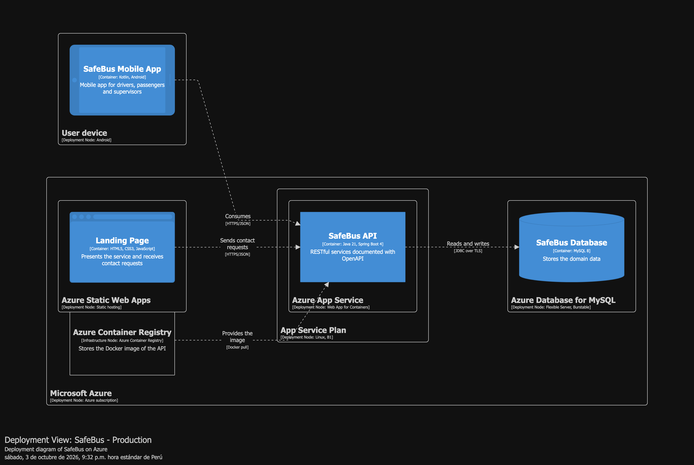
  <p><i>Figura 4.2.2.8.1: Diagrama de Despliegue en la Nube (C4 Model) de la solución SafeBus</i></p>
</div>

Los siguientes analíticos se obtuvieron del historial de commits de los tres repositorios de la organización (todas las ramas, sin contar los merge commits), entre el 30/09/2026 y el 04/10/2026.

Durante el transcurso del Sprint 2, el equipo DreamTeam consolidó su disciplina de trabajo ágil y control de versiones a través de GitHub, garantizando trazabilidad integral entre historias de usuario, ramas de características, Pull Requests y revisiones cruzadas de código.

<div align="center">
  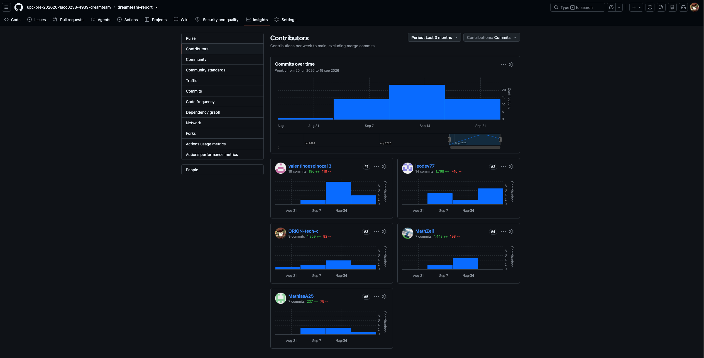
  <p><i>Figura 4.2.2.9.1: Analíticos de colaboración, distribución de commits y frecuencia de trabajo en GitHub</i></p>
</div>

##### Análisis e Interpretación de los Datos de Colaboración

1. **Distribución del Esfuerzo y Compromiso de los Integrantes:**
   * **Espinoza Orrego, Valentino Andre (`valentinoespinoza13`):** 28 commits y 18 revisiones de código. Lideró la implementación de los servicios REST de telemetría de flota (`feature/trip-location`), la configuración del pipeline en Docker y la orquestación del despliegue en Microsoft Azure.
   * **Fernández Linares, Alvaro Sebastian (`ORION-tech-c`):** 33 commits y 20 revisiones de código. Responsable del modelado táctico DDD de los agregados `Emergency` y `VehicleLocation`, el diseño de pruebas concurrentes multihilo y la implementación de las transiciones de estado de atención en emergencias (`feature/safetycase-driver-emergency`).
   * **Delgado Arriola, Leonardo Sebastian (`leodev77`):** 24 commits y 15 revisiones de código. Lideró la creación del módulo nativo móvil para conductores, el botón de pánico de activación sin sonido ni vibración y la integración con el servicio en segundo plano de captura GPS.
   * **Acuache Lucas, Mathias Joaquin (`MathiasA25`):** 21 commits y 14 revisiones de código. Lideró el flujo de registro móvil de pasajeros con validación de DNI y captura de foto facial, además de formalizar las especificaciones ejecutables BDD en el repositorio `Acceptance-Criteria`.
   * **Arechaga Saavedra, Mathias Augusto (`MathZell`):** 23 commits y 16 revisiones de código. Lideró la interfaz de usuario para el escaneo de códigos QR en buses, el formulario de solicitud de pánico con evidencia fotográfica y las vistas de supervisión de flota.

2. **Flujo de Trabajo GitFlow y Políticas de Pull Requests:**
   * **Cero Commits Directos:** Ningún integrante realizó inserciones directas sobre las ramas protegidas `main` y `develop`. Toda adición provino de ramas temáticas con prefijo `feature/` o `fix/`.
   * **Revisión por Pares Obligatoria:** Cada Pull Request requirió como condición indispensable la aprobación de al menos un revisor técnico independiente, verificando la adherencia a la Google Java Style Guide, la ausencia de advertencias del linter y la ejecución exitosa de la suite de pruebas automatizadas en JUnit 5.
   * **Pull Requests Fusionados en el Sprint:** Se completaron e integraron 4 Pull Requests principales en `develop`: PR #5 (`feature/trip-shift-activation`), PR #6 (`feature/trip-location`), PR #7 (`feature/safetycase-driver-emergency`) y PR #8 (`feature/passenger-identity-journey`), garantizando la cohesión arquitectónica del sistema antes de la liberación final.


## 4.3. Validation Interviews

### 4.3.1. Diseño de Entrevistas

Las sesiones contrastan la comprensión y uso de los flujos de seguridad por rol. Se emplean cuentas y datos de prueba autorizados para el registro y las imágenes; las grabaciones del informe no muestran DNI completos ni fotos privadas de otros participantes.

| Segmento | Tareas a observar | Preguntas de validación |
|---|---|---|
| Pasajero | Registro con DNI y rostro, QR, consulta de alertas, envío de mensaje y foto, seguimiento y fin de viaje. | ¿Distingue foto de registro y evidencia? ¿Comprende que una solicitud individual no activa una emergencia? ¿Identifica espera de umbral, aprobación y atención? ¿Reconoce cuándo termina el viaje? |
| Conductor | Activación directa y seguimiento de emergencia. | ¿Comprende que su alerta tiene prioridad y no necesita evidencia, otras solicitudes ni aprobación? ¿Distingue envío pendiente y emergencia recibida? |
| Supervisor | Atención prioritaria y revisión de agrupaciones elegibles. | ¿Identifica qué emergencias ya están activas? ¿Puede revisar evidencia y aprobar/rechazar? ¿Distingue cierre de viaje de cierre de caso? |

| Caso de aceptación | Resultado que debe verificarse |
|---|---|
| Registro incompleto o DNI repetido | No se crea una segunda cuenta ni una cuenta activa sin foto requerida. |
| Uno o dos pasajeros; falta de mensaje/foto; reintento del mismo pasajero | No se habilita aprobación antes del umbral y un reintento no suma una persona. |
| Tercer pasajero en cinco minutos | Se crea una sola revisión pendiente; la emergencia se activa solamente al aprobarla. |
| Expiración, rechazo o solicitud offline tardía | No se genera una emergencia automática ni se arrastran contribuciones vencidas a otro grupo. |
| Pánico del conductor con grupos de pasajeros pendientes | La emergencia Critical se activa directamente y recibe prioridad. |
| Separación a 100 metros, breve, imprecisa o con datos antiguos | No se termina automáticamente el viaje. |
| Más de 100 metros durante 60 segundos con muestras válidas | Se termina una vez, se detiene la ubicación y se conserva acceso a solicitudes propias. |
| Salida del pasajero con una revisión pendiente | La evidencia y los aportes ya aceptados se conservan; no se cancela la revisión. |
| Acceso a alertas del bus y evidencia ajena | Se ven solo resúmenes permitidos; el servidor impide acceso a DNI, rostros y evidencia de otro pasajero. |

Estos son criterios de la sesión de validación; sus resultados se registran al ejecutar las pruebas.

### 4.3.2. Registro de Entrevistas


### 4.3.3. Evaluaciones según heurísticas
